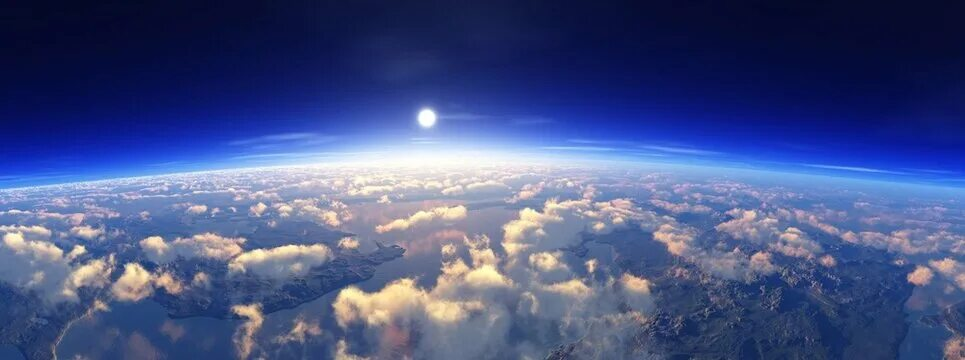

# [Атмосфера](./atmosphere.md)

**ID:** `atmosphere`  
**WikiData:** [Q32389](https://www.wikidata.org/wiki/Q32389)  
**Раздел:** 1.1 Земля, природа и климат

> 💡 **Коротко:** Воздушная оболочка Земли, которая защищает нас и помогает дышать

---

# [Атмосфера](./atmosphere.md)

## Введение
Привет! Давай познакомимся с невидимым, но очень важным другом нашей планеты — [атмосферой](./atmosphere.md)! 🌬️ [Атмосфера](./atmosphere.md) — это слой воздуха, который окружает [Землю](./earth.md), как огромное одеяло. Без неё мы не смогли бы дышать, а планета была бы слишком холодной или слишком горячей. Именно [атмосфера](./atmosphere.md) делает нашу [Землю](./earth.md) уютным домом для жизни!

## Из чего состоит атмосфера
Воздух, которым мы дышим, — это смесь разных газов. Вот главные «ингредиенты» [атмосферы](./atmosphere.md):

- **Азот (78%)**: Самый главный газ! Он не имеет цвета и запаха, но очень важен для роста растений.
- **Кислород (21%)**: Именно им мы дышим! Без кислорода не могли бы жить ни люди, ни животные, ни большинство растений.
- **Другие газы (1%)**: Сюда входят углекислый газ, аргон и другие. Их мало, но они очень важны — например, углекислый газ помогает растениям расти, а ещё удерживает тепло на планете.

Также в воздухе есть крошечные капельки воды и пылинки — из них образуются [облака](./clouds.md)!

## Слои атмосферы — как этажи дома
[Атмосфера](./atmosphere.md) состоит из нескольких слоёв, каждый со своей задачей:

1. **Тропосфера** (0–12 км): Самый нижний слой, где живём мы. Здесь формируется [погода](./weather.md): идут [дождь](./precipitation.md) и снег, дует [ветер](./wind.md), летают птицы и самолёты.
2. **Стратосфера** (12–50 км): Здесь находится озоновый слой — он как солнечные очки для [Земли](./earth.md), защищает нас от вредных лучей Солнца.
3. **Мезосфера** (50–85 км): Самый холодный слой. Именно здесь сгорают метеориты, которые летят на [Землю](./earth.md) — мы видим их как «падающие звёзды»!
4. **Термосфера** (85–600 км): Очень горячий слой, где летают спутники и появляется северное сияние!
5. **Экзосфера** (свыше 600 км): Самый верхний слой, который плавно переходит в космос.

## Зачем нам нужна атмосфера
[Атмосфера](./atmosphere.md) выполняет много важных задач:

- **Даёт нам воздух для дыхания**: Без кислорода мы не смогли бы жить ни секунды!
- **Защищает от космоса**: [Атмосфера](./atmosphere.md) сжигает мелкие метеориты и задерживает вредное излучение Солнца.
- **Сохраняет тепло**: Как одеяло, она не даёт теплу улетучиваться в космос. Это называется [парниковый эффект](./greenhouse_effect.md) — в умеренных количествах он очень полезен!
- **Создаёт погоду**: Благодаря движению воздуха в [атмосфере](./atmosphere.md) появляются [ветер](./wind.md), [облака](./clouds.md), [дождь](./precipitation.md) и снег. Так работает [круговорот воды](./water_cycle.md)!
- **Помогает жить природе**: Растения берут из воздуха углекислый газ для роста, а выделяют кислород, которым дышим мы. Это настоящий обмен!

## Атмосфера и климат
[Атмосфера](./atmosphere.md) тесно связана с [климатом](./climate.md) — средней [погодой](./weather.md) за много лет. Вот как это работает:

- **[Ветер](./wind.md)** переносит тепло и влагу между разными частями планеты.
- **[Облака](./clouds.md)** могут как охлаждать [Землю](./earth.md) (отражая солнечный свет), так и согревать её (удерживая тепло).
- **[Океанические течения](./ocean_currents.md)** и атмосфера работают вместе, как команда, чтобы распределять тепло по планете.

Но если в [атмосфере](./atmosphere.md) становится слишком много углекислого газа от заводов и машин, [парниковый эффект](./greenhouse_effect.md) усиливается. Это приводит к [глобальному потеплению](./global_warming.md) — планета нагревается, льды тают, а [климат](./climate.md) меняется.

## Проблемы атмосферы
К сожалению, люди иногда вредят воздуху:

- **[Загрязнение окружающей среды](./environmental_pollution.md)**: Дым от заводов, выхлопные газы машин и сжигание мусора портят воздух.
- **Парниковые газы**: Их становится всё больше, и [Земля](./earth.md) перегревается.
- **Разрушение озонового слоя**: Раньше некоторые газы из баллончиков и холодильников разрушали защиту от солнечных лучей. Сейчас люди научились делать безопасные вещества, и озоновый слой постепенно восстанавливается!

## Что ты можешь сделать
Даже в 10 лет ты можешь помочь [атмосфере](./atmosphere.md):

- **Ходи пешком или на велосипеде**: Меньше машин — чище воздух!
- **Экономь электричество**: Когда ты выключаешь свет, электростанции работают меньше и выбрасывают меньше дыма.
- **Сажай деревья**: Растения очищают воздух и выделяют кислород.
- **Не жги мусор**: При сжигании в воздух попадают вредные вещества.
- **Рассказывай друзьям**: Чем больше людей знает о проблемах воздуха, тем лучше мы сможем их решить!

## Интересные факты
- Если бы всю [атмосферу](./atmosphere.md) можно было сжать до плотности воды, она покрыла бы [Землю](./earth.md) слоем толщиной всего 10 метров!
- На горе Эверест воздуха так мало, что альпинистам нужны специальные маски с кислородом.
- [Ветер](./wind.md) на других планетах может дуть со скоростью более 2000 км/ч — на [Земле](./earth.md) такой ветер снёс бы всё на своём пути!
- Каждый раз, когда ты делаешь вдох, ты вдыхаешь примерно те же молекулы воздуха, которыми дышали динозавры!
- Северное сияние появляется, когда частицы от Солнца сталкиваются с газами в [атмосфере](./atmosphere.md) — это как огромный небесный фейерверк!

## Заключение
[Атмосфера](./atmosphere.md) — это невидимый, но очень важный щит нашей планеты. Она даёт нам воздух, защищает от опасностей из космоса, создаёт [погоду](./weather.md) и помогает жить всей природе. Но она нуждается в нашей заботе! Каждый раз, когда ты экономишь энергию, сажаешь дерево или просто дышишь свежим воздухом — ты помогаешь [атмосфере](./atmosphere.md). Вместе мы сохраним чистое небо для себя и будущих поколений! 🌤️💙

---

*Автор: Бельский Глеб • GitHub: @gbbelskij*

*Сгенерировано с помощью OpenAI GPT-4 • 2026-03-15*