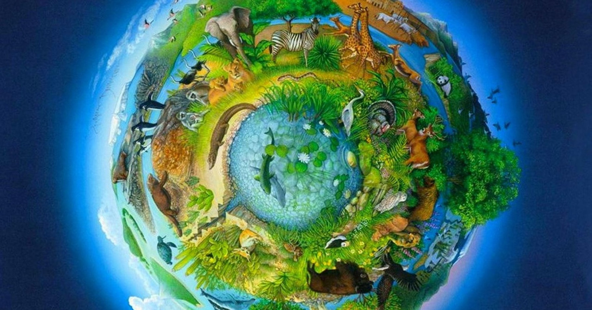

# [Биосфера](./biosphere.md)

**ID:** `biosphere`  
**WikiData:** [Q182704](https://www.wikidata.org/wiki/Q182704)  
**Раздел:** 1.1 Земля, природа и климат

> 💡 **Коротко:** Область Земли, где существует жизнь — от глубоких океанов до высоких гор

---

# [Биосфера](./biosphere.md)

## Введение
Привет, друг природы! 🌿 Давай поговорим о самом живом слое нашей планеты — [биосфере](./biosphere.md). [Биосфера](./biosphere.md) — это место, где есть жизнь! Она включает в себя всех живых существ: тебя, меня, собак, кошек, деревья, цветы, рыб, птиц и даже крошечные бактерии, которых не видно глазом. [Биосфера](./biosphere.md) словно обнимает [Землю](./earth.md), проникая в воздух, воду и землю.

## Где живёт биосфера
Жизнь удивительна — она встречается везде! [Биосфера](./biosphere.md) пересекается с другими оболочками планеты:

- **В [атмосфере](./atmosphere.md)**: Птицы летают в небе, насекомые парят в воздухе, а ветер переносит семена растений и споры грибов.
- **В [гидросфере](./hydrosphere.md)**: Океаны, реки и озёра полны жизни — от крошечного планктона до огромных китов. Даже в самой глубокой впадине есть живые существа!
- **В [литосфере](./lithosphere.md)**: В почве живут черви, жуки и корни растений. Некоторые животные роют норы глубоко под землёй.

Но жизнь есть только там, где есть вода, воздух и подходящая температура. Поэтому [биосфера](./biosphere.md) не везде одинакова — где-то её много, а где-то почти нет.

## Экосистемы — дома для живых существ
Внутри [биосферы](./biosphere.md) есть много разных «домов» — [экосистем](./ecosystem.md). В каждом доме свои правила и жители:

- **[Леса](./forest.md)**: Здесь много деревьев, которые дают кислород. В лесах живут медведи, белки, птицы и тысячи насекомых.
- **[Пустыни](./desert.md)**: Здесь очень жарко и сухо, но даже тут живут верблюды, ящерицы и специальные растения, которые умеют хранить воду.
- **[Тундра](./tundra.md)**: Холодный край, где растут только мхи и лишайники. Здесь обитают северные олени и полярные совы.
- **Океаны**: Огромные водные пространства, где кораллы создают целые города для рыб, а водоросли вырабатывают много кислорода.

Все жители [экосистемы](./ecosystem.md) связаны друг с другом. Если исчезнет одно звено, могут пострадать все остальные.

## Почему биосфера важна
[Биосфера](./biosphere.md) — это как большой механизм, где каждая деталь важна:

- **Кислород**: Растения и водоросли вырабатывают кислород, которым мы дышим. Без них мы не смогли бы жить!
- **Еда**: Все продукты, которые мы едим — яблоки, хлеб, мясо, рыба — приходят из [биосферы](./biosphere.md).
- **Очистка планеты**: Бактерии и грибы перерабатывают мусор и остатки растений, превращая их в полезную почву.
- **Баланс**: Хищники контролируют количество травоядных, а растения удерживают почву. Всё находится в равновесии.

## Угрозы для биосферы
К сожалению, жизнь на [Земле](./earth.md) сейчас в опасности:

- **[Загрязнение окружающей среды](./environmental_pollution.md)**: Пластик в океане, дым в воздухе и химикаты в почве вредят животным и растениям.
- **[Глобальное потепление](./global_warming.md)**: Из-за изменения [климата](./climate.md) некоторые животные теряют свои дома. Например, белые медведи страдают из-за таяния льдов.
- **Вырубка лесов**: Когда люди вырубают [леса](./forest.md), животные теряют жильё, а воздуха становится меньше.
- **Исчезновение видов**: Каждый день на планете исчезают несколько видов животных и растений навсегда.

## Что ты можешь сделать
Ты можешь стать защитником [биосферы](./biosphere.md) уже сегодня:

- **Береги животных**: Не разоряй гнёзда, не лови насекомых просто так и не мусори в лесу.
- **Экономь бумагу**: Бумагу делают из деревьев. Используя меньше бумаги, ты спасаешь [леса](./forest.md).
- **Не покупай лишнее**: Чем меньше вещей мы покупаем, тем меньше ресурсов забирает у природы производство.
- **Сажай растения**: Цветы на подоконнике или дерево во дворе — это маленький кусочек [биосферы](./biosphere.md), который ты создал сам.
- **Изучай природу**: Чем больше ты знаешь о живых существах, тем больше хочешь их защитить.

## Интересные факты
- В одной чайной ложке почвы живёт больше организмов, чем людей на всей [Земле](./earth.md)!
- Деревья могут общаться друг с другом через корни и грибы, предупреждая об опасности.
- Самый большой живой организм на планете — это гриб в США, который занимает площадь более 9 квадратных километров!
- Киты своими экскрементами удобряют океан, помогая расти планктону, который вырабатывает кислород.
- Человек — это тоже часть [биосферы](./biosphere.md), мы зависим от природы так же, как и все другие животные.

## Заключение
[Биосфера](./biosphere.md) — это удивительный мир жизни, который окружает нас везде. Она даёт нам воздух, еду и красоту. Но она хрупкая и нуждается в нашей защите. Каждый раз, когда ты бережёшь природу, ты помогаешь всей [биосфере](./biosphere.md). Давай жить дружно с природой, чтобы наша планета оставалась зелёной и живой ещё очень долго! 🌳🦋

---

*Автор: Бельский Глеб • GitHub: @gbbelskij*

*Сгенерировано с помощью OpenAI GPT-4 • 2026-03-15*