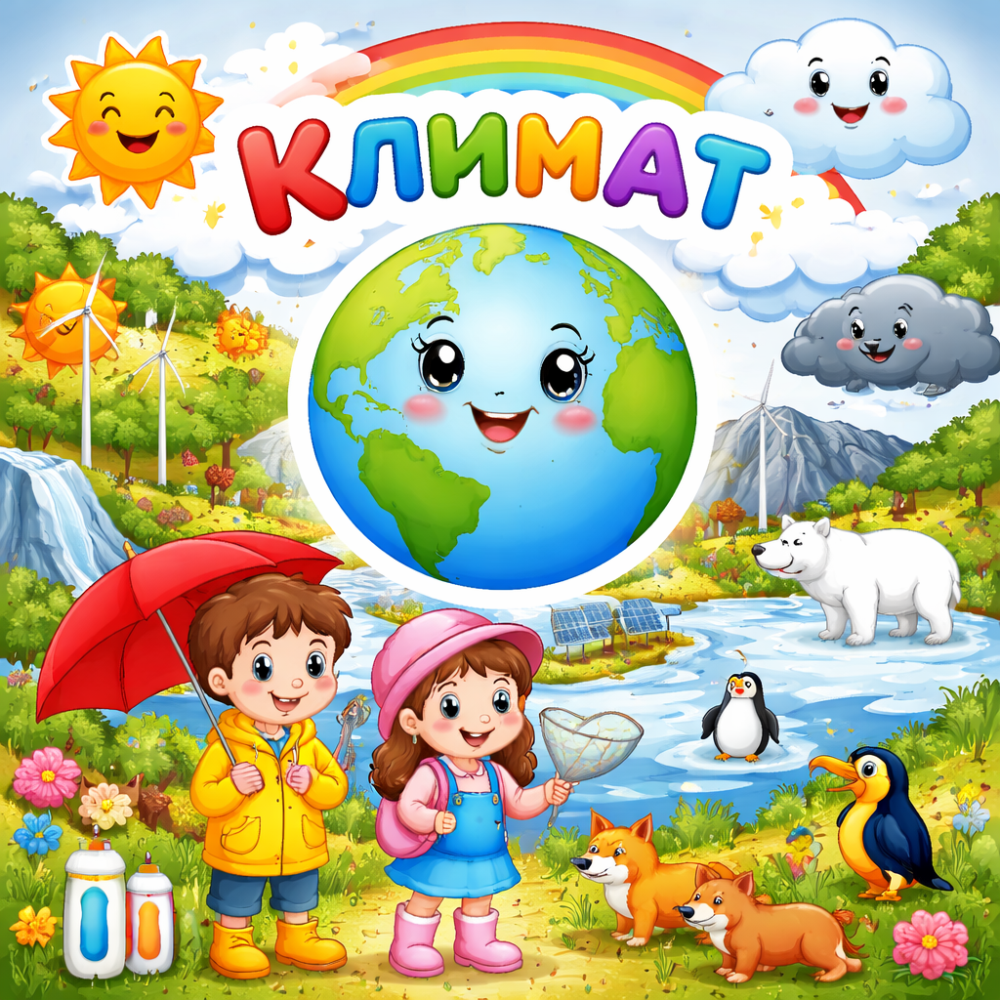

# [Климат](./climate.md)

**ID:** `climate`  
**WikiData:** [Q7937](https://www.wikidata.org/wiki/Q7937)  
**Раздел:** 1.1 Устройство мира / [Земля](./earth.md), природа и климат

> 💡 **Коротко:** Многолетний режим погоды, характерный для определённой местности

---

# [Климат](./climate.md)

## Введение
Представь, что **погода** — это то, что происходит за окном прямо сейчас: дождь, солнце или снег. А **климат** — это то, какая погода бывает в каком-то месте *обычно*, если наблюдать за ней много-много лет (как минимум 30 лет!).

Например, мы знаем, что в Африке обычно жарко, а на Северном полюсе — холодно. Это и есть [климат](./climate.md) этих мест.

## От чего зависит климат?

[Климат](./climate.md) зависит от многих вещей:

- **Солнце** — главный источник тепла на [Земле](./earth.md). Чем ближе место к экватору, тем больше солнечного света оно получает и тем теплее там климат.
- **[Океанические течения](./ocean_currents.md)** — огромные «реки» в океане переносят тёплую и холодную воду, влияя на температуру побережий.
- **[Ветер](./wind.md)** — переносит тёплый или холодный воздух из одних мест в другие.
- **Горы** — высокие горы могут задерживать [облака](./clouds.md) и влагу, поэтому с одной стороны гор может быть дождливо, а с другой — сухо.
- **Расстояние от океана** — у моря климат мягче, а в глубине материка — более суровый.

## Какие бывают климаты?

На нашей планете выделяют несколько основных типов климата:

| Тип климата | Где встречается | Особенности |
|---|---|---|
| Экваториальный | Вблизи экватора | Жарко и влажно круглый год |
| Тропический | Тропики | Жарко, бывают сухой и влажный сезоны |
| Умеренный | Средние широты (Россия, Европа) | Четыре сезона: зима, весна, лето, осень |
| Арктический | Полярные районы | Очень холодно, длинная зима |
| Пустынный | [Пустыни](./desert.md) | Очень сухо, большие перепады температур |

## Климат и природа

[Климат](./climate.md) определяет, какие растения растут и какие животные живут в каждом уголке планеты. Именно поэтому на [Земле](./earth.md) существуют разные [природные зоны](./natural_zones.md): [леса](./forest.md), [пустыни](./desert.md), [тундра](./tundra.md) и другие.

[Круговорот воды](./water_cycle.md) тоже тесно связан с климатом — в жарких местах вода испаряется быстрее, образуется больше [облаков](./clouds.md) и выпадает больше [осадков](./precipitation.md).

## Почему климат меняется?

[Климат](./climate.md) на [Земле](./earth.md) менялся всегда — были ледниковые периоды и тёплые эпохи. Но сейчас учёные заметили, что климат меняется быстрее обычного из-за деятельности человека. Заводы, машины и вырубка лесов усиливают [парниковый эффект](./greenhouse_effect.md), что приводит к [глобальному потеплению](./global_warming.md).

Это влияет на [погоду](./weather.md), [океанические течения](./ocean_currents.md), таяние ледников и жизнь многих животных и растений.

---

*Автор: Горячкин Владимир • Сгенерировано с помощью Claude Opus 4.6 • Слов: 280 • 2026-03-17*
