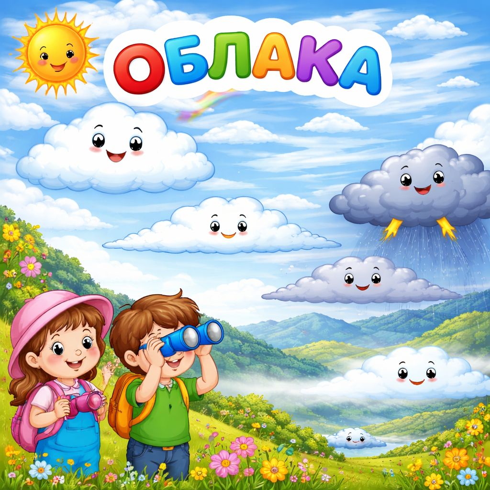

# [Облака](./clouds.md)

**ID:** `clouds`  
**WikiData:** [Q8074](https://www.wikidata.org/wiki/Q8074)  
**Раздел:** 1.1 Устройство мира / [Земля](./earth.md), природа и климат

> 💡 **Коротко:** Скопление капелек воды или кристалликов льда в атмосфере

---

# [Облака](./clouds.md)

## Введение
Посмотри на небо — видишь пушистые белые фигуры? Это **облака**! Они похожи на вату, но на самом деле состоят из миллиардов крошечных капелек воды или кристалликов льда, которые парят в воздухе.

[Облака](./clouds.md) — это важная часть [круговорота воды](./water_cycle.md) в природе. Именно из них выпадают [осадки](./precipitation.md): дождь, снег и град.

## Как образуются облака?

Всё начинается с воды на поверхности [Земли](./earth.md). Солнце нагревает воду в реках, озёрах и океанах. Вода испаряется и поднимается вверх в виде невидимого пара.

Чем выше поднимается пар, тем холоднее становится воздух. Пар остывает и превращается обратно в крошечные капельки воды — это называется **конденсация**. Капельки такие маленькие и лёгкие, что не падают вниз, а «висят» в воздухе, образуя облако.

Чтобы капельки могли образоваться, им нужны крошечные частички — пылинки, кристаллики соли или пыльца растений. Вокруг них и «собирается» вода.

## Какие бывают облака?

Учёные выделяют несколько основных видов [облаков](./clouds.md):

### Кучевые облака (Кумулус) ☁️

Это те самые пушистые «белые горы», которые мы обычно рисуем. Они появляются в хорошую [погоду](./weather.md) и плывут невысоко над землёй. Но если кучевое облако вырастает очень высоко, оно может превратиться в грозовое!

### Слоистые облака (Стратус) 🌫️

Похожи на серое одеяло, которое затягивает всё небо. Из них часто идёт мелкий, затяжной дождик или моросит.

### Перистые облака (Циррус) 🪶

Тонкие, лёгкие, похожие на пёрышки. Они находятся очень высоко — на высоте 6–12 километров! Состоят из кристалликов льда.

### Кучево-дождевые облака (Кумулонимбус) ⛈️

Это огромные, тёмные облака-великаны. Именно они приносят грозы, ливни и даже град. Они могут вырастать до 12–15 километров в высоту!

## Облака и погода

По [облакам](./clouds.md) можно предсказывать [погоду](./weather.md):

| Облака | Что ожидать |
|---|---|
| Белые кучевые | Хорошая, солнечная погода |
| Серые слоистые | Пасмурно, возможен мелкий дождь |
| Перистые | Скоро может измениться погода |
| Тёмные кучево-дождевые | Гроза, сильный дождь или град |

[Ветер](./wind.md) переносит облака по небу, поэтому [погода](./weather.md) постоянно меняется. А [климат](./climate.md) определяет, в каких местах облаков обычно больше, а в каких — меньше.

## Интересные факты

- Среднее облако весит около **500 тонн**! Но оно не падает, потому что капельки очень маленькие и воздух их удерживает.
- На Венере облака состоят из серной кислоты, а на Юпитере — из аммиака.
- Туман — это тоже облако, только оно образовалось прямо у поверхности [Земли](./earth.md).

---

*Автор: Горячкин Владимир • Сгенерировано с помощью Claude Opus 4.6 • Слов: 310 • 2026-03-17*
