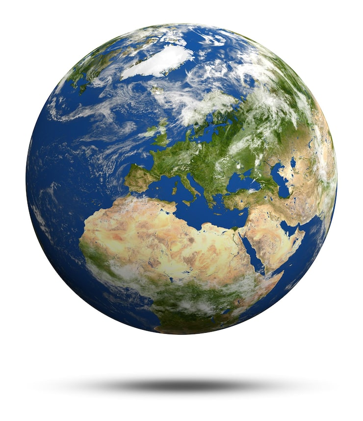

# [Земля](./earth.md)

**ID:** `earth`  
**WikiData:** [Q2](https://www.wikidata.org/wiki/Q2)  
**Раздел:** 1.1 Земля, природа и климат

> 💡 **Коротко:** Наша планета — единственный известный дом, где есть жизнь

---

# [Земля](./earth.md)

## Введение
Привет! Давай поговорим о самом удивительном месте во Вселенной — о нашей планете [Земля](./earth.md)! 🌍 [Земля](./earth.md) — это наш общий дом, единственная известная планета, где есть [жизнь](./biosphere.md). Она появилась около 4,5 миллиардов лет назад и с тех пор стала домом для миллионов разных существ: от крошечных бактерий до огромных китов и, конечно, нас с тобой!

## Из чего состоит наша планета
[Земля](./earth.md) похожа на многослойный пирог! У неё есть несколько важных частей:

- **[Атмосфера](./atmosphere.md)**: Это воздушная оболочка вокруг планеты. Она защищает нас от вредных солнечных лучей и помогает дышать. Без [атмосферы](./atmosphere.md) на [Земле](./earth.md) было бы слишком холодно или слишком жарко!
- **[Гидросфера](./hydrosphere.md)**: Это вся вода на планете — океаны, моря, реки, озёра и даже лёд на полюсах. Интересно, что воды на [Земле](./earth.md) так много, что планету иногда называют «Голубой»!
- **[Литосфера](./lithosphere.md)**: Это твёрдая оболочка [Земли](./earth.md) — горы, равнины, почва, по которой мы ходим. [Литосфера](./lithosphere.md) состоит из огромных плит, которые медленно двигаются.
- **[Биосфера](./biosphere.md)**: Это все живые существа на планете — растения, животные, грибы и микроорганизмы. Ты тоже часть [биосферы](./biosphere.md)!

## Как работает наша планета
[Земля](./earth.md) — это как огромный механизм, где всё связано между собой:

- **[Круговорот воды](./water_cycle.md)**: Вода испаряется с поверхности океанов, поднимается вверх, образует [облака](./clouds.md), а потом возвращается на [Землю](./earth.md) в виде [осадков](./precipitation.md) — дождя или снега. Затем вода снова течёт в реки и океаны, и всё начинается заново!
- **[Погода](./weather.md) и [климат](./climate.md)**: [Погода](./weather.md) — это то, что происходит с воздухом прямо сейчас (идёт дождь, светит солнце, дует [ветер](./wind.md)). А [климат](./climate.md) — это средняя [погода](./weather.md) за много лет в определённом месте.
- **[Океанические течения](./ocean_currents.md)**: В океанах есть огромные «реки» из воды, которые переносят тепло от экватора к полюсам. Они помогают регулировать [климат](./climate.md) на всей планете!

## Природные зоны Земли
На нашей планете есть разные [природные зоны](./natural_zones.md) — места с особыми условиями:

- **[Леса](./forest.md)**: Здесь растёт много деревьев. Леса бывают разные — тропические (где всегда тепло и влажно), умеренные (где есть все четыре времени года) и таёжные (где растут в основном хвойные деревья).
- **[Пустыни](./desert.md)**: Места, где очень мало воды и почти не идёт дождь. Днём там очень жарко, а ночью может быть холодно. Но даже в [пустыне](./desert.md) есть жизнь!
- **[Тундра](./tundra.md)**: Холодная зона near северного полюса, где растёт только мох и маленькие кустики. Зимой здесь очень холодно и темно, а летом — светло почти круглосуточно!
- **[Экосистемы](./ecosystem.md)**: Это сообщества живых организмов, которые живут вместе и помогают друг другу. Например, лес — это целая [экосистема](./ecosystem.md), где деревья дают кислород, животные опыляют растения, а грибы помогают разлагать опавшие листья.

## Почему важно беречь Землю
Наша планета сейчас сталкивается с проблемами:

- **[Парниковый эффект](./greenhouse_effect.md)**: Некоторые газы в [атмосфере](./atmosphere.md) удерживают тепло, как одеяло. Это хорошо, но когда этих газов становится слишком много, [Земля](./earth.md) начинает перегреваться.
- **[Глобальное потепление](./global_warming.md)**: Из-за [парникового эффекта](./greenhouse_effect.md) средняя температура на планете растёт. Это приводит к таянию льдов, повышению уровня океана и изменению [климата](./climate.md).
- **[Загрязнение окружающей среды](./environmental_pollution.md)**: Люди выбрасывают много мусора, выхлопных газов и химических веществ. Это вредит природе, животным и даже нам самим.

## Что ты можешь сделать
Даже в 10 лет ты можешь помочь [Земле](./earth.md):

- **Экономь воду**: Закрывай кран, когда чистишь зубы.
- **Сортируй мусор**: Пластик, бумагу и стекло можно переработать!
- **Выключай свет**: Когда выходишь из комнаты, выключай свет — это экономит энергию.
- **Сажай растения**: Деревья и цветы очищают воздух и делают планету красивее.
- **Рассказывай друзьям**: Чем больше людей узнает о проблемах [Земли](./earth.md), тем лучше!

## Интересные факты
- [Земля](./earth.md) — единственная планета в нашей солнечной системе, где есть жидкая вода на поверхности!
- Если бы [Земля](./earth.md) была размером с яблоко, то [атмосфера](./atmosphere.md) была бы тоньше, чем кожура этого яблока!
- Самый глубокий океанский желоб на [Земле](./earth.md) — Марианская впадина — глубже, чем высота горы Эверест!
- На [Земле](./earth.md) живёт около 8,7 миллиона видов животных и растений, но учёные открыли ещё не все!
- [Земля](./earth.md) вращается вокруг своей оси со скоростью около 1670 км/ч на экваторе, но мы этого не чувствуем!

## Заключение
[Земля](./earth.md) — это удивительная планета, наш единственный дом. Она даёт нам воздух, воду, еду и красоту природы. Но она нуждается в нашей защите! Каждый из нас может сделать что-то хорошее для [Земли](./earth.md), даже если это кажется мелочью. Вместе мы сможем сохранить нашу планету для будущих поколений! 🌍💚

---

*Автор: Бельский Глеб • GitHub: @gbbelskij*

*Сгенерировано с помощью OpenAI GPT-4 • 2026-03-15*