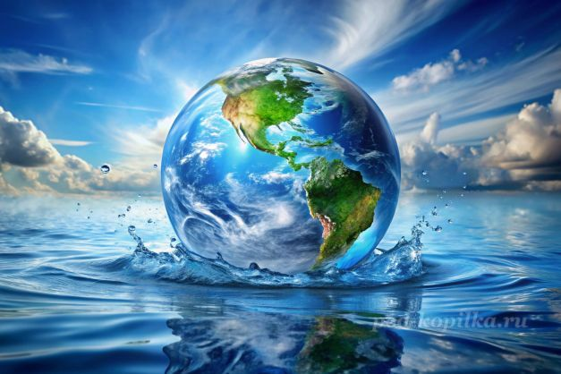

# [Гидросфера](./hydrosphere.md)

**ID:** `hydrosphere`  
**WikiData:** [Q43403](https://www.wikidata.org/wiki/Q43403)  
**Раздел:** 1.1 Земля, природа и климат

> 💡 **Коротко:** Вся вода на Земле — океаны, реки, лёд и даже капельки в воздухе

---

# [Гидросфера](./hydrosфера.md)

## Введение
Привет, маленький исследователь! 🌊 Давай поговорим о [гидросфере](./hydrosphere.md) — это научное название всей воды на нашей планете [Земля](./earth.md). Представь: каждый океан, река, озеро, облако, капелька росы и даже лёд на полюсах — всё это часть [гидросферы](./hydrosphere.md)! Без воды не было бы жизни, поэтому она — настоящая супергероиня нашей планеты!

## Где живёт вода на Земле
Вода на [Земле](./earth.md) прячется в разных местах:

- **Океаны и моря (97%)**: Большая часть воды — солёная и живёт в океанах. Там плавают рыбы, киты, медузы и миллионы других морских жителей!
- **Лёд и снег (2%)**: На полюсах и в горах вода «спит» в виде льда. Это как огромный холодильник планеты!
- **Пресная вода (1%)**: Реки, озёра, подземные воды — это та вода, которую мы пьём и используем каждый день. Её очень мало, поэтому её нужно беречь!
- **Вода в воздухе**: Даже в воздухе есть вода — в виде пара и [облаков](./clouds.md). Когда пара становится много, он превращается в [дождь](./precipitation.md) или снег!

## Круговорот воды — вечное путешествие
Вода на [Земле](./earth.md) никогда не стоит на месте! Она путешествует по [круговороту воды](./water_cycle.md):

1. **Испарение**: Солнце нагревает воду в океанах и озёрах, и она превращается в невидимый пар, который поднимается вверх.
2. **Образование облаков**: Пар охлаждается и собирается в капельки — так появляются [облака](./clouds.md).
3. **Осадки**: Когда капелек в облаке становится слишком много, они падают на [Землю](./earth.md) в виде [дождя](./precipitation.md), снега или града.
4. **Сток**: Вода течёт по рекам обратно в океаны, просачивается в почву или замерзает в ледники. И всё начинается сначала! 🔄

Этот круговорот работает уже миллиарды лет — та же вода, которую пили динозавры, сейчас может быть в твоём стакане!

## Почему вода так важна
[Гидросфера](./hydrosphere.md) — это как кровеносная система нашей планеты:

- **Даёт жизнь**: Все живые существа — от крошечных бактерий до огромных китов и нас с тобой — не могут жить без воды.
- **Регулирует климат**: Океаны поглощают тепло Солнца и переносят его по планете с помощью [океанических течений](./ocean_currents.md). Это помогает смягчать [климат](./climate.md) в разных уголках [Земли](./earth.md).
- **Создаёт погоду**: Испарение воды и движение воздушных масс рождают [ветер](./wind.md), [облака](./clouds.md) и [осадки](./precipitation.md).
- **Формирует ландшафт**: Реки вырезают каньоны, волны лепят берега, а ледники «утюжат» горы — вода постоянно меняет облик [Земли](./earth.md)!
- **Помогает людям**: Мы пьём воду, готовим еду, моем руки, поливаем растения, вырабатываем электричество на гидроэлектростанциях.

## Вода и экосистемы
Вода создаёт удивительные [экосистемы](./ecosystem.md), где всё связано:

- **Океаны**: Дом для коралловых рифов, где рыбы прячутся среди ярких кораллов, а черепахи плавают на тысячи километров.
- **Реки и озёра**: Здесь живут лягушки, утки, бобры и множество рыб. Бобры даже строят плотины, которые меняют течение рек!
- **Болота**: Кажется, что это просто мокрое место, но на самом деле болота — это «почки планеты», которые очищают воду от загрязнений.
- **Подземные воды**: Невидимые реки под землёй питают родники и колодцы.

Каждая [экосистема](./ecosystem.md) зависит от чистоты и количества воды — если вода загрязняется, страдают все жители этой системы!

## Проблемы гидросферы
К сожалению, люди иногда вредят воде:

- **[Загрязнение окружающей среды](./environmental_pollution.md)**: Пластиковые пакеты, бутылки и другой мусор попадают в океаны. Рыбы принимают пластик за еду и погибают.
- **Сточные воды**: Заводы и фермы иногда сбрасывают вредные химикаты в реки, отравляя воду.
- **Перерасход воды**: Мы тратим слишком много пресной воды — например, долго принимаем душ или поливаем газон в жару.
- **[Глобальное потепление](./global_warming.md)**: Из-за повышения температуры тают ледники, уровень океана растёт, а некоторые места становятся слишком сухими или слишком влажными.

## Что ты можешь сделать
Даже в 10 лет ты можешь помочь [гидросфере](./hydrosphere.md):

- **Закрывай кран**: Когда чистишь зубы или намыливаешь руки — выключай воду. Так можно сэкономить целое ведро воды за раз!
- **Не бросай мусор**: Пластик в реке или океане может навредить животным. Лучше выброси его в урну или, ещё лучше, переработай.
- **Используй воду дважды**: Водой после мытья овощей можно полить цветы.
- **Рассказывай друзьям**: Чем больше людей знает о важности воды, тем больше мы сможем её сохранить!
- **Участвуй в уборке**: Пойди с родителями или классом на уборку берега реки или озера — это весело и полезно!

## Интересные факты
- На [Земле](./earth.md) воды так много, что если бы планета была гладким шаром, она была бы покрыта водой слоем глубиной почти 3 километра!
- Самый большой океан — Тихий — больше, чем вся суша на [Земле](./earth.md) вместе взятая!
- В одной капле воды из лужи может жить больше микроорганизмов, чем людей на всей планете!
- Айсберг — это огромный кусок льда, и только 10% его видно над водой. Остальные 90% спрятаны под водой, как у уточки!
- Вода — единственное вещество на [Земле](./earth.md), которое в природе встречается во всех трёх состояниях: жидком, твёрдом (лёд) и газообразном (пар).

## Заключение
[Гидросфера](./hydrosphere.md) — это удивительное водное царство нашей планеты. Она даёт жизнь, создаёт красоту и помогает нам каждый день. Но вода — это не бесконечный ресурс, её нужно беречь. Каждый раз, когда ты экономишь воду, не бросаешь мусор или просто любуешься дождём — ты становишься защитником [гидросферы](./hydrosphere.md)! Вместе мы сохраним чистую воду для себя, животных и будущих поколений! 💧🌍

---

*Автор: Бельский Глеб • GitHub: @gbbelskij*

*Сгенерировано с помощью OpenAI GPT-4 • 2026-03-15*