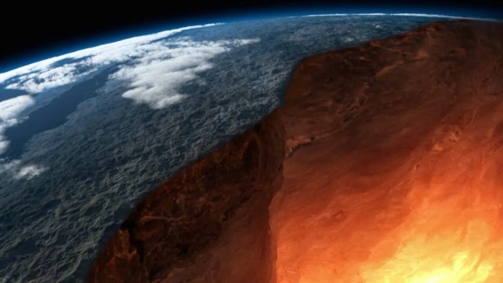

# [Литосфера](./lithosphere.md)

**ID:** `lithosphere`  
**WikiData:** [Q133604](https://www.wikidata.org/wiki/Q133604)  
**Раздел:** 1.1 Земля, природа и климат

> 💡 **Коротко:** Твёрдая оболочка Земли — камни, почва и горы, на которых мы живём

---

# [Литосфера](./lithosphere.md)

## Введение
Привет, юный геолог! 🪨 Давай посмотрим под ноги! Всё, что твёрдое под нами — горы, камни, песок и почва — это часть [литосферы](./lithosphere.md). [Литосфера](./lithosphere.md) — это твёрдая оболочка [Земли](./earth.md), её «кожа» и «скелет». Без неё не было бы суши, негде было бы строить дома и сажать растения. Это фундамент нашей жизни!

## Из чего состоит литосфера
[Литосфера](./lithosphere.md) — это не просто сплошной камень. Она состоит из разных частей:

- **Земная кора**: Самый верхний слой, на котором мы живём. Она бывает материковая (под континентами, толстая) и океаническая (под океанами, тонкая).
- **Верхняя мантия**: Находится под корой. Она очень горячая и вязкая, как пластилин. Вместе с корой они образуют [литосферу](./lithosphere.md).
- **Литосферные плиты**: Земная кора не цельная, а разбита на огромные куски — плиты. Они медленно плавают по мантии, как льдины по воде!

## Движение плит и чудеса природы
Поскольку плиты двигаются, на [Земле](./earth.md) происходят удивительные вещи:

- **Горы**: Когда две плиты сталкиваются, земля сминается в складки, и вырастают горы. Самые высокие горы мира появились именно так!
- **Вулканы**: Иногда плиты расходятся, и горячая лава изнутри [Земли](./earth.md) вырывается наружу. Это извержение вулкана.
- **Землетрясения**: Когда плиты трутся друг о друга или сдвигаются, земля дрожит. Это называется землетрясение.

## Почва — богатство литосферы
Самый важный для нас слой [литосферы](./lithosphere.md) — это почва. Это не просто грязь, это дом для миллионов организмов и основа для растений!

- **Питание для растений**: В почве есть вещества, которые нужны деревьям и травам, чтобы расти. Без почвы не было бы [лесов](./forest.md) и полей.
- **Дом для животных**: Многие звери, насекомые и черви живут в земле. Они рыхлят её и делают ещё плодороднее.
- **Связь с биосферой**: Почва соединяет твёрдую [литосферу](./lithosphere.md) и живую [биосферу](./biosphere.md). Растения берут из земли воду и minerals, а потом дают еду животным и нам.

## Полезные ископаемые
В глубине [литосферы](./lithosphere.md) спрятаны настоящие сокровища — полезные ископаемые:

- **Уголь и нефть**: Используются для получения энергии и топлива.
- **Руды**: Из них получают металлы — железо, медь, алюминий, из которых делают машины, дома и телефоны.
- **Драгоценные камни**: Алмазы, рубины и изумруды тоже находят в земной коре.

## Взаимодействие с другими оболочками
[Литосфера](./lithosphere.md) не живёт отдельно, она дружит с другими частями планеты:

- **С [гидросферой](./hydrosphere.md)**: Вода размывает камни, создаёт реки и каньоны. А горы задерживают облака, влияя на [осадки](./precipitation.md).
- **С [атмосферой](./atmosphere.md)**: Ветер обдувает камни, перенося песок и пыль. Вулканы выбрасывают газы в воздух.
- **С [биосферой](./biosphere.md)**: Растения своими корнями укрепляют почву, не давая ей рассыпаться.

## Проблемы литосферы
Люди часто забывают, что [литосфера](./lithosphere.md) нуждается в защите:

- **[Загрязнение окружающей среды](./environmental_pollution.md)**: Мусор, пластик и химикаты попадают в почву и отравляют её.
- **Истощение ресурсов**: Мы добываем слишком много полезных ископаемых, не думая о будущем.
- **Разрушение почвы**: Вырубка [лесов](./forest.md) и неправильное земледелие приводят к тому, что плодородный слой исчезает, и земля превращается в [пустыню](./desert.md).
- **Карьеры и шахты**: Добыча ресурсов меняет ландшафт и разрушает места обитания животных.

## Что ты можешь сделать
Даже в 10 лет ты можешь помочь [литосфере](./lithosphere.md):

- **Не бросай мусор на землю**: Батарейки и пластик могут отравлять почву сотни лет!
- **Береги растения**: Корни деревьев держат почву, не давая ей размываться дождём.
- **Экономь вещи**: Чем меньше мы покупаем нового, тем меньше нужно добывать ресурсов из земли.
- **Участвуй в посадках**: Посади дерево или цветок — это укрепит почву и украсит [Землю](./earth.md).

## Интересные факты
- Самая глубокая скважина на [Земле](./earth.md) — Кольская сверхглубокая — имеет глубину более 12 километров, но это всё равно меньше, чем толщина земной коры!
- Горы продолжают расти! Гималаи поднимаются на несколько миллиметров каждый год из-за движения плит.
- В одном грамме почвы может жить больше миллиарда бактерий!
- Самый твёрдый минерал на [Земле](./earth.md) — алмаз, а самый мягкий — тальк.
- Если бы [Земля](./earth.md) была размером с яйцо, то земная кора была бы тоньше, чем скорлупа этого яйца!

## Заключение
[Литосфера](./lithosphere.md) — это твёрдая опора нашей жизни. Она даёт нам землю для домов, почву для еды и ресурсы для развития. Но она не бесконечна и может быть разрушена. Давай относиться к земле под ногами с уважением: не мусорить, беречь растения и помнить, что [Земля](./earth.md) — наш общий дом! 🏔️🌱

---

*Автор: Бельский Глеб • GitHub: @gbbelskij*

*Сгенерировано с помощью OpenAI GPT-4 • 2026-03-15*