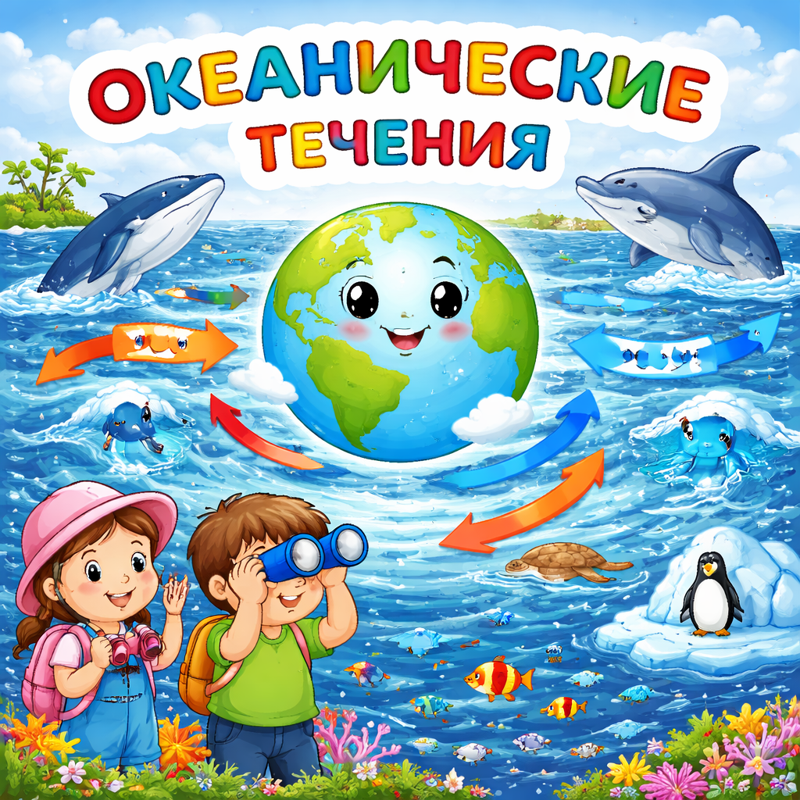

# [Океанические течения](./ocean_currents.md)

**ID:** `ocean_currents`  
**WikiData:** [Q15903](https://www.wikidata.org/wiki/Q15903)  
**Раздел:** 1.1 Устройство мира / [Земля](./earth.md), природа и климат

> 💡 **Коротко:** Постоянные потоки воды в океане, переносящие тепло и влияющие на климат

---

# [Океанические течения](./ocean_currents.md)

## Введение
Представь, что в огромном океане текут невидимые **реки**. Они не имеют берегов, но переносят огромное количество воды на тысячи километров! Эти «реки» в океане называются **[океаническими течениями](./ocean_currents.md)**.

Течения бывают **тёплыми** и **холодными**. Тёплые несут нагретую воду от экватора к полюсам, а холодные — наоборот, холодную воду от полюсов к экватору.

## Почему возникают течения?

[Океанические течения](./ocean_currents.md) появляются по нескольким причинам:

### Ветер 🌬️

Главная причина поверхностных течений — это [ветер](./wind.md). Постоянные ветры (пассаты, западные ветры) дуют над океаном и «толкают» воду, заставляя её двигаться. [Атмосфера](./atmosphere.md) и океан работают вместе, как одна команда!

### Разница температур 🌡️

Вода у экватора нагревается сильнее, чем у полюсов. Тёплая вода расширяется и становится легче, а холодная — тяжелее и опускается вниз. Это создаёт глубинные течения.

### Солёность воды 🧂

Солёная вода тяжелее пресной. Когда вода испаряется, соль остаётся, и вода становится ещё солёнее и тяжелее — она опускается на глубину и создаёт течение.

### Вращение Земли 🌍

[Земля](./earth.md) вращается, и это заставляет течения отклоняться: в Северном полушарии — вправо, в Южном — влево. Это называется **сила Кориолиса**.

## Самые известные течения

| Течение | Тёплое или холодное | Где находится |
|---|---|---|
| Гольфстрим | Тёплое | Атлантический океан |
| Куросио | Тёплое | Тихий океан (у Японии) |
| Лабрадорское | Холодное | Атлантический океан (у Канады) |
| Перуанское (Гумбольдта) | Холодное | Тихий океан (у Южной Америки) |

**Гольфстрим** — самое знаменитое течение в мире. Оно несёт тёплую воду из тропиков к берегам Европы. Благодаря ему в Лондоне и Париже зимой не так холодно, как, например, в Москве, хотя они находятся на похожих широтах!

## Как течения влияют на климат?

[Океанические течения](./ocean_currents.md) — один из главных «регуляторов» [климата](./climate.md) на [Земле](./earth.md):

- **Тёплые течения** согревают побережья, делают [климат](./climate.md) мягче, приносят больше [осадков](./precipitation.md) и влаги.
- **Холодные течения** охлаждают побережья. Вдоль холодных течений часто находятся [пустыни](./desert.md) — например, пустыня Атакама у берегов Южной Америки.
- Течения переносят тепло от экватора к полюсам, помогая «выравнивать» температуру на планете.
- Течения влияют на [погоду](./weather.md), формирование [облаков](./clouds.md) и силу [ветров](./wind.md).

## Океанический конвейер

Все течения на [Земле](./earth.md) связаны в единую систему, которую учёные называют **глобальный океанический конвейер** (или термохалинная циркуляция). Это как гигантская «лента», которая медленно переносит воду по всем океанам. Один полный цикл такого путешествия занимает около **1000 лет**!

Если этот конвейер нарушится из-за [глобального потепления](./global_warming.md) и таяния ледников, это может сильно изменить [климат](./climate.md) на всей планете.

## Интересный факт

Учёные изучают [океанические течения](./ocean_currents.md) с помощью специальных плавучих буёв — маленьких приборов, которые дрейфуют по океану и передают данные через спутники. Некоторые буи путешествуют по океану годами!

---

*Автор: Горячкин Владимир • Сгенерировано с помощью Claude Opus 4.6 • Слов: 370 • 2026-03-17*
