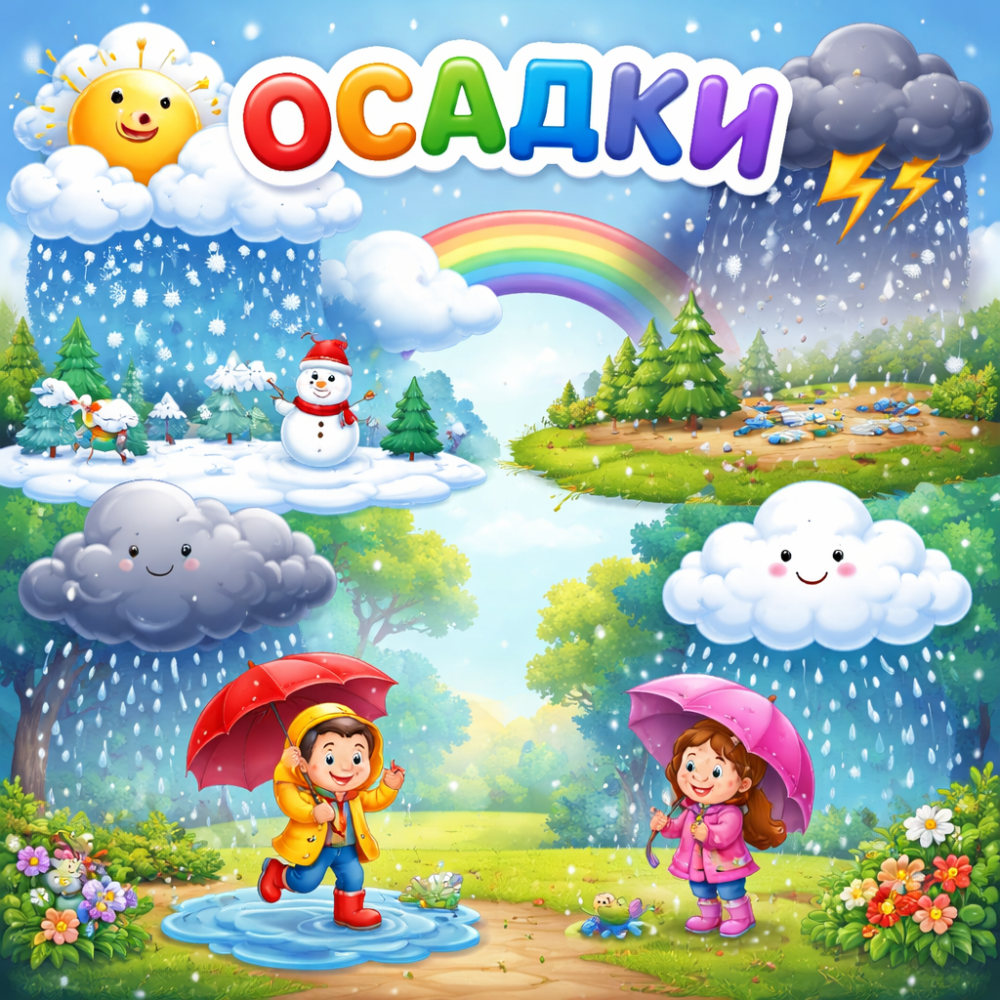

# [Осадки](./precipitation.md)

**ID:** `precipitation`  
**WikiData:** [Q25257](https://www.wikidata.org/wiki/Q25257)  
**Раздел:** 1.1 Устройство мира / [Земля](./earth.md), природа и климат

> 💡 **Коротко:** Вода, выпадающая из облаков на землю в виде дождя, снега или града

---

# [Осадки](./precipitation.md)

## Введение
**Осадки** — это вода, которая падает из [облаков](./clouds.md) на землю. Дождь, снег, град, изморось — всё это [осадки](./precipitation.md)!

[Осадки](./precipitation.md) — важнейшая часть [круговорота воды](./water_cycle.md) в природе. Благодаря им реки не пересыхают, растения получают воду, а мы можем пить чистую воду.

## Как образуются осадки?

Всё начинается с [облаков](./clouds.md). Внутри облака находятся миллиарды крошечных капелек воды или кристалликов льда. Сначала они очень маленькие и лёгкие, поэтому «висят» в воздухе.

Но постепенно капельки сталкиваются друг с другом и сливаются, становясь всё больше и тяжелее. Когда капля становится настолько тяжёлой, что воздух больше не может её удержать — она падает вниз. Так начинается дождь!

## Виды осадков

### Дождь 🌧️

Самый знакомый вид [осадков](./precipitation.md). Дождь — это капли воды, которые падают из [облаков](./clouds.md). Капли дождя бывают разного размера — от мелкой мороси до крупных капель в ливень.

### Снег ❄️

Когда температура воздуха ниже нуля, капельки воды в [облаках](./clouds.md) замерзают и превращаются в кристаллики льда — снежинки. Каждая снежинка уникальна — двух одинаковых не бывает!

### Град 🧊

Иногда в мощных грозовых облаках капли воды подбрасываются сильным [ветром](./wind.md) вверх, замерзают, потом падают вниз, снова поднимаются и покрываются новым слоем льда. Так образуются градины — ледяные шарики, которые могут быть размером от горошины до куриного яйца!

### Изморось 🌫️

Это очень мелкий, еле заметный дождик. Капельки настолько маленькие, что кажется, будто они «висят» в воздухе.

### Роса и иней

Это тоже [осадки](./precipitation.md), но они образуются не из [облаков](./clouds.md)! **Роса** — это капельки воды, которые появляются утром на траве и листьях, когда тёплый воздух остывает ночью. **Иней** — то же самое, но при температуре ниже нуля вода замерзает в красивые белые кристаллы.

## Почему осадки бывают разными?

Вид [осадков](./precipitation.md) зависит от температуры воздуха:

| Температура | Вид осадков |
|---|---|
| Выше +5°C | Дождь |
| Около 0°C | Мокрый снег или дождь со снегом |
| Ниже 0°C | Снег |
| В грозовых облаках | Возможен град |

## Осадки и жизнь

[Осадки](./precipitation.md) влияют на всё вокруг:

- **[Климат](./climate.md)** — в местах с большим количеством осадков растут густые [леса](./forest.md), а там, где осадков мало — раскинулись [пустыни](./desert.md).
- **Реки и озёра** — наполняются благодаря дождям и тающему снегу.
- **Сельское хозяйство** — без дождей не вырастет урожай.
- **[Погода](./weather.md)** — осадки делают [погоду](./weather.md) разнообразной и интересной!

## Интересный факт

В некоторых местах на [Земле](./earth.md) дождь идёт почти каждый день (например, в тропических [лесах](./forest.md)), а в [пустыне](./desert.md) Атакама в Южной Америке дождь может не идти несколько лет!

---

*Автор: Горячкин Владимир • Сгенерировано с помощью Claude Opus 4.6 • Слов: 330 • 2026-03-17*
