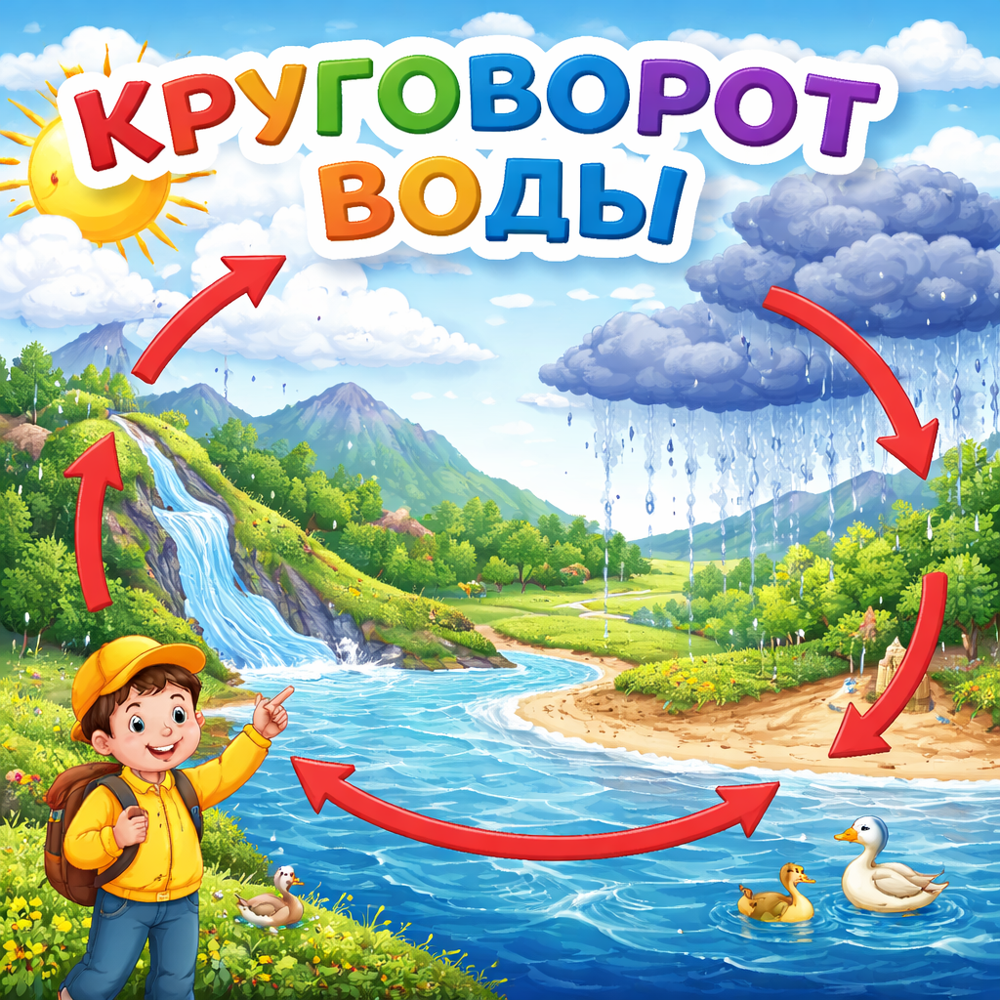

# [Круговорот воды](./water_cycle.md)

**ID:** `water_cycle`  
**WikiData:** [Q102798](https://www.wikidata.org/wiki/Q102798)  
**Раздел:** 1.1 Устройство мира / [Земля](./earth.md), природа и климат

> 💡 **Коротко:** Непрерывное движение воды в природе: испарение, облака, осадки и сток

---

# [Круговорот воды](./water_cycle.md)

## Введение
Ты когда-нибудь задумывался, откуда берётся дождь? И куда девается вода из луж после дождя? Всё это — часть удивительного процесса, который называется **круговорот воды в природе**.

Вода на [Земле](./earth.md) постоянно путешествует: из рек и океанов она поднимается в небо, превращается в [облака](./clouds.md), потом падает обратно на землю в виде [осадков](./precipitation.md) — дождя или снега — и снова попадает в реки и океаны. И так по кругу, снова и снова!

## Как это работает?

[Круговорот воды](./water_cycle.md) состоит из нескольких этапов:

### 1. Испарение 💧➡️☁️

Солнце нагревает воду в океанах, реках, озёрах и даже в лужах. Вода превращается в невидимый пар и поднимается вверх, в [атмосферу](./atmosphere.md). Это называется **испарение**.

Растения тоже «выдыхают» воду через свои листья — этот процесс называется **транспирация**.

### 2. Конденсация ☁️

Высоко в небе воздух холодный. Водяной пар остывает и превращается в крошечные капельки воды или кристаллики льда. Из миллиардов таких капелек образуются [облака](./clouds.md)!

### 3. Осадки 🌧️

Когда капелек в облаке становится слишком много и они становятся тяжёлыми, они падают вниз. Так выпадают [осадки](./precipitation.md): дождь, снег, град или изморось.

### 4. Сток 🌊

Вода, которая упала на землю, стекает по поверхности в ручьи, реки и озёра, а оттуда — в моря и океаны. Часть воды впитывается в почву и попадает в подземные воды.

И всё начинается заново!

## Почему круговорот воды важен?

- **Пресная вода** — благодаря [круговороту](./water_cycle.md) вода очищается: при испарении соль и грязь остаются, а чистый пар поднимается вверх.
- **[Погода](./weather.md) и [климат](./climate.md)** — круговорот воды создаёт [облака](./clouds.md), [осадки](./precipitation.md) и влияет на [ветер](./wind.md). Без него не было бы дождей!
- **Жизнь** — все живые существа нуждаются в воде. Круговорот обеспечивает постоянный запас пресной воды на планете.

## Интересный факт

Вода, которую ты пьёшь сегодня, могла миллионы лет назад быть частью древнего океана, в котором плавали динозавры! Количество воды на [Земле](./earth.md) почти не меняется — она просто путешествует по кругу.

---

*Автор: Горячкин Владимир • Сгенерировано с помощью Claude Opus 4.6 • Слов: 290 • 2026-03-17*
