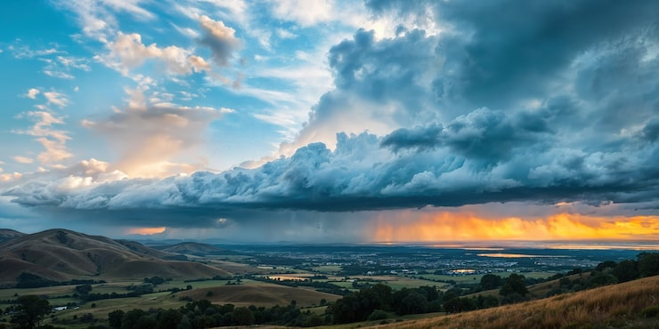

# [Погода](./weather.md)

**ID:** `weather`  
**WikiData:** [Q11663](https://www.wikidata.org/wiki/Q11663)  
**Раздел:** 1.1 Земля, природа и климат

> 💡 **Коротко:** Состояние воздуха прямо сейчас: дождь, солнце, ветер или снег

---

# [Погода](./weather.md)

## Введение
Привет! 👋 Выгляни в окно. Что ты видишь? Светит солнце? Идёт [дождь](./precipitation.md)? Дует [ветер](./wind.md)? Всё это называется [погода](./weather.md)! [Погода](./weather.md) — это состояние воздуха в определённом месте и в определённое время. Она может измениться очень быстро: утром было солнечно, а вечером пошёл снег. Давай разберёмся, как это работает!

## Из чего состоит погода
[Погода](./weather.md) складывается из нескольких главных элементов:

- **Температура**: Насколько тепло или холодно на улице. Мы измеряем её градусником.
- **[Облака](./clouds.md)**: Белые пушистые комочки в небе или серая пелена. Они говорят нам, будет ли дождь.
- **[Осадки](./precipitation.md)**: Это всё, что падает из облаков — [дождь](./precipitation.md), снег, град или иней.
- **[Ветер](./wind.md)**: Движение воздуха. Он может быть лёгким breeze или сильным штормом.
- **Влажность**: Сколько воды в воздухе. Когда влажности много, кажется, что воздух мокрый.

## Погода и Климат — в чём разница?
Часто люди путают [погоду](./weather.md) и [климат](./climate.md). Давай запомним простое правило:

- **[Погода](./weather.md)** — это то, что происходит **прямо сейчас**. Например: «Сегодня идёт дождь».
- **[Климат](./climate.md)** — это средняя [погода](./weather.md) за **много лет**. Например: «В Африке жарко круглый год».

Можно сказать так: [погода](./weather.md) — это твоё настроение сегодня, а [климат](./climate.md) — это твой характер в целом! 😊

## Как создаётся погода
Главный двигатель [погоды](./weather.md) — это Солнце! ☀️

1.  **Солнце греет [Землю](./earth.md)**: Но греет оно неравномерно. Экватор получает больше тепла, чем полюса.
2.  **Движение воздуха**: Тёплый воздух лёгкий и поднимается вверх, а холодный — тяжёлый и опускается вниз. Это движение создаёт [ветер](./wind.md).
3.  **[Круговорот воды](./water_cycle.md)**: Солнце нагревает воду в океанах, она испаряется, превращается в пар и поднимается в [атмосферу](./atmosphere.md). Там она охлаждается и становится [облаками](./clouds.md).
4.  **[Осадки](./precipitation.md)**: Когда в облаках накапливается много воды, она падает на землю в виде дождя или снега.

## Как мы измеряем погоду
Чтобы знать, какую одежду надеть, люди придумали специальные приборы:

- **Термометр**: Измеряет температуру.
- **Барометр**: Измеряет давление воздуха (помогает предсказать изменение погоды).
- **Анемометр**: Измеряет скорость [ветра](./wind.md).
- **Осадкомер**: Измеряет, сколько выпало дождя или снега.

Сейчас за погодой следят даже спутники в космосе! Они присылают фотографии [облаков](./clouds.md) и помогают учёным делать прогнозы.

## Почему погода важна для нас
[Погода](./weather.md) влияет на нашу жизнь каждый день:

- **Одежда**: В дождь мы берём зонт, а в мороз — тёплую куртку.
- **Сельское хозяйство**: Фермерам нужно знать, когда сажать растения и когда их поливать.
- **Путешествия**: Самолёты и корабли зависят от погоды. Сильный шторм может отменить рейс.
- **Настроение**: Когда светит солнце, нам часто веселее, а в пасмурный день хочется уютно посидеть дома.

## Экстремальная погода
Иногда [погода](./weather.md) становится слишком суровой:

- **Грозы**: С яркими молниями и громким громом.
- **Ураганы и тайфуны**: Очень сильные ветры, которые могут ломать деревья.
- **Метели**: Сильный снег и ветер зимой.
- **Жара**: Когда температура поднимается очень высоко, что опасно для здоровья.

Важно слушать предупреждения учёных и прятаться в безопасное место во время таких явлений.

## Что ты можешь сделать
Хотя мы не можем управлять погодой, мы можем к ней подготовиться:

- **Смотри прогноз**: Перед выходом из дома узнай, какая будет [погода](./weather.md).
- **Одевайся по сезону**: Не забывай шапку зимой и кепку летом.
- **Береги природу**: Из-за [глобального потепления](./global_warming.md) погода становится более странной и опасной. Экономя энергию, ты помогаешь стабилизировать [климат](./climate.md).
- **Наблюдай**: Веди дневник погоды. Записывай, что было за окном каждый день. Это интересно!

## Интересные факты
- Самая высокая температура на [Земле](./earth.md) была зафиксирована в пустыне — +56.7°C!
- Самая низкая температура — в Антарктиде, -89.2°C. Брр! 🥶
- Молния может быть горячее, чем поверхность Солнца!
- Существует облако, которое весит больше 100 слонов!
- В некоторых местах дождь идёт почти каждый день, а в других — не бывает годами.

## Заключение
[Погода](./weather.md) — это удивительное явление, которое делает каждый день уникальным. Она зависит от Солнца, [атмосферы](./atmosphere.md) и [воды](./hydrosphere.md). Хотя мы не можем остановить дождь, мы можем научиться жить с ним в гармонии и беречь нашу планету, чтобы [климат](./climate.md) оставался благоприятным. Надевай куртку, бери зонт и наслаждайся любым днём! 🌦️☀️

---

*Автор: Бельский Глеб • GitHub: @gbbelskij*

*Сгенерировано с помощью OpenAI GPT-4 • 2026-03-15*