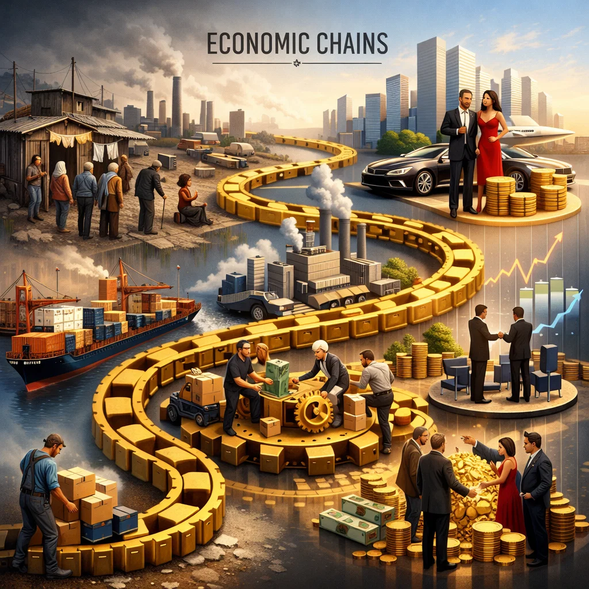

# Экономические цепочки 💹⛓️

В экономике, как и в жизни, каждое [событие](causality_base.md) имеет свои **причины** и **следствия**. [Цена](../../../6.1_Independent_living_and_daily_living_skills/reasonable_spending/articles/price.md) на товар, [инвестиции](../../../2.2_history/world_economy_on_fingers/articles/aziatskie_tigry.md), потребительский спрос, [колебания](../../../1.2_natural_sciences/physics_in_everyday_life/Q11652.md) валют — всё связано в сложную **[цепь](../../../1.2_natural_sciences/physics_in_everyday_life/Q12725.md) взаимозависимостей**. [Понимание](empathy_causality.md) этих связей позволяет предсказывать последствия решений и управлять ресурсами более эффективно. В этой статье мы рассмотрим, как устроены **экономические цепочки**, почему важно видеть их целиком и как это помогает принимать обоснованные решения. О [том](../../../7.1_art/musical_instruments/articles/drums.md), как [ИИ помогает искать причины](./ai_causality.md), читайте в отдельной статье.

---

## [Природа](../../../1.2_natural_sciences/why_science_help_understand_world/nature.md) экономических цепочек 📊

Каждое экономическое [действие](personal_choice.md) — будь то покупка, продажа или инвестирование — запускает ряд **последствий**, которые распространяются дальше по системе. Экономическая цепочка — это последовательность взаимосвязанных событий, где одна операция служит **причиной**, а последующие [шаги](../../../7.2 Media, leisure and hobbies/Computer games/articles/dream_team/composer.md) — **следствием**.

> **Важно!** Если не учитывать последствия на всех уровнях цепочки, решения могут привести к неожиданным потерям или упущенным возможностям.

### Компоненты экономической цепочки:

* 💡 **[Ресурсы](ecological_footprint.md)** — то, что используется для производства товаров и услуг.
* ⚖️ **[Процесс](../../../5.1_technology_and_digital_literacy/operating system/articles/process.md)** — [действия](../../../3.1_healthy_lifestyle/pervaya_pomoshch/ushibi_porezy_ozhogi/03_obschie_pravila_algorithm.md), которые превращают [ресурсы](ecological_footprint.md) в [результат](../../../1.2_natural_sciences/why_science_help_understand_world/experimental_science.md).
* 🚀 **[Результат](../../../1.2_natural_sciences/why_science_help_understand_world/experimental_science.md)** — товар, услуга, прибыль или убыток.

Пример простой цепочки:

* **[Причина](causality_base.md):** [Повышение](../../../8.2_future/choosing_a_career_path/articles/career-path.md) сырьевых цен → **[Следствие](causality_base.md):** Увеличение стоимости производства → **[Следствие](causality_base.md):** [Рост](../../../3.1. healthy lifestyle/Sleep, nutrition, and adolescent energy/articles/micronutrients_and_teenagers.md) цены на конечный продукт → **Следствие:** Снижение покупательной [способности](../../../4.1_rules_of_study/how_to_learn_effectively/articles/growth_mindset.md).

---

## [Влияние](../../../5.1_technology_and_digital_literacy/information and media literacy/манипуляции_и_пропаганда.md) решений на цепочку 🔄

Экономические цепочки не линейны: одно [событие](causality_base.md) может вызвать **множество ответвлений**, некоторые из которых непредсказуемы. [Понимание](empathy_causality.md) **каскадного эффекта** важно для бизнеса, государства и индивидуальных инвесторов.

* **Детальная [оценка](../../../4.1_rules_of_study/how_to_learn_effectively/articles/self_reflection.md):** Прежде чем принимать [решение](personal_choice.md), учитывайте не только ближайший результат, но и вторичные последствия.
* **[Прогнозирование](ai_causality.md) рисков:** Предвидя возможные последствия, можно минимизировать финансовые потери.
* **Оптимизация ресурсов:** [Анализ](../../../1.2_natural_sciences/why_science_help_understand_world/research.md) цепочек помогает рационально распределять капитал, труд и [время](../../../1.2_natural_sciences/physics_in_everyday_life/Q20702.md).

---

## Примеры экономических цепочек 🏦

| Событие                     | [Причина](causality_base.md)                                   | Следствие                                   |
| --------------------------- | ----------------------------------------- | ------------------------------------------- |
| [Рост](../../../3.1. healthy lifestyle/Sleep, nutrition, and adolescent energy/articles/micronutrients_and_teenagers.md) курса валют            | Спрос на валюту выше предложения          | Удорожание импортных товаров                |
| Инвестиции в инфраструктуру | Планы государства стимулировать экономику | Создание рабочих мест, рост потребления     |
| Снижение налогов            | [Желание](../../../6.1_Independent_living_and_daily_living_skills/reasonable_spending/articles/want.md) стимулировать [бизнес](../../../8.1_self-understanding/HowToFindYourStrengths/articles/talent_monetization.md)              | Увеличение инвестиций, рост [доходов](../../../8.2_future/choosing_a_career_path/articles/salary.md) бюджета |

> В реальности цепочки часто переплетаются: одно событие одновременно влияет на несколько отраслей, создавая **эффект домино** в экономике.

---

## Цепочка решений: [анализ](../../../1.2_natural_sciences/why_science_help_understand_world/research.md) и [прогнозирование](ai_causality.md) 🧠

Экономика — это постоянное [взаимодействие](../../../1.2_natural_sciences/physics_in_everyday_life/Q128030.md) **выбора, [действия](../../../3.1_healthy_lifestyle/pervaya_pomoshch/ushibi_porezy_ozhogi/03_obschie_pravila_algorithm.md) и последствия**. Чтобы управлять этим процессом, важно видеть цепочку полностью:

1. **[Решение](personal_choice.md):** Например, компания решает увеличить производство.
2. **[Действие](personal_choice.md):** Покупка сырья, расширение производственных мощностей.
3. **[Последствие](personal_choice.md):** Изменение цен, спроса, прибыли, влияющее на рынок и потребителей.

Осознание этих связей превращает управленца из «реактивного» участника рынка в **стратегического игрока**, способного прогнозировать результат и корректировать курс.

---

## [Заключение](../../../1.2_natural_sciences/physics_in_everyday_life/Q2225.md) 💭

Понимание **экономических цепочек** — это не просто инструмент анализа цифр. Это способ видеть **причины и последствия** в динамичной системе, принимать **осознанные решения** и минимизировать неожиданные потери. Освоив этот подход, мы учимся действовать **проактивно**, предсказывать [результаты](../../../1.2_natural_sciences/why_science_help_understand_world/research_work.md) и создавать устойчивые [стратегии](../../../../8.1_self_understanding/articles/overcoming.md) — будь то в бизнесе, финансах или личной жизни. 🌱

---

*[Автор](../../../5.1_technology_and_digital_literacy/information and media literacy/авторское_право_и_честное_использование.md): Слесарчук Василий*

*Использованные [нейросети](ai_causality.md): СhatGPT (GPT-5.3) для генерации текста, Sora для создания иллюстрации.*

---
