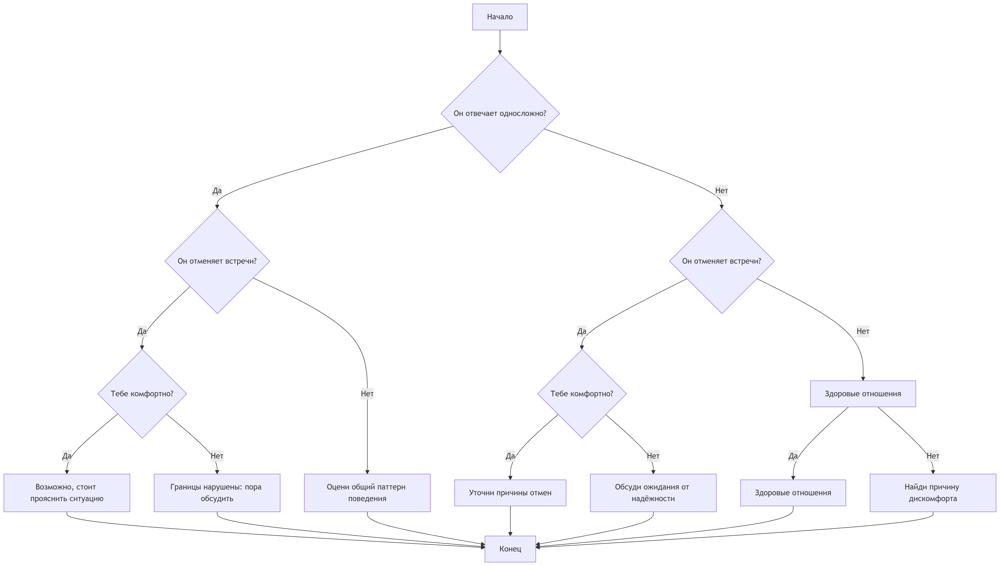

# Кринж или норм? Как понять, не бесишь ли ты нового друга своим поведением

Ты познакомился с крутым чуваком или девчонкой, всё вроде идет отлично, но вдруг появляется тревожная мысль: «А вдруг я его/её бешу?». Знакомо? Это нормальная паранойя. Мы все боимся показаться странными или навязчивыми. Но как отличить реальную проблему от своих страхов? Давай разбираться, где проходит грань между «классным другом» и «тем самым кринжовым типом».

## Красные флаги: когда ты реально бесишь

Есть сигналы, которые игнорировать [нельзя](../../../3.1_healthy_lifestyle/pervaya_pomoshch/ushibi_porezy_ozhogi/07_ushib_chego_nelzya.md). Если ты замечаешь их постоянно, возможно, стоит сбавить обороты или найти новый круг общения схожий с твоими интересами.

1.  **Односложные ответы.** Ты пишешь полотна текста, скидываешь мемы и крутые видосы, а в [ответ](../../../5.1_technology_and_digital_literacy/how_internet_works/articles/http_https/http_https.md) получаешь сухое «ага», «норм» или «ясно». Если это происходит разово — может, [человек](../../../1.2_natural_sciences/physics_in_everyday_life/Q45003.md) просто занят. Но если это система, и [инициатива](mozno_li_naiti_druzei_sluchaino.md) всегда исходит только от тебя — **СТОП**. Ты навязываешься.
2.  **Отмены планов.** Вы договариваетесь встретиться, но друг постоянно находит отговорки: «голова болит», «[родители](../../../../8.1_self_understanding/articles/family_influence.md) не пускают», «я [устал](../../../4.1_rules_of_study/how_to_memorize/articles/ustalost.md)». А потом ты видишь его [онлайн](../../../3.2 healthy lifestyle/how to act in a dangerous situation/articles/internet-safety.md) в игре или в сторис с другими ребятами. Это больно, но это [факт](../../../1.2_natural_sciences/why_science_help_understand_world/science.md): ты не в приоритете и нужно **ОСТАНОВИТЬСЯ**.
3.  **Игнор личных границ.** Ты шутишь над тем, что ему неприятно, или лезешь с расспросами, когда он хочет помолчать. Если друг говорит «хватит» или «мне некомфортно», а ты продолжаешь гнуть свою линию — это **КРИНЖ** и неуважение.
4.  **Только ты говоришь.** В диалоге или на встрече ты постоянно рассказываешь о себе, о своих успехах или проблемах, не давая вставить слово. Эгоцентризм отталкивает быстрее всего. Стоит **ЗАДУМАТЬСЯ**.

## Желтые флаги: это ещё не кринж, но уже настораживает

Иногда [поведение](../../../1.2_natural_sciences/neurobiology_for_teens/articles/06_phineas_gage.md) друга меняется не потому, что ты бесишь, а по другим причинам. Не спеши делать [выводы](../../../1.2_natural_sciences/why_science_help_understand_world/research_work.md).

*   **Стал реже отвечать.** Может, у него проблемы в семье, завал в школе или просто депрессивный [период](../../../1.2_natural_sciences/physics_in_everyday_life/Q11652.md). В 8 классе нагрузка возрастает, и не у всех есть [силы](../../../1.2_natural_sciences/physics_in_everyday_life/Q11423.md) на постоянную болтовню.
*   **Шутки не заходят.** То, что было смешно месяц назад, сейчас вызывает неловкое молчание. Люди меняются, их чувство юмора тоже. Это не значит, что ты плохой друг, просто вы немного рассинхронизировались.

## Как проверить, не перегибаешь ли ты палку?

Лучший способ не гадать на кофейной гуще, а проанализировать ситуацию. Задай себе три честных вопроса:

1.  **Я слушаю или жду своей очереди говорить?** Настоящая [дружба](../../../1.2_natural_sciences/neurobiology_for_teens/articles/17_hugs_oxytocin.md) — это [диалог](../../../../8.1_entertainment/articles/script.md). Если ты знаешь о его жизни только то, что он сам рассказал под давлением, а о себе ты выложил всю подноготную — это дисбаланс.
2.  **Мне комфортно с ним или я пытаюсь заслужить одобрение?** Если ты меняешь свои [интересы](../../cause_and_effect_relationships/articles/conflict_roots.md), притворяешься фанатом того, что тебе не нравится, или смеешься над шутками, которые считаешь глупыми, только чтобы понравиться — это [путь](../../../1.2_natural_sciences/physics_in_everyday_life/Q11476.md) в никуда. Рано или поздно маска спадет, и будет еще более кринжово.
3.  **Уважаю ли я его «нет»?** Если друг отказался идти гулять, а ты начал давить на [жалость](../../../1.2_natural_sciences/neurobiology_for_teens/articles/15_empathy.md) или злиться — ты ведешь себя токсично.

## Что делать, если ты всё-таки бесишь?

Допустим, ты понял, что перегнул палку. Паниковать не надо. Ситуации бывают разные.

**[Сценарий](../../../../8.1_entertainment/articles/script.md) 1: Ты просто был слишком навязчив.**
Сделай [шаг](../../../1.2_natural_sciences/physics_in_everyday_life/Q36253.md) назад. Перестань писать первым пару дней. Дай человеку [пространство](../../../1.2_natural_sciences/physics_in_everyday_life/Q36253.md). Часто отсутствие только усиливает [интерес](../../../1.2_natural_sciences/neurobiology_for_teens/articles/19_curiosity.md). Если друг сам напишет — отлично, значит, ты ему нужен. Если нет — увы, возможно, вы просто не сошлись характерами, и это нормально. Нельзя нравиться всем.

**Сценарий 2: Ты нарушил границы.**
Если ты пошутил неудачно или полез не в свое дело, лучшее [решение](../../cause_and_effect_relationships/articles/personal_choice.md) — извиниться. Не пиши поэмы с оправданиями. Просто и честно: «Слушай, я тупанул с той шуткой, извини, больше не буду». Искренность подкупает. Если друг адекватный, он примет извинения.

**Сценарий 3: Вы просто разные.**
Иногда люди просто перерастают друг друга. То, что было интересно в 5 классе, в 8-м кажется детским садом. Если тебе хочется обсуждать [аниме](fandom.md) и игры, а другу только тусовки и [отношения](guide_dlya_introvertov.md) с противоположным полом — это не значит, что кто-то из вас «кринж». Просто ваши пути расходятся.

## Главный секрет

Перестань париться над тем, что о тебе подумают. Парадокс в [том](../../../7.1_art/musical_instruments/articles/drums.md), что именно [неуверенность](../../../8.1_self-understanding/HowToFindYourStrengths/articles/impostor_syndrome.md) и [желание](../../../6.1_Independent_living_and_daily_living_skills/reasonable_spending/articles/want.md) понравиться всем подряд выглядят максимально кринжово. Люди тянутся к тем, кто уверен в себе, кто имеет свои интересы и не боится быть собой.

Если ты интересный [собеседник](interesnoe_obshchenie.md), уважаешь других и не ведешь себя токсично — у тебя всё будет норм. А если кто-то всё равно бесится — это его проблемы, а не твои. Найди тех, с кем тебе будет легко и без масок. Такие люди обязательно найдутся.

## Связанные статьи

- [Дружба на веки: Как не поссориться с лучшим другом и не потерять его навсегда](./sora_drug.md.md)
- [Цифровая дружба: реально ли найти друга в соцсетях?](./tcifrovaya_druzhba.md)
- [Кибербуллинг: как распознать и действовать](../../../5.1_technology_and_digital_literacy/information%20and%20media%20literacy/articles/кибербуллинг_как_распознать_и_действовать.md)

---

*[Автор](../../../4.2_thinking_and_working_information/how_to_search_information/articles/copypaste.md): Сергеева Алёна (@Yoshivara)*

*Использованные [нейросети](../../cause_and_effect_relationships/articles/ai_causality.md): Qwen3.5-Plus, Алиса AI*, Mage