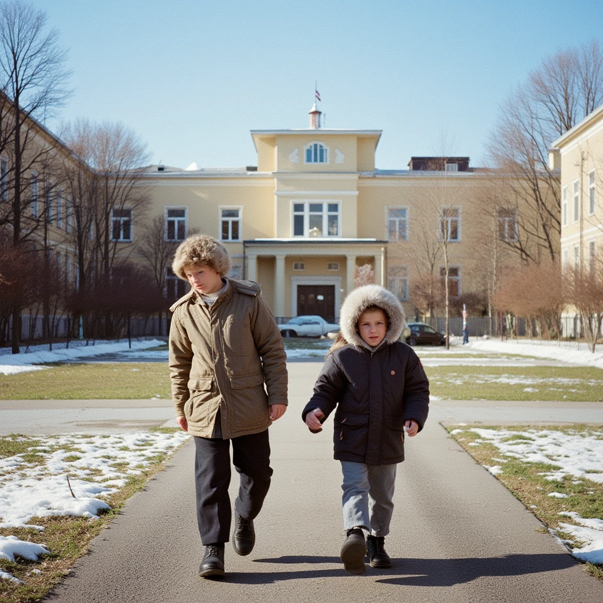

# Дружба после школы: Что делать, если живешь в одном дворе, а интересы — в разных вселенных?

Школа заканчивается, и привычный мир рушится. Вчера вы каждый день видели одноклассников, сидели за одной партой, обсуждали учителей, вместе бежали с последнего урока и зависали во дворе до темноты. Сегодня всё иначе.

Кто-то уехал учиться в другой город. Кто-то пошёл работать. Кто-то нашёл новых друзей в университете. А кто-то остался в том же дворе, но между вами словно выросла невидимая стена. Разговоры становятся короче, встречи — реже, а общие темы тают на глазах.

Дружба после школы проходит первое серьёзное испытание реальностью. Как не потерять дорогих людей, когда ваши вселенные разлетаются с бешеной скоростью?

## Почему школьные друзья отдаляются

Это естественный процесс, и в нём нет вины кого-либо. С вами и вашими друзьями происходит нормальная жизнь.

*   **Разный темп жизни.** Один встаёт в 6 утра на завод или стройку, другой — к 11-й паре в университете. Один зубрит билеты к сессии, другой — осваивает рабочую специальность. У вас просто физически разные графики и разная усталость.
*   **Новый круг общения.** Появляются новые знакомые из универа, с работы, с курсов. С ними вы видитесь чаще, у них понятный текущий контекст. Это не предательство, это расширение картины мира.
*   **Смена ценностей.** То, что было важно в 16 лет (тусовки во дворе, обсуждение одноклассников, походы в кинотеатр), может стать безразлично в 20 (карьера, отношения, деньги, самореализация). Вы меняетесь, и это нормально.
*   **Разное финансовое положение.** Кто-то уже зарабатывает и может позволить себе путешествия и рестораны, кто-то живёт на стипендию и считает каждую копейку. Разный уровень дохода создаёт дистанцию.
*   **География.** Переезд в другой район, город или страну автоматически выкидывает из ежедневного контекста. Поддерживать связь на расстоянии сложно, даже при огромном желании.

Это не предательство. Это **эволюция**. Вопрос не в том, чтобы удержать всё любой ценой, а в том, чтобы понять, какие отношения вы хотите сохранить и готовы ли к этому обе стороны.

## Что происходит с дружбой после школы

Психологи выделяют несколько сценариев развития школьной дружбы во взрослой жизни:

### Сценарий 1. Естественное угасание

Вы просто перестаёте общаться. Не потому, что поссорились, а потому что исчез повод. Нет общих тем, нет регулярных встреч, нет необходимости. При случайной встрече вы можете тепло поздороваться, обменяться новостями за пять минут и разойтись. Это грустно, но это жизнь. Такая дружба выполнила свою функцию в своё время.

### Сценарий 2. Ритуальные встречи

Вы договариваетесь видеться раз в месяц или в полгода. Встречаетесь, пьёте пиво, вспоминаете школу, обсуждаете, у кого какие новости. Это тёплые, но уже скорее ностальгические встречи. Глубокой связи уже нет, но есть память и приятные эмоции.

### Сценарий 3. Трансформация в настоящую дружбу

Самый редкий и ценный сценарий. Из «вынужденных соседей по парте» вы становитесь осознанными друзьями по жизни. Вас связывает уже не школа, а взаимный интерес, общие ценности, доверие. Такая дружба не боится расстояния и времени.

## Как поддерживать связь, если вы стали разными

Если вы чувствуете, что дружба вам дорога, и вы хотите её сохранить, придётся приложить усилия. Это работа, но она окупается.

### 1. Откажитесь от ожиданий

Перестаньте ждать, что друг останется таким же, как в 9-м классе. Он изменится. И вы изменитесь. Если вы будете ждать прежнего человека, вы неизбежно разочаруетесь.

Примите его новый образ. Даже если вам не нравится его новая девушка, его музыка или выбор профессии. Он имеет право на свой путь. Цените то общее, что у вас было, и искренне интересуйтесь тем, что у него сейчас.

### 2. Создайте новые ритуалы

Раз нет возможности видеться каждый день, придумайте регулярные «якоря» связи.

*   **Общий онлайн-досуг.** Играйте по вечерам в онлайн-игры, смотрите одновременно фильмы по видеосвязи с синхронным запуском, слушайте и обсуждайте подкасты.
*   **Еженедельные или ежемесячные созвоны.** Выделите полчаса в воскресенье, чтобы просто поболтать, посмеяться, поделиться новостями. Сделайте это традицией.
*   **Офлайн-встречи.** Если живёте в одном городе — введите традицию «встречи выпускников» в узком кругу раз в месяц. Ходите в новые места, создавайте новые общие воспоминания.

### 3. Ищите новые точки соприкосновения

Ваши интересы разошлись? Отлично! Это повод узнать что-то новое.

Попросите друга-программиста объяснить простыми словами, чем он там занимается на работе. А он пусть сходит с вами на выставку современного искусства, даже если обычно предпочитает «Мстителей». Дружба — это диалог двух разных миров. Если вам интересны не только ваши темы, но и его — это настоящая близость.

### 4. Принимайте его новый круг

Не ревнуйте к новым друзьям. У вас тоже они появятся. Если друг знакомит вас со своими новыми знакомыми — это знак доверия. Не отказывайтесь от совместных встреч, даже если вам немного некомфортно. Это шанс расширить свою картину мира.

### 5. Говорите честно

Если вы чувствуете, что отдаляетесь, и вам это больно — скажите об этом. «Мне не хватает нашего общения», «Давай придумаем, как нам не потеряться». Часто другой человек чувствует то же самое, но боится заговорить первым.

## Как понять, что дружба всё-таки закончилась

Бывает и так, что сохранить уже нечего. Признаки того, что дружба выполнила свою функцию:

*   Вам больше не о чем говорить. Разговоры становятся натянутыми и поверхностными.
*   Встречи воспринимаются как обязанность. Вы чувствуете облегчение, если они срываются.
*   Вы не доверяете другу свои секреты и переживания, как раньше.
*   Вы не ждёте от него поддержки и не хотите его поддерживать.
*   Вы замечаете, что рядом с ним вам скорее скучно или некомфортно, чем тепло.

В этом случае лучше честно отпустить. Не нужно драмы и выяснений. Просто позвольте отношениям уйти. Освободившееся место займут новые люди, которые будут соответствовать вашему сегодняшнему миру.

## Главное

Дружба после школы переходит из категории «вынужденное соседство» в категорию «осознанный выбор». Вы уже не просто «одноклассники». Вы или становитесь друзьями по жизни, или остаётесь тёплыми воспоминаниями.

И то, и другое — нормально. Ценность школьной дружбы не в том, чтобы длиться вечно, а в том, что она была в тот момент, когда была нужна больше всего.

Но если вам удалось сохранить дружбу через годы, расстояния и разные вселенные — это будет самая крепкая связь, которую вы только можете представить. Вас связывает не общая парта, а нечто большее: история, доверие и взаимное уважение, которые не зависят от обстоятельств.

## Словарь по теме

**Социализация** — процесс усвоения человеком норм, правил и моделей поведения, необходимых для жизни в обществе, а также построения социальных связей на разных этапах жизни.

**Адаптация** — приспособление человека к изменяющимся условиям среды, в том числе к новому социальному окружению и новым жизненным обстоятельствам.

**Ценности** — важные для человека ориентиры, то, что определяет его выбор, поведение и отношение к жизни (семья, карьера, свобода, творчество, стабильность).

**Ритуал** — установленный порядок действий, традиция, которая объединяет людей и создаёт чувство общности и предсказуемости отношений.

**Сепарация** — в психологии — процесс отделения от родителей и становления самостоятельной личностью. В контексте дружбы — отделение от старого круга общения и формирование нового, соответствующего текущему этапу жизни.

**Ностальгия** — тоска по прошлому, по прежним местам, людям и событиям, часто сопровождающаяся идеализацией «того времени».

**Осознанная дружба** — отношения, которые поддерживаются не из привычки или обязанности, а из взаимного интереса, уважения и желания быть частью жизни друг друга.

**Жизненный контекст** — совокупность обстоятельств, условий и событий, составляющих текущую жизнь человека (работа, учёба, семья, окружение, интересы).

## Связанные статьи

- [Цифровая дружба: реально ли найти друга в соцсетях?](./tcifrovaya_druzhba.md)
- [Можно ли найти друзей случайно](./mozno_li_naiti_druzei_sluchaino.md)
- [Гайд для интровертов: как найти друзей, не истощая свой ресурс](./guide_dlya_introvertov.md)

---

**Автор:** Соболин Тимофей 
*Текст статьи подготовлен с использованием нейросетей (LLM — ChatGPT).*