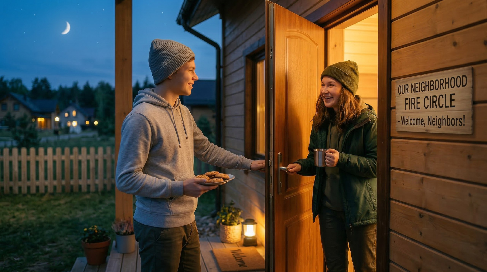

# Дружба с соседями: новый тренд или забытое старое?

Ты когда-нибудь замечал, что живёшь рядом с людьми уже несколько лет, а знаешь их только в лицо? Или вообще не знаешь 😅. В этой статье разберёмся, почему соседи — это недооценённый ресурс для общения, и как превратить людей за стенкой в настоящих знакомых, а может, и друзей.

---

---

## Зачем вообще дружить с соседями

Раньше во дворах все знали друг друга по именам: дети гуляли вместе, взрослые занимали соль и помогали с ремонтом. Потом появились смартфоны, закрытые двери и доставка еды — и всё, сосед стал просто "тот мужик с третьего этажа" 🚪. Но сейчас эта история снова набирает обороты. Люди начинают понимать: живёшь рядом — значит, уже есть что-то общее. И это отличная точка старта для общения.

---

## 1. Чаты дома и подъезда

Почти в каждом доме сейчас есть общий чат в мессенджере — и это реально работает 📱. Там обсуждают сломанный лифт, потерявшихся кошек и шумных соседей. Но помимо жалоб, чат — это способ познакомиться. Можно написать что-то полезное: "Кто-нибудь едет в сторону центра, можем скинуться на такси?" или "Нашёл ключи у подъезда — чьи?". Люди запоминают тех, кто помогает или просто пишет по делу. Так из безликого "участника чата" ты превращаешься в конкретного живого человека.

> Если чата ещё нет — можно предложить его создать. Это уже повод познакомиться с несколькими соседями лично.

---

## 2. Совместные субботники

Субботник — это когда соседи собираются и вместе убирают двор или подъезд 🧹. Звучит скучно, но на деле это один из самых простых способов познакомиться с людьми из своего дома. Во-первых, вы делаете что-то реально полезное вместе. Во-вторых, пока метёшь или сгребаешь листья, разговор сам собой завязывается: "Ты давно здесь живёшь?", "А ты в каком подъезде?" или "Слушай, а давно у нас такой бардак во дворе?". После субботника люди часто остаются поболтать или пьют чай — и вот уже компания готова.

---

## 3. Посадка деревьев и озеленение двора

Это уже следующий уровень 🌱. Некоторые соседи организуют небольшие проекты: посадить деревья, разбить клумбу или поставить скворечники. Такие штуки объединяют лучше любой вечеринки, потому что у вас есть общая цель и общий результат. Потом, когда дерево вырастет, ты будешь проходить мимо и думать: "Вот это мы с Колей с пятого этажа сажали". Чтобы начать, не нужно быть организатором — можно просто спросить в чате: "Есть желающие облагородить двор?" и посмотреть, кто откликнется.

---

## 4. Традиция "чаепития на лестничной клетке"

Это вообще отдельная история ☕. В некоторых домах соседи договариваются раз в месяц (или по праздникам) выходить на площадку с чаем, печеньем и хорошим настроением. Никакого повода не нужно — просто посидеть, познакомиться, поговорить. Для подростка это звучит странно, но именно так часто находятся классные взрослые соседи, которые могут и помочь с чем-то, и просто поддержать. Плюс — это повод вылезти из комнаты и хоть немного пообщаться вживую 😄.

---

## 5. Общие интересы внутри дома

Иногда оказывается, что в твоём доме живёт кто-то с похожими увлечениями. Кто-то играет на гитаре, кто-то рисует, кто-то гоняет на велике. Об этом просто никто не знает, потому что не спрашивал 🎸. Можно написать в чат: "Есть кто-нибудь, кто играет в настолки?" или "Ищу напарника для пробежек по утрам". Звучит смело, но такие посты обычно набирают кучу ответов — потому что многие думают о том же, но не решаются написать первыми.

---

## 6. Помощь по мелочам

Иногда дружба начинается с самого простого: придержал дверь, помог донести тяжёлые пакеты, присмотрел за кошкой на неделю 🐱. Такие маленькие жесты запоминаются, и люди начинают воспринимать тебя как "своего". Не нужно ничего специально организовывать — просто будь внимательным к тем, кто живёт рядом. Это работает даже лучше, чем любой чат или субботник.

---

## Новый тренд или забытое старое?

Если честно — и то, и другое. Соседские сообщества были нормой ещё у наших бабушек и дедушек. Потом всё это куда-то исчезло. А сейчас снова возвращается — только уже с чатами, совместными проектами и осознанным желанием знать людей рядом. Это не ностальгия, а просто здравый смысл: если ты знаешь соседей, ты чувствуешь себя в своём доме безопаснее и уютнее. И это работает в любом возрасте — даже в восьмом классе 😊.

---

## Как выбрать своё место

Не обязательно участвовать во всём сразу. Подумай:

- Тебе комфортнее онлайн (чат) или офлайн (субботник, чаепитие)?
- Ты хочешь познакомиться с ровесниками из дома или с людьми любого возраста?
- Что тебе проще — написать первым в чате или подойти лично?
- Есть ли у тебя идея маленького проекта, которую можно предложить соседям?

Начни с одного шага — и посмотри, что получится. Иногда достаточно просто поздороваться в лифте, чтобы через месяц уже знать человека по имени.

---

## Как общаться с соседями аккуратно и безопасно

Соседи — это всё равно чужие люди, пока вы не познакомились поближе. Не нужно сразу рассказывать, когда ты дома один, давать ключи или впускать незнакомых людей в квартиру. Общение в чате или во дворе — это нормально и безопасно. Если что-то в поведении соседа кажется странным или некомфортным, доверяй своим ощущениям и скажи об этом взрослым.

> Дружба с соседями — это про уважение и постепенное доверие, а не про то, чтобы сразу стать лучшими друзьями.

---

## Короткие вопросы и ответы

**Вопрос 1.** А если соседи вообще не хотят общаться — это нормально? 😐

**Ответ.** Да, абсолютно. У всех разный темп и разные границы. Не нужно навязываться — достаточно быть открытым, и те, кому интересно, сами откликнутся.

**Вопрос 2.** Я подросток, взрослые соседи меня не воспримут всерьёз?

**Ответ.** Воспримут, если ты ведёшь себя нормально и по делу. Помог донести пакет или написал что-то полезное в чат — тебя уже запомнили как адекватного человека.

**Вопрос 3.** Как предложить создать чат дома, если я не знаю никого?

**Ответ.** Можно написать объявление на доске у подъезда или просто спросить у ближайших соседей. Обычно кто-то один уже знает остальных и поможет собрать всех в одном месте.

**Вопрос 4.** Как не выглядеть странно, если я хочу познакомиться с соседями?

**Ответ.** Просто начни с повода: совместное дело, вопрос в чате или маленькая помощь. Люди не думают, что ты странный — они просто удивятся, что кто-то первым сделал шаг.

**Вопрос 5.** А если сосед неприятный или шумит по ночам — как с этим?

**Ответ.** Это отдельная история. Лучше сначала вежливо поговорить, а если не помогает — подключать взрослых или управляющую компанию. Конфликт с соседями — не повод отказываться от общения с остальными.

**Вопрос 6.** Есть ли смысл дружить с соседями, если я скоро перееду?

**Ответ.** Да. Даже временное общение даёт опыт, поддержку прямо сейчас и иногда — знакомства, которые остаются на долго после переезда.

**Вопрос 7.** С чего вообще начать, если никогда этим не занимался?

**Ответ.** С самого маленького шага: поздоровайся с соседом в лифте по имени (если знаешь), или напиши что-то полезное в общий чат. Одно действие — и ты уже начал.

---

## Связанные статьи

- [Топ-10 неочевидных мест для знакомства](./neochevidnye_mesta_dlya_znakomstva.md)
- [Гайд для интровертов: как найти друзей, не истощая свой ресурс](./guide_dlya_introvertov.md)
- [Skill-микс: идём на курсы не за дипломом, а за людьми](./skill_miks.md)

---

## Словарь по теме

**Субботник** — добровольная коллективная уборка или благоустройство территории: двора, парка, подъезда.

**Сообщество** — группа людей, объединённых общим местом (двор, дом, район) или общими интересами и целями.

**Чат дома** — общий мессенджер-чат для жильцов одного дома или подъезда, где обсуждают общие вопросы и новости.

**Озеленение** — посадка деревьев, кустов, цветов и другой растительности для улучшения внешнего вида территории.

**Инициатива** — самостоятельное предложение или действие, которое ты берёшь на себя, не дожидаясь, пока кто-то другой это сделает.

**Управляющая компания** — организация, которая отвечает за обслуживание жилого дома: ремонт, уборку, коммунальные услуги.

**Личные границы** — правила, которые человек устанавливает для себя в общении: что ему комфортно, а что — нет.

**Доверие** — ощущение безопасности рядом с человеком, уверенность, что он не подведёт и не причинит вред.

---

Авторы: *Леоненкова Елена leoelena, @leoelena2;*

*Ресурсы: Perplexity (GPT‑5.1), Nano Banana 2*