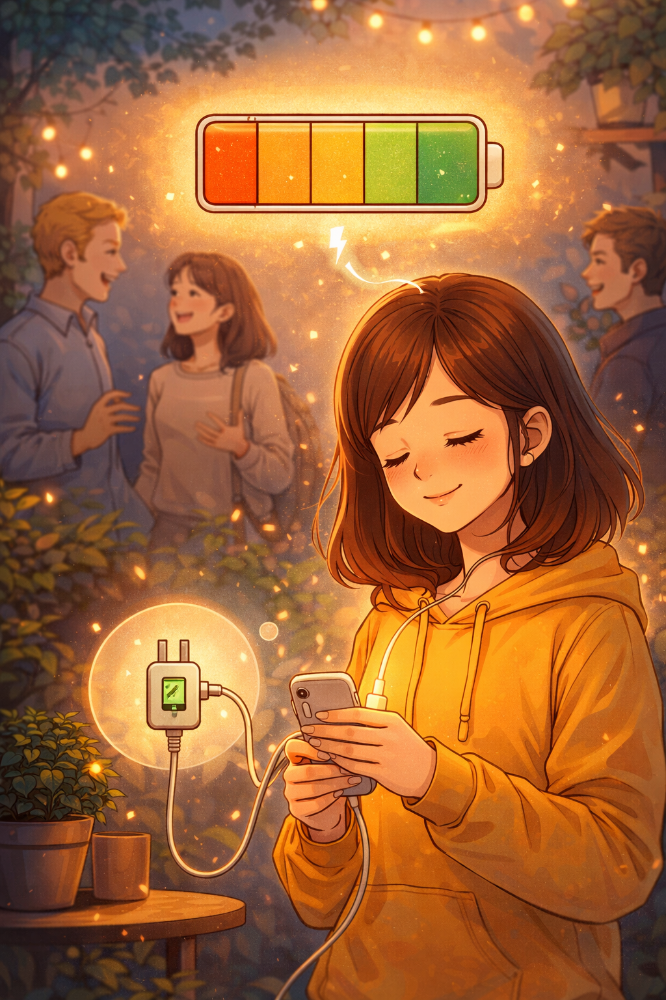

# Гайд для интровертов: как найти друзей, не истощая свой ресурс

Интроверты часто воспринимаются как замкнутые или нелюдимые люди, но это распространённое заблуждение. На самом деле интроверсия — это не про нелюбовь к общению, а про особенности восстановления энергии. Интроверт может с удовольствием общаться и иметь друзей, но при этом ему важно сохранять баланс и не перегружать себя. В этой статье мы разберём, как интроверту находить друзей, строить отношения и при этом не чувствовать усталости и эмоционального выгорания.

## Что значит быть интровертом

Интроверт — это человек, который восстанавливает энергию в спокойной обстановке: в одиночестве или в кругу близких людей. В отличие от экстравертов, которые заряжаются от активного общения, интроверты могут быстро уставать от шумных компаний, длительных разговоров или большого количества социальных контактов.

Важно понимать, что интроверсия — это не недостаток, а особенность личности. Интроверты часто обладают такими сильными качествами, как внимательность, умение слушать, глубокое мышление и склонность к искренним, а не поверхностным отношениям.

## Почему интроверту может быть сложно заводить друзей

Сложности возникают не из-за отсутствия желания общаться, а из-за формата общения. Например:

* шумные вечеринки могут вызывать дискомфорт
* необходимость быстро знакомиться с новыми людьми утомляет
* страх показаться навязчивым или сказать что-то не так
* предпочтение глубоких разговоров вместо «small talk»

Интроверту важно время, чтобы привыкнуть к человеку. Поэтому быстрые и поверхностные знакомства могут казаться неестественными.

## Где интроверту проще находить друзей

Лучше выбирать такие ситуации, где общение происходит постепенно и естественно. Подходящие варианты:

* кружки и клубы по интересам (рисование, шахматы, программирование)
* учебные проекты или совместные задания
* небольшие курсы или мастер-классы
* онлайн-сообщества и тематические форумы

В таких местах разговор начинается сам собой, потому что есть общая тема. Это снижает напряжение и помогает чувствовать себя увереннее.

## Как начать общение без стресса

Начало разговора — один из самых сложных этапов. Но на самом деле всё проще, чем кажется. Не нужно придумывать идеальные фразы.

Вот несколько простых способов:

* задать вопрос по ситуации («Ты понял это задание?»)
* попросить совет («Как ты это сделал?»)
* сделать комментарий («Интересная идея, я бы так не подумал»)

Главное — говорить естественно. Интроверты часто лучше чувствуют себя, когда разговор имеет конкретную цель, а не является «разговором ради разговора».

## Как сохранять энергию при общении

Чтобы не чувствовать усталость, важно следить за своим состоянием. Несколько полезных правил:

* делайте перерывы после общения
* планируйте время для восстановления (чтение, прогулка, хобби)
* не перегружайте себя встречами
* выбирайте комфортный формат общения (например, переписка вместо звонков)

Умение сказать «нет» — важный навык. Это не делает человека плохим другом, а помогает сохранять ресурс.

## Как строить и развивать дружбу

Дружба — это процесс, который требует времени. Интровертам особенно подходит постепенное сближение:

* общайтесь регулярно, но без давления
* делитесь своими мыслями и интересами
* задавайте вопросы и проявляйте внимание
* уважайте личные границы

Интроверты часто становятся надёжными друзьями, потому что они умеют слушать и ценят искренность. Их дружба обычно глубже и стабильнее.

Важно помнить: не нужно пытаться понравиться всем. Достаточно найти «своих» людей, с которыми комфортно.

## Онлайн-общение как альтернатива

Для многих интровертов онлайн-формат — отличный способ завести друзей. Он даёт несколько преимуществ:

* можно обдумать ответ перед тем, как написать
* нет давления живого общения
* легче найти людей с похожими интересами

Это могут быть:

* чаты по интересам
* игровые сообщества
* образовательные платформы
* социальные сети

Иногда онлайн-дружба со временем переходит в реальную. Но даже если этого не происходит, такие отношения всё равно могут быть значимыми.

## Как понять, что дружба подходит именно вам

Хорошая дружба не должна вызывать постоянную усталость или стресс. Есть несколько признаков, что вы на правильном пути:

* вам комфортно рядом с человеком
* можно быть собой без страха осуждения
* после общения не возникает сильной усталости
* есть взаимный интерес и уважение

Если же общение постоянно истощает, стоит задуматься о границах или формате отношений.

## Итог

Интровертам не нужно менять себя, чтобы находить друзей. Гораздо важнее понять свои особенности и выстраивать общение так, чтобы оно приносило радость, а не усталость. Небольшое количество близких друзей, спокойные форматы общения и уважение к собственным границам — ключ к комфортной социальной жизни.

Дружба — это не про количество, а про качество. И именно в этом интроверты часто оказываются особенно сильны.

## Короткие вопросы и ответы

**1. Нужно ли интроверту много друзей?**
Нет, достаточно нескольких близких людей.

**2. Можно ли быть интровертом и общительным?**
Да, просто общение должно быть комфортным.

**3. Что делать, если трудно начать разговор?**
Начните с простого вопроса или комментария.

**4. Нормально ли уставать от общения?**
Да, это естественно для интровертов.

**5. Можно ли найти друзей онлайн?**
Да, это распространённый и удобный способ.

**6. Нужно ли менять себя, чтобы понравиться другим?**
Нет, лучше оставаться собой.

**7. Как понять, что человек подходит для дружбы?**
С ним комфортно и легко общаться.

## Связанные статьи

- [Можно ли найти друзей случайно](./mozno_li_naiti_druzei_sluchaino.md)
- [Цифровая дружба: реально ли найти друга в соцсетях?](./tcifrovaya_druzhba.md)
- [Clubs And Sections](../../../7.2_leisure/useful_and_interesting_leisure/articles/clubs_and_sections.md)

## Словарь по теме

**Интроверт** — человек, который восстанавливает энергию в одиночестве или в спокойной обстановке и предпочитает глубокое общение.

**Экстраверт** — человек, который получает энергию от активного общения и взаимодействия с другими людьми.

**Социализация** — процесс взаимодействия человека с обществом, в ходе которого он учится общаться и строить отношения.

**Коммуникация** — обмен информацией, мыслями и чувствами между людьми.

**Личные границы** — правила и ограничения, которые человек устанавливает для комфортного общения и защиты своего эмоционального состояния.

**Эмоциональное выгорание** — состояние сильной усталости и истощения, вызванное длительным стрессом или перегрузкой, в том числе от общения.

**Small talk (смол-ток)** — лёгкий, непринуждённый разговор на общие темы (например, о погоде или хобби), без глубокого содержания.

**Онлайн-сообщество** — группа людей, которые общаются и взаимодействуют через интернет на основе общих интересов.

## Атрибуция

**Автор:** Якубович Егор

**Источники:** 
* LLM - ChatGPT

