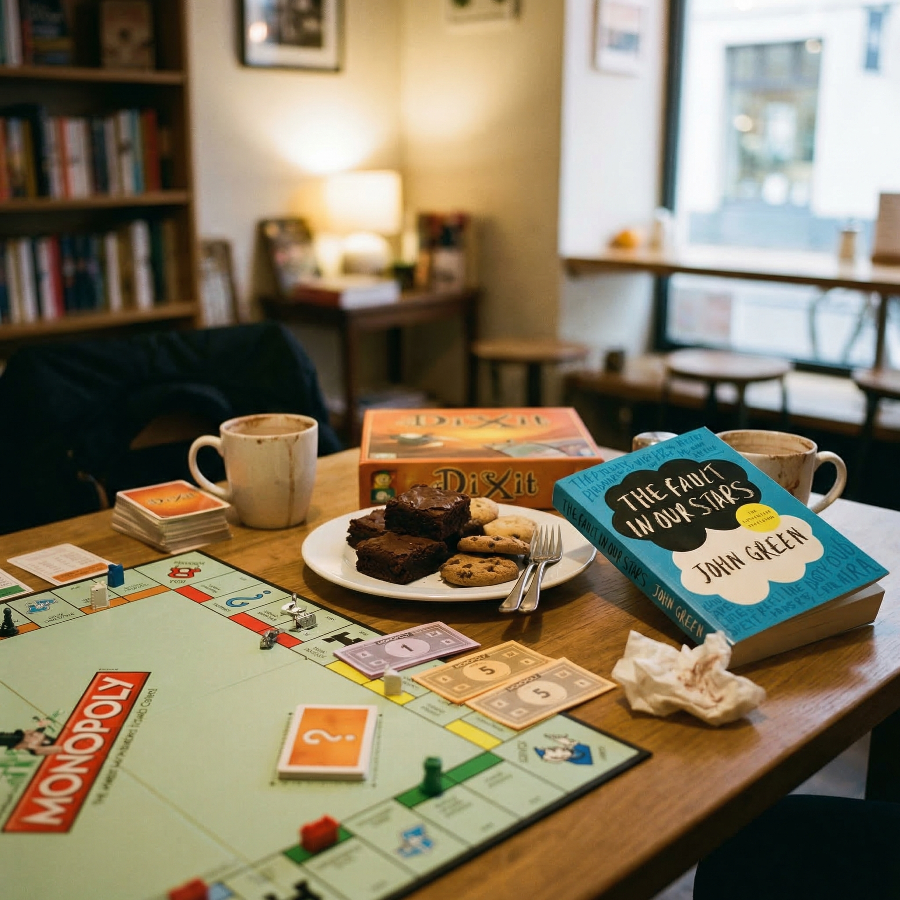
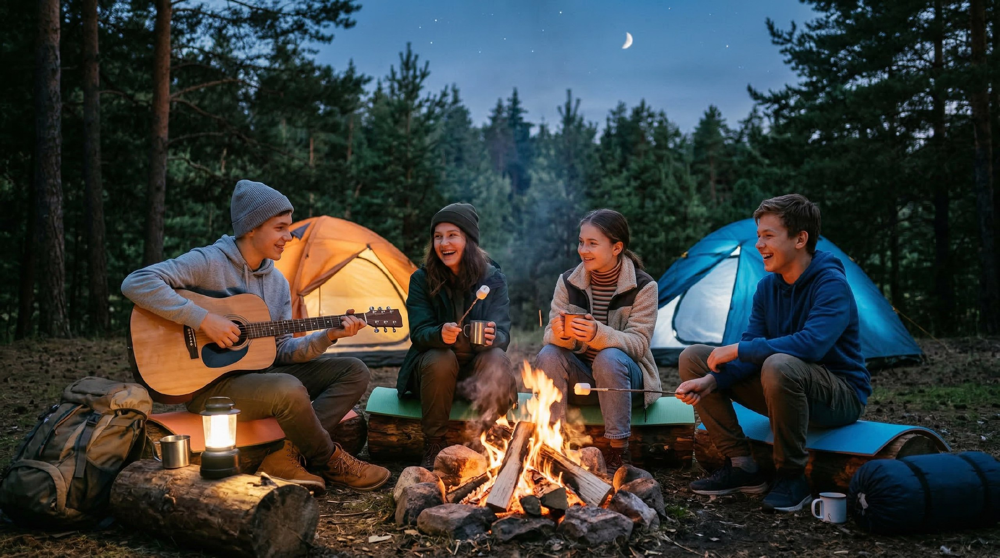

# Топ-10 неочевидных мест для знакомства

В этой статье мы расскажем, где можно познакомиться с новыми людьми спокойно и без лишнего стресса 🧃. Обычно взрослые говорят про какие‑то "популярные" места, но они часто шумные и не очень комфортные для подростков. Здесь мы собрали другие варианты — те, где люди собираются ради любимого дела или общей цели, а знакомство получается как бы между делом.

---

---

## Зачем вообще искать новые места для знакомства

Иногда кажется, что друзей можно найти только в школе, дворовом кружке или в онлайн‑команде в любимой игре 🎮. Но что делать, если в классе тебя не понимают, а в привычных местах все уже "своими компаниями"? Тогда помогают новые, более спокойные локации. Это места, куда люди приходят по интересу: читать книги, играть в настолки, учиться чему‑то новому или помогать другим. Там уже заранее понятно, что у вас есть общая тема для разговора — и не нужно "выдумывать" повод.

---

## 1. Клуб настольных игр

Клуб настольных игр — это место, где люди собираются, чтобы играть в настолки: от "Монополии" и "Диксита" до сложных стратегий 🧩. Все сидят за столами, объясняют друг другу правила, бросают кубики и много разговаривают по ходу игры. Даже если ты стесняешься, игра сама даёт повод общаться: нужно обсуждать ходы, шутить над забавными моментами и помогать новичкам. Начать разговор можно очень просто: "А ты давно сюда ходишь?", "Какие настолки тебе больше всего нравятся?" или "Можешь объяснить правила, я тут первый раз?".

> Если боишься идти один, можно взять с собой друга – так будет проще вписаться в первую игру.

---

## 2. Книжный клуб

Книжный клуб — это небольшая группа людей, которые читают одну и ту же книгу, а потом обсуждают её 📚. Кто‑то делится любимыми героями, кто‑то спорит с концовкой, кто‑то советует похожие истории. Важное правило: там нормально иметь своё мнение, и никто не смеётся, если ты любишь необычные жанры. Общая книга сразу даёт тему для разговора: "Как тебе главный герой?", "Тебе было жалко этого персонажа?" или "А что бы ты сделал на его месте?". Так постепенно находятся "свои" люди — те, кто чувствует историю похожим с тобой образом.

---

## 3. Лектории и музеи

Лекторий — это встреча, где кто‑то рассказывает интересную тему: про космос, искусство, психологию или, например, историю игр 🌌. Часто такие лекции проходят в музеях или культурных центрах. Сначала все просто слушают, но после лекции люди обсуждают, что их удивило или что осталось непонятно. Это отличный момент, чтобы подойти к кому‑то и сказать: "А тебе как показалась эта часть?", "Ты понял, почему это так работает?" или "Ты был уже на других лекциях этого спикера?". Когда вы вместе пытаетесь разобраться в новой информации, легче завязать дружеский диалог.

---

## 4. Благотворительные забеги и волонтёрство

Волонтёр — это человек, который по собственной воле помогает другим: людям, животным или природе. Благотворительный забег — это мероприятие, где участники бегут, а взносы или пожертвования идут на добрые дела 🏃‍️. На таких событиях собираются люди, которым не всё равно, что происходит вокруг. Это значит, что у вас уже совпадают какие‑то ценности: помогать, поддерживать, делать мир чуть лучше. Можно начать разговор с простого: "За кого ты сегодня бежишь?", "Как ты вообще попал на этот проект?" или "Ты ещё где‑нибудь волонтёришь?". Часто после совместной помощи остаётся чувство, что вы сделали что‑то важное вместе — и на этом легко строится дружба.

---

## 5. Походы и турклубы

Поход с турклубом — это когда группа людей вместе идёт по маршруту: в лес, в горы или на несколько дней к озеру. Днём вы идёте с рюкзаками, вечером сидите у костра, вместе готовите еду и рассказываете истории 🔥. В таких условиях люди быстро узнают друг друга: кто шутит, кто поддерживает, кто помогает донести тяжёлый рюкзак. К тому же это полезно для здоровья: свежий воздух, движение, меньше времени в телефоне. В походе можно познакомиться, просто спросив: "Как ты вообще выдерживаешь такой подъём?", "Ты уже ходил в другие походы?" или предложить помощь: "Давай возьму часть твоих вещей, у меня рюкзак полегче".

---

## 6. Кулинарные мастер‑классы

На кулинарном мастер‑классе люди собираются, чтобы вместе приготовить какое‑то блюдо: торт, пасту или даже сложный десерт 🍰. У каждого есть своя задача: кто‑то нарезает овощи, кто‑то мешает тесто, кто‑то украшает готовое блюдо. Пока вы стоите рядом у одной доски или плиты, разговор возникает сам: "Ты часто готовишь дома?", "Какой твой любимый десерт?", "Хочешь, я покажу, как я обычно это режу?". В конце все пробуют результат своей работы — это приятный момент, когда можно обменяться контактами и договориться прийти ещё раз вместе.

---

## 7. Курсы актёрского мастерства

На курсах актёрского мастерства люди учатся не бояться сцены, пробуют разные роли и тренируются показывать эмоции 🎭. Там много игр и упражнений: нужно изображать персонажей, придумывать короткие сценки, реагировать на партнёра. В такой атмосфере тяжело оставаться "закрытым": вы вместе смеётесь над неудачными репетициями, поддерживаете друг друга, когда кто‑то стесняется. После нескольких занятий уже не страшно подойти и сказать: "Классно сыграл сегодня!", "Поможешь мне с этой сценкой?" или "Давай придумаем мини‑этюд вдвоём". Общий страх и общий прогресс очень сближают.

---

## 8. Языковые курсы и разговорные клубы

На языковых курсах и в разговорных клубах люди приходят тренировать иностранный язык: английский, испанский, японский — любой 🗣️. Вместо скучных упражнений "по учебнику" часто дают задания в парах и группах: обсудить фильм, придумать диалог или разыграть ситуацию в магазине. Тут общение — это не бонус, а главная часть занятия. Можно постепенно переходить от учебных фраз к более живым: спрашивать про любимые игры, музыку, планы на каникулы — всё это на изучаемом языке. Так вы узнаёте друг друга и одновременно прокачиваете речь.

---

## 9. Клубы по редким хобби

У кого‑то хобби необычное: кто‑то коллекционирует жуков, кто‑то пишет фанфики по редкому фандому, кто‑то учит искусственный язык вроде эсперанто. В обычной школе за это могут подшучивать, но в специальных клубах и онлайн‑сообществах люди как раз собираются ради такой "странности". Там нормально обсуждать то, что любят единицы, и никто не закатывает глаза. Важно помнить: если твоё хобби не похоже на хобби одноклассников, это не значит, что оно "неправильное". Просто твои "свои" могут сидеть в другом месте — на форуме, в Discord‑сервере или локальном клубе — и там будет намного проще почувствовать себя на своём месте.

---

## 10. Локальные мероприятия во дворе и в районе

Во дворах и районах часто проходят маленькие события: праздники, ярмарки, кино под открытым небом, мастер‑классы в доме культуры или библиотеке 🎉. Иногда это даже просто соседский пикник или совместная посадка деревьев. На таких мероприятиях люди обычно более открыты: все пришли не спешить, а спокойно провести время. Можно начать с любого мелкого повода: "Классная игра, а как в неё играть?", "Ты часто сюда приходишь?" или "А ты живёшь в этом доме или рядом?". Приятный бонус — если вы подружитесь, потом будет легко пересекаться во дворе или на детской площадке.

---

## Как выбрать своё место

Необязательно ходить сразу везде. Подумай:

- Что тебе действительно интересно: игры, книги, спорт, помощь другим, творчество или языки.
- Какой уровень шума тебе комфортен: тихая группа из пяти человек или большая движуха.
- Сколько людей тебе ок видеть вокруг: маленький кружок или большой фестиваль.
- Чувствуешь ли ты себя там в безопасности: есть ли взрослые, адекватная атмосфера, ясные правила.

Важно не заставлять себя терпеть место, которое тебя выматывает. Лучше выбрать один‑два варианта, где ты чувствуешь себя спокойно и живо, и ходить туда регулярно — так шансов найти "своих" намного больше.

---

## Как знакомиться аккуратно и безопасно

Даже в самых уютных местах важно помнить о безопасности и личных границах. Не нужно сразу рассказывать незнакомым людям все свои секреты, домашний адрес или пароли от аккаунтов. Лучше первое время встречаться в людных местах и уходить домой не слишком поздно. Если что‑то в общении кажется странным или неприятным, доверяй своим ощущениям и можешь спокойно прекратить разговор. Дружба — это не про давление, а про уважение и чувство, что рядом с человеком тебе легче дышать, а не тяжелее.

> Если кто‑то сильно давит, просит фото, деньги или зовёт в странное место, это красный флаг. Можно и нужно сказать "нет" и обратиться к взрослым.

---

## Короткие вопросы и ответы

**Вопрос 1.** А если я очень стеснительный, вообще есть шанс с кем‑то познакомиться? 🙂

**Ответ.** Да, есть. Выбирай места, где есть общая активность (игра, мастер‑класс, лекция) — там разговор начинается сам по себе, без "крутого" вступления.

**Вопрос 2.** Что делать, если мне отказали в общении или проигнорировали?

**Ответ.** Это неприятно, но нормально: не все люди обязаны становиться друзьями. Попробуй воспринимать это как опыт и пробовать знакомиться с другими — "твой" человек точно найдётся.

**Вопрос 3.** Можно ли знакомиться только онлайн?

**Ответ.** Можно, но важно выбирать безопасные площадки, не отправлять личные данные и не соглашаться на встречи в одиночестве в странных местах.

**Вопрос 4.** Как понять, что человек настроен дружелюбно?

**Ответ.** Он не давит, не высмеивает, не заставляет делать то, что тебе неприятно, и уважает твои "нет".

**Вопрос 5.** Что сказать первым, если я не умею начинать разговор?

**Ответ.** Универсальные фразы: "Ты давно сюда ходишь?", "Что тебе здесь больше всего нравится?", "Что посоветуешь попробовать в первый раз?".

**Вопрос 6.** Нужно ли сразу давать свой номер телефона или соцсети?

**Ответ.** Нет, можешь сначала понаблюдать за человеком, пообщаться несколько раз на мероприятии и только потом обменяться контактами, если чувствуешь себя спокойно.

**Вопрос 7.** Что делать, если меня стебут за мои хобби?

**Ответ.** Помни, что "странное" хобби часто просто значит "редкое", а не "плохое". Лучше искать людей в клубах по интересам или онлайн‑сообществах, где твоё увлечение разделяют.

---

## Связанные статьи

- [Skill-микс: идём на курсы не за дипломом, а за людьми](./skill_miks.md)
- [Можно ли найти друзей случайно](./mozno_li_naiti_druzei_sluchaino.md)
- [Геолокация и проверка контекста](../../../5.1_technology_and_digital_literacy/information%20and%20media%20literacy/articles/геолокация_и_проверка_контекста.md)

---

## Словарь по теме

**Волонтёр** — человек, который бесплатно помогает другим или участвует в полезных проектах: приютах, благотворительных акциях, экологических инициативах.

**Лекторий** — встреча или серия встреч, где эксперт рассказывает о какой‑то теме (науке, искусстве, технологиях), а слушатели могут задавать вопросы.

**Разговорный клуб** — место, где люди собираются, чтобы общаться на иностранном языке и тренировать речь в реальных диалогах.

**Комьюнити** — сообщество людей, объединённых общим интересом или целью; может быть офлайн (клуб, студия) или онлайн (сервер, форум).

**Кибербуллинг** — травля в интернете: обидные комментарии, издёвки, угрозы, оскорбительные мемы и посты в сторону человека.

**Онлайн‑сообщество** — группа людей в интернете (форум, чат, сервер), где обсуждают общие темы, делятся опытом и поддерживают друг друга.

**Безопасная встреча** — встреча с новым человеком в людном месте, днём, с возможностью быстро уйти и сообщить взрослым, куда ты идёшь.

**Хобби** — то, чем ты занимаешься для удовольствия в свободное время: спорт, творчество, коллекционирование, игры и многое другое.

---

Авторы: *Леоненкова Елена leoelena, @leoelena2;*

*Ресурсы: Perplexity (GPT‑5.1), Nano Banana 2*