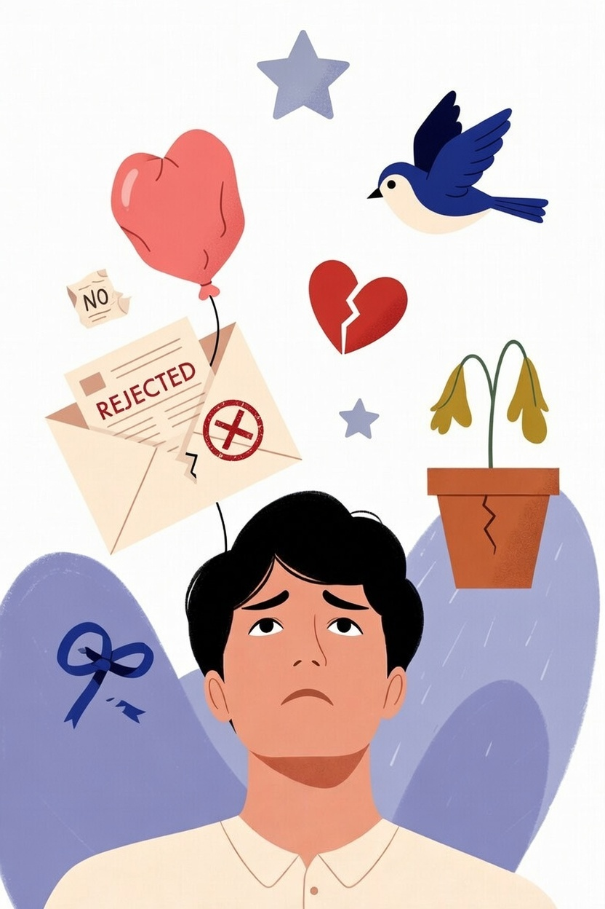
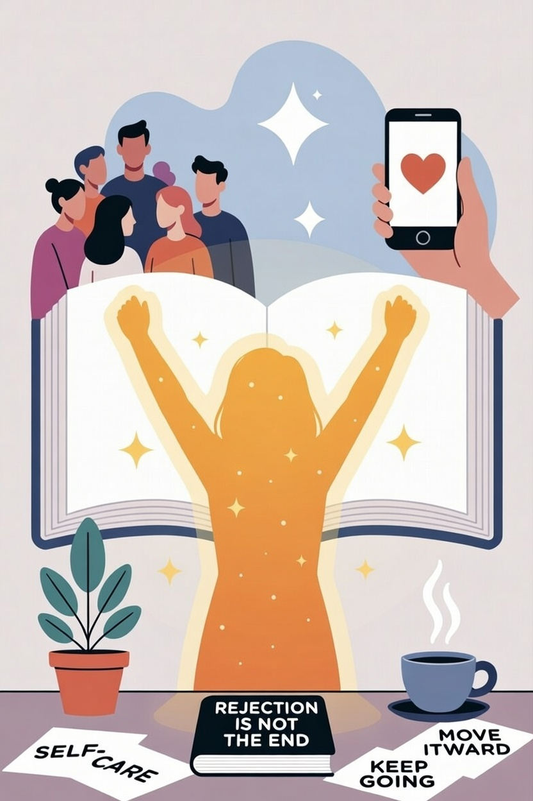

# Отказ — это не конец: как пережить, что новый знакомый не захотел продолжать общение

Иногда мы знакомимся с человеком, начинаем общаться, и кажется, что всё складывается хорошо… но потом он перестаёт писать или прямо говорит, что не хочет продолжать общение. Это может вызывать грусть, неловкость или даже обиду. В такие моменты важно помнить: отказ — это нормальная часть жизни, а не показатель вашей ценности.

## Почему люди отказываются от общения

Когда кто-то не хочет продолжать общение, это почти всегда связано с его внутренними причинами, а не с тем, что с вами «что-то не так».

Вот несколько распространённых причин:

* у человека уже есть близкий круг друзей, и ему сложно впускать новых людей
* он переживает сложный период и не готов к общению
* у вас разные интересы или взгляды
* он ищет другой формат общения (например, более активный или, наоборот, более спокойный)
* просто не возникло ощущения «своего человека»

Важно понимать: дружба — это совпадение двух людей, а не экзамен, который нужно «сдать».

## Почему отказ кажется таким болезненным

Отказ может задевать сильнее, чем мы ожидаем. Это связано с тем, как работает наша психика.

Когда нас отвергают, могут возникать мысли:

* «меня не приняли»
* «я недостаточно хороший»
* «я сделал что-то не так»

Но это не факты, а интерпретации. Наш мозг иногда преувеличивает значение ситуации.

Кроме того, особенно тяжело, если:

* вы уже успели привязаться к человеку
* у вас мало друзей, и этот контакт казался важным
* вы долго решались на знакомство

Поэтому важно относиться к себе с пониманием, а не с критикой.

## Как правильно реагировать на отказ

Правильная реакция помогает быстрее восстановиться и сохранить уверенность.

Полезные шаги:

* **признать свои чувства** — грусть, обида или разочарование — это нормально
* **дать себе время** — не нужно сразу «брать себя в руки»
* **не делать поспешных выводов о себе**
* **уважать решение другого человека**
* **переключить внимание** — на учёбу, хобби, спорт

Иногда лучшее, что можно сделать — это просто отпустить ситуацию.

## Чего не стоит делать

Есть реакции, которые кажутся естественными, но на самом деле мешают справиться с отказом:

* постоянно прокручивать разговор в голове
* искать «идеальную ошибку», которую вы якобы допустили
* писать человеку снова и снова
* пытаться изменить себя ради одобрения
* полностью закрываться от новых знакомств

Такие действия усиливают тревогу и не дают двигаться дальше.

## Как поддержать себя после отказа

После неприятного опыта особенно важно позаботиться о себе.

Попробуйте:

* записать свои мысли и чувства — это помогает их упорядочить
* поговорить с тем, кому вы доверяете
* заняться тем, что приносит радость
* напомнить себе о своих сильных сторонах
* ограничить самокритику

Вы имеете право на поддержку — в том числе от самого себя.

## Как восстановить уверенность

Уверенность не исчезает навсегда — она может временно снижаться после неприятных ситуаций.

Чтобы вернуть её:

* вспомните прошлые удачные общения
* отмечайте даже маленькие успехи (например, вы сами начали разговор)
* не избегайте новых знакомств полностью
* ставьте небольшие цели (поговорить с одним человеком, а не сразу со всеми)

Важно двигаться постепенно, без давления на себя.

## Как относиться к отказу по-другому

Можно попробовать изменить взгляд на ситуацию:

* отказ — это не «провал», а фильтр
* он помогает понять, с кем вам не по пути
* освобождает время и энергию для «своих» людей
* делает вас опытнее в общении

Каждый такой опыт — это шаг к более комфортным и настоящим отношениям.

## Отказ — это часть пути к «своим» людям

У каждого человека есть люди, с которыми ему легко и интересно. Но чтобы их найти, иногда приходится сталкиваться с отказами.

Это нормально:
не все знакомства превращаются в дружбу — и это не ваша ошибка.

Настоящая дружба строится там, где есть взаимный интерес, уважение и желание общаться с обеих сторон.

## Короткие вопросы и ответы

**1. Это значит, что я неинтересный человек?**
Нет, просто не произошло совпадения.

**2. Нужно ли спрашивать причину отказа?**
Можно, но человек не обязан отвечать.

**3. Почему меня это так задевает?**
Потому что отказ связан с чувством принятия.

**4. Стоит ли писать снова?**
Если человек отказался — лучше уважать его решение.

**5. Как долго это переживается?**
По-разному, но со временем становится легче.

**6. Можно ли полностью избежать отказов?**
Нет, это естественная часть общения.

**7. Нужно ли перестать знакомиться?**
Нет, наоборот — важно продолжать.

## Связанные статьи

- [Гайд для интровертов: как найти друзей, не истощая свой ресурс](./guide_dlya_introvertov.md)
- [Токсичные друзья: 5 звоночков, что пора заканчивать эту “дружбу”](./toksichnye_druzya.md)
- [Не просто болтун: как стать интересным собеседником и расположить к себе любого](./interesnoe_obshchenie.md)

## Словарь по теме

**Отказ** — ситуация, когда человек не хочет продолжать общение.

**Самооценка** — мнение человека о себе.

**Эмоции** — внутренние переживания человека.

**Принятие** — ощущение, что тебя понимают и уважают.

**Стресс** — реакция на сложные ситуации.

**Границы** — личные правила в общении.

**Уверенность** — вера в свои способности и ценность.

**Рефлексия** — размышление о своих мыслях и чувствах.

## Атрибуция

**Автор:** Якубович Егор

**Источники:**

* Материалы по подростковой психологии
* Руководства по развитию эмоционального интеллекта
* LLM - ChatGPT (OpenAI)
