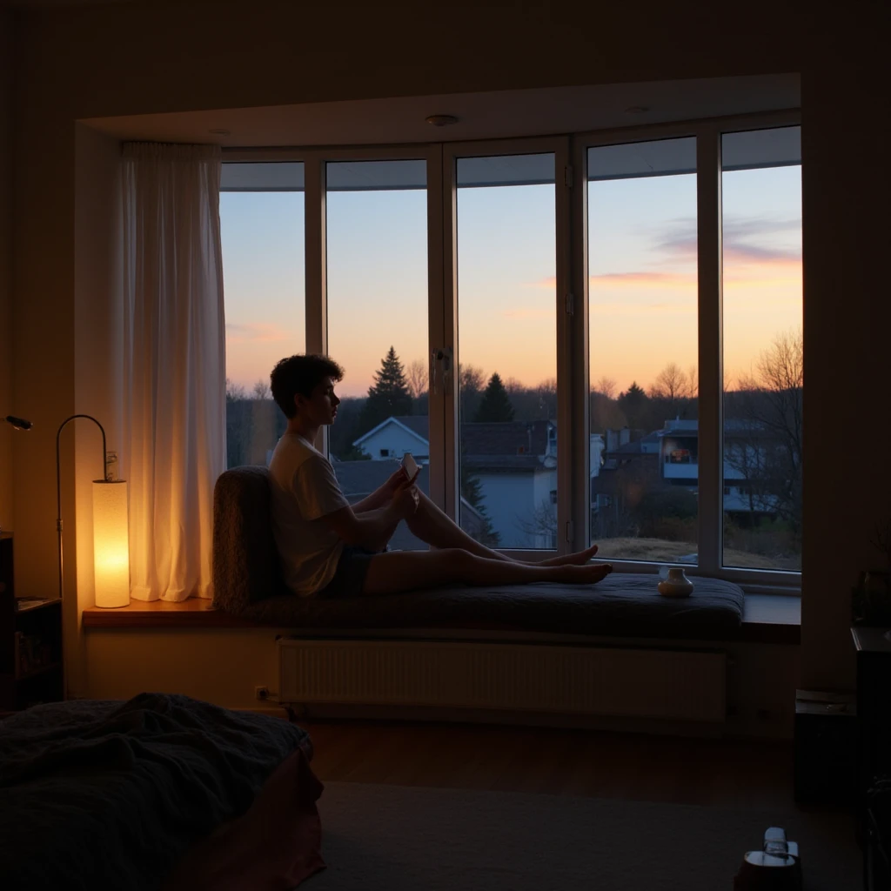

# Сам себе интересный: Как проводить время с собой, чтобы не сойти с ума от одиночества

Мы живём в мире, где быть постоянно на связи — почти обязанность. Мессенджеры требуют ответов, соцсети — присутствия, а друзья — внимания. И когда человек вдруг остаётся один, многие испытывают не облегчение, а тревогу. Тишина начинает давить, а в голову лезут мысли, от которых хочется убежать обратно в шум.

Но есть и другая правда: умение быть наедине с собой — это не приговор и не социальная неудача. Это навык. И как любой навык, его можно развить. В этой статье мы разберём, почему так важно дружить с самим собой и как превратить одиночество из наказания в ресурс.

## Почему мы боимся оставаться одни

Страх одиночества заложен в нас эволюционно. Для древнего человека быть изгнанным из племени означало верную гибель. Сегодня угроза физической смерти сменилась страхом социальной изоляции: нам кажется, что если мы одни — значит, мы никому не нужны, скучные, неинтересные.

К этому добавляются современные установки:

*   **Социальное давление:** в кино, книгах и рекламе счастье почти всегда показывают в компании. Одинокий человек воспринимается как неудачник.
*   **Отсутствие внутреннего диалога:** мы привыкли, что фоном всегда что-то играет — музыка, подкасты, сериалы. В тишине мы остаёмся наедине с голосом внутри себя, и если мы с ним не дружим, этот голос может пугать.
*   **Привычка к стимуляции:** мозг требует постоянных внешних раздражителей. Когда их нет, наступает что-то похожее на ломку.

Но если присмотреться, одиночество — это просто состояние. Проблема не в нём, а в том, что мы с этим состоянием делаем.

## Чем заняться с собой: не скучно и не больно

Хорошая новость в том, что с самим собой можно проводить время не менее интересно, чем с другими. Даже интереснее — потому что вы точно знаете, что вам нравится, и не нужно ни под кого подстраиваться.

### 1. Свидание с собой

Звучит странно, но работает безотказно. Выделите вечер и сходите туда, куда всегда хотели, но стеснялись или откладывали. В кино на авторское артхаусное кино? Отлично. В кофейню попробовать новый сорт кофе? Прекрасно. На выставку современного искусства? Ещё лучше.

Главное правило: никакого телефона в руках, никакого «просто посидеть в соцсетях». Вы здесь с собой, а не с экраном. Наблюдайте, чувствуйте, запоминайте.

### 2. Творчество без свидетелей

Когда мы что-то делаем для других, мы неизбежно оглядываемся на оценку. В одиночестве можно творить просто так. Рисовать кривые картины, писать глупые стихи, лепить из пластилина монстров, сочинять музыку на коленке. Не для того, чтобы выложить в инстаграм, а для процесса.

Творчество — это диалог с собой. Через него вы узнаёте о себе то, о чём даже не догадывались.

### 3. Дневник не для чужих глаз

Ведение дневника — самый недооценённый инструмент самопознания. Не нужно писать «Дорогой дневник, сегодня я съел бутерброд». Просто выплёскивайте на бумагу (или в заметки) всё, что накопилось. Страхи, идеи, обиды, планы, глупые мысли.

Через месяц перечитайте. Вы увидите, как изменились, какие мысли возвращаются, а какие ушли навсегда. Это похоже на разговор с самим собой во времени.

### 4. Телесные практики

Мы часто существуем только головой, забывая про тело. Одиночество — отличный момент вспомнить, что у вас есть руки, ноги, спина и им тоже нужно внимание.

*   Йога или просто растяжка под любимую музыку.
*   Долгая прогулка без наушников — слушать город или природу.
*   Танцы, когда никто не видит (отлично снимает стресс и поднимает настроение).
*   Баня или долгая ванна с пеной и солью.

Тело накопляет напряжение от общения и суеты. Дайте ему расслабиться.

### 5. Исследование города

Мы часто живём в режиме «дом — работа — дом» и не замечаем, что происходит вокруг. Устройте себе экскурсию по собственному району или городу. Зайдите во дворы, где никогда не были, найдите самую старую скамейку, рассмотрите архитектуру. Можно представить себя туристом в своём городе.

## Одиночество как ресурс

Умение быть одному — это не про изоляцию. Это про способность наполняться самостоятельно, а не только через других людей. Когда вы знаете, что можете провести вечер с собой и не сойти с ума от скуки, вы перестаёте цепляться за любые отношения лишь бы не быть одному.

Вы начинаете выбирать людей не из страха, а из интереса. И это меняет качество дружбы кардинально.

## Когда стоит насторожиться

Важно различать здоровое уединение и болезненную изоляцию. Если вам хорошо с собой, но вы при этом легко идёте на контакт с другими — всё в порядке. Если же одиночество становится единственным доступным состоянием, а мысли о встрече с людьми вызывают панику — это повод обратиться к специалисту.

Одиночество должно быть выбором, а не тюрьмой.

## Словарь по теме

**Одиночество** — состояние человека, который находится вне физического или эмоционального контакта с другими людьми. Может быть как вынужденным (негативным), так и осознанным (позитивным уединением).

**Рефлексия** — способность человека анализировать свои собственные мысли, чувства, поступки и состояния, смотреть на себя со стороны.

**Самодостаточность** — качество личности, характеризующееся способностью человека обходиться без внешней поддержки, самостоятельно удовлетворять свои потребности и принимать решения, сохраняя эмоциональную устойчивость.

**Интроверсия** — тип личности, ориентированный на внутренний мир, мысли и переживания. Интроверты восстанавливают энергию в одиночестве.

**Экстраверсия** — тип личности, ориентированный на внешнее взаимодействие, общение и активность. Экстраверты заряжаются от контактов с людьми.

**Уединение** — добровольное состояние нахождения наедине с собой, выбранное для отдыха, восстановления или размышлений.

**Ресурсное состояние** — внутреннее состояние наполненности энергией, спокойствием и готовностью к деятельности или общению.

**Проживание эмоций** — процесс осознанного контакта с собственными чувствами, позволяющий им быть пережитыми и отпущенными, вместо подавления или избегания.

## Связанные статьи

- [Изи-темы для разговора: Как заговорить с кем-то, если вы вообще не знакомы](./izi_temy_dlya_razgovora.md)
- [Гайд для интровертов: как найти друзей, не истощая свой ресурс](./guide_dlya_introvertov.md)
- [Влияние эмоций: Как страх, надежда или симпатия заставляют нас игнорировать факты](../../../4.2/critical_thinking/articles/influence_of_emotions.md)

---

**Автор:** Соболин Тимофей   
*Текст статьи подготовлен с использованием нейросетей (LLM — ChatGPT).*