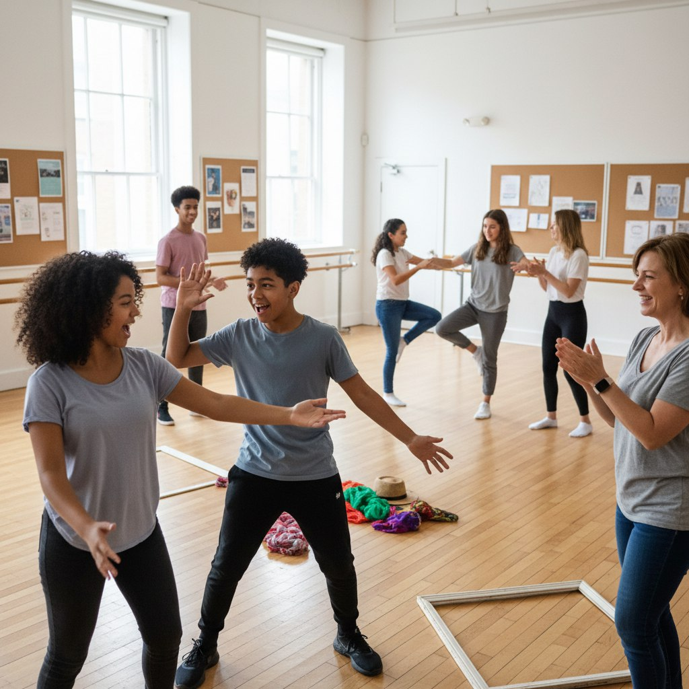

# Skill-микс: идём на курсы не за дипломом, а за людьми

Ты когда-нибудь шёл на какой-то курс или мастер-класс и думал: "Главное — научиться, а люди там не важны"? А потом оказывалось, что именно люди там и были самым интересным 😄. В этой статье разберёмся, почему учёба — это один из лучших способов найти "своих", и какие курсы работают лучше всего как место для знакомств.

---

---

## Зачем искать знакомства на курсах, а не в соцсетях

Сайты знакомств и случайные чаты работают так: ты видишь профиль, пишешь что-то вроде "привет, как дела?" — и чаще всего разговор умирает через три сообщения 💀. На курсах всё иначе. Вы сразу оказываетесь в одной ситуации: оба не знаете, как правильно нарезать лук, оба пытаетесь выговорить испанское "rr", оба смеётесь над тем, как неловко получился первый этюд. Общий опыт сближает быстрее, чем любая анкета в интернете.

---

## 1. Курсы актёрского мастерства

Это, наверное, самое мощное место для знакомств из всех курсов 🎭. Почему? Потому что там буквально невозможно оставаться закрытым. Упражнения построены так, что ты с первого занятия уже смотришь партнёру в глаза, изображаешь эмоции и реагируешь на чужие действия. Вместе проваливаете сцену — вместе смеётесь. Вместе боитесь выйти на сцену — вместе поддерживаете друг друга. После пары занятий ощущение, будто знаешь людей уже год.

Хорошие фразы для старта:
- "Классно сыграл сегодня, правда!"
- "Поможешь мне с этой сценкой после занятия?"
- "Ты тоже первый раз? Давай вместе разберёмся в упражнении."

---

## 2. Школы иностранных языков и разговорные клубы

На обычных уроках в школе ты сидишь тихо и отвечаешь по очереди. На языковых курсах и в разговорных клубах — всё наоборот 🗣️. Там тебя специально ставят в пары и группы, дают задания типа "обсудите любимый фильм" или "разыграйте сцену в кафе". Ты одновременно тренируешь язык и узнаёшь человека рядом: что он смотрит, что слушает, куда хочет поехать.

Отдельный кайф разговорных клубов — там часто встречаются люди с очень разным бэкграундом, но с одним общим желанием: говорить и практиковаться. Это уже отличная точка входа для разговора.

> Лайфхак: если тема занятия тебе не очень интересна, придумай вопрос к партнёру на эту тему — так разговор идёт сам.

---

## 3. Кулинарные мастер-классы

Готовить вместе — это древний способ подружиться, серьёзно 🍝. Когда ты стоишь рядом с человеком у одной доски и оба пытаетесь не сжечь лук, разговор возникает сам собой. Не нужно придумывать темы — всё уже есть: что готовим, как получается, вкусно ли, что любишь есть дома. В конце все пробуют результат — и это такой момент, когда легко сказать: "Слушай, давай в следующий раз придём вместе?"

Кулинарные курсы хороши ещё тем, что там обычно небольшие группы — 8-12 человек. Не нужно кричать через толпу, всё камерно и спокойно.

---

## 4. Творческие мастерские: рисование, керамика, иллюстрация

Рисование или лепка в группе — это тихое, но очень сближающее занятие 🎨. Вы сидите рядом, каждый делает своё, но видите работы друг друга, иногда спрашиваете совета или просто комментируете: "О, у тебя классный цвет получился". Это ненавязчивое общение — без давления и необходимости постоянно что-то говорить. Для тех, кто устаёт от шумных компаний, это вообще идеальный вариант.

---

## 5. Спортивные секции и танцы

Спорт в группе работает по той же логике: вы вместе устаёте, вместе смеётесь над своими ошибками, вместе радуетесь прогрессу 💪. На танцах это особенно заметно — партнёрские танцы вообще построены на контакте и доверии. Уже через пару занятий ты знаешь, как двигается твой партнёр, как он реагирует на музыку — это очень быстро создаёт ощущение "своего человека".

В спортивных секциях часто складываются компании, которые потом идут куда-то вместе после тренировки. Это и есть тот самый момент, когда знакомство переходит в дружбу.

---

## 6. IT-курсы и хакатоны

Да, даже здесь 😄. Особенно хакатоны — это мероприятия, где команды за короткое время делают какой-то проект. Ты работаешь с незнакомыми людьми в режиме "выжить вместе", и за 24-48 часов узнаёшь человека лучше, чем за полгода переписки. IT-курсы с проектной работой работают похоже: вы вместе решаете задачи, помогаете друг другу, злитесь на баги и радуетесь, когда что-то наконец заработало.

---

## Почему курсы работают лучше сайтов знакомств

Всё просто: на курсах у вас уже есть:

- **Общий контекст** — одна тема, одно пространство, один преподаватель.
- **Общий опыт** — вы вместе через что-то проходите, пусть даже это просто "как не сжечь ризотто".
- **Повод встретиться снова** — следующее занятие уже запланировано, не нужно придумывать причину увидеться.
- **Естественный разговор** — тема для общения уже есть, не нужно ничего выдумывать.

На сайте знакомств ты — анкета. На курсе ты — живой человек, которого видят в деле.

---

## Как выбрать курс под себя

Не нужно идти туда, где "больше людей" или "модно". Подумай:

- Что тебе реально интересно или хотелось бы попробовать?
- Ты хочешь активное общение (театр, танцы) или спокойное (рисование, кулинария)?
- Тебе комфортнее маленькая группа или большой поток?
- Готов ли ты к регулярным встречам или хочешь разовый мастер-класс для начала?

Начни с одного пробного занятия — большинство курсов дают первый урок бесплатно или по сниженной цене.

---

## Как знакомиться на курсах аккуратно и без стресса

Не нужно с первого занятия стараться познакомиться со всеми — это давит и выглядит странно. Просто будь собой, участвуй в занятии и реагируй на людей рядом. Один короткий комментарий по ходу дела ("О, у тебя получилось лучше моего!") — и лёд уже сломан. Дальше само пойдёт.

> Самое главное правило: приходи на курс ради самого курса, а знакомства пусть случаются сами — так они получаются настоящими.

---

## Короткие вопросы и ответы

**Вопрос 1.** А если я пришёл на курс, а там никто не хочет общаться?

**Ответ.** Бывает — особенно на первом занятии, все немного зажаты. Подожди 2-3 встречи: люди обычно раскрываются постепенно, когда привыкают к месту и друг к другу.

**Вопрос 2.** Я плохо учусь — не буду ли я выглядеть глупо рядом с теми, кто лучше?

**Ответ.** Нет. На курсах все начинают с разного уровня, и это нормально. Часто именно те, кто "плохо учится", вызывают симпатию — потому что не боятся пробовать и ошибаться на глазах у всех.

**Вопрос 3.** Как начать разговор, если я не знаю с чего?

**Ответ.** Комментируй то, что происходит прямо сейчас: занятие, упражнение, результат. "Как тебе это задание?", "Ты уже делал что-то похожее раньше?" — простые вопросы, которые работают всегда.

**Вопрос 4.** Стоит ли ходить на курс в одиночку или лучше с другом?

**Ответ.** Оба варианта работают. Один — проще знакомиться с новыми людьми, потому что ты не замкнут в своей компании. С другом — легче решиться прийти в первый раз. Выбирай по ситуации.

**Вопрос 5.** Что делать, если курс закончился, а я хочу продолжать общаться с людьми оттуда?

**Ответ.** Предложи создать общий чат или договорись встретиться ещё раз — на следующем курсе, в кафе или на каком-то мероприятии по теме. Обычно люди с радостью соглашаются, просто никто не решается предложить первым.

**Вопрос 6.** Курсы стоят денег — а есть бесплатные варианты?

**Ответ.** Да: разговорные клубы часто бесплатны, хакатоны — тоже, библиотеки и культурные центры проводят бесплатные мастер-классы. Поищи в своём городе — обычно вариантов больше, чем кажется.

**Вопрос 7.** Я хожу на курс уже месяц, но так ни с кем и не подружился. Что не так?

**Ответ.** Скорее всего, ничего. Иногда химия между людьми появляется позже. Попробуй немного активнее: задай вопрос соседу, предложи помощь или просто прокомментируй что-то по ходу занятия. Маленький шаг — и ситуация меняется.

---

## Связанные статьи

- [Топ-10 неочевидных мест для знакомства](./neochevidnye_mesta_dlya_znakomstva.md)
- [Изи-темы для разговора: Как заговорить с кем-то, если вы вообще не знакомы](./izi_temy_dlya_razgovora.md)
- [Карта компетенций по возрастам](../../../5.1_technology_and_digital_literacy/information%20and%20media%20literacy/articles/карта_компетенций_по_возрастам.md)

---

## Словарь по теме

**Нетворкинг** — целенаправленное знакомство с людьми для общения, обмена опытом или совместных дел. Необязательно по работе — бывает и дружеский нетворкинг.

**Хакатон** — соревнование, где команды за короткое время (обычно 24-48 часов) создают какой-то проект или решают задачу.

**Разговорный клуб** — встреча, где люди практикуют иностранный язык в живом диалоге, а не по учебнику.

**Мастер-класс** — короткое практическое занятие, где мастер показывает, как что-то делать, а участники пробуют сами.

**Skill** (англ.) — навык, умение. "Skill-микс" — смесь разных умений и людей, которые их осваивают.

**Этюд** — короткая актёрская сценка-упражнение, которую придумывают и разыгрывают прямо на занятии.

**Бэкграунд** — прошлый опыт человека: откуда он, чем занимался, что умеет и знает.

**Химия между людьми** — неформальное выражение для описания ощущения, когда с человеком легко и приятно общаться, как будто вы давно знакомы.

---

Авторы: *Леоненкова Елена leoelena, @leoelena2;*

*Ресурсы: Perplexity (GPT‑5.1), Nano Banana 2*