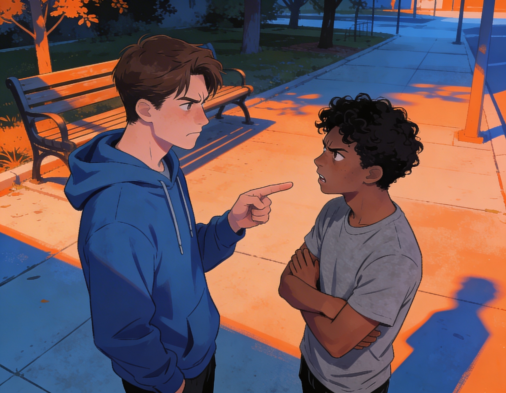
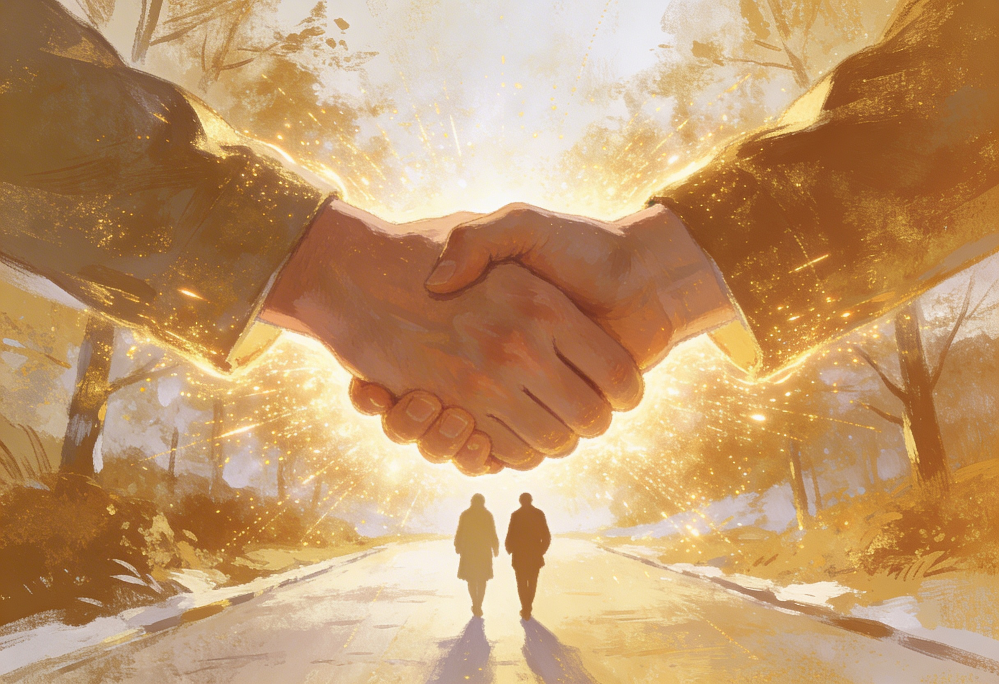

# [Дружба](../../../1.2_natural_sciences/neurobiology_for_teens/articles/17_hugs_oxytocin.md) на веки: Как не поссориться с лучшим другом и не потерять его навсегда

Представь: у тебя есть друг, с которым вы вместе столько, что уже не помнишь, как познакомились. Вы знаете друг про друга всё: от любимого вкуса чипсов до самых страшных секретов. Но вдруг одна неудачная [шутка](../../../7.2 Media, leisure and hobbies/Computer games/articles/game_culture/game_memes.md), случайный [лайк](../../../3.1_healthy lifestyle/vrednye_privychki/articles/Social_media.md) не тому человеку или глупое [недопонимание](../../cause_and_effect_relationships/articles/conflict_roots.md) превращаются в ледяное молчание. Потерять лучшего друга в 8 классе — это почти как [расставание](../../../1.2_natural_sciences/neurobiology_for_teens/articles/16_love_chemistry.md) с парнем или девушкой. Больно, обидно и одиноко. Но большинство ссор можно предотвратить, если знать [правила](../../cause_and_effect_relationships/articles/why_rules_work.md) игры.

## Почему вообще случаются ссоры?

Чаще всего [друзья](../../../4.1_rules_of_study/how_to_learn_effectively/articles/peer_learning.md) ругаются не из-за глобальных предательств, а из-за мелочей, которые накапливаются как снежный ком.

*   **Нарушение границ.** Ты рассказал его секрет другому человеку «просто так». Для тебя это ерунда, а для него — предательство.
*   **Ревность и собственничество.** «Ты теперь дружишь с ним, а меня забыл?». Люди меняются, у них появляются новые знакомые, и это нормально.
*   **Разные [интересы](../../cause_and_effect_relationships/articles/conflict_roots.md).** Вчера вы играли в одну игру, а сегодня он увлекся спортом или музыкой, которая тебе не нравится.
*   **Плохое [настроение](../../../1.2_natural_sciences/neurobiology_for_teens/articles/10_sweet_tooth.md).** Иногда ты срываешься на друга просто потому, что у тебя проблемы в школе или дома.

## [Правила безопасности](../../../1.2_natural_sciences/physics_in_everyday_life/Q186161.md): как не довести до конфликта

Дружба — это [работа](../../../1.2_natural_sciences/physics_in_everyday_life/Q11382.md), даже если кажется, что всё должно быть легко. Вот несколько правил, которые помогут сохранить [отношения](guide_dlya_introvertov.md) крепкими.

1.  **Умей слушать, а не только говорить.** Когда друг рассказывает о проблеме, не перебивай советами. Иногда нужно просто выслушать и сказать: «Да, это отстой, я с тобой».
2.  **Уважай личное [пространство](../../../1.2_natural_sciences/physics_in_everyday_life/Q36253.md).** Если друг пишет «я занят» или «[хочу](../../../6.1_Independent_living_and_daily_living_skills/reasonable_spending/articles/want.md) побыть один», не обижайся и не заваливай его вопросами «что случилось?». Дай ему [время](../../../1.2_natural_sciences/physics_in_everyday_life/Q20702.md).
3.  **Не сплетничай за спиной.** Самое быстрое разрушение дружбы — это обсуждение друга с другими людьми. Если тебе есть что сказать, скажи это лично в [глаза](../../../7.2 Media, leisure and hobbies/Computer games/articles/useful_tips/eyes_and_back.md).
4.  **Извиняйся первым.** Гордость — плохой советчик. Если ты чувствуешь, что неправ, не жди, пока друг сделает [первый шаг](../../../1.2_natural_sciences/physics_in_everyday_life/Q26540.md). Написать «извини, я перегнул» — это признак [силы](../../../1.2_natural_sciences/physics_in_everyday_life/Q11423.md), а не слабости.

## Что делать, если [ссора](konflikty_s_druzyami.md) уже произошла?

Даже если вы поругались, всё ещё можно исправить. Главное — не тянуть время.

*   **Дай себе и другу остыть.** На эмоциях можно наговорить лишнего. Возьми паузу на день или два, но не исчезай на недели.
*   **Напиши [сообщение](../../../3.2 healthy lifestyle/how to act in a dangerous situation/articles/phishing-links.md).** Вживую говорить сложно, можно струсить. Сообщение дает время обдумать [ответ](../../../5.1_technology_and_digital_literacy/how_internet_works/articles/http_https/http_https.md). Напиши честно: «Мне важно наше [общение](guide_dlya_introvertov.md), давай не будем ссориться из-за ерунды».
*   **Используй «Я-сообщения».** Вместо «Ты меня бесишь», скажи «Мне было обидно, когда ты так поступил». Это снижает агрессию.
*   **Предложи встречу.** Иногда лучше просто увидеться, купить мороженое и посмеяться над ситуацией. Личный [контакт](../../../1.2_natural_sciences/neurobiology_for_teens/articles/17_hugs_oxytocin.md) лечит лучше сотни сообщений.

## Когда стоит отпустить друга?

Иногда мы так боимся потерять друга, что терпим токсичное отношение. Запомни: дружба должна приносить радость, а не постоянный [стресс](../../../3.1. healthy lifestyle/Sleep, nutrition, and adolescent energy/articles/chronic_sleep_deprivation.md). Стоит задуматься о расстоянии, если:

*   Друг постоянно тебя унижает или критикует.
*   Ты чувствуешь себя виноватым без причины.
*   Он использует твои секреты против тебя.
*   После встреч ты чувствуешь себя выжатым как лимон.

В таком случае потерять такого «друга» — это не [потеря](../../../1.2_natural_sciences/neurobiology_for_teens/articles/20_sadness.md), а освобождение.

## Вместо вывода

Настоящая дружба проверяется не годами, а трудностями.
Не бойся конфликтов, бойся молчания. Если [человек](../../../1.2_natural_sciences/physics_in_everyday_life/Q45003.md) действительно твой, вы сможете обсудить любую проблему и стать только ближе. Береги тех, кто принимает тебя настоящим, не требуя меняться ради одобрения. И помни: один верный друг стоит сотни просто знакомых. Не дай глупой гордости разрушить то, что строилось годами.

## Связанные статьи

- [Конфликты: Как поссориться с лучшим другом и не потерять его навсегда](./konflikty_s_druzyami.md)
- [Цифровая дружба: реально ли найти друга в соцсетях?](./tcifrovaya_druzhba.md)
- [Можно ли найти друзей случайно](./mozno_li_naiti_druzei_sluchaino.md)

---

*[Автор](../../../4.2_thinking_and_working_information/how_to_search_information/articles/copypaste.md): Сергеева Алёна (@Yoshivara)*

*Использованные [нейросети](../../cause_and_effect_relationships/articles/ai_causality.md): DeepSeek, Алиса AI*, Mage