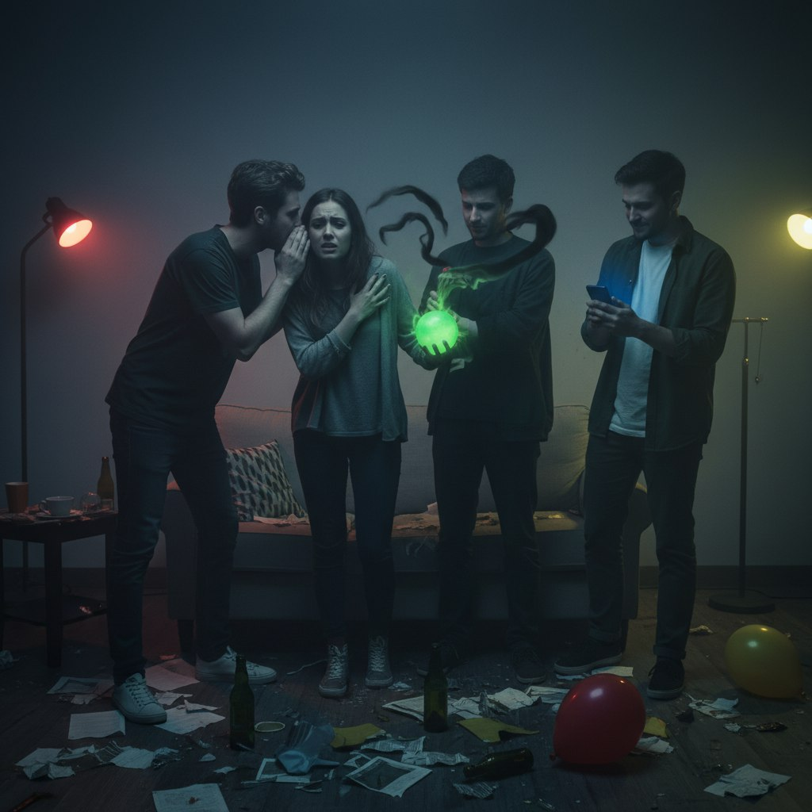
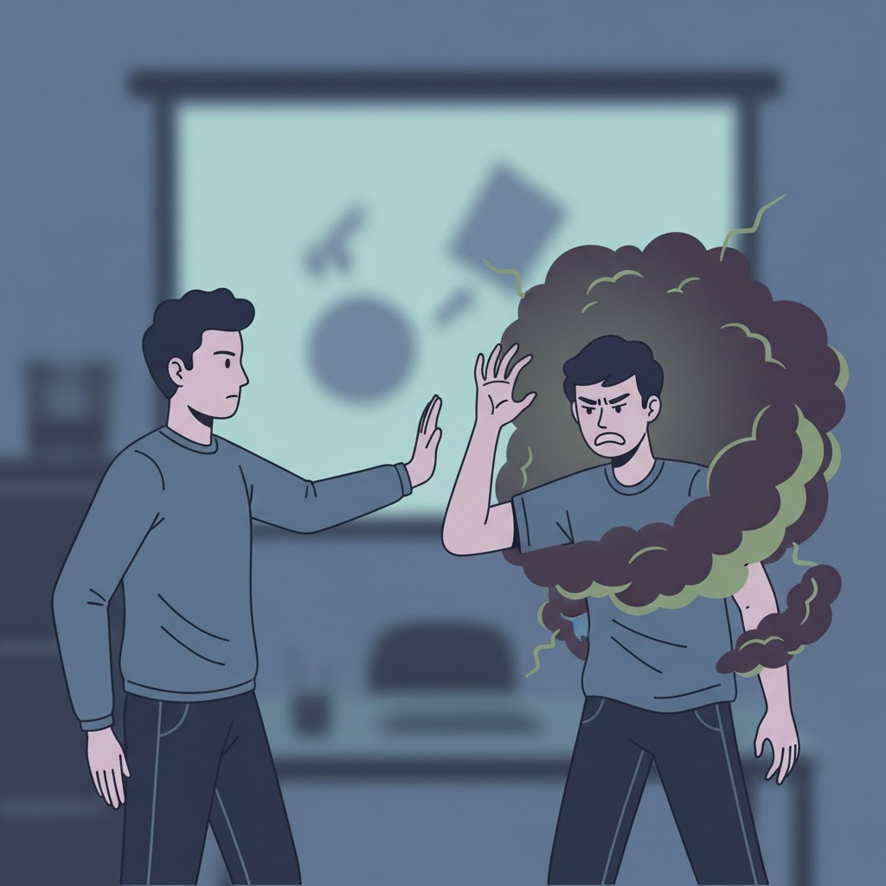

# Токсичные друзья: 5 звоночков, что пора заканчивать эту "дружбу"

Дружба — это опора, поддержка и радость. Это человек, с которым можно быть собой, не боясь осуждения. Он придет на помощь в трудную минуту. Но что делать, если после встречи с другом вы чувствуете себя опустошенным, тревожным или виноватым?

К сожалению, не все отношения, которые мы называем дружескими, являются таковыми. Токсичная дружба маскируется под заботу, но медленно лишает вас энергии и самоуважения. Вот 5 явных признаков («звоночков»), которые говорят о том, что пришло время пересмотреть ценность таких отношений.

---

## Почему мы терпим токсичных друзей?

Часто мы держимся за такие отношения из страха одиночества или привычки. Кажется, что друг — это друг, пусть и неидеальный. Психологи называют это «эффектом утопленника»: в пустыне и кактус покажется розой. Мы боимся, что новых людей не найдем, а старых потеряем. Но правда в том, что одиночество рядом с токсичным человеком гораздо страшнее, чем одиночество физическое. В первом случае вы медленно разрушаетесь, во втором — у вас есть шанс восстановиться и встретить своих людей.

## 1. Дисбаланс: только вы вкладываетесь

Отношения — это улица с двусторонним движением. В здоровой дружбе царит баланс «брать-давать». Конечно, бывают периоды, когда один из друзей нуждается в большем внимании (болезнь, кризис), но вцелом чаша весов уравновешена.

**Красный флаг:** Вы всегда тот, кто звонит первым, предлагает встретиться, интересуется делами. Ваш «друг» появляется только тогда, когда ему что-то нужно от вас: помощь, деньги, эмоциональная разгрузка или компания, чтобы скоротать вечер. Ваши же проблемы и события остаются без внимания. Разговор с ним похож на монолог: только о нем и его жизни.

**Что это значит:** Для него вы не друг, а ресурс. Удобный, безотказный и всегда доступный. Как только вы перестанете давать то, что ему нужно, он исчезнет сам.

## 2. Обесценивание и скрытые насмешки

Токсичный друг часто маскирует агрессию под «шутки» или «правду в глаза». Он редко хвалит ваши достижения, предпочитая принизить их или перевести тему. Ваша новая работа? «Платят там, наверное, копейки». Ваше новое платье? «Оригинально, но мне бы такое не пошло».

**Красный флаг:** После общения с этим человеком у вас падает самооценка. Вы чувствуете себя глупым, неудачником или неблагодарным. Его комплименты всегда с двойным дном («Как ты так похудела? Я бы так не смогла голодать»). Вместо поддержки вы получаете порцию сарказма.

**Что это значит:** Он самоутверждается за ваш счет. Ему выгодно, чтобы вы были неуверенным в себе — тогда вами легче управлять.

## 3. Конкуренция вместо радости

Истинный друг радуется вашим победам, потому что они не умаляют его собственных. Токсичный друг воспринимает ваш успех как свое поражение. Для него дружба — это поле битвы, где он всегда должен быть на шаг впереди.

**Красный флаг:** Вы замечаете, что скрываете от друга свои удачи или приуменьшаете их, чтобы не вызвать зависть или неприятную реакцию. Если у вас случилось горе — он тут как тут, готов утешить (ведь это возвышает его на фоне «падшего» вас). Но если у вас радость — он исчезает или находит повод испортить настроение.

**Что это значит:** Вы для него не друг, а конкурент. Ему важно быть лучше, а не быть рядом.

## 4. Постоянное чувство вины и долженствования

Токсичные люди — мастера манипуляции. Они умеют выставить себя жертвой, заставляя вас чувствовать ответственность за их эмоции и благополучие. Вы не можете отказать им в просьбе, потому что сразу услышите: «Ну конечно, вечно на тебя нельзя положиться», «Ты же настоящий друг, сделай это для меня».

**Красный флаг:** Вы чувствуете тревогу, когда не можете ответить на звонок или сообщение сразу. Вы делаете то, чего делать не хотите, просто чтобы не обидеть его. Ваши личные границы систематически нарушаются: он может прийти без приглашения, занять деньги и не отдать, критиковать ваших других друзей или партнера.

**Что это значит:** Вы попали в эмоциональную зависимость. Вами управляют через чувство долга и вину.

## 5. Выпивание энергии (эмоциональный вампиризм)

Встреча с настоящим другом наполняет энергией и желанием жить. Встреча с токсичным другом опустошает. После часа общения с ним у вас болит голова, вы чувствуете усталость, как будто разгрузили вагон угля. Такой друг постоянно ноет, драматизирует, перекладывает на вас свои проблемы, но никогда не слушает советы. Ему нужны не решения, а зритель и «жилетка».

**Красный флаг:** Вы начинаете избегать встреч с ним, придумываете отговорки, а его звонок вызывает у вас не радость, а внутренний стон. Рядом с ним вы не отдыхаете душой, а работаете — эмоциональным консультантом.

**Что это значит:** Он использует вас как бесплатную батарейку. Вы отдаете энергию, а взамен получаете только усталость.

---

## Что делать, если вы узнали своего друга?

Если вы узнали в описании своего знакомого, не спешите писать гневное письмо. Токсичные люди редко осознают свою токсичность. Самый здоровый способ — дистанцироваться.

1. **Перестаньте инициировать общение.** Посмотрите, сколько пройдет времени, прежде чем он напишет сам. Возможно, тишина станет для вас ответом.
2. **Научитесь говорить «нет».** Без объяснения причин. «Я не могу», «Мне это неудобно», «Нет» — это полноценное предложение.
3. **Снизьте градус эмоций.** Не давайте вовлекать себя в драмы и скандалы. Отвечайте сухо и спокойно. Техника «серого камня» — когда вы становитесь скучным и неэмоциональным — отлично работает с токсичными людьми.
4. **Оплачьте потерю.** Да, это больно. Вы теряете не просто человека, вы теряете надежду на то, какими эти отношения могли бы быть. Позвольте себе погрустить.

Завершать дружбу всегда больно, даже если она была токсичной. Но освободившееся место в вашей жизни обязательно займут те, с кем вам будет тепло, легко и надежно. Берегите себя.

---

## Короткие вопросы и ответы

**1. Можно ли поговорить с токсичным другом и объяснить ему, что мне больно?**
Попробовать можно, но шансов мало. Токсичные люди редко слышат критику — их психика блокирует ее, чтобы защитить свое эго. Готовьтесь к тому, что вы станете «плохим» в его глазах.

**2. Я боюсь одиночества, если порву эту дружбу. Что делать?**
Это нормальный страх. Но подумай: одиночество с собой лучше, чем одиночество в компании того, кто тебя разрушает. В пустоте постепенно появятся новые, здоровые люди.

**3. Как не привлекать токсичных людей в будущем?**
Работай над самооценкой и личными границами. Токсичные люди «сканируют» жертву на безотказность и неуверенность. Чем тверже твое «нет», тем меньше желающих его проверить.

**4. Если у меня несколько друзей с такими признаками, может, проблема во мне?**
Честный вопрос. Да, возможно, у вас есть склонность к созависимости или страх отвержения. Но это не значит, что вы виноваты в их токсичности. Это значит, что вам стоит поработать с психологом над выбором окружения.

**5. Как отличить токсичного друга от просто уставшего или переживающего трудный период?**
Ключевое отличие — динамика. Трудный период проходит, и человек возвращается к нормальному общению, извиняется за свою резкость. Токсичность — это система, постоянный паттерн поведения.

**6. Что делать, если мы учимся или работаем вместе, и совсем не общаться не получится?**
Используй тактику «вежливый незнакомец». Будь корректен, но холоден. Говори только о деле, не вступай в личные разговоры, не делись сокровенным.

**7. Стоит ли возвращать долги токсичному другу, если он мне должен?**
Стоит, если хотите закрыть вопрос и забыть. Но не ждите, что он отдаст вам, если должны вы. Считайте это платой за курс «Как распознать токсичного человека».

---

## Похожие статьи

- [Отказ — это не конец: как пережить, что новый знакомый не захотел продолжать общение](./otkaz_ne_konets.md)
- [Гайд для интровертов: как найти друзей, не истощая свой ресурс](./guide_dlya_introvertov.md)
- [Манипуляции и пропаганда: как не стать жертвой лжи](../../../5.1_technology_and_digital_literacy/information%20and%20media%20literacy/articles/манипуляции_и_пропаганда.md)

---

## Словарь по теме

**Токсичные отношения** — Отношения, которые наносят вред психологическому здоровью человека, вызывают стресс, снижают самооценку и истощают эмоциональные ресурсы.

**Газлайтинг** — Форма психологического насилия, при которой манипулятор заставляет жертву сомневаться в адекватности своего восприятия реальности («тебе показалось», «я такого не говорил», «ты слишком чувствительная»).

**Эмоциональный вампиризм** — Поведение, при котором человек забирает эмоциональную энергию другого, вызывая у него чувство жалости, вины или тревоги, чтобы подпитаться самому.

**Личные границы** — Правила и ограничения, которые человек устанавливает для защиты своего психологического комфорта и безопасности. Умение говорить «нет» — это и есть защита границ.

**Созависимость** — Состояние, при котором человек чрезмерно поглощен проблемами другого, его настроение и самооценка полностью зависят от одобрения и поведения этого другого.

**Обесценивание** — Защитный механизм, при котором человек принижает значимость чувств, достижений или потребностей другого, чтобы чувствовать себя выше или контролировать ситуацию.

**Манипуляция** — Скрытое психологическое воздействие на другого человека с целью добиться от него нужного поведения, при этом у жертвы создается иллюзия свободного выбора.

**Абьюз** — Систематическое насилие (психологическое, физическое, экономическое) по отношению к партнеру или другу с целью установления власти и контроля.

**Сепарация** — Процесс отделения от другого человека, обретение эмоциональной независимости. В контексте дружбы — выход из токсичных отношений без чувства вины.

---

**Автор:** Стаценко Виктория, @thevicst
**Использованные ресурсы:** DeepSeek, Nano Banana 2