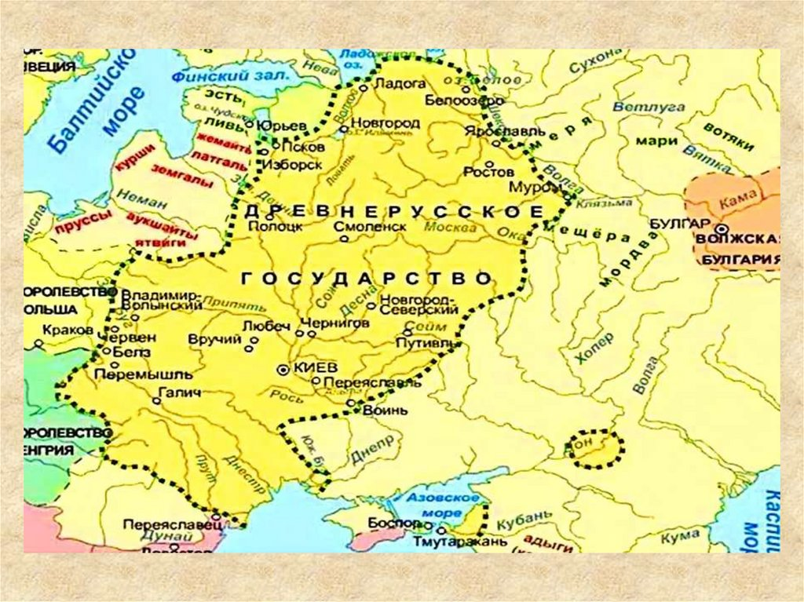

# Становление Киевской Руси

**Раздел:** 2. Человек и общество → 2.2 [История](../../../2.1_society/cause_and_effect_relationships/articles/lessons_of_history.md), страны и мир вокруг → История [России](time_of_trouble.md) и стран ближнего зарубежья

 

---

Представь себе карту Восточной Европы больше тысячи лет назад. По бескрайним равнинам текут полноводные реки, шумят дремучие леса, а по водным путям плывут ладьи с товарами и воинами. Сегодня мы узнаем, как на этой земле родилось государство, которое назовут Киевской Русью, и почему его судьбу изменило принятие христианства.

## Кто жил на этих землях?

В древности восточноевропейские равнины населяли разные племена. Славяне — **поляне**, **древляне**, **кривичи**, **ильменские словене** и другие — занимались земледелием, охотой и бортничеством. Они жили небольшими общинами, поклонялись богам природы — Перуну, Велесу, Даждьбогу — и не всегда ладили между собой.

Через их земли проходил знаменитый торговый путь «из варяг в греки» — от Балтийского моря до Чёрного, в богатую Византию. По рекам плыли купцы с севера на юг, и на этом пути вырастали первые города — Новгород, Ладога, а позже и Киев.

## Призвание варягов: начало династии

По «Повести временных лет», славянские и финские племена, жившие вокруг Новгорода, устали от междоусобиц и решили найти правителя со стороны. В 862 году они отправили послов к варягам — так на Руси называли скандинавских воинов и мореходов.

И сказали послы: «Земля наша велика и обильна, а порядка в ней нет. Приходите княжить и владеть нами». И откликнулись три брата — **Рюрик**, **Синеус** и **Трувор**. Рюрик сел княжить в Новгороде, а его братья — в других городах. Так началась династия Рюриковичей, которая правила Русью более семи веков.

Историки до сих пор спорят, действительно ли было призвание или варяги просто захватили власть. Но ясно одно: именно с Рюрика начинается история единой княжеской династии на Руси.

## Объединение Руси: Олег Вещий

После смерти Рюрика власть перешла к его родичу **Олегу**, который стал править за малолетнего сына Рюрика — **Игоря**. Олег отправился в поход на юг, по пути захватывая города. Главной его целью был Киев, где правили варяги Аскольд и Дир.

Хитростью выманив их из города, Олег убил их и воскликнул: «Да будет Киев матерью городам русским!» Так в 882 году под властью Олега объединились северные и южные земли — Новгород и Киев. Это событие считают началом единого Древнерусского государства.

Олег прославился и успешным походом на Византию. По легенде, он прибил свой щит к вратам Царьграда (Константинополя), показав мощь нового государства. За мудрость и удачу народ прозвал его Вещим.

## Первые князья: Игорь, Ольга, Святослав

После Олега правил князь **Игорь**. Он тоже ходил на Византию, но менее удачно. Главная трагедия случилась с ним в земле древлян: когда Игорь пришёл собирать дань, он попытался взять лишнего, и разгневанные древляне жестоко убили его.

Его жена **Ольга** осталась с малолетним сыном **Святославом**. Она жестоко отомстила древлянам, но вошла в историю как первая правительница, принявшая христианство. В 957 году в Константинополе её крестил сам византийский император. Однако распространять новую веру на Руси она не стала — ждала времени.

Сын Ольги **Святослав** был настоящим воином. Он мало сидел в Киеве, больше воевал — разгромил Хазарский каганат, воевал с болгарами и Византией. Князь говорил: «Иду на Вы!» — и всегда побеждал. Но в далёком походе его подстерегли печенеги и убили. Государством же всё это время управляла Ольга.

## Владимир: выбор веры

После гибели Святослава между его сыновьями началась усобица. Победителем вышел младший — **Владимир**, который сначала правил в Новгороде. Он захватил Киев и стал единодержавным князем.

Владимир начал с укрепления язычества. Поставил в Киеве новых идолов, даже приносил человеческие жертвы. Но понимал: старая вера разъединяет племена, а для крепкого государства нужна единая религия. И он выбрал христианство.

«Повесть временных лет» рассказывает красивую легенду. К Владимиру приходили послы от разных народов: мусульмане, иудеи, западные христиане. Каждый хвалил свою веру. Но больше всего князю понравился рассказ византийского посланника о православии. А когда его бояре побывали на службе в Константинополе, они сказали: «Не знали, на небе мы или на земле, ибо нет на земле такой красоты».

## Крещение Руси

В 988 году Владимир взял византийский город Херсонес (Корсунь) и потребовал в жёны сестру императора Анну. Византийцы согласились, но поставили условие: князь должен креститься. Владимир крестился сам и крестил свою дружину.

Вернувшись в Киев, он приказал уничтожить языческих идолов. Главного — Перуна — привязали к конскому хвосту и сбросили в Днепр. А наутро князь объявил: если кто завтра не придёт на реку креститься — будь то богатый или бедный, — тот будет мне врагом.

И люди пошли в воду. Кто-то со страхом, кто-то с радостью, но никто не осмелился ослушаться. Священники, пришедшие с Владимиром, совершили обряд крещения киевлян в месте впадения Почайны в Днепр.

## Что изменилось?

Крещение не сделало Русь христианской за один день. В лесах ещё долго молились старым богам, вспыхивали восстания волхвов. Но путь был выбран.

Владимир построил в Киеве первую каменную церковь — Десятинную. При нём открывались школы, куда забирали детей «лучших людей» учить книжному учению. Приезжали из Византии мастера, иконописцы, строители.

Русь вошла в семью европейских христианских народов. Началось строительство храмов, распространение письменности (кириллицы), пришедшей от славянских просветителей Кирилла и Мефодия. Крещение укрепило власть князя, сплотило племена и определило всю дальнейшую историю России.

Так от призвания варяжского князя до выбора веры прошло больше века. И этот путь превратил разрозненные племена в народ, способный создать великую цивилизацию.

## Похожие статьи

- [История Московского княжества](Moscow.md)
- [Москва - Третий Рим](Third_Rome.md)

---

_**[Автор](../../../5.1_technology_and_digital_literacy/information and media literacy/авторское_право_и_честное_использование.md):** Тихомиров Максим (@kanetsura)_  
_**GitHub:** @MaximTikhomirov_   
_**Использованные [нейросети](../../../2.1_society/cause_and_effect_relationships/articles/ai_causality.md):** LLM - DeepSeek_