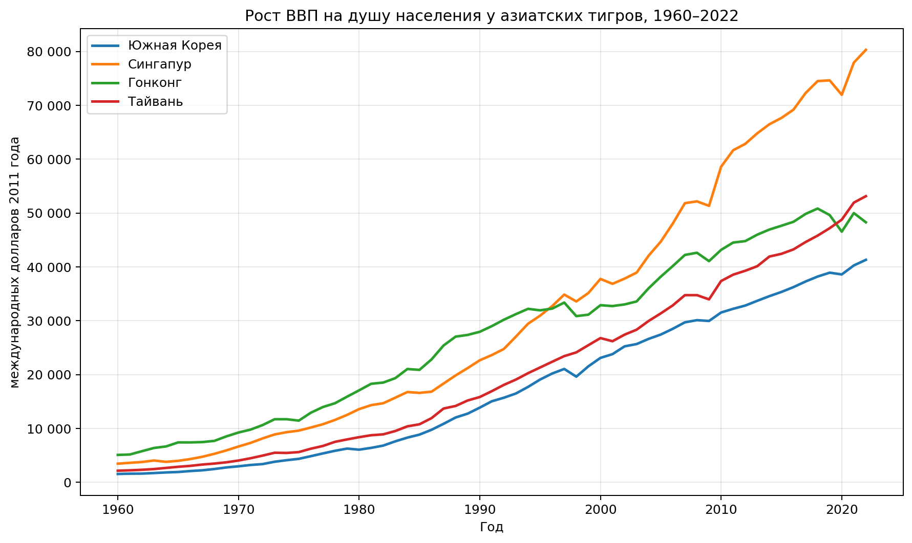
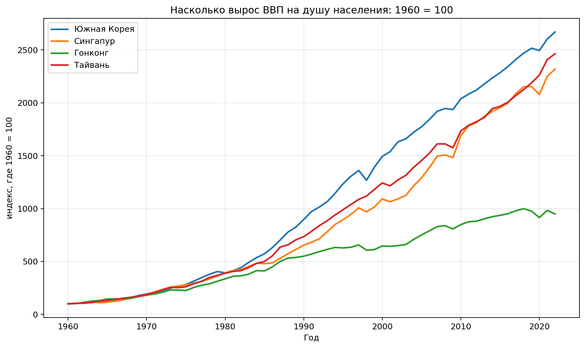
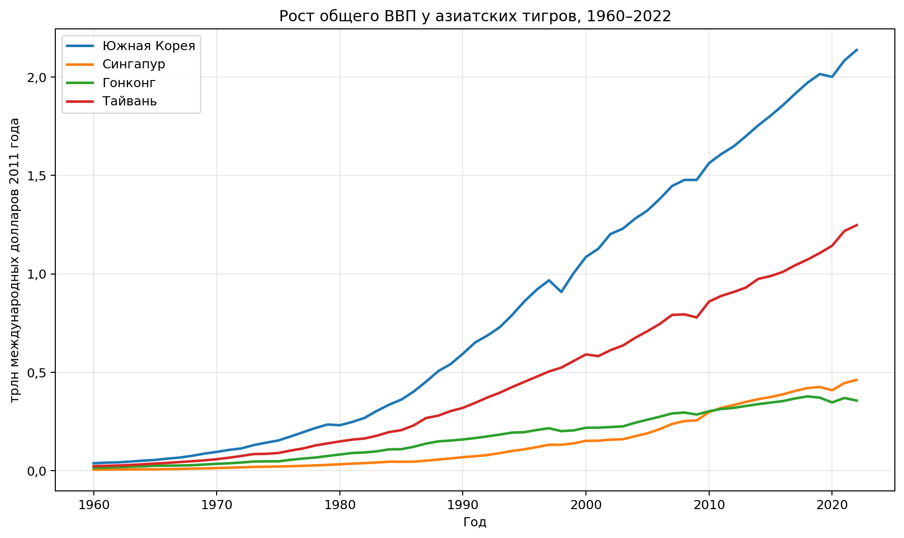
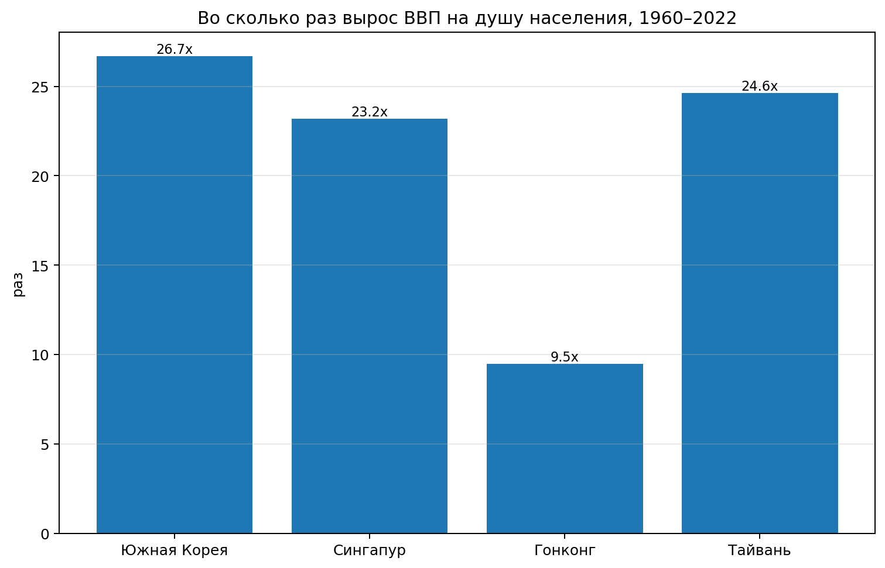
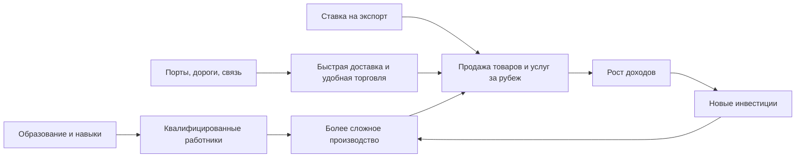
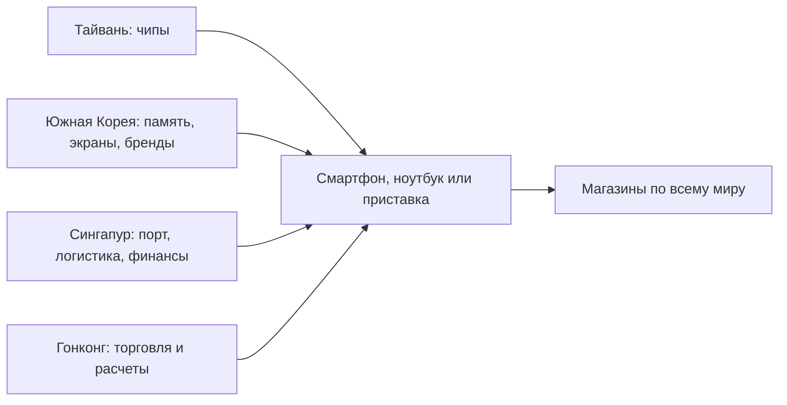

# Азиатские тигры

**Азиатские тигры** — это Южная Корея, Сингапур, Гонконг и Тайвань. Так называют четыре экономики Восточной Азии, которые во второй половине XX века выросли особенно быстро. За несколько десятилетий они прошли путь от сравнительно бедных или развивающихся территорий к важным центрам мировой торговли, промышленности, технологий и финансов.

Для темы «Мировая экономика на пальцах» эта статья важна потому, что на примере азиатских тигров хорошо видно, как работают [экспорт](./eksport.md), [глобализация](./globalizatsiya.md), [индустриализация](./industrializatsiya.md), [международная торговля](./mezhdunarodnaya_torgovlya.md), [полупроводники](./poluprovodniki.md) и [азиатский финансовый кризис](./aziatskiy_finansovyy_krizis.md).

## Содержание

- [Что такое азиатские тигры](#what-is)
- [Где находятся азиатские тигры](#map)
- [Почему они важны для мировой экономики](#why-important)
- [Как росли экономики азиатских тигров](#growth)
- [Как азиатские тигры выросли так быстро](#how-it-worked)
- [Чем каждая экономика особенно известна](#specialization)
- [Пример из реальной жизни](#real-life)
- [На пальцах](#simple)
- [Почему это важно школьнику](#school)
- [С чем связана эта статья в базе знаний](#links)
- [Интересный факт](#fact)
- [Главное](#main)
- [Источники данных и визуалов](#sources)

<a id="what-is"></a>
## Что такое азиатские тигры

Если говорить просто, **азиатские тигры** — это четыре очень успешные экономики Восточной Азии, которые сумели быстро разбогатеть за счет торговли с миром, роста промышленности, вложений в образование и перехода к более сложным технологиям.

Иногда их еще называют **четырьмя азиатскими драконами**. Но смысл один и тот же: речь идет о группе экономик, которые стали примером очень быстрого развития.

Чтобы не запутаться, удобно смотреть на такую таблицу:

| Экономика | Что это | Чем особенно известна сегодня |
|---|---|---|
| Южная Корея | государство в Восточной Азии | электроника, автомобили, корабли, чипы |
| Сингапур | город-государство | порт, логистика, финансы, международный бизнес |
| Гонконг | специальный административный район Китая | торговля, финансы, международные расчеты |
| Тайвань | островная экономика Восточной Азии | электроника, полупроводники, высокие технологии |

> **Важно:** в обычной речи иногда говорят, что это «четыре страны», но строго говоря это не совсем точно. Например, Гонконг — не отдельное государство. Однако в мировой экономике его часто рассматривают отдельно, потому что он долгое время играл особую роль как торговый и финансовый центр.

<a id="map"></a>
## Где находятся азиатские тигры

Ниже показана карта, на которой отмечены азиатские тигры.

*На карте красным выделены Южная Корея, Тайвань, Гонконг и Сингапур. Для Гонконга и Сингапура подсветка сделана схематично: на масштабе всей Восточной Азии реальные границы слишком малы.*

А вот короткая таблица, чтобы было проще запомнить их расположение:

| Экономика | Регион | Что рядом |
|---|---|---|
| Южная Корея | северо-восток Азии | Китай, Япония, Корейский полуостров |
| Тайвань | Восточная Азия | недалеко от побережья Китая |
| Гонконг | юг Китая | побережье Южно-Китайского моря |
| Сингапур | Юго-Восточная Азия | у важного морского пути между Индийским и Тихим океанами |

Ниже представлена интерактивная карта в формате GeoJSON. В этом варианте страны и территории не просто отмечены точками, а **подсвечены полигонами**.

```geojson
{
  "type": "FeatureCollection",
  "features": [
    {
      "type": "Feature",
      "properties": {
        "title": "Южная Корея",
        "description": "Подсветка страны. Экспорт, электроника, автомобили, судостроение и чипы.",
        "fill": "#d32f2f",
        "fill-opacity": 0.45,
        "stroke": "#8b0000",
        "stroke-width": 2,
        "stroke-opacity": 0.9
      },
      "geometry": {
        "type": "Polygon",
        "coordinates": [
          [
            [
              126.174759,
              37.749686
            ],
            [
              126.237339,
              37.840378
            ],
            [
              126.68372,
              37.804773
            ],
            [
              127.073309,
              38.256115
            ],
            [
              127.780035,
              38.304536
            ],
            [
              128.205746,
              38.370397
            ],
            [
              128.349716,
              38.612243
            ],
            [
              129.21292,
              37.432392
            ],
            [
              129.46045,
              36.784189
            ],
            [
              129.468304,
              35.632141
            ],
            [
              129.091377,
              35.082484
            ],
            [
              128.18585,
              34.890377
            ],
            [
              127.386519,
              34.475674
            ],
            [
              126.485748,
              34.390046
            ],
            [
              126.37392,
              34.93456
            ],
            [
              126.559231,
              35.684541
            ],
            [
              126.117398,
              36.725485
            ],
            [
              126.860143,
              36.893924
            ],
            [
              126.174759,
              37.749686
            ]
          ]
        ]
      }
    },
    {
      "type": "Feature",
      "properties": {
        "title": "Тайвань",
        "description": "Подсветка страны. Один из важнейших центров производства полупроводников.",
        "fill": "#d32f2f",
        "fill-opacity": 0.45,
        "stroke": "#8b0000",
        "stroke-width": 2,
        "stroke-opacity": 0.9
      },
      "geometry": {
        "type": "Polygon",
        "coordinates": [
          [
            [
              121.777818,
              24.394274
            ],
            [
              121.175632,
              22.790857
            ],
            [
              120.74708,
              21.970571
            ],
            [
              120.220083,
              22.814861
            ],
            [
              120.106189,
              23.556263
            ],
            [
              120.69468,
              24.538451
            ],
            [
              121.495044,
              25.295459
            ],
            [
              121.951244,
              24.997596
            ],
            [
              121.777818,
              24.394274
            ]
          ]
        ]
      }
    },
    {
      "type": "Feature",
      "properties": {
        "title": "Гонконг",
        "description": "Схематичная подсветка территории: на масштабе всей Восточной Азии реальные границы слишком малы.",
        "fill": "#d32f2f",
        "fill-opacity": 0.45,
        "stroke": "#8b0000",
        "stroke-width": 2,
        "stroke-opacity": 0.9
      },
      "geometry": {
        "type": "Polygon",
        "coordinates": [
          [
            [
              113.8,
              22.12
            ],
            [
              114.46,
              22.12
            ],
            [
              114.46,
              22.58
            ],
            [
              113.8,
              22.58
            ],
            [
              113.8,
              22.12
            ]
          ]
        ]
      }
    },
    {
      "type": "Feature",
      "properties": {
        "title": "Сингапур",
        "description": "Схематичная подсветка территории: на масштабе всей Восточной Азии реальные границы слишком малы.",
        "fill": "#d32f2f",
        "fill-opacity": 0.45,
        "stroke": "#8b0000",
        "stroke-width": 2,
        "stroke-opacity": 0.9
      },
      "geometry": {
        "type": "Polygon",
        "coordinates": [
          [
            [
              103.58,
              1.15
            ],
            [
              104.05,
              1.15
            ],
            [
              104.05,
              1.48
            ],
            [
              103.58,
              1.48
            ],
            [
              103.58,
              1.15
            ]
          ]
        ]
      }
    },
    {
      "type": "Feature",
      "properties": {
        "title": "Сеул",
        "description": "Южная Корея",
        "marker-color": "#8b0000",
        "marker-size": "medium",
        "marker-symbol": "circle"
      },
      "geometry": {
        "type": "Point",
        "coordinates": [
          126.978,
          37.5665
        ]
      }
    },
    {
      "type": "Feature",
      "properties": {
        "title": "Тайбэй",
        "description": "Тайвань",
        "marker-color": "#8b0000",
        "marker-size": "medium",
        "marker-symbol": "circle"
      },
      "geometry": {
        "type": "Point",
        "coordinates": [
          121.5654,
          25.033
        ]
      }
    },
    {
      "type": "Feature",
      "properties": {
        "title": "Гонконг",
        "description": "Финансы, торговля и международные расчеты",
        "marker-color": "#8b0000",
        "marker-size": "medium",
        "marker-symbol": "circle"
      },
      "geometry": {
        "type": "Point",
        "coordinates": [
          114.1694,
          22.3193
        ]
      }
    },
    {
      "type": "Feature",
      "properties": {
        "title": "Сингапур",
        "description": "Порт, логистика и международный бизнес",
        "marker-color": "#8b0000",
        "marker-size": "medium",
        "marker-symbol": "circle"
      },
      "geometry": {
        "type": "Point",
        "coordinates": [
          103.8198,
          1.3521
        ]
      }
    }
  ]
}
```

<a id="why-important"></a>
## Почему они важны для мировой экономики

История азиатских тигров важна по нескольким причинам.

Во-первых, она показывает, что для успеха в мировой экономике не обязательно быть огромной страной по площади. Гораздо важнее уметь производить нужные товары, хорошо торговать с другими странами, привлекать инвестиции и развивать образование.

Во-вторых, азиатские тигры стали частью глобальных цепочек производства. Это значит, что товар может проектироваться в одной стране, собираться в другой, перевозиться через третью, а продаваться по всему миру. В таких цепочках Южная Корея, Тайвань, Сингапур и Гонконг играют очень заметную роль.

В-третьих, именно на этих экономиках хорошо видно, как мир переходит от простого производства к сложному: от текстиля и обычных фабрик — к электронике, финансам, чипам, логистике и цифровым технологиям.

Удобно увидеть это в таблице:

| Почему это важно | Что это значит для мира |
|---|---|
| Быстрый рост | эти экономики стали примером того, как можно резко ускорить развитие |
| Экспорт | они продавали товары и услуги не только себе, но и всему миру |
| Технологии | сегодня многие из них важны для электроники и чипов |
| Финансы и логистика | через них проходят деньги, сделки, грузы и поставки |

<a id="growth"></a>
## Как росли экономики азиатских тигров

Одна из самых интересных частей темы — посмотреть на рост **не словами, а по данным**.

> [!NOTE]
> На графиках ниже используются данные **Maddison Project Database 2023**. Это исторические ряды до **2022 года** в **постоянных международных долларах 2011 года**. Такой формат нужен, чтобы честно сравнивать разные годы: без искажений из-за инфляции и разницы цен между странами.

### 1) ВВП на душу населения



*Этот график показывает, сколько экономики в среднем приходится на одного человека. Поэтому маленькая экономика тоже может выглядеть очень богатой «на человека».*

Удобно дополнить график таблицей:

| Экономика | ВВП на душу в 1960 | ВВП на душу в 2022 | Во сколько раз вырос |
|---|---:|---:|---:|
| Южная Корея | 1 548 | 41 321 | 26,7 |
| Сингапур | 3 464 | 80 320 | 23,2 |
| Гонконг | 5 088 | 48 289 | 9,5 |
| Тайвань | 2 157 | 53 143 | 24,6 |


Из нее видно важную вещь: по **уровню ВВП на душу населения** все четыре экономики сделали огромный рывок. Особенно заметно это у Южной Кореи: она стартовала с гораздо более низкого уровня, чем остальные, но потом очень быстро догоняла и росла.

### 2) Насколько быстро они росли относительно своей стартовой точки



*Здесь 1960 год у всех принят за 100. Так легче увидеть именно темп роста, а не просто кто был богаче в абсолютных цифрах.*

На таком графике особенно хорошо видно, что Южная Корея прошла путь почти от бедной индустриализирующейся экономики до одной из самых развитых в мире.

### 3) Общий размер экономики



*Этот график уже показывает не богатство «на человека», а общий размер экономики. Поэтому более населенные Южная Корея и Тайвань выглядят крупнее Гонконга и Сингапура.*

И еще одна таблица — уже про общий ВВП:

| Экономика | Общий ВВП в 1960, млрд | Общий ВВП в 2022, млрд | Во сколько раз вырос |
|---|---:|---:|---:|
| Южная Корея | 38,4 | 2 137,6 | 55,7 |
| Сингапур | 5,7 | 461,8 | 81,0 |
| Гонконг | 15,4 | 356,7 | 23,2 |
| Тайвань | 23,4 | 1 247,9 | 53,3 |


### 4) Короткий вывод по графикам



Если совсем коротко, то графики показывают три идеи:

1. **Все четыре экономики выросли очень сильно.**
2. **Южная Корея особенно впечатляет по темпу догоняющего роста.**
3. **Сингапур и Гонконг особенно заметны по высокому уровню ВВП на душу населения, а Южная Корея и Тайвань — по более крупному общему размеру экономики.**

<a id="how-it-worked"></a>
## Как азиатские тигры выросли так быстро

Их рост не был «волшебством». Обычно работало сразу несколько факторов:

1. **Ставка на образование.**  
   Нужны были грамотные рабочие, инженеры, менеджеры и ученые.

2. **Ставка на экспорт.**  
   Эти экономики не ограничивались продажами только внутри себя. Они старались производить товары для всего мира.

3. **Переход от простого к сложному.**  
   Сначала — более простые товары, потом — техника, электроника, сложные детали, финансовые услуги и высокие технологии.

4. **Хорошая инфраструктура.**  
   Порты, дороги, заводы, склады, связь и удобные условия для бизнеса сильно ускоряли развитие.

Ниже — схема, которая показывает эту логику:



А вот еще одна полезная таблица — по этапам роста:

| Период | Что происходило |
|---|---|
| 1950-е–1960-е | экономики были намного беднее, чем сегодня |
| 1960-е–1980-е | быстрый рост промышленности и экспорта |
| 1980-е–1990-е | переход к более сложным товарам, электронике и услугам |
| 1997–1998 | сильный удар азиатского финансового кризиса |
| 2000-е–сегодня | еще большая роль технологий, логистики, финансов и чипов |

Важно понимать: рост не шел по идеально ровной линии. Даже очень успешные экономики могут переживать кризисы, падение спроса и трудные периоды.

<a id="specialization"></a>
## Чем каждая экономика особенно известна

Хотя их объединяют в одну группу, у каждой экономики своя специализация.

| Экономика | С чего начинала или чем особенно росла раньше | Что особенно важно сегодня |
|---|---|---|
| Южная Корея | промышленность, тяжелое производство, экспорт | электроника, автомобили, корабли, чипы |
| Сингапур | торговый порт и переработка | логистика, финансы, международные услуги |
| Гонконг | торговля и посредничество | финансы, сделки, международный бизнес |
| Тайвань | легкая промышленность и электроника | полупроводники, сложная электроника, высокие технологии |

Можно еще посмотреть на это так:

| Экономика | Короткая ассоциация |
|---|---|
| Южная Корея | технологии и промышленность |
| Сингапур | порт и деньги |
| Гонконг | торговля и финансы |
| Тайвань | чипы и электроника |

<a id="real-life"></a>
## Пример из реальной жизни

Представьте обычный смартфон, ноутбук или игровую приставку. Очень часто в такой технике есть связь сразу с несколькими азиатскими тиграми:

- **Тайвань** связан с производством чипов;
- **Южная Корея** — с памятью, экранами, электроникой и крупными брендами;
- **Сингапур** — с логистикой, портами, поставками и финансовыми услугами;
- **Гонконг** — с международной торговлей и денежными операциями.

Вот это можно показать схемой:



Именно поэтому тема азиатских тигров — это не только история прошлого, но и часть современной мировой экономики.

<a id="simple"></a>
## На пальцах

> **На пальцах:**  
> Представьте, что в школе есть четыре очень сильные команды. Одна лучше всех делает сложные детали, вторая отлично собирает технику, третья быстрее всех перевозит товары, а четвертая помогает проводить сделки и работать с деньгами.  
>  
> По отдельности каждая команда уже важна. А вместе они становятся настолько полезными, что без них всей школьной системе становится трудно работать. Примерно так азиатские тигры и встроились в мировую экономику.

<a id="school"></a>

---
## Почему это важно школьнику

Эта тема кажется далекой только на первый взгляд.

Во-первых, азиатские тигры напрямую связаны с техникой, которой школьники пользуются каждый день: телефонами, ноутбуками, мониторами, игровыми приставками и другой электроникой.

Во-вторых, через эту тему легко понять, почему новости про мировую торговлю и поставки влияют на обычные цены. Если где-то ломается логистика, дорожают перевозки или не хватает чипов, это рано или поздно отражается на стоимости товаров.

В-третьих, азиатские тигры — хороший пример того, что богатство страны создается не только природными ресурсами. Огромную роль играют знания, организация, порты, промышленность, технологии и умение работать с мировым рынком.

Вот короткая таблица связи с повседневной жизнью:

| Что замечает школьник | Как это связано с азиатскими тиграми |
|---|---|
| дорожают телефоны и ноутбуки | в их производстве важны чипы, экраны и мировые поставки |
| в новостях говорят о логистике и морских путях | Сингапур — один из важнейших торговых узлов |
| часто обсуждают микрочипы | Тайвань и Южная Корея играют в этой теме огромную роль |
| мировая экономика кажется слишком сложной | на примере азиатских тигров ее легче понять по шагам |

<a id="links"></a>
## С чем связана эта статья в базе знаний

- [Экспорт](./eksport.md)
- [Глобализация](./globalizatsiya.md)
- [Индустриализация](./industrializatsiya.md)
- [Международная торговля](./mezhdunarodnaya_torgovlya.md)
- [Логистика](./logistika.md)
- [Полупроводники](./poluprovodniki.md)
- [Финансовый центр](./finansovyy_tsentr.md)
- [Азиатский финансовый кризис](./aziatskiy_finansovyy_krizis.md)

<a id="fact"></a>
## Интересный факт

> **Интересный факт:**  
> Тайвань играет настолько большую роль в производстве полупроводников, что новости о тайваньской чиповой отрасли обсуждают по всему миру — от производителей автомобилей до создателей игровых консолей. Это хороший пример того, как сравнительно небольшая экономика может оказаться очень важной для всего мира.

<a id="main"></a>
## Главное

Азиатские тигры — это Южная Корея, Сингапур, Гонконг и Тайвань. Их история показывает, что быстрый экономический рост обычно строится не на чуде, а на сочетании образования, экспорта, инфраструктуры, технологий и продуманной экономической стратегии.

На их примере хорошо видно, как мировая экономика связывает между собой заводы, порты, банки, перевозки, электронику и повседневную жизнь обычных людей.

<a id="sources"></a>
## Источники данных и визуалов

**Основные данные для графиков:**
- [Maddison Project Database 2023 (DataverseNL)](https://dataverse.nl/dataset.xhtml?persistentId=doi:10.34894/INZBF2)
- [Maddison Project Database 2023 — University of Groningen](https://www.rug.nl/ggdc/historicaldevelopment/maddison/releases/maddison-project-database-2023?lang=en)

**Карта и схемы:**
- [Natural Earth: Admin 0 – Countries](https://www.naturalearthdata.com/downloads/110m-cultural-vectors/110m-admin-0-countries/)
- Исходный GeoJSON карты хранится в `WORK/2.2_history/world_economy_on_fingers/assets/maps/aziatskie_tigry_map.geojson`

**Локальные файлы визуалов:**
- `../images/aziatskie_tigry_map.png`
- `../images/aziatskie_tigry_gdppc_1960_2022.png`
- `../images/aziatskie_tigry_gdppc_index_1960_2022.png`
- `../images/aziatskie_tigry_total_gdp_1960_2022.png`
- `../images/aziatskie_tigry_gdppc_growth_multipliers.png`

---
***Автор:** Авраменко Денис @denisuelius*  
***GitHub:*** *[den4ik2975](https://github.com/den4ik2975)*  
***Использованные нейросети и ресурсы:*** *ChatGPT 5.4; Maddison Project Database 2023; Natural Earth*
