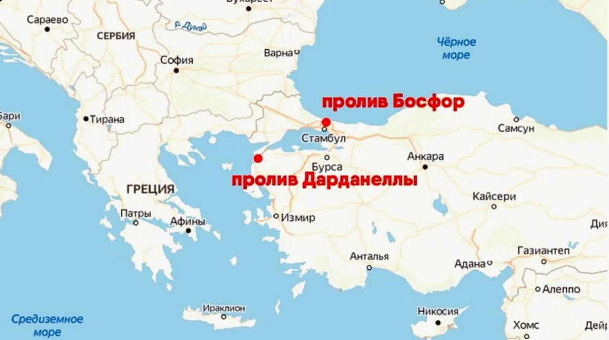
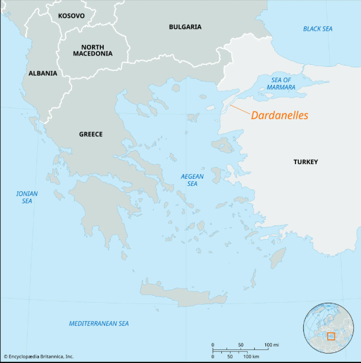
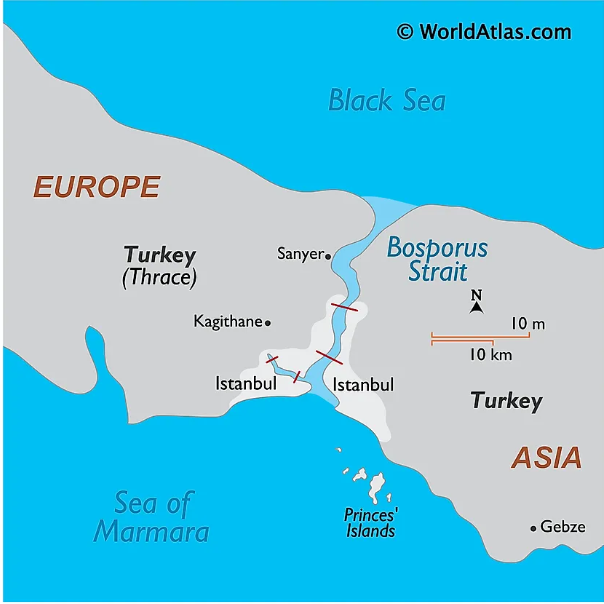
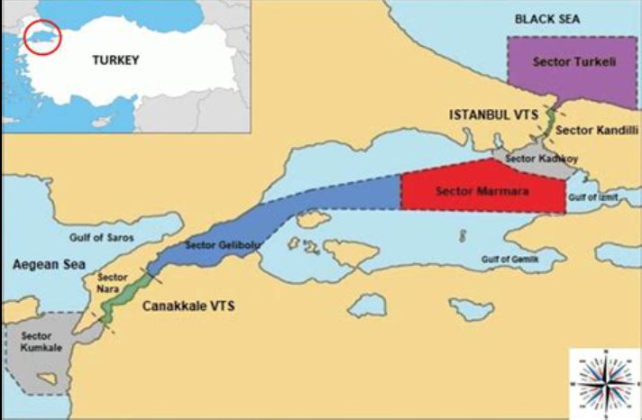

# Босфор и Дарданеллы

---

Босфор и Дарданеллы — это стратегически важные проливы, соединяющие Черное море со Средиземноморским бассейном. Их значение выходит далеко за рамки географии: они влияют на торговлю, перевозки сырья и международную политику.

Босфор и Дарданеллы — это два стратегически важных пролива, которые вместе с Мраморным морем образуют систему так называемых Турецких проливов. Через них Черное море соединяется с Эгейским, а затем и со Средиземным морем. Именно поэтому эти проливы имеют огромное значение не только для географии, но и для мировой экономики, торговли и политики.

Для стран Черноморского региона Босфор и Дарданеллы — это главный выход к мировым морским путям. Через них идут грузы, нефть, зерно, металлы и другие товары. Поэтому любые ограничения, конфликты или риски в районе проливов быстро отражаются на торговле, логистике и международных отношениях.

На карте видно, где находятся Дарданеллы и как они соединяют Эгейское море с Мраморным. Это помогает понять, почему проливы имеют ключевое значение для выхода из Чёрного моря в Средиземноморье.

---

## Содержание

- [Что это такое](#what-is)
- [Почему это важно для мировой экономики](#why-important)
- [Как это работает](#how-it-works)
- [Пример из реальной жизни](#real-life)
- [На пальцах](#simple)
- [Почему это важно школьнику](#school)
- [С чем связана статья в базе знаний](#links)
- [Интересный факт](#fact)
- [Заключение](#main)

---

## Что это такое

Босфор — это пролив, который соединяет Черное море с Мраморным и одновременно разделяет европейскую и азиатскую части Стамбула. Дарданеллы — это пролив, который соединяет Мраморное море с Эгейским. Вместе они образуют единственный морской путь из Черного моря в Средиземное.

На карте видно, что Босфор соединяет Чёрное море с Мраморным морем и проходит через Стамбул, разделяя Европу и Азию. Это делает его важным не только для торговли, но и для геополитики.

В географическом смысле их значение огромно: без них Черное море было бы почти замкнутым внутренним бассейном. Britannica прямо отмечает, что Черное море связано с водами Атлантики именно через Босфор, Мраморное море, Дарданеллы, Эгейское и Средиземное моря.

Эти проливы важны не только как природные проходы, но и как объект международной политики. Их стратегическое значение обсуждалось веками, а вопрос о контроле над ними был настолько важен, что в европейской дипломатии даже существовало отдельное понятие — Straits Question, то есть «вопрос о проливах».

Их рассматривают вместе, потому что в международном судоходстве они работают как единая система. Корабль не может выйти из Черного моря в Средиземное, пройдя только один из этих проливов: маршрут всегда включает и Босфор, и Дарданеллы.

## Почему это важно для мировой экономики

Главная экономическая роль Босфора и Дарданелл в том, что они обеспечивают морской выход для стран Черноморского региона. Через этот маршрут идут экспорт и импорт таких государств, как Турция, Болгария, Румыния, Украина, Грузия и в определённой степени Россия. Без проливов торговля этих стран с внешним миром была бы намного сложнее и дороже.

Особенно важны проливы для перевозки зерна, нефти, металлов и других массовых грузов. На примере Черноморской зерновой инициативы ООН и Турции хорошо видно, что возможность безопасного судоходства из украинских портов через Черное море и далее через Турецкие проливы влияет не только на регион, но и на мировую продовольственную безопасность. UNCTAD подчёркивала, что инициатива помогла вернуть зерно и продовольствие на мировые рынки и смягчить продовольственный кризис.

Экономическая значимость проливов связана ещё и с тем, что они представляют собой узкое место торговли. Когда важный маршрут проходит через сравнительно ограниченный участок, любые сбои — от военных рисков до административных ограничений — начинают влиять на стоимость перевозок, сроки поставок и устойчивость рынков. Это особенно заметно в периоды кризисов в Черноморском регионе.

Их положение делает их важными не только экономически, но и геополитически. Контроль над проходом и безопасность судоходства влияют на интересы целого ряда государств и международных организаций.

## Как это работает

С точки зрения логистики система проста: судно выходит из Черного моря через Босфор, проходит Мраморное море, затем проходит Дарданеллы и выходит в Эгейское море, откуда уже может идти в Средиземное и дальше в мировой океан. Именно поэтому Босфор и Дарданеллы обычно рассматривают не по отдельности, а как единый транспортный коридор.

Но экономическая роль проливов определяется не только географией, а ещё и правилами прохода. Важнейшим документом здесь является Конвенция Монтрё 1936 года, которая восстановила турецкий суверенитет над проливами и установила особый режим прохода, особенно для военных кораблей. Britannica отмечает, что именно эта конвенция закрепила современный порядок контроля над проливами.

Для мировой экономики это важно потому, что торговля зависит от предсказуемости маршрута. Если правила прохода понятны и судоходство безопасно, страны Черноморского бассейна могут стабильно экспортировать и импортировать товары. Если же политическая или военная ситуация ухудшается, проливы из транспортного коридора превращаются в источник риска.

Проход через них стратегически значим, потому что это единственный морской путь, связывающий Черное море с мировыми торговыми маршрутами. Любые ограничения, риски безопасности или политические споры сразу отражаются на перевозках, стоимости логистики и международных отношениях.

## Пример из реальной жизни

Хороший пример — экспорт украинского зерна в условиях войны. После начала полномасштабного конфликта вывоз зерна из украинских портов резко осложнился, что ударило по мировому рынку продовольствия. Черноморская зерновая инициатива, подписанная в июле 2022 года при участии ООН и Турции, позволила возобновить вывоз зерна морем. IMO сообщала, что в рамках первых этапов инициативы были перемещены десятки миллионов тонн зерна и продовольствия, а UNCTAD подчёркивала её значение для снижения глобального ценового давления.

Хотя сама инициатива касалась украинских портов в Черном море, её практический смысл напрямую связан с Босфором и Дарданеллами: без выхода через Турецкие проливы эти грузы не могли бы двигаться дальше на мировые рынки. Это наглядно показывает, что значение проливов выходит далеко за пределы Турции и касается продовольственной и торговой безопасности многих стран.

## На пальцах

Это как ворота, через которые товары из Черного моря выходят в большой мировой рынок. Если с этими воротами возникают сложности, это сразу сказывается на торговле и перевозках.

Если совсем просто, Босфор и Дарданеллы — это как ворота из Черного моря в большой мировой рынок. Пока ворота открыты и всё спокойно, корабли вывозят зерно, нефть и другие товары. Но если с этими воротами что-то происходит, торговля сразу тормозится.

Можно представить Черное море как большой двор, а Босфор и Дарданеллы — как единственный выезд с него на главную дорогу. Если этот выезд работает нормально, всё движется. Если появляются проблемы, это быстро чувствуют и продавцы, и покупатели, и перевозчики, и целые страны. Такой образ хорошо передаёт экономический смысл проливов.

На схеме видно, что Босфор и Дарданеллы работают как единый транспортный коридор. Именно через эту систему страны Чёрноморского региона получают морской выход в Средиземное море и дальше в мировой океан.

## Почему это важно школьнику

- показывает, как отдельные проливы влияют на целые регионы;
- помогает понять связь географии и политики;
- делает понятнее маршруты экспорта и международные конфликты;
- полезно для географии, истории, экономики.

Эта тема важна школьнику, потому что она показывает, как география влияет на экономику и политику. На карте Босфор и Дарданеллы могут показаться просто двумя узкими проливами, но на деле от них зависит торговля целого региона. Это хороший пример того, что в мировой экономике значение имеет не только размер страны, но и её положение на ключевых маршрутах.

Кроме того, тема помогает лучше понимать новости. Когда речь идёт о зерновом экспорте, Черноморском регионе, международных кризисах или контроле над морскими путями, Босфор и Дарданеллы часто оказываются в центре обсуждения. Зная, что это за проливы и почему они важны, легче понимать, как связаны география, история и мировая торговля.

## С чем связана статья в базе знаний

- [Суэцкий канал](./suetskiy_kanal.md) — ещё один важный транспортный узел.
- [Нефть в мировой экономике](./neft_v_mirovoy_ekonomike.md) — через проливы идут энергетические и сырьевые грузы.
- [Глобализация](./globalizatsiya.md) — проливы встроены в мировую систему перевозок.
- [Европейский союз](./evropeyskiy_soyuz.md) — ЕС связан с торговлей и логистикой этого региона.
- [Развитые и развивающиеся страны](./razvitye_i_razvivayushchiesya_strany.md) — значение проливов различается для стран с разной ролью в мировой экономике.

## Интересный факт

Одни и те же проливы на протяжении веков остаются важными и для торговли, и для военной стратегии, что делает их редким примером стабильной геоэкономической значимости.

Вопрос о Босфоре и Дарданеллах был настолько важен для международной политики, что в XIX–XX веках превратился в отдельную дипломатическую проблему европейского масштаба — так называемый вопрос о проливах. То есть эти проходы влияли на отношения великих держав задолго до современной глобализации.

## Заключение

Босфор и Дарданеллы — это важнейшие звенья между Черным морем и мировыми торговыми путями. Их значение показывает, как география может влиять на экономику целых регионов.

Босфор и Дарданеллы — это не просто два пролива на карте, а один из важнейших транспортных и геополитических узлов Евразии. Они обеспечивают связь Черного моря со Средиземным, а значит, влияют на торговлю, экспорт, импорт и международные отношения всего региона.

Для базы знаний эта статья важна потому, что на её примере хорошо видно, как мировая экономика зависит от конкретных маршрутов. Босфор и Дарданеллы соединяют географию, историю, торговлю и политику в одной теме — а значит, помогают лучше понять устройство современного мира.

---

***Автор:** Георгий Голосов @goschikk*  
***GitHub:*** *[GeorgyGolosov](https://github.com/GeorgyGolosov)*  
***Использованные нейросети и ресурсы:*** *ChatGPT 5.4.*
