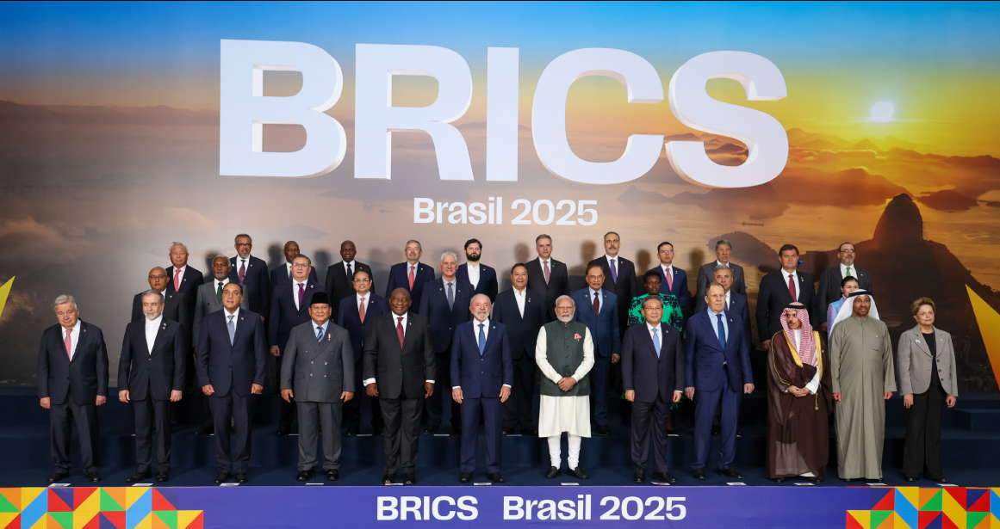
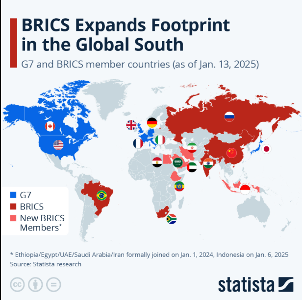
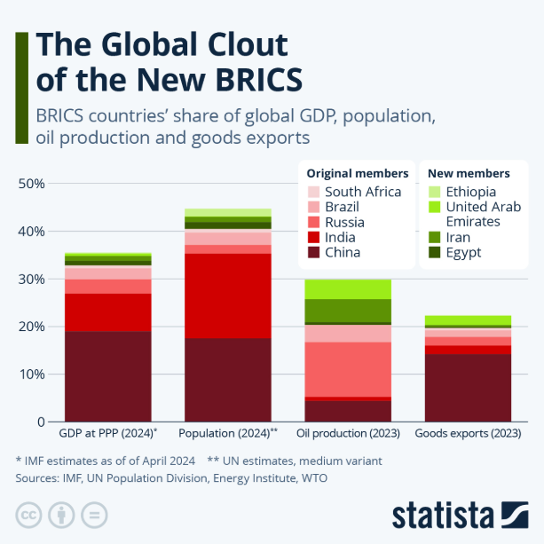
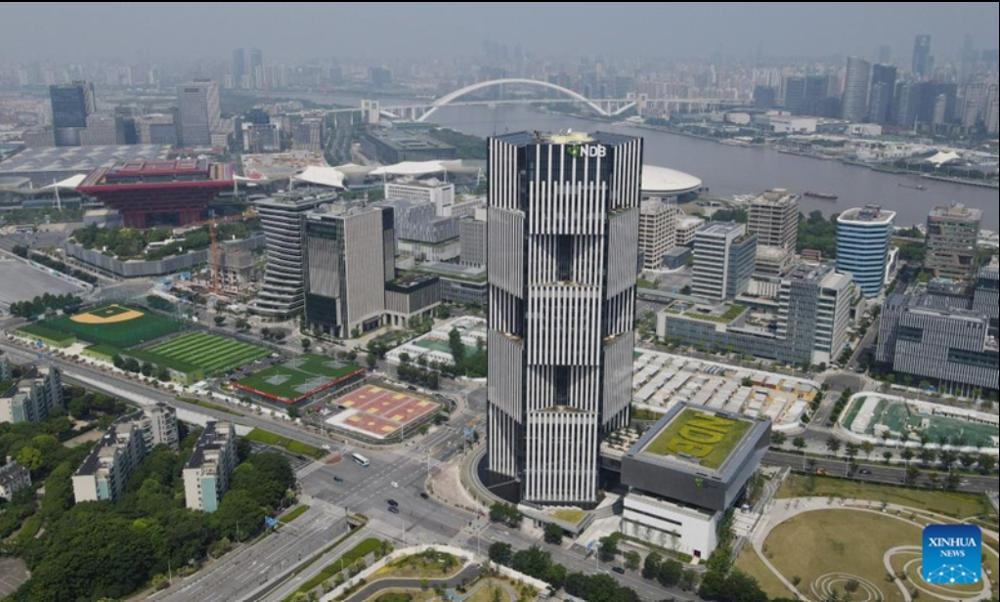

# [БРИКС](kitayskiy_yuan.md)

---

БРИКС — это объединение крупных стран с развивающимися экономиками, которое стало заметным игроком в мировой экономике и политике. Несмотря на различия между участниками, их объединяет стремление усилить роль незападных центров [силы](../../../1.2_natural_sciences/physics_in_everyday_life/Q11423.md).

БРИКС — это международное объединение крупных стран, которое играет заметную роль в мировой экономике и всё чаще рассматривается как один из символов более многополярного мира. Изначально в него входили Бразилия, Россия, Индия и Китай, а затем присоединилась Южная [Африка](../../../7.1_art/musical_instruments/articles/marimba.md). По состоянию на 2026 год на официальном сайте БРИКС указано, что группа включает уже одиннадцать стран: Бразилию, Россию, Индию, Китай, Южную Африку, а также [Египет](suetskiy_kanal.md), Эфиопию, Индонезию, Иран, Саудовскую Аравию и Объединённые Арабские Эмираты.

БРИКС важен не только потому, что объединяет крупные государства, но и потому, что показывает: [мировая экономика](globalizatsiya.md) уже давно не сводится только к США, Западной Европе и Японии. Участники БРИКС стремятся активнее влиять на международные [правила](../../../2.1_society/cause_and_effect_relationships/articles/why_rules_work.md), усиливать связи между странами Глобального Юга и расширять экономическое [сотрудничество](../../../8.2_future/choosing_a_career_path/articles/team.md) вне привычных западных центров. Это делает тему БРИКС особенно важной для понимания современной мировой экономики.

---

## Содержание

- [Что это такое](#what-is)
- [Почему это важно для мировой экономики](#why-important)
- [Как это работает](#how-it-works)
- [Пример из реальной жизни](#real-life)
- [На пальцах](#simple)
- [Почему это важно школьнику](#school)
- [С чем связана статья в базе знаний](#links)
- [Интересный факт](#fact)
- [Заключение](#main)

---

## Что это такое

БРИКС — это не государство, не военный союз и не аналог Европейского союза. У объединения нет общей валюты, единого парламента или общего правительства. Скорее, это площадка для координации позиций, переговоров и совместных инициатив в политике, экономике и международных отношениях. Официальные [материалы](../../../1.2_natural_sciences/physics_in_everyday_life/Q487005.md) БРИКС описывают сотрудничество по трём крупным направлениям: политика и [безопасность](../../../1.2_natural_sciences/neurobiology_for_teens/articles/17_hugs_oxytocin.md), экономика и финансы, а также культурные и гуманитарные связи.

[История](../../../1.2_natural_sciences/physics_in_everyday_life/Q11469.md) объединения началась с формата BRIC, в который входили Бразилия, Россия, Индия и Китай. Южная Африка присоединилась позже, в 2011 году, и с этого момента закрепилось название BRICS. Новая [волна](../../../1.2_natural_sciences/physics_in_everyday_life/Q1146001.md) расширения была оформлена в 2024–2025 годах, и сейчас объединение стало заметно шире, чем его первоначальный [состав](../../../1.2_natural_sciences/physics_in_everyday_life/Q11469.md).

На карте видно, что БРИКС расширился по сравнению с первоначальным составом. Это показывает [рост](../../../3.1. healthy lifestyle/Sleep, nutrition, and adolescent energy/articles/micronutrients_and_teenagers.md) географического охвата объединения и [усиление](../../../1.2_natural_sciences/physics_in_everyday_life/Q136980.md) его роли как площадки стран Глобального Юга.

Важно понимать, что страны БРИКС очень разные. Среди них есть крупнейшие производственные экономики, экспортёры сырья, энергетические державы, страны с огромным населением и государства с разной политической системой. Их объединяет не одинаковость, а общий [интерес](../../../1.2_natural_sciences/neurobiology_for_teens/articles/19_curiosity.md) к более заметной роли в глобальном управлении и к укреплению связей между развивающимися и быстрорастущими экономиками.

## Почему это важно для мировой экономики

БРИКС важен для мировой экономики уже хотя бы потому, что объединяет очень крупные рынки, большие [ресурсы](../../../2.1_society/cause_and_effect_relationships/articles/ecological_footprint.md), значительную часть населения [планеты](../../../1.2_natural_sciences/physics_in_everyday_life/Q1.md) и быстрорастущие [сегменты](../../../5.1_technology_and_digital_literacy/operating system/articles/memory_management.md) мировой торговли. Даже без точных цифр понятно, что речь идёт не о периферийной группе стран, а о наборе государств, которые влияют на [производство](../../../2.1_society/cause_and_effect_relationships/articles/economic_chains.md), [сырьевые рынки](neft_v_mirovoy_ekonomike.md), энергетику, логистику и международные финансы.

На диаграмме видно, что [значение](../../../7.2 Media, leisure and hobbies /useful_and_interesting_leisure/articles/leisure_and_why_need.md) БРИКС связано не только с числом стран-участниц, но и с их весом в мировой экономике. Объединение концентрирует крупные рынки, большое население и важные сырьевые ресурсы.

Ещё одна [причина](../../../2.1_society/cause_and_effect_relationships/articles/causality_base.md) важности БРИКС — стремление изменить [баланс](../../../1.2_natural_sciences/physics_in_everyday_life/Q634.md) влияния в мировой финансовой системе. В официальных документах и заявлениях группы регулярно поднимаются темы [реформы](../../../2.1_society/cause_and_effect_relationships/articles/lessons_of_history.md) глобального управления, усиления роли развивающихся стран и более справедливого [устройства](../../../5.1_technology_and_digital_literacy/operating system/articles/HAL.md) международных институтов. Это означает, что БРИКС — не просто клуб для встреч, а площадка, через которую участники пытаются продвигать своё видение мировой экономики.

Для мировой торговли БРИКС тоже имеет большое значение. Среди стран объединения есть крупнейшие производители промышленных товаров, поставщики нефти и газа, важные сельскохозяйственные экспортёры и огромные потребительские рынки. Поэтому любое усиление кооперации внутри БРИКС отражается не только на его участниках, но и на более широких торговых цепочках.

## Как это работает

БРИКС работает прежде всего через саммиты лидеров, встречи министров, совместные заявления и согласование позиций по ключевым международным вопросам. У объединения есть ежегодное председательство: например, в 2025 году председателем была Бразилия, а в 2026 году председательство должно перейти к Индии. Это показывает, что БРИКС действует как [формат](../../../7.2 Media, leisure and hobbies/Computer games/articles/how_it_all_started/cartridge_versus_disc.md) регулярного межгосударственного взаимодействия, а не как разовая политическая [акция](../../../6.1_Independent_living_and_daily_living_skills/reasonable_spending/articles/discount.md).

Одним из самых заметных практических инструментов БРИКС стал Новый [банк](../../../6.2_money_and_literacy/how_to_save_for_goal/articles/bank_account.md) развития, созданный в 2015 году пятью первоначальными странами объединения. Этот банк был задуман как институт, который мобилизует ресурсы для инфраструктурных и устойчивых проектов в странах с формирующимися рынками и развивающихся экономиках. Иначе говоря, БРИКС не ограничивается разговорами: у него есть собственный финансовый механизм.

При этом Новый банк развития шире самого БРИКС. На его сайте указано, что помимо стран-основателей в число членов банка вошли, например, Бангладеш, ОАЭ, Египет и Алжир, а также есть prospective members. Это важно, потому что показывает: вокруг БРИКС постепенно формируется [сеть](../../../5.1_technology_and_digital_literacy/how_internet_works/articles/history/internet_history.md) более широкого сотрудничества, связанная не только с самими саммитами, но и с институтами развития.

На фотографии видно здание Нового банка развития — одного из главных практических институтов БРИКС. Его создание показывает, что объединение стремится не только обсуждать мировую экономику, но и формировать собственные механизмы финансирования развития.

Кроме того, в повестке БРИКС регулярно обсуждаются расчёты в национальных валютах, расширение экономических связей между странами Глобального Юга и снижение избыточной зависимости от традиционных центров мировой финансовой системы. Это не означает, что БРИКС уже создал единую альтернативу доллару или существующему порядку, но показывает [направление](../../../1.2_natural_sciences/physics_in_everyday_life/Q11402.md), в котором участники хотят двигаться. Такой [вывод](../../../1.2_natural_sciences/why_science_help_understand_world/scientific_method.md) следует из официальной риторики объединения о реформе глобального управления и экономико-финансового сотрудничества.

БРИКС не является полным аналогом Европейского союза. В отличие от [ЕС](evropeyskiy_soyuz.md), это объединение не строится на глубокой наднациональной интеграции. У него нет общего законодательства, общего рынка в европейском смысле, единой валюты и единой системы управления. Поэтому БРИКС правильнее понимать как формат координации и сотрудничества, а не как тесный интеграционный союз.

## Пример из реальной жизни

Хороший реальный пример — расширение БРИКС в 2024–2025 годах. Если раньше объединение ассоциировалось в основном с пятью крупными странами, то теперь в официальном составе уже одиннадцать участников. Это изменило масштаб группы и усилило её значение в энергетике, логистике и торговле, потому что среди новых членов есть государства, связанные с Ближним Востоком, Северной Африкой и Юго-Восточной Азией.

Другой важный пример — деятельность Нового банка развития. Сам [факт](../../../1.2_natural_sciences/why_science_help_understand_world/science.md) существования собственного многостороннего банка, созданного БРИКС, показывает, что страны объединения пытаются не только критиковать существующую финансовую архитектуру, но и строить собственные [инструменты](../../../1.2_natural_sciences/physics_in_everyday_life/Q36253.md) развития. Это делает БРИКС заметным участником разговоров о будущем глобальных инвестиций и инфраструктуры.

Также важным примером остаётся обсуждение торговли в национальных валютах. Для стран БРИКС это способ укреплять взаимную экономическую [самостоятельность](../../../6.1_Independent_living_and_daily_living_skills/reasonable_spending/articles/pocket_money.md) и снижать [зависимость](../../../3.1. healthy lifestyle/Sleep, nutrition, and adolescent energy/articles/the_energy_trap.md) от традиционных мировых финансовых центров. Даже если этот [процесс](../../../5.1_technology_and_digital_literacy/operating system/articles/process.md) идёт постепенно, сама [постановка](../../../../8.1_entertainment/articles/director.md) вопроса показывает, какие изменения участники хотели бы видеть в мировой экономике.

## На пальцах

БРИКС можно сравнить с группой крупных игроков, которые хотят, чтобы правила мировой экономики определялись не только Западом. Поодиночке у них разные [интересы](../../../2.1_society/cause_and_effect_relationships/articles/conflict_roots.md), но вместе их голос звучит громче.

Если совсем просто, БРИКС — это группа больших стран, которые хотят, чтобы мировая экономика управлялась не только богатыми западными державами. Они не становятся одной страной и не сливаются в единый союз, но стараются чаще договариваться друг с другом и вместе продвигать свои интересы.

Можно представить это как большую компанию учеников, где раньше все решения в классе принимала одна маленькая группа. БРИКС — это попытка остальных сильных учеников сказать: «Мы тоже крупные, у нас тоже есть ресурсы, рынки и [влияние](../../../5.1_technology_and_digital_literacy/information and media literacy/манипуляции_и_пропаганда.md), поэтому правила нужно обсуждать вместе с нами». Это упрощённое [сравнение](../../../5.2_cybersecurity/cpp_fundamentals/5_operators.md), но оно хорошо передаёт основной смысл объединения. На это указывает сама [логика](../../../2.1_society/cause_and_effect_relationships/articles/causality_base.md) официальных документов БРИКС о более инклюзивном и справедливом глобальном управлении.

## Почему это важно школьнику

- помогает понимать новости;
- показывает, что мировая экономика многополярна;
- объясняет, почему [доллар](dollar_ssha.md) и западные институты — не единственные центры влияния;
- связано с темами глобализации, торговли, валют и международных организаций.

Тема БРИКС важна школьнику, потому что она помогает понять современный мир без старой схемы, где всё решают только несколько западных стран. Через БРИКС видно, что мировая экономика становится более сложной: растёт влияние Азии, усиливается роль стран Глобального Юга, а международные объединения могут строиться вокруг общих интересов, а не только вокруг географической близости.

Кроме того, БРИКС помогает лучше разбираться в новостях. Когда говорят о расчётах в нацвалютах, о многополярности, о реформе международных институтов или о новых экономических союзах, очень часто рядом появляется тема БРИКС. Зная, что это за объединение и чего оно добивается, легче понимать международную политику и мировую торговлю.

Наконец, эта тема полезна для изучения географии, экономики, обществознания и истории одновременно. В ней сходятся [вопросы](../../../4.1_rules_of_study/how_to_learn_effectively/articles/curiosity.md) ресурсов, населения, торговли, валют, транспортных маршрутов и международных отношений. БРИКС — хороший пример того, как одна тема помогает увидеть [связь](../../../1.2_natural_sciences/physics_in_everyday_life/Q12969754.md) между разными школьными предметами.

## С чем связана статья в базе знаний

- [Развитые и развивающиеся страны](./razvitye_i_razvivayushchiesya_strany.md) — БРИКС объединяет крупные развивающиеся экономики.
- [Китайский юань](./kitayskiy_yuan.md) — важен в расчетах и усилении роли незападных валют.
- [Российский рубль](./rossiyskiy_rubl.md) — используется в региональной торговле и расчетах.
- [Резервная валюта](./rezervnaya_valyuta.md) — БРИКС связан с идеей снижения зависимости от ведущих мировых валют.
- [Глобализация](./globalizatsiya.md) — объединение существует внутри глобальной экономики.
- [Суэцкий канал](./suetskiy_kanal.md) — важен для торговли и [энергетики](../../../3.1. healthy lifestyle/Sleep, nutrition, and adolescent energy/articles/the_energy_trap.md) стран БРИКС.
- [Ормузский пролив](./ormuzskiy_proliv.md) — важен для торговли и энергетики стран БРИКС.
- [Нефть в мировой экономике](./neft_v_mirovoy_ekonomike.md) — в составе БРИКС есть важные энергетические [игроки](../../../7.2 Media, leisure and hobbies/Computer games/articles/useful_tips/toxic_players.md), влияющие на сырьевые рынки.
- [Нефтедоллар](./neftedollar.md) — связан с дискуссиями о мировой валютной системе и роли энергетики.

## Интересный факт

Само слово BRIC сначала появилось не как название официального союза, а как аналитический термин для обозначения крупных быстрорастущих экономик. Его в 2001 году предложил экономист Goldman Sachs Джим О’Нил как [обозначение](../../../1.2_natural_sciences/physics_in_everyday_life/Q30006.md) экономик Бразилии, России, Индии и Китая. Тогда это была просто удобная аббревиатура BRIC, а Южная Африка присоединилась позже, и в 2010 году появилось привычное BRICS. Уже потом эта идея превратилась в реальный формат международного сотрудничества, а затем и в расширенное объединение BRICS. История названия хорошо показывает, как экономическая концепция может со временем стать настоящим политико-экономическим проектом.

## [Заключение](../../../1.2_natural_sciences/physics_in_everyday_life/Q2225.md)

БРИКС — это пример того, как крупные [развивающиеся страны](razvitye_i_razvivayushchiesya_strany.md) пытаются усилить своё влияние в мировой экономике. Это объединение показывает, что современный мир становится более многополярным.

БРИКС — это одно из самых заметных объединений современного мира, потому что оно отражает [сдвиг](../../../1.2_natural_sciences/physics_in_everyday_life/Q193514.md) мировой экономики в сторону большей многополярности. Его участники не образуют единое государство и не всегда думают одинаково, но их объединяет стремление усилить влияние развивающихся стран и сделать глобальное управление более сбалансированным.

Для понимания мировой экономики БРИКС важен как [минимум](../../../1.2_natural_sciences/physics_in_everyday_life/Q136980.md) по трём причинам: он объединяет очень крупные страны, создаёт собственные механизмы сотрудничества, включая Новый банк развития, и показывает, что мировой [порядок](../../../1.2_natural_sciences/physics_in_everyday_life/Q45003.md) постепенно меняется. Поэтому статья о БРИКС нужна в базе знаний как [материал](../../../1.2_natural_sciences/physics_in_everyday_life/Q25358.md) о новых центрах силы, международной кооперации и будущем глобальной экономики.

---

***[Автор](../../../4.2_thinking_and_working_information/how_to_search_information/articles/copypaste.md):** Георгий Голосов @goschikk*  
***GitHub:*** *[GeorgyGolosov](https://github.com/GeorgyGolosov)*  
***Использованные [нейросети](../../../2.1_society/cause_and_effect_relationships/articles/ai_causality.md) и ресурсы:*** *[ChatGPT](../../../7.1_art/modern_technological_art/articles/6.1_prompt_art.md) 5.4.*
