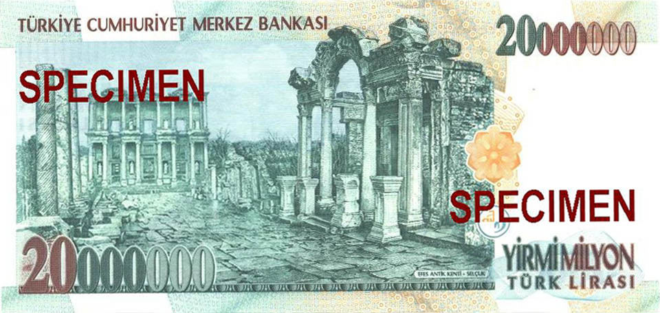
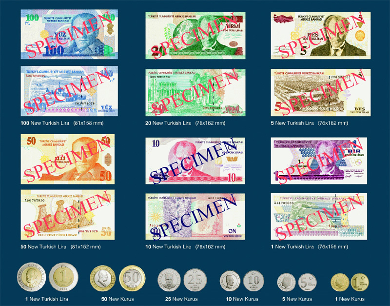
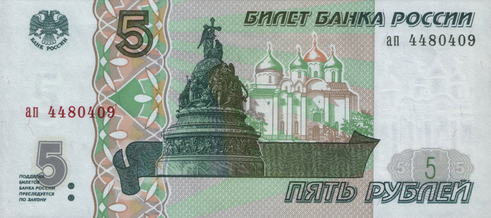

# Деноминация

**Деноминация** — это изменение масштаба денежных единиц, когда старые деньги обменивают на новые по **строго установленному соотношению**. Чаще всего это выглядит как «убирание нулей»: например, 1000 старых единиц становятся 1 новой. Через тему деноминации удобно понять, чем отличаются [Инфляция, дефляция и нулевая инфляция](./inflyatsiya_deflyatsiya_i_nulevaya_inflyatsiya.md), [Девальвация](./devalvatsiya.md), [Центральный банк](./tsentralnyy_bank.md) и [Российский рубль](./rossiyskiy_rubl.md).

Деноминация важна для мировой экономики не потому, что сама по себе делает страну богаче, а потому, что показывает состояние денежной системы. Обычно к ней приходят после периода высокой инфляции или очень больших чисел в ценниках, расчетах и отчетности.

---

## Содержание

- [Что такое деноминация](#what-is)
- [Чем деноминация отличается от девальвации и инфляции](#difference)
- [Зачем проводят деноминацию](#why)
- [Как она проходит](#how)
- [Примеры из разных стран](#examples)
- [Как это выглядит на иллюстрациях](#images)
- [На пальцах](#simple)
- [Почему это важно школьнику](#school)
- [Самое главное](#main) 

---

## Что такое деноминация

Если говорить совсем просто, деноминация — это **пересчет денег в другом масштабе**. Количество нулей уменьшается, но смысл цен сохраняется. Если хлеб стоил 10 000 старых единиц, а после реформы стал стоить 10 новых, это не значит, что хлеб внезапно подешевел в тысячу раз. Это значит, что деньги просто стали записывать иначе.

Поэтому деноминация не делает людей автоматически богаче или беднее. Она меняет **форму записи цен**, зарплат, сбережений и долгов. Именно из-за этого ее иногда путают с [Девальвация](./devalvatsiya.md), но это разные вещи.

Обычно деноминацию проводит государство вместе с [Центральный банк](./tsentralnyy_bank.md). Оно заранее объявляет правило обмена, сроки замены старых денег и период, когда старые и новые купюры могут ходить одновременно. 

---

## Чем деноминация отличается от девальвации и инфляции

| Понятие | Что происходит | Главный смысл |
|---|---|---|
| Деноминация | меняется масштаб денежных единиц | «убирают нули», упрощают расчеты |
| [Девальвация](devalvatsiya.md) | валюта слабеет по отношению к другим валютам | меняется внешний курс денег |
| [Инфляция](inflyatsiya_deflyatsiya_i_nulevaya_inflyatsiya.md) | в стране растет общий уровень цен | деньги теряют покупательную способность |

Если страна пережила сильную [Инфляция, дефляция и нулевая инфляция](./inflyatsiya_deflyatsiya_i_nulevaya_inflyatsiya.md), в обращении могут появиться слишком большие числа: тысячи, миллионы и даже миллиарды на ценниках. Тогда деноминация делает деньги удобнее в использовании. Но она **не лечит инфляцию сама по себе**.

Поэтому правильная логика такая: сначала в стране стараются навести порядок с ценами и денежной системой, а уже потом могут провести деноминацию как техническую и психологическую реформу. 

---

## Зачем проводят деноминацию

У деноминации обычно несколько причин.

- Чтобы сделать расчеты проще и понятнее.
- Чтобы сократить слишком длинные числа в кассах, бухгалтерии и чеках.
- Чтобы упростить выпуск новых купюр, монет, ценников и документов.
- Чтобы показать: период очень высокой инфляции остался позади.

Но важно помнить: деноминация — это не волшебная кнопка. Если в экономике продолжаются проблемы, одних новых купюр недостаточно. Страна не станет богаче только потому, что вместо 100 000 старых единиц теперь пишет 100 новых.

Именно поэтому тему деноминации полезно читать рядом со статьями [Инфляция, дефляция и нулевая инфляция](./inflyatsiya_deflyatsiya_i_nulevaya_inflyatsiya.md) и [Девальвация](./devalvatsiya.md): они объясняют, **почему вообще появляются лишние нули** и почему иногда государство решает от них избавиться. 

---

## Как она проходит

Деноминация почти никогда не происходит мгновенно «за одну ночь». Обычно процесс делят на несколько шагов.

1. Государство и [центральный банк](tsentralnyy_bank.md) объявляют правило обмена. Например: 1000 старых единиц = 1 новая.
2. Печатаются новые купюры и чеканятся новые монеты.
3. Некоторое время старые и новые деньги могут использоваться параллельно.
4. Магазины, банки и предприятия пересчитывают цены, зарплаты, тарифы и документы.
5. Старые деньги постепенно перестают быть законным платежным средством.

В хорошие реформы стараются заложить главный принцип: **человек не должен потерять деньги только из-за самого обмена**. Если у него было 500 000 старых единиц, после деноминации он должен получить эквивалентную сумму в новых деньгах по объявленному правилу.

Именно поэтому деноминация тесно связана с доверием к денежной системе. Если люди не понимают реформу, они начинают нервничать. А если правила ясные и переход проходит спокойно, новая запись денег быстрее становится привычной. 

---

## Примеры из разных стран

Деноминация проводилась в разных странах и в разные эпохи. Ниже — три понятных примера.

### Россия

В России с 1 января 1998 года прошла деноминация рубля: **1000 старых рублей стали 1 новым рублем**. Старые и новые деньги некоторое время обращались одновременно, чтобы переход был более плавным. Эту тему особенно полезно связывать со статьей [Российский рубль](./rossiyskiy_rubl.md).

### Польша

В Польше деноминация злотого прошла в 1995 году по правилу **10 000 старых злотых = 1 новый злотый**. Реформа стала возможной после того, как чрезмерная инфляция уже была взята под контроль.

### Турция

В Турции с 1 января 2005 года ввели **новую турецкую лиру**. Старый 1 000 000 турецких лир соответствовал 1 новой турецкой лире. Это хороший пример того, как деноминация убирает очень большие числа и делает деньги удобнее в обращении.

Эти случаи показывают общую идею: деноминация — это прежде всего **упорядочивание денежной записи**, а не автоматическое экономическое чудо. 

---

## Как это выглядит на иллюстрациях

*Старая банкнота в 20 000 000 турецких лир. Такой номинал хорошо показывает, почему стране может понадобиться деноминация: расчеты и ценники становятся неудобными. Источник визуала: Wikimedia Commons, автор — Turkish Central Bank, статус — public domain; файл описан как банкнота, замененная в 2005 году похожей по дизайну купюрой в 20 New Turkish Lira.*

*Новая турецкая лира после реформы 2005 года. На изображении видны уже «укороченные» номиналы без лишних нулей. Источник визуала: Wikimedia Commons, исходный загрузчик Mu5ti на English Wikipedia, статус — public domain в Турции.*

*Деноминированная российская банкнота 5 рублей образца 1997 года, введенная с 1 января 1998 года. Источник визуала: Wikimedia Commons, Central Bank of Russian Federation / скан и обработка Victor Vizu; статус — public domain как форма денег согласно статье 1259 ГК РФ.*

Эти изображения помогают увидеть ключевую мысль: после деноминации деньги выглядят «проще», потому что число нулей уменьшается. Но за этим внешним упрощением стоит большая организационная работа банков, государства и магазинов. 

---

## На пальцах

Представьте, что в школьной столовой всё измеряют в очень маленьких жетонах. Булочка стоит 10 000 жетонов, сок — 25 000, обед — 120 000. Считать неудобно, писать долго, легко запутаться.

Тогда школа решает: отныне **1000 старых жетонов = 1 новый жетон**. Булочка теперь стоит 10 новых жетонов, сок — 25, обед — 120. Продукты не изменились, просто запись стала удобнее.

Вот это и есть деноминация: **не изменение цен по сути, а изменение масштаба счета**. 

---

## Почему это важно школьнику

Во-первых, деноминация помогает не путать важные экономические термины. Многие слышали слова «девальвация», «инфляция», «реформа денег», но не всегда понимают, что это разные процессы.

Во-вторых, через деноминацию удобно увидеть, что деньги — это не только бумажки и монеты, но и система правил. Если государство меняет масштаб денежных единиц, это затрагивает цены, зарплаты, банковские счета, чеки и документы.

В-третьих, тема деноминации хорошо показывает, почему в экономике важны доверие и понятность. Даже техническая реформа должна быть организована так, чтобы люди не боялись потерять свои деньги и не путались в новых ценах. 

---

## Самое главное

Деноминация — это изменение масштаба денежных единиц, при котором старые деньги обменивают на новые по фиксированному соотношению. Чаще всего это выглядит как «убирание нулей».

Деноминация не равна [Девальвация](./devalvatsiya.md) и не равна [Инфляция, дефляция и нулевая инфляция](./inflyatsiya_deflyatsiya_i_nulevaya_inflyatsiya.md). Она не делает страну автоматически богаче, а в первую очередь упрощает расчеты и делает денежную систему более удобной.

Лучше всего понимать деноминацию как реформу записи денег: суммы становятся короче и понятнее, но реальный смысл цен, зарплат и сбережений должен сохраняться. 

---

***Автор:** Лапенко Карина @Dhelprat*
***GitHub:*** *[Dhelprat](https://github.com/dhelprat)*  
***Использованные нейросети и ресурсы:*** *ChatGPT 5.4; Bank of Russia Annual Report 1998 и Annual Report 1997; Narodowy Bank Polski, Bankoteka; Central Bank of the Republic of Türkiye, Series 1 Banknotes (E1); Wikimedia Commons (локальные свободно лицензированные визуалы); материалы курса по оформлению статей в GFM.*
