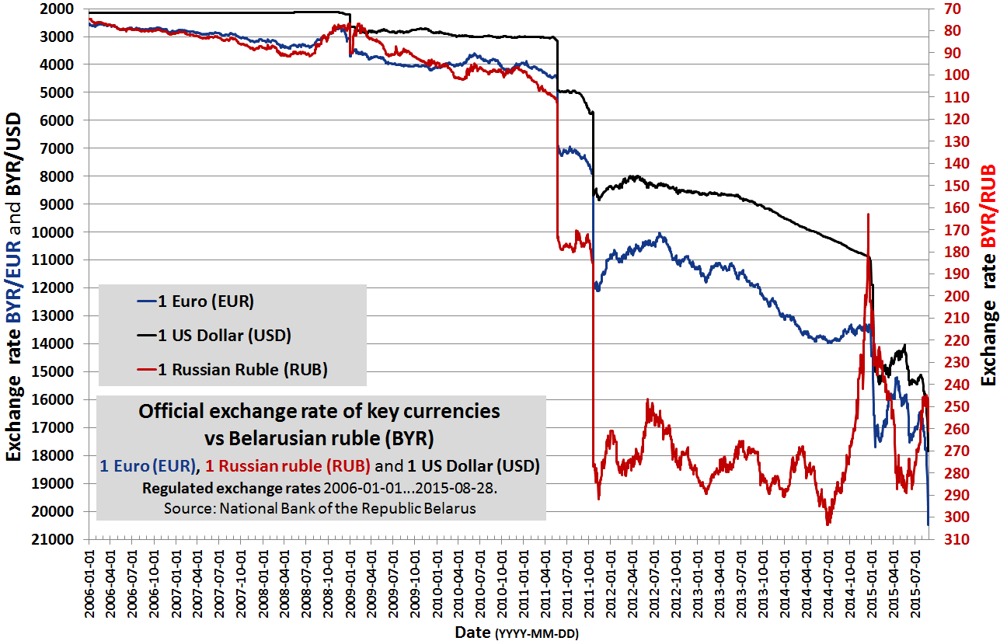

# [Девальвация](valyutnyy_kurs.md)

**Девальвация** — это снижение стоимости национальной валюты по отношению к иностранным валютам. Через тему девальвации удобно понять, как связаны [Валютный курс](./valyutnyy_kurs.md), [Центральный банк](./tsentralnyy_bank.md), [Инфляция, дефляция и нулевая инфляция](./inflyatsiya_deflyatsiya_i_nulevaya_inflyatsiya.md), [Доллар США](./dollar_ssha.md), [Китайский юань](./kitayskiy_yuan.md) и [Российский рубль](./rossiyskiy_rubl.md).

Девальвация важна для мировой экономики, потому что она влияет на цены импортных товаров, на [экспорт](aziatskie_tigry.md), на [доверие](../../../1.2_natural_sciences/neurobiology_for_teens/articles/17_hugs_oxytocin.md) к [деньгам](../../../8.2_future/choosing_a_career_path/articles/salary.md) и на повседневную [жизнь](../../../1.2_natural_sciences/physics_in_everyday_life/Q1751973.md) людей. Когда национальная [валюта](../../../6.2_money_and_literacy/how_to_save_for_goal/articles/money.md) резко слабеет, это чувствуют не только банки и компании, но и обычные семьи: дорожают поездки, импортная [техника](../../../1.2_natural_sciences/physics_in_everyday_life/Q133673.md), лекарства, сырье и многие товары в магазинах.

---

## Содержание

- [Что такое девальвация](#what-is)
- [Девальвация, depreciation и деноминация](#terms)
- [Зачем ее проводят](#why)
- [Что происходит после девальвации](#effects)
- [Как это выглядит на графиках](#charts)
- [На пальцах](#simple)
- [Почему это важно школьнику](#school)
- [Самое главное](#main) 

---

## Что такое девальвация

Если говорить совсем просто, девальвация означает, что национальная валюта стала **дешевле** по сравнению с другими валютами. Например, если раньше за 1 [Доллар США](./dollar_ssha.md) нужно было отдать 70 единиц местной валюты, а потом 90, значит местная валюта ослабла.

Для экономики это важно по двум причинам:

- импортные товары становятся дороже;
- товары страны за границей могут стать дешевле и привлекательнее для покупателей.

Чаще всего девальвацию обсуждают рядом со статьями [Валютный курс](./valyutnyy_kurs.md) и [Центральный банк](./tsentralnyy_bank.md), потому что именно через курс валюты видно, насколько подорожали [доллар](dollar_ssha.md), [евро](rezervnaya_valyuta.md) или другие [деньги](../../../2.1_society/cause_and_effect_relationships/articles/economic_chains.md) по отношению к национальной валюте.

Важно [помнить](../../../4.1_rules_of_study/how_to_memorize/articles/pamyat.md): девальвация — это не просто «[плохие новости](../../../3.1_healthy lifestyle/vrednye_privychki/articles/Doomscrolling.md) про деньги». Иногда власти идут на нее сознательно, если хотят поддержать экспорт или приспособиться к экономическим трудностям. Но почти всегда у такого шага есть и неприятные последствия. 

---

## Девальвация, depreciation и [деноминация](denominatsiya.md)

В повседневной речи словом «девальвация» часто называют **любое** сильное падение курса. Но в строгом экономическом смысле есть важная разница.

| Понятие | Что это значит | Где чаще используется |
|---|---|---|
| Девальвация | официальное снижение курса валюты государством или центральным банком | при фиксированном или жестко управляемом курсе |
| Depreciation (обесценивание) | падение курса под действием рынка | при плавающем курсе |
| [Деноминация](denominatsiya.md) | изменение масштаба денежных единиц, когда «убирают нули» | при денежной реформе |

Поэтому [Деноминация](./denominatsiya.md) и девальвация — это не одно и то же. При деноминации деньги пересчитывают в другом масштабе, но это само по себе не делает страну богаче. А девальвация меняет соотношение валют и сразу влияет на импорт, экспорт и цены.

[Связь](../../../1.2_natural_sciences/physics_in_everyday_life/Q12969754.md) с [Инфляция, дефляция и нулевая инфляция](./inflyatsiya_deflyatsiya_i_nulevaya_inflyatsiya.md) тоже очень тесная: после сильного ослабления валюты в страну часто приходит новая [волна](../../../1.2_natural_sciences/physics_in_everyday_life/Q1146001.md) роста цен. 

---

## Зачем ее проводят

Причины девальвации могут быть разными. Иногда это [решение](../../../2.1_society/cause_and_effect_relationships/articles/personal_choice.md) властей, а иногда — вынужденный [шаг](../../../1.2_natural_sciences/physics_in_everyday_life/Q36253.md), когда удерживать старый курс уже слишком трудно.

Основные причины такие:

- у страны не хватает иностранной валюты для поддержки прежнего курса;
- импорт слишком велик, а экспорт недостаточен;
- государство хочет сделать свои товары дешевле для внешних покупателей;
- падают [доходы](../../../6.2_money_and_finance/personal_budget/index.md) от сырья, туризма или внешней торговли;
- начинается экономический [кризис](../../../2.1_society/cause_and_effect_relationships/articles/economic_chains.md) и растет недоверие к национальной валюте.

На практике [логика](../../../2.1_society/cause_and_effect_relationships/articles/causality_base.md) часто выглядит так: если валюта становится дешевле, экспортерам легче продавать товары за границу, потому что их продукция в пересчете на иностранную валюту может стоить меньше. Но это не волшебная кнопка. Девальвация не решает все проблемы автоматически и может дать лишь временную передышку.

Именно поэтому тема девальвации связана не только с курсом, но и с темами [Нефть в мировой экономике](./neft_v_mirovoy_ekonomike.md), [Глобализация](./globalizatsiya.md) и [Развитые и развивающиеся страны](./razvitye_i_razvivayushchiesya_strany.md): чем сильнее страна зависит от импорта, долгов или сырьевого экспорта, тем болезненнее может быть падение курса. 

---

## [Что происходит](../../../5.1_technology_and_digital_literacy/how_internet_works/articles/web_basics/what_happens.md) после девальвации

После девальвации жизнь экономики почти никогда не остается прежней.

**Что может стать плюсом:**

- экспортерам иногда легче конкурировать на внешних рынках;
- импорт частично сокращается, потому что он дорожает;
- государству бывает проще уменьшить [давление](../../../1.1_structure_of_the_world/matter/articles/07_gases.md) на [валютные резервы](tsentralnyy_bank.md).

**Что часто становится минусом:**

- дорожают импортные товары и комплектующие;
- растут цены внутри страны, особенно если экономика зависит от импорта;
- тяжелее становится обслуживать внешние долги в иностранной валюте;
- люди начинают сильнее нервничать за свои [сбережения](../../../6.1_Independent_living_and_daily_living_skills/reasonable_spending/articles/savings.md).

Особенно важно понять, что девальвация не живет отдельно от [Инфляция, дефляция и нулевая инфляция](./inflyatsiya_deflyatsiya_i_nulevaya_inflyatsiya.md). Если страна много покупает за рубежом лекарства, оборудование, технику, детали или [топливо](neft_v_mirovoy_ekonomike.md), ослабление валюты довольно быстро передается в цены. Поэтому девальвация часто ощущается не в финансовых новостях, а на кассе в магазине.

Через эту тему удобно переходить и к статье [Российский рубль](./rossiyskiy_rubl.md): именно на примере рубля школьнику легко увидеть, как изменение курса связано с импортом, экспортом, нефтью и ожиданиями людей. 

---

## Как это выглядит на графиках

Ниже — три примера, которые помогают увидеть тему глазами.

*Официальный курс белорусского рубля к доллару США, евро и российскому рублю. На графике хорошо видны резкие скачки 2011 и 2014–2015 годов; в описании файла на Wikimedia Commons они прямо названы сильными девальвациями. [Источник](../../../5.1_technology_and_digital_literacy/information and media literacy/дезинформация_и_фейки.md) визуала: Wikimedia Commons, [автор](../../../4.2_thinking_and_working_information/how_to_search_information/articles/copypaste.md) Paju, [лицензия](../../../4.2_thinking_and_working_information/how_to_search_information/articles/copyright.md) [CC BY-SA](../../../4.2_thinking_and_working_information/how_to_search_information/articles/copyright.md) 4.0; график построен по данным Национального банка Республики Беларусь.*

Этот график полезен тем, что показывает именно **официальный курс**. Здесь слово «девальвация» используется в строгом смысле: курс резко меняется решением денежной власти или в условиях, когда прежний официальный курс уже невозможно удерживать.

*Курс доллара США к российскому рублю. Источник визуала: Wikimedia Commons, автор Wikideas1, [статус](../../../5.1_technology_and_digital_literacy/how_internet_works/articles/http_https/http_https.md) — [CC0](../../../4.2_thinking_and_working_information/how_to_search_information/articles/copyright.md) / [public domain](../../../4.2_thinking_and_working_information/how_to_search_information/articles/copyright.md); график основан на исторических данных Investing.com.*

На графике рубля видно, как [рынок](../../../2.1_society/cause_and_effect_relationships/articles/economic_chains.md) может быстро менять оценку валюты. В строгом смысле в новостях здесь часто правильнее говорить не только о девальвации, но и об **обесценивании валюты на рынке**. Однако для школьного объяснения это хороший пример того, как ослабление [денег](../../../8.2_future/choosing_a_career_path/articles/salary.md) сразу становится заметным на графике курса.

*Курс доллара США к турецкой лире. Источник визуала: Wikimedia Commons, автор Wikideas1, статус — public domain; график основан на исторических данных Investing.com.*

Турецкая [лира](denominatsiya.md) показывает еще одну важную мысль: если валюта слабеет долго и сильно, люди начинают внимательнее следить за курсом, ценами и решениями [Центральный банк](./tsentralnyy_bank.md). Так тема девальвации превращается из «слова из учебника» в повседневную [реальность](../../../1.2_natural_sciences/physics_in_everyday_life/Q140028.md). 

---

## На пальцах

Представьте, что в школе есть жетоны, за которые можно купить обед. Если раньше за один иностранный жетон давали 10 школьных жетонов, а теперь уже 15, значит школьные жетоны подешевели.

Для тех, кто покупает что-то из другой школы, это плохо: теперь им нужно больше своих жетонов. А для тех, кто продает что-то другой школе, это может быть выгодно: их товар становится дешевле для иностранного покупателя.

Примерно так и работает девальвация: своя валюта слабеет, импорт дорожает, а экспорт иногда получает преимущество. 

---

## Почему это важно школьнику

Тема девальвации кажется взрослой, но на самом деле она очень жизненная.

Во-первых, она помогает понять, почему дорожают импортные товары: [смартфоны](../../../1.2_natural_sciences/physics_in_everyday_life/Q170475.md), ноутбуки, лекарства, [одежда](../../../1.2_natural_sciences/physics_in_everyday_life/Q487005.md), комплектующие и даже некоторые [продукты](../../../3.1. healthy lifestyle/Sleep, nutrition, and adolescent energy/articles/healthy_school_snacks.md).

Во-вторых, девальвация показывает, что деньги страны зависят не только от цифр на купюрах, но и от доверия, от торговли, от решений [Центрального банка](./tsentralnyy_bank.md) и от того, сколько страна продает и покупает у мира.

В-третьих, через девальвацию удобно изучать сразу несколько важных тем: [Валютный курс](./valyutnyy_kurs.md), [Инфляция, дефляция и нулевая инфляция](./inflyatsiya_deflyatsiya_i_nulevaya_inflyatsiya.md), [Доллар США](./dollar_ssha.md), [Китайский юань](./kitayskiy_yuan.md) и [Российский рубль](./rossiyskiy_rubl.md). 

---

## Самое главное

Девальвация — это снижение стоимости национальной валюты по отношению к иностранным валютам. В строгом смысле термин особенно важен для фиксированного или жестко управляемого курса, но в повседневной речи им часто называют и любое резкое ослабление денег.

Девальвация может помочь экспорту и снизить давление на валютные резервы, но почти всегда делает импорт дороже и часто подталкивает вверх цены внутри страны.

Именно поэтому тема девальвации помогает понять, как связаны [Валютный курс](./valyutnyy_kurs.md), [Центральный банк](./tsentralnyy_bank.md), [Инфляция, дефляция и нулевая инфляция](./inflyatsiya_deflyatsiya_i_nulevaya_inflyatsiya.md) и жизнь обычных людей. 

---

***Автор:** Лапенко Карина @Dhelprat*
***GitHub:*** *[Dhelprat](https://github.com/dhelprat)*  
***Использованные [нейросети](../../../2.1_society/cause_and_effect_relationships/articles/ai_causality.md) и [ресурсы](../../../2.1_society/cause_and_effect_relationships/articles/ecological_footprint.md):*** *[ChatGPT](../../../7.1_art/modern_technological_art/articles/6.1_prompt_art.md) 5.4; IMF, “EconEd Online: Teacher Guide to Student Interactive” ([определение](../../../1.2_natural_sciences/physics_in_everyday_life/Q29996.md) девальвации при фиксированном курсе); ECB, “Exchange rate pass-through into euro area inflation” и “The transmission of exchange rate changes to euro area inflation”; World Bank, “How exports react to exchange-rate fluctuations, and what [it](../../../8.2_future/choosing_a_career_path/articles/programmer.md) means [for](../../../5.2_cybersecurity/cpp_fundamentals/7_loops.md) businesses”; Wikimedia Commons (локальные свободно лицензированные визуалы); [материалы](../../../1.2_natural_sciences/physics_in_everyday_life/Q487005.md) курса по оформлению статей в GFM.*
