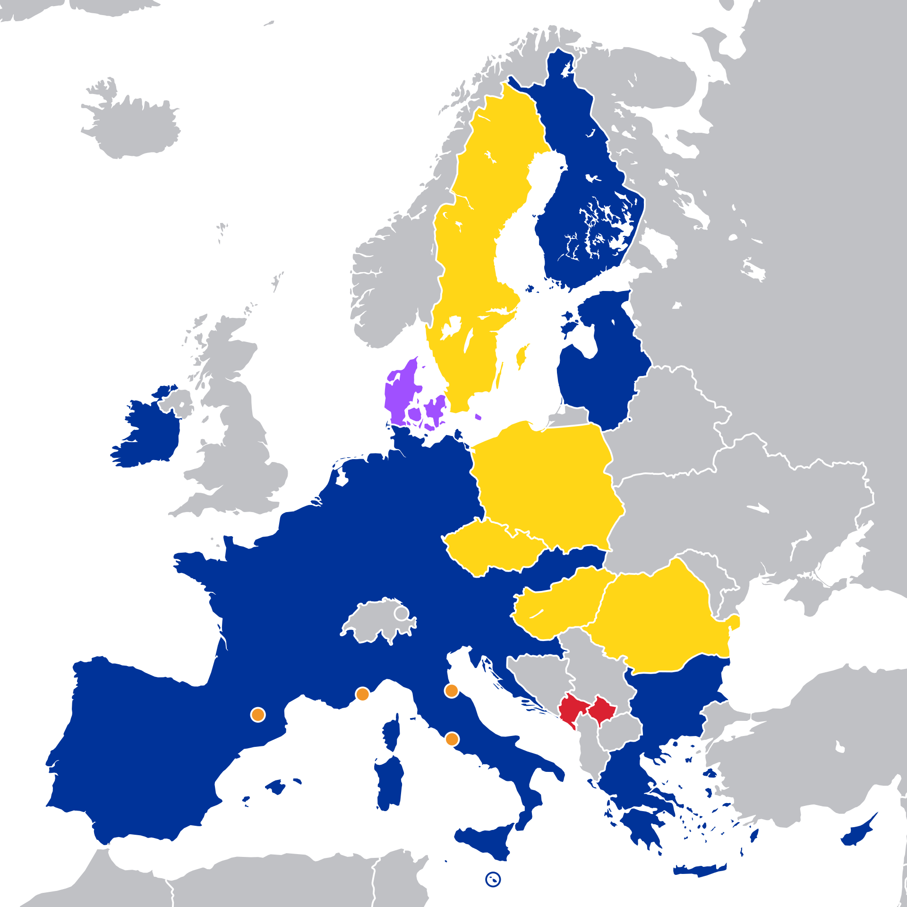
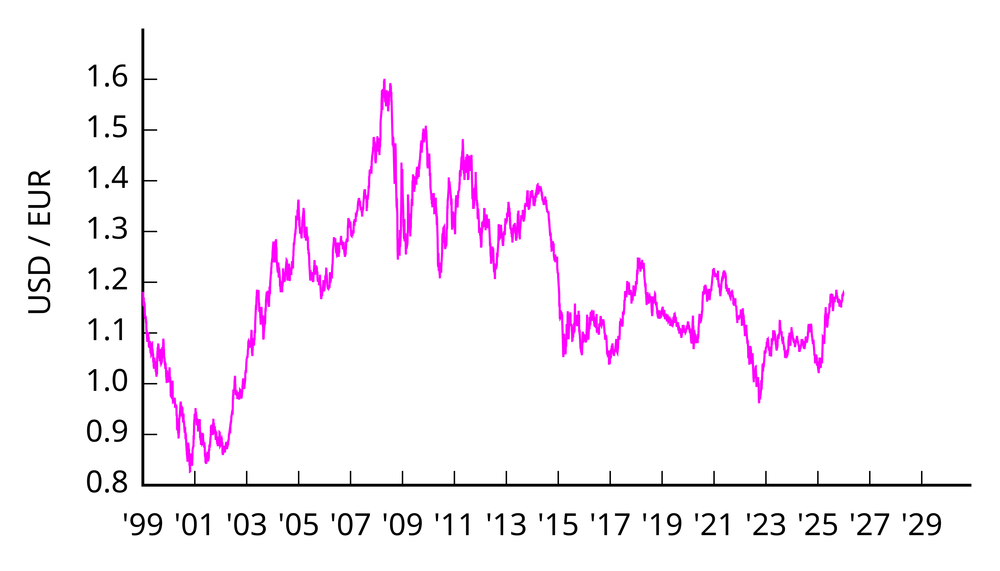

# Евро

**Евро** — это общая валюта части стран [Европейского союза](./evropeyskiy_soyuz.md) и одна из самых важных валют современной мировой экономики. Через тему евро удобно понять сразу несколько больших сюжетов: что такое [еврозона](./evrozona.md), как работает общий [центральный банк](./tsentralnyy_bank.md), почему меняется [валютный курс](./valyutnyy_kurs.md), как валюта становится [резервной валютой](./rezervnaya_valyuta.md) и чем евро отличается от [доллара США](./dollar_ssha.md).

Евро важно не только для Европы. Эта валюта участвует в мировой торговле, используется в международных расчетах и помогает понять, как экономика разных стран может быть связана одной денежной системой.

---

## Содержание

- [Что такое евро](#what-is-euro)
- [Как появился евро](#history)
- [Евро и еврозона](#eurozone)
- [Кто отвечает за евро](#ecb)
- [Евро и валютный курс](#exchange-rate)
- [Евро как резервная валюта](#reserve-currency)
- [Евро и доллар США](#usd)
- [Плюсы и трудности общей валюты](#pros-cons)
- [На пальцах](#simple)
- [Почему это важно школьнику](#school)
- [Самое главное](#main) 

---

## Что такое евро

Евро — это валюта, которой пользуются страны [еврозоны](./evrozona.md). У нее есть международный код **EUR** и знак **€**. Евро делится на 100 евроцентов.

Важно не путать две близкие темы:

| Понятие | Что это значит |
|---|---|
| Евро | сама валюта |
| [Еврозона](evrozona.md) | страны, которые используют евро |
| [Европейский союз](evropeyskiy_soyuz.md) | политическое и экономическое объединение стран Европы |

Не все страны Европейского союза используют евро. Но именно евро стало символом европейской экономической интеграции: несколько государств договорились пользоваться одной валютой вместо разных национальных денег.

Сейчас евро — официальная валюта 21 страны ЕС. Это делает его одной из самых распространенных валют мира и одной из главных тем для разговора о мировой экономике. 

---

## Как появился евро

Евро вводили не в один день и не сразу в привычном для людей виде.

| Год | Что произошло |
|---|---|
| 1999 | евро начал использоваться в безналичных расчетах |
| 2002 | появились банкноты и монеты евро |
| 2026 | евро используют уже 21 страна ЕС |

Сначала евро существовал в банковских переводах, расчетах и документах. Только потом люди начали расплачиваться новыми монетами и купюрами в магазинах.

Такой постепенный запуск был нужен, потому что перейти на одну валюту сразу для многих стран очень сложно: надо перестроить банки, магазины, цены, банкоматы, бухгалтерию и привычки миллионов людей.

История евро тесно связана со статьями [Европейский союз](./evropeyskiy_soyuz.md), [Еврозона](./evrozona.md) и [Центральный банк](./tsentralnyy_bank.md). 

---

## Евро и еврозона

Когда говорят о евро, почти всегда рядом должна стоять статья [Еврозона](./evrozona.md). Евро — это валюта, а еврозона — это группа стран, которые этой валютой пользуются.

*Карта еврозоны. Источник визуала: Wikimedia Commons, автор Ssolbergj; актуальная версия файла обновлена 16 февраля 2026 года пользователем DeKosmopoliet; статус — public domain.*

Общая валюта дает странам несколько преимуществ:

- проще торговать друг с другом;
- не нужно постоянно менять национальные деньги при поездках и расчетах;
- легче сравнивать цены;
- общий рынок работает более связно.

Но общая валюта означает и общую ответственность. Если страны очень отличаются по уровню цен, долговой нагрузке, темпам роста и состоянию бюджета, то одной денежной политикой управлять становится сложнее.

Поэтому евро — это не просто удобные деньги для путешествий, а большой экономический проект, тесно связанный с развитием [Европейского союза](./evropeyskiy_soyuz.md) и вопросами о том, как сочетать интересы разных стран в одной системе. 

---

## Кто отвечает за евро

За устойчивость евро отвечает европейская система центральных банков, а ключевую роль в ней играет Европейский [центральный банк](tsentralnyy_bank.md). Поэтому статья о евро обязательно должна ссылаться на тему [Центральный банк](./tsentralnyy_bank.md).

Центральный банк в такой системе нужен для того, чтобы:

- следить за устойчивостью цен;
- влиять на стоимость кредитов через процентные ставки;
- поддерживать доверие к валюте;
- участвовать в регулировании финансовой системы.

Это особенно важно для общей валюты. Если у нескольких стран одна денежная единица, они уже не могут просто напечатать «свои отдельные деньги» или легко менять собственный курс. Поэтому роль общего центрального банка здесь даже заметнее, чем в обычной национальной валютной системе.

Через эту тему евро напрямую связан и со статьей [Инфляция, дефляция и нулевая инфляция](./inflyatsiya_deflyatsiya_i_nulevaya_inflyatsiya.md), потому что борьба с ростом цен — одна из главных задач денежной политики. 

---

## Евро и валютный курс

Как и любая крупная валюта, евро имеет свой [валютный курс](./valyutnyy_kurs.md). Это значит, что его стоимость по отношению к доллару, фунту, иене, юаню или рублю меняется.

*Курс евро к доллару США с 1999 года. Источник визуала: Wikimedia Commons, автор Monaneko, лицензия CC BY 3.0; график основан на данных Federal Reserve.*

Почему курс евро меняется:

- инвесторы по-разному оценивают состояние экономики Европы и США;
- центральные банки принимают разные решения по ставкам;
- меняются цены на энергию, товары и кредиты;
- влияют кризисы, конфликты и ожидания участников рынка.

Из-за этого евро постоянно сравнивают с [долларом США](./dollar_ssha.md). Но для понимания школьного уровня важно помнить главное: курс валюты — это не «оценка хорошая она или плохая», а результат сложного равновесия между экономикой, политикой и доверием. 

---

## Евро как резервная валюта

Евро важен не только внутри Европы. Он также играет большую роль в мировой финансовой системе как [резервная валюта](./rezervnaya_valyuta.md).

*Структура мировых валютных резервов. Источник визуала: Wikimedia Commons, автор Spitzl, лицензии CC BY-SA 3.0 и GFDL; график обновлен на основе данных IMF COFER.*

Когда центральные банки разных стран держат часть своих запасов в евро, это означает, что они считают эту валюту важной и достаточно надежной. Именно поэтому евро называют второй по значению мировой валютой после доллара.

Для мировой экономики это очень важно. Если крупная валюта широко используется в международных резервах, торговле и кредитовании, она влияет не только на «свою» территорию, но и на правила игры во всем мире.

Поэтому статья о евро естественно связывается не только со статьями [Еврозона](./evrozona.md) и [Европейский союз](./evropeyskiy_soyuz.md), но и с темами [Резервная валюта](./rezervnaya_valyuta.md), [Доллар США](./dollar_ssha.md), [Фунт стерлингов](./funt_sterlingov.md) и [Китайский юань](./kitayskiy_yuan.md). 

---

## Евро и доллар США

Евро часто сравнивают с [долларом США](./dollar_ssha.md), потому что это две самые заметные валюты современного мира.

Между ними есть важная разница:

- [доллар](dollar_ssha.md) связан прежде всего с ролью США в мировой финансовой системе;
- евро опирается на экономику сразу нескольких европейских стран;
- доллар исторически глубже встроен в мировые расчеты за сырье и в международные финансы;
- евро особенно силен в Европе и в соседних с ней регионах, а также важен как [резервная валюта](rezervnaya_valyuta.md).

При этом евро не является «слабой копией» доллара. Это самостоятельная большая валюта с собственной зоной влияния, собственными институтами и собственной логикой развития.

Именно поэтому тема евро помогает понять, что в мире может существовать не одна единственная сильная валюта, а сразу несколько крупных центров финансового влияния. 

---

## Плюсы и трудности общей валюты

Евро часто приводят как пример того, как одна валюта может помочь многим странам, но при этом создать и новые сложности.

**Плюсы евро:**

- проще торговать внутри еврозоны;
- легче путешествовать и сравнивать цены;
- меньше расходов на обмен валют;
- общая валюта усиливает экономическую связность Европы.

**Трудности евро:**

- страны еврозоны отличаются по уровню развития и по устройству экономики;
- одной денежной политикой трудно одинаково удобно управлять сразу для всех;
- во время кризисов не каждая страна может быстро решить свои проблемы через отдельную национальную валюту;
- споры о ставках, долгах и поддержке экономик становятся общими для многих государств сразу.

Именно поэтому евро — очень хорошая тема для связи со статьями [Развитые и развивающиеся страны](./razvitye_i_razvivayushchiesya_strany.md), [Инфляция, дефляция и нулевая инфляция](./inflyatsiya_deflyatsiya_i_nulevaya_inflyatsiya.md) и [Центральный банк](./tsentralnyy_bank.md). 

---

## На пальцах

Представьте, что раньше у каждого класса в школе были свои жетоны. Чтобы купить что-то у другого класса, приходилось все время менять одни жетоны на другие.

А потом несколько классов договорились пользоваться одной общей школьной валютой. С одной стороны, стало намного удобнее покупать, продавать и сравнивать цены. С другой стороны, теперь всем приходится договариваться об общих правилах: сколько жетонов выпускать, как бороться с ростом цен и что делать, если у одного класса дела идут хуже, чем у других.

Примерно так и работает евро: он упрощает жизнь внутри общего пространства, но требует общей экономической дисциплины. 

---

## Почему это важно школьнику

Тема евро кажется взрослой, но на самом деле она очень жизненная.

Во-первых, евро помогает понять, как работает Европа как единое экономическое пространство. Это полезно, даже если человек просто читает новости.

Во-вторых, через евро легко увидеть, как деньги связаны с путешествиями, онлайн-покупками, стоимостью товаров и курсами обмена.

В-третьих, евро — отличный пример того, что валюта — это не просто бумажки и монеты, а часть большой системы, где важны доверие, правила, банки, политика и международная торговля.

Через эту статью удобно переходить к темам [Еврозона](./evrozona.md), [Валютный курс](./valyutnyy_kurs.md), [Резервная валюта](./rezervnaya_valyuta.md), [Доллар США](./dollar_ssha.md) и [Центральный банк](./tsentralnyy_bank.md). 

---

## Самое главное

Евро — это общая валюта части стран Европейского союза и одна из главных валют мировой экономики. Он важен не только потому, что им пользуются миллионы людей, но и потому, что евро участвует в мировой торговле, международных расчетах и валютных резервах государств.

Через тему евро хорошо видно, как тесно связаны [Европейский союз](./evropeyskiy_soyuz.md), [Еврозона](./evrozona.md), [Центральный банк](./tsentralnyy_bank.md), [Валютный курс](./valyutnyy_kurs.md) и [Резервная валюта](./rezervnaya_valyuta.md).

Евро — это не просто деньги для Европы, а один из важнейших инструментов современной мировой экономики. 

---

***Автор:** Лапенко Карина @Dhelprat*
***GitHub:*** *[Dhelprat](https://github.com/dhelprat)*
***Использованные нейросети и ресурсы:*** *ChatGPT 5.4; European Union, “Countries using the euro”; European Union, “The euro internationally”; European Central Bank, “Initial changeover (2002)” и “The international role of the euro” (2025); IMF COFER; Wikimedia Commons (локальные свободно лицензированные визуалы); материалы курса по оформлению статей в GFM.*
