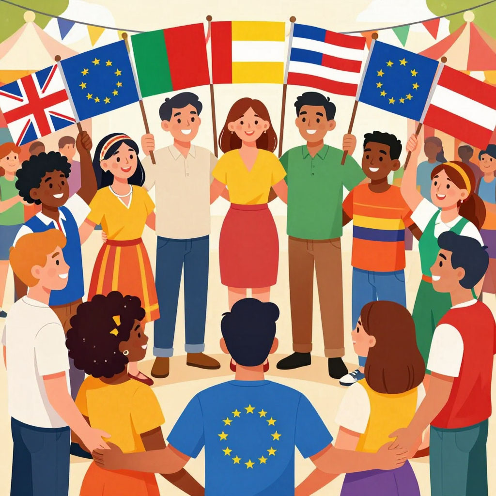
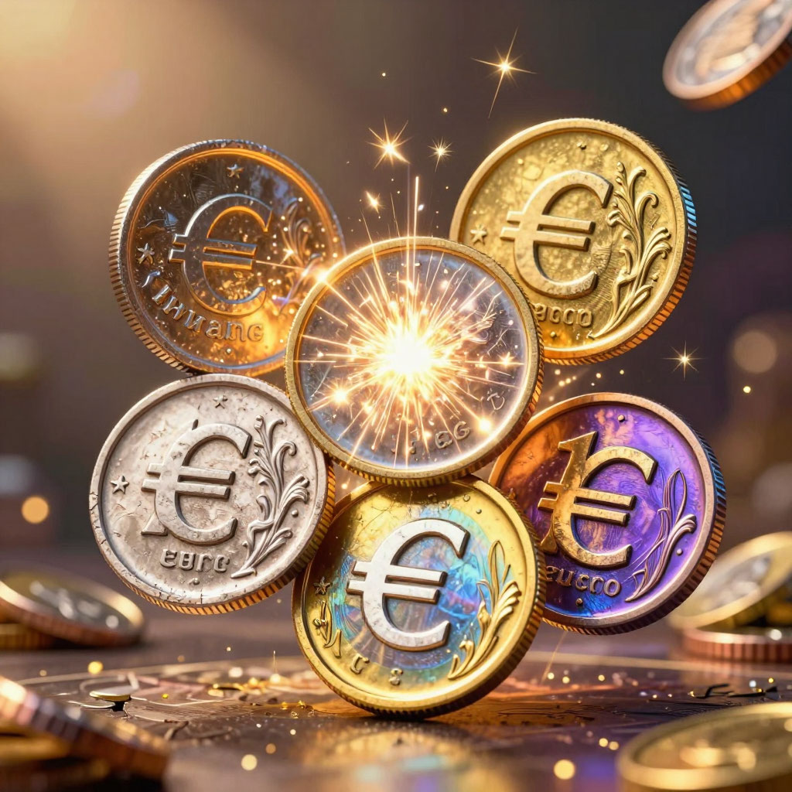

# Европейский союз

## Как 27 стран научились жить вместе

---
## Содержание

- [Введение: Что такое Европейский союз?](#intro)
- [Как всё начиналось: уголь и сталь вместо войны](#history)
- [От шестёрки к двадцати семи](#expansion)
- [Как устроен Евросоюз](#institutions)
- [Что даёт членство в ЕС?](#benefits)
- [Экономика Европейского союза](#economy)
- [ЕС и остальной мир](#world)
- [Узкие места европейской торговли](#bottlenecks)
- [Проблемы Евросоюза](#problems)
- [Почему это важно школьнику](#school)
- [Будущее ЕС: что дальше?](#future)
- [На пальцах: главное о ЕС](#simple)
- [Интересные факты о Евросоюзе](#facts)
- [Заключение](#main)

---

## Введение: Что такое Европейский союз?

Представь, что 27 стран вдруг решили объединиться. Они убрали границы, сделали общие деньги, придумали единые законы и даже выбрали общий парламент. При этом каждая страна осталась сама собой — со своим языком, президентом, традициями. Звучит как фантастика? А в Европе это работает уже почти 70 лет!

**Европейский союз (ЕС)** — это уникальное объединение стран, которые договорились жить по общим правилам, чтобы вместе было лучше, чем порознь. Это не Соединённые Штаты Европы (как хотели некоторые мечтатели), но и не просто клуб по интересам. Это что-то среднее — **"семья народов"**, как говорят сами европейцы.

Сегодня в ЕС входят 27 стран с населением почти 450 миллионов человек. Это третья по величине экономика мира после США и Китая. Но главное — это самый успешный эксперимент в истории по добровольному объединению государств.

---

## Как всё начиналось: уголь и сталь вместо войны

### Послевоенное пепелище

1945 год. Вторая мировая война закончилась. Европа лежит в руинах. Миллионы погибших, разрушенные города, уничтоженные заводы. Франция и Германия — давние враги, которые воевали три раза за 70 лет, — снова смотрят друг на друга с подозрением.

Как сделать так, чтобы война больше никогда не повторилась? Этот вопрос мучил европейских политиков.

### Идея Монне и Шумана

Французский экономист Жан Монне и министр иностранных дел Франции Робер Шуман придумали гениальный ход: "Давайте объединим уголь и сталь Франции и Германии. Без угля и стали нельзя сделать пушки. Если производство будет общим, воевать друг с другом станет невозможно".

9 мая 1950 года Шуман объявил о своём плане. Эту дату теперь считают днём рождения Евросоюза.

### Европейское объединение угля и стали

В 1951 году шесть стран — Франция, Германия, Италия, Бельгия, Нидерланды, Люксембург — подписали договор о создании **Европейского объединения угля и стали**. Они договорились вместе добывать уголь, вместе плавить сталь, вместе устанавливать цены.

Это был гениальный ход: экономика объединила то, что политика разделяла. Воевать с соседом, от которого зависит твоя сталь, — невозможно.

---

## От шестёрки к двадцати семи

### 1957 год: Римский договор

Шестёрка решила не останавливаться на угле и стали. В 1957 году в Риме подписали договор о создании **Европейского экономического сообщества (ЕЭС)**. Цель — **общий рынок**, где товары, услуги, люди и деньги могут свободно перемещаться между странами.

### 1973 год: первое расширение

К клубу присоединились Великобритания, Ирландия и Дания. Британия долго сомневалась, но поняла: быть одной скучно и невыгодно.

### 1980-е: южное расширение

Греция (1981), Испания и Португалия (1986) вступили в сообщество. Для них это был способ закрепить демократию после долгих лет диктатуры.

### 1992 год: Маастрихтский договор

Самый важный шаг. В голландском городе Маастрихт подписали договор о создании **Европейского союза**. Появились:
- Единое гражданство (ты гражданин своей страны и ЕС одновременно)
- Общая внешняя политика
- План введения единой валюты — **[евро](./evro.md)**

### 1995 год: нейтральные страны

Австрия, Финляндия, Швеция — богатые нейтральные страны, которые раньше боялись вступать в блоки, решили, что в ЕС безопаснее.

### 2004 год: великое расширение

Сразу 10 стран вступили в ЕС — в основном бывшие социалистические страны Восточной Европы: Польша, Чехия, Венгрия, Словакия, Словения, Литва, Латвия, Эстония, а также Кипр и Мальта. Это было историческое воссоединение Европы после падения "железного занавеса".

### 2007-2013: финальные штрихи

Болгария и Румыния (2007), Хорватия (2013) — последние на сегодня члены.

### 2020 год: первый выход

Великобритания вышла из ЕС — это назвали **Брекзит**. Впервые страна покинула союз.

---

## Как устроен Евросоюз

Управлять 27 странами — та ещё задача. ЕС придумал сложную систему **наднациональных институтов**, где у каждой страны есть голос, но решения принимаются сообща.

### Европейская комиссия — "правительство"

Это команда из 27 комиссаров (по одному от каждой страны). Они предлагают новые законы, следят, чтобы все выполняли правила, управляют бюджетом.

### Европейский парламент — "голос народа"

Депутатов выбирают граждане всех стран ЕС раз в 5 лет. 705 депутатов заседают в Страсбурге и Брюсселе. Они утверждают законы и бюджет.

### Совет Европейского союза — "голос стран"

Там заседают министры стран ЕС. Если обсуждают сельское хозяйство — приезжают министры сельского хозяйства. Если финансы — министры финансов.

### Европейский совет — "вожди"

Это встречи лидеров всех стран (президентов и премьер-министров). Они определяют главные направления развития.

### Суд ЕС — следит за законами

Следит, чтобы все страны соблюдали правила. Может оштрафовать страну, если она нарушает законы ЕС.

### Европейский центральный банк

Управляет **[евро](./evro.md)** и находится во Франкфурте. Это один из ключевых **[центральных банков](./tsentralnyy_bank.md)** мира.

---

## Что даёт членство в ЕС?

### **На пальцах:** ЕС как клуб друзей

Представь, что ты вступаешь в крутой клуб. В клубе есть правила, но зато:
- Можно свободно ходить в гости ко всем членам клуба
- Можно пользоваться общим бассейном и тренажёркой
- Если кто-то нападает на членов клуба, все вступаются
- У клуба общая касса, откуда дают деньги тем, у кого временно туго

Примерно так работает и ЕС.

### Свобода передвижения

Главное достижение — **Шенгенская зона**. 26 стран (не все в ЕС, но большинство) отменили границы. Можно ехать из Парижа в Берлин, из Берлина в Варшаву, из Варшавы в Прагу — и ни разу не показать паспорт!

400 миллионов человек могут свободно пересекать границы, работать, учиться, жить в любой стране ЕС.

### Единый рынок

Товары тоже перемещаются свободно. Немецкие машины, французское вино, итальянская обувь, польская мебель — всё это можно продавать по всему ЕС без пошлин и лишних проверок. Это и есть **общий рынок**, ради которого всё затевалось.

### Единая валюта (для большинства)

20 стран ввели **[евро](./evro.md)** и образовали **[еврозону](./evrozona.md)**. Больше не нужно менять деньги, путешествуя по Европе.

### Деньги для бедных регионов

ЕС перераспределяет деньги: богатые регионы платят больше, бедные получают помощь. Например, Польша за 20 лет членства получила больше 200 миллиардов [евро](evro.md) на дороги, мосты, школы.

### Сила голоса

Маленькая страна в одиночку мало что значит в мире. А 27 стран вместе — сила. ЕС договаривается о **торговле** с США и Китаем, защищает окружающую среду, борется с изменением климата.

---

## Экономика Европейского союза

ЕС — это экономический гигант. Вот несколько цифр:

- **ВВП**: около 16 триллионов евро (третье место в мире)
- **Население**: 447 миллионов человек
- **Торговля**: ЕС — крупнейший экспортёр и импортёр в мире
- **Валюта**: евро — вторая резервная валюта планеты

### Торговые партнёры

ЕС торгует со всем миром, но особенно активно с:
- США
- Китаем
- Великобританией (несмотря на Брекзит)
- Швейцарией
- Россией (до 2022 года)

### Место в мировой экономике

ЕС — один из центров **[глобализации](./globalizatsiya.md)**. Европейские компании работают по всему миру, а европейские стандарты часто становятся мировыми.

---

## ЕС и остальной мир

### Развитые и развивающиеся страны

Внутри самого ЕС есть и **[развитые](./razvitye_i_razvivayushchiesya_strany.md)**, и **[развивающиеся страны](./razvitye_i_razvivayushchiesya_strany.md)**. Германия, Франция, Нидерланды — это богатые, развитые экономики. А Болгария, Румыния, [страны Балтии](../../history_of_russia_and_nearest_countries/articles/Baltic_states.md) — догоняющие, хотя быстро растут.

ЕС помогает бедным странам не только внутри союза, но и за его пределами. Это называется "политика развития".

### Отношения с соседями

У ЕС есть программа **"Восточное партнёрство"** для стран бывшего [СССР](../../history_of_russia_and_nearest_countries/articles/USSR.md) (Украина, Молдова, Грузия, Азербайджан, Армения, Беларусь) и **"Средиземноморский союз"** для стран Северной Африки и Ближнего Востока.

### Глобальное влияние

ЕС влияет на весь мир через:
- **Торговые соглашения** (договаривается о правилах торговли)
- **Климатическую политику** (европейские экологические стандарты часто копируют другие страны)
- **Финансовую помощь** (ЕС — крупнейший донор помощи бедным странам)

---

## Узкие места европейской торговли

Для своей торговли ЕС активно использует важнейшие мировые транспортные коридоры.

### Суэцкий канал

Огромная часть товаров из Азии поступает в Европу через **[Суэцкий канал](./suetskiy_kanal.md)**. Это короткий путь из Индийского океана в Средиземное море. Если бы не канал, кораблям пришлось бы огибать всю Африку!

### Босфор и Дарданеллы

Черноморские страны (Румыния, Болгария) и другие государства отправляют свои товары через проливы **[Босфор и Дарданеллы](./bosfor_i_dardanelly.md)**. Это ворота из Чёрного моря в Средиземное.

### Почему это важно

Любые проблемы на этих маршрутах — заторы, конфликты, аварии — сразу сказываются на европейской экономике. Цены растут, товаров не хватает.

---

## Проблемы Евросоюза

### Бюрократия

ЕС создаёт горы бумаг. Чтобы что-то изменить, нужно пройти 100 кругов ада. Брюссельские чиновники часто далеки от реальной жизни.

### Долговой кризис

В 2010-х годах Греция чуть не обанкротилась. ЕС пришлось спасать Грецию, давать кредиты, но требовать жёсткой экономии.

### Миграционный кризис

В 2015 году в Европу хлынули миллионы беженцев. Страны не могли договориться, кто будет их принимать. Границы временно вернули.

### Раскол между богатыми и бедными

Германия и Франция — локомотивы ЕС. А Греция, Болгария, Румыния — бедные родственники. Богатые обижаются, что кормят бедных, бедные — что ими помыкают.

### Брекзит — первый выход

Великобритания вышла из ЕС в 2020 году. Это был сильный удар. Впервые страна ушла. Но ЕС выжил и даже стал сплочённее.

---

## **Почему это важно школьнику**

Ты постоянно сталкиваешься с ЕС, даже не замечая этого:

- **LEGO** (Дания), **Adidas** (Германия), **Zara** (Испания), **Ferrari** (Италия), **IKEA** (Швеция) — всё это сделано в странах ЕС
- Если ты ездишь отдыхать в Европу, **[евро](./evro.md)** тебе пригодится
- Если играешь в онлайн-игры с европейскими друзьями — вы живёте в одном "цифровом пространстве" без границ

А ещё ЕС — это про то, как **договариваться**. 27 стран с разными языками, культурой, интересами умудряются жить вместе и решать общие проблемы. Может, и нам есть чему поучиться?

---

## Будущее ЕС: что дальше?

### Новые члены

Несколько стран хотят вступить в ЕС:
- **Украина** (подала заявку в 2022 году)
- **Молдова**
- **Грузия**
- Страны Западных Балкан (Сербия, Черногория, Албания, Северная Македония, Босния)

Процесс вступления долгий: нужно выполнить кучу условий, реформировать экономику, победить коррупцию.

### Реформы

ЕС понимает, что старые правила работают плохо. Нужно упростить принятие решений, сделать союз более гибким. Но любое изменение требует согласия всех 27 стран — это почти невозможно.

### Климат и экология

ЕС ставит амбициозные цели: к 2050 году стать **климатически нейтральным** (не загрязнять природу). Переходят на электромобили, зелёную энергию, экономят ресурсы.

---

## **На пальцах:** главное о ЕС

**Европейский союз** — это семья европейских стран, которые решили жить вместе, чтобы:
1. **Не воевать** друг с другом (уголь и сталь вместо пушек)
2. **Свободно торговать** (общий рынок без границ)
3. **Быть сильнее** в мире (вместе нас больше слышно)
4. **Иметь общие деньги** ([евро](./evro.md))

Сегодня это 27 стран, 447 миллионов человек и огромная экономика. ЕС — один из главных игроков в мировой политике и экономике.

---

## Интересные факты о Евросоюзе

**Факт 1:** Флаг ЕС — 12 золотых звёзд на синем фоне. Число 12 не связано с количеством стран. Это символ совершенства и единства (как 12 часов на часах, 12 месяцев в году).

**Факт 2:** Гимн ЕС — "Ода к радости" Бетховена. Без слов, только музыка. Чтобы никому не было обидно.

**Факт 3:** День Европы отмечают 9 мая — в день "декларации Шумана". В этот же день Россия празднует День Победы. Символично.

**Факт 4:** Самые маленькие страны ЕС: Мальта, Люксембург, Кипр. У них столько же голосов, сколько у Германии, в некоторых вопросах.

**Факт 5:** В ЕС 24 официальных языка. Все законы переводят на все языки. Это огромная работа.

**Факт 6:** Бюджет ЕС меньше бюджета одной только Франции. Но влияния — больше.

**Факт 7:** ЕС учредил **[план Маршалла](./plan_marshalla.md)** для стран, вступающих в союз? Нет, [план Маршалла](plan_marshalla.md) был раньше, после Второй мировой, и помог восстановить Европу. Но ЕС тоже помогает бедным странам догонять богатых.

**Факт 8:** Через **[Суэцкий канал](./suetskiy_kanal.md)** и **[Босфор и Дарданеллы](./bosfor_i_dardanelly.md)** проходит огромная часть европейской торговли. Это кровеносные сосуды экономики ЕС.

---

## Заключение

Европейский союз — уникальный эксперимент в истории. Впервые страны добровольно отказались от части суверенитета ради общей цели: мира и процветания.

Да, у ЕС много проблем. Бюрократия, кризисы, расколы. Но он существует уже 70 лет и не разваливается. Наоборот, к нему хотят присоединиться новые страны.

Главный урок ЕС: **вместе лучше, чем порознь**. Даже если вместе трудно.

В мире, где так много конфликтов, Европа показывает пример, как можно договариваться. Пусть неидеально, пусть со скрипом, но можно.

---
## 🔗 Связанные статьи
- [Еврозона](./evrozona.md)
- [Евро](./evro.md)
- [Центральный банк](./tsentralnyy_bank.md)
- [Развитые и развивающиеся страны](./razvitye_i_razvivayushchiesya_strany.md)
- [Глобализация](./globalizatsiya.md)
- [План Маршалла](./plan_marshalla.md)
- [Суэцкий канал](./suetskiy_kanal.md)
- [Босфор и Дарданеллы](./bosfor_i_dardanelly.md)

---
***Автор:** Максим Шаталов @Maxishoo*  
***GitHub:*** *[Maxishoo](https://github.com/Maxishoo/)*  
***Использованные нейросети и ресурсы:*** *DeepSeek; Алиса AI.*
