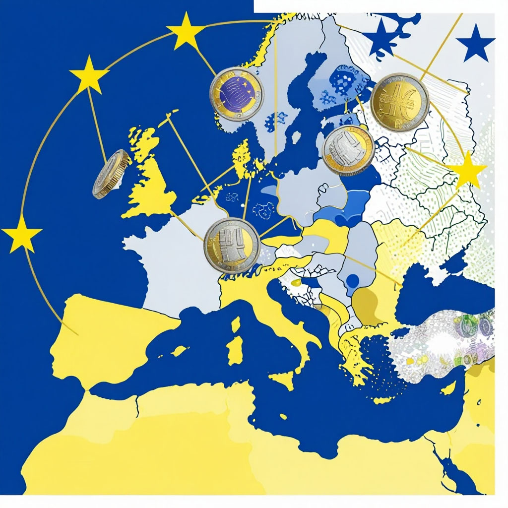
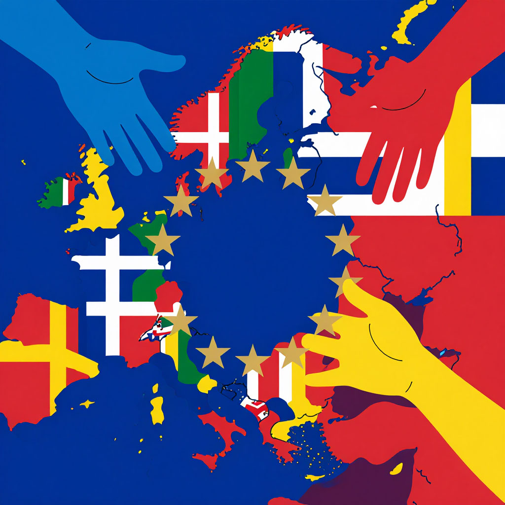

# Еврозона

## Страны, которые заговорили на одном денежном языке

---
## Содержание

- [Что такое еврозона?](#what-is)
- [Как появилась еврозона](#history)
- [Кто сегодня в еврозоне](#members)
- [Как устроена еврозона](#structure)
- [Что даёт евро простым людям](#benefits)
- [Экономика еврозоны](#economy)
- [Денежная политика еврозоны](#policy)
- [Греческая трагедия: когда евро становится проблемой](#greece)
- [Критика еврозоны: за что её не любят](#criticism)
- [Почему это важно школьнику](#school)
- [Будущее еврозоны: что дальше?](#future)
- [Интересные факты о еврозоне](#facts)
- [Заключение](#main)

---

## Что такое еврозона?

Представь, что ты путешествуешь по Европе. Садишься в поезд в Париже, выходишь в Брюсселе, потом едешь в Амстердам, а оттуда — в Берлин. И всё это [время](../../../1.2_natural_sciences/physics_in_everyday_life/Q20702.md) в твоём кошельке лежат одни и те же [деньги](../../../2.1_society/cause_and_effect_relationships/articles/economic_chains.md) — **[евро](evro.md)**. Не нужно менять валюту в каждой стране, не нужно считать [курсы](../../../2.1_society/how_and_where_find_friends/articles/skill_miks.md), не нужно бояться, что тебя обсчитают при обмене.

Это и есть **еврозона** — клуб стран, которые договорились использовать единую валюту. Сегодня в этом клубе 20 стран, 340 миллионов [человек](../../../1.2_natural_sciences/physics_in_everyday_life/Q45003.md) и вторая по значимости [валюта](../../../6.2_money_and_literacy/how_to_save_for_goal/articles/money.md) в мире после доллара.

Но создать единую валюту для разных стран — задача невероятно сложная. Это как заставить семью из 20 человек не только жить в одном доме, но и пользоваться одним общим кошельком, при этом каждый зарабатывает по-своему и тратит по-своему. Как им не поссориться? Давай разбираться.

---

## Как появилась еврозона

### [Мечта](../../../6.2_money_and_literacy/how_to_save_for_goal/articles/goal.md) о единой валюте

Идея единой европейской валюты не нова. Ещё Наполеон мечтал, чтобы по всей Европе платили одной монетой. В XX веке об этом говорили экономисты и политики. Но слишком велики были разногласия, слишком сильны национальные [чувства](../../../2.1_society/cause_and_effect_relationships/articles/empathy_causality.md).

Всё изменилось после падения Берлинской стены в 1989 году. Германия объединилась, Европа менялась. Лидеры Франции и Германии (Франсуа Миттеран и Гельмут Коль) решили: чтобы навсегда связать Европу воедино, нужна общая валюта. Ничто так не объединяет, как общие деньги.

### Маастрихтский договор

В 1992 году в голландском городе Маастрихт лидеры Европы подписали исторический договор о создании **[Европейского союза](./evropeyskiy_soyuz.md)**. И один из ключевых пунктов — введение единой валюты к 1999 году.

Но вступить в еврозону мог не каждый. Нужно было соответствовать строгим критериям:
- Низкая **[инфляция](./inflyatsiya_deflyatsiya_i_nulevaya_inflyatsiya.md)** (цены не должны скакать)
- [Низкий](../../../7.1_art/musical_instruments/articles/bassoon.md) дефицит бюджета ([нельзя](../../../3.1_healthy_lifestyle/pervaya_pomoshch/ushibi_porezy_ozhogi/07_ushib_chego_nelzya.md) тратить больше, чем зарабатываешь)
- Стабильный **[валютный курс](./valyutnyy_kurs.md)**
- Низкие процентные [ставки](../../../3.1_healthy lifestyle/vrednye_privychki/articles/ludomania.md)

### Рождение [евро](rezervnaya_valyuta.md)

**1 января 1999 года** **[евро](./evro.md)** появился — сначала в безналичной форме. Банки, компании, биржи начали использовать новую валюту. Люди пока держали в руках свои марки, франки, лиры, но уже знали: скоро всё изменится.

**1 января 2002 года** — день, который ждали миллионы. В полночь банкоматы по всей Европе начали выдавать новенькие [банкноты](../../../6.2_money_and_literacy/how_to_save_for_goal/articles/money.md) евро. Люди выстраивались в очереди, чтобы первыми получить новую валюту. За несколько недель [старые деньги](denominatsiya.md) исчезли, их место заняло евро.

### Первые участники

Первыми в еврозону вошли 11 стран: Германия, Франция, Италия, [Испания](../../../7.1_art/musical_instruments/articles/castanets.md), Нидерланды, Бельгия, Люксембург, Австрия, Ирландия, Португалия, Финляндия. Греция присоединилась чуть позже, в 2001 году.

---

## Кто сегодня в еврозоне

Сегодня еврозона — это 20 стран. Вот полный [список](../../../5.2_cybersecurity/cpp_fundamentals/10_arrays.md):

| Страна | Год вступления | Интересный [факт](../../../1.2_natural_sciences/why_science_help_understand_world/science.md) |
|--------|-----------------|-----------------|
| Германия | 1999 | Крупнейшая экономика еврозоны |
| Франция | 1999 | Там находится штаб-квартира [ЕЦБ](tsentralnyy_bank.md) |
| Италия | 1999 | Третья экономика зоны евро |
| Испания | 1999 | Четвёртая экономика |
| Нидерланды | 1999 | Очень богатая страна |
| Бельгия | 1999 | Столица [ЕС](evropeyskiy_soyuz.md) — [Брюссель](evropeyskiy_soyuz.md) |
| Люксембург | 1999 | Самая богатая на душу населения |
| Австрия | 1999 | Любит туристов |
| Ирландия | 1999 | Кельтский тигр |
| Португалия | 1999 | Много солнца и туристов |
| Финляндия | 1999 | Единственная скандинавская страна в еврозоне |
| Греция | 2001 | Пережила тяжёлый [кризис](../../../2.1_society/cause_and_effect_relationships/articles/economic_chains.md) |
| Словения | 2007 | Первая из бывших югославских республик |
| Кипр | 2008 | Остров разделён, но евро везде |
| Мальта | 2008 | Самая маленькая страна еврозоны |
| Словакия | 2009 | Не путать со Словенией! |
| [Эстония](../../../2.2_society/history/articles/Baltic_states.md) | 2011 | Очень цифровая страна |
| [Латвия](../../../2.2_society/history/articles/Baltic_states.md) | 2014 | Любит петь |
| [Литва](../../../2.2_society/history/articles/Baltic_states.md) | 2015 | Последняя из Прибалтики |
| Хорватия | 2023 | Самая новая участница |

### Кто не входит и почему

Некоторые страны ЕС не перешли на евро:

- **Дания и Швеция** — сознательно отказались (провели референдумы, народ сказал "нет")
- **[Польша](../../../2.2_society/history/articles/Catherine_II_of_Russia.md), Чехия, Венгрия, Румыния, Болгария** — пока не выполнили критерии или не хотят
- **Великобритания** — вышла из ЕС, так что вопрос отпал

А ещё есть страны, которые используют евро без официального разрешения: Черногория, Косово, Андорра, Монако, Сан-Марино, Ватикан. Для них евро — якорь стабильности.

---

## Как устроена еврозона

### Европейский [центральный банк](valyutnyy_kurs.md) (ЕЦБ)

[Сердце](../../../3.1. healthy lifestyle/Sleep, nutrition, and adolescent energy/articles/the_energy_trap.md) еврозоны находится во Франкфурте-на-Майне в огромной башне-близнеце. Там заседают главные банкиры Европы, которые принимают решения о [деньгах](../../../8.2_future/choosing_a_career_path/articles/salary.md).

**[Европейский центральный банк](./tsentralnyy_bank.md)** (ЕЦБ) делает то же, что любой **[центральный банк](./tsentralnyy_bank.md)**:
- Устанавливает процентные ставки (сколько стоят деньги)
- Следит за **[инфляцией](./inflyatsiya_deflyatsiya_i_nulevaya_inflyatsiya.md)** (чтобы цены не росли слишком быстро)
- Печатает евро (точнее, контролирует печать)
- Наблюдает за банками

Но есть важное отличие: ЕЦБ отвечает не за одну страну, а сразу за 20. И у всех стран [интересы](../../../2.1_society/cause_and_effect_relationships/articles/conflict_roots.md) разные. Германия боится инфляции как огня, а Италии нужен [рост](../../../3.1. healthy lifestyle/Sleep, nutrition, and adolescent energy/articles/micronutrients_and_teenagers.md). Находить [баланс](../../../1.2_natural_sciences/physics_in_everyday_life/Q634.md) — задача невероятно сложная.

### Кто принимает решения

Главный [орган](../../../7.1_art/musical_instruments/articles/organ.md) — **Совет управляющих ЕЦБ**. Туда входят:
- 6 членов правления (назначенные на 8 лет)
- 20 глав национальных банков стран еврозоны

Они собираются раз в месяц и голосуют. Решения принимаются большинством.

### Европейский стабилизационный механизм

После кризиса 2008 года страны еврозоны создали специальный "спасательный фонд" — **ESM** (Европейский стабилизационный механизм). Это [500](../../../5.1_technology_and_digital_literacy/how_internet_works/articles/http_https/http_https.md) миллиардов евро, которые можно дать стране, если она попала в беду.

---

## Что даёт евро простым людям

### **На пальцах:** евро как общий [язык](../../../5.2_cybersecurity/cpp_fundamentals/1_introduction.md)

Представь, что в Европе 20 стран говорят на 20 разных языках. Общаться трудно. И вдруг все договариваются выучить один общий язык — например, английский. Теперь можно путешествовать, учиться, работать где угодно.

**[Евро](./evro.md)** — это такой же "общий язык", только для [денег](../../../8.2_future/choosing_a_career_path/articles/salary.md).

### Для путешественников

Главный плюс — **не нужно менять деньги**. Едешь из Франции в Италию, из Италии в Словению, из Словении в Австрию — в кармане одни и те же евро. Никаких обменников, никаких комиссий, никаких потерь на курсе.

### Для сравнения цен

С евро легко сравнивать, где что дороже. Бутылка воды в Париже стоит 2 евро, в Берлине — 1.5 евро, в Риме — 1.8 евро. Сразу видно, где выгоднее.

### Для учёбы и [работы](../../../8.2_future/choosing_a_career_path/articles/interview.md)

[Студент](../../../8.2_future/choosing_a_career_path/articles/university.md) из Испании может поехать учиться в Германию, открыть там счёт в евро, получать стипендию, платить за общежитие — и никаких проблем с конвертацией.

---

## Экономика еврозоны

### Цифры и [факты](../../../1.2_natural_sciences/physics_in_everyday_life/Q17737.md)

- **Население**: 340 миллионов человек
- **ВВП**: около 13 триллионов евро
- **Доля в мировой экономике**: около 15%
- **[Инфляция](inflyatsiya_deflyatsiya_i_nulevaya_inflyatsiya.md)**: [цель](../../../1.2_natural_sciences/why_science_help_understand_world/research_work.md) ЕЦБ — 2% в год

### Страны еврозоны: разные, но вместе

Внутри еврозоны есть и богатые, и бедные страны. Это и **[развитые](./razvitye_i_razvivayushchiesya_strany.md)**, и **[развивающиеся страны](./razvitye_i_razvivayushchiesya_strany.md)** в одном союзе:

| Группа | Страны | Особенности |
|--------|--------|-------------|
| [Ядро](../../../1.1_structure_of_the_world/matter/articles/03_atom_structure.md) | Германия, Франция, Нидерланды | Сильные экономики, доноры |
| Юг | Италия, Испания, Греция | Большие долги, проблемы |
| Север | Финляндия, Эстония, Литва | Маленькие, но стабильные |
| Новые | Хорватия, Словакия | Недавно вступили, быстро растут |

### [Торговля](evropeyskiy_soyuz.md) внутри еврозоны

Благодаря единой валюте торговля между странами выросла на 5-15%. Это огромный скачок! Компаниям проще планировать, легче считать прибыль, нет рисков из-за скачков курса.

---

## Денежная политика еврозоны

### Что такое денежная политика

Это то, как **[центральный банк](./tsentralnyy_bank.md)** управляет [деньгами](../../../8.2_future/choosing_a_career_path/articles/salary.md) в стране. В еврозоне этим занимается ЕЦБ.

Главные [инструменты](../../../1.2_natural_sciences/physics_in_everyday_life/Q36253.md):
1. **Процентные ставки** — если [ставка](../../../../8.1_entertainment/articles/gambling-and-harm.md) низкая, брать кредиты дёшево, экономика растёт быстрее
2. **Печать денег** (количественное смягчение) — когда экономике нужна "[скорая](../../../3.1_healthy_lifestyle/pervaya_pomoshch/ushibi_porezy_ozhogi/15_ozhog_kogda_skoraya.md) [помощь](../../../3.1_healthy_lifestyle/pervaya_pomoshch/ushibi_porezy_ozhogi/10_krovotechenie_chto_delat.md)"
3. **Требования к банкам** — сколько денег они обязаны держать в запасе

### Цель: стабильность

ЕЦБ следит, чтобы **[инфляция](./inflyatsiya_deflyatsiya_i_nulevaya_inflyatsiya.md)** была около 2% в год. Это оптимальный [уровень](../../../../8.1_entertainment/articles/gamification.md): цены немного растут, но не слишком быстро.

Если [инфляция](../../../2.1_society/cause_and_effect_relationships/articles/economic_chains.md) выше 2% — ЕЦБ повышает ставки (брать кредиты становится дороже, экономика остывает).
Если инфляция ниже 2% — ЕЦБ понижает ставки или печатает деньги (стимулирует экономику).

---

## Греческая трагедия: когда евро становится проблемой

### Как Греция обманула всех

Греция вступила в еврозону в 2001 году. Чтобы попасть, нужно было соответствовать критериям. Греция им не соответствовала, но... приукрасила статистику. Помог американский [банк](../../../6.2_money_and_literacy/how_to_save_for_goal/articles/bank_account.md) Goldman Sachs, который придумал хитрую схему, чтобы скрыть долги.

Когда правда выяснилась, было поздно.

### 2009 год: кошмар начался

В 2009 году новый премьер Греции объявил: предыдущее правительство врало. На самом деле [долг](../../../2.1_society/cause_and_effect_relationships/articles/responsibility.md) не 100 миллиардов, а 300! Рынки запаниковали. Греции грозило банкротство.

### Спасать или не спасать?

В еврозоне разгорелись жаркие споры. Германия говорила: "Они сами виноваты, зачем нам платить?" Но если Греция обанкротится, пострадают все.

Кризис показал слабые места **валютного союза** без единой бюджетной политики.

### Уроки кризиса

Греция показала слабые места еврозоны:
- Общая валюта требует общей бюджетной политики
- Нельзя иметь евро, но жить не по средствам
- Нужен механизм спасения (его создали)

---

## [Критика](../../../8.1_self-understanding/HowToFindYourStrengths/articles/impostor_syndrome.md) еврозоны: за что её не любят

### [Потеря](../../../1.2_natural_sciences/neurobiology_for_teens/articles/20_sadness.md) независимости

Когда страна вступает в еврозону, она теряет контроль над своей денежной политикой. Раньше можно было напечатать денег, понизить ставку, обесценить валюту — и помочь экономике. Теперь решения принимаются во Франкфурте.

### "Одна ставка на всех"

Германии нужна высокая ставка (боится инфляции), а Италии — низкая (нужен рост). ЕЦБ выбирает среднюю, и никто не доволен до конца.

### Север против Юга

Север Европы — богатые, дисциплинированные, любят экономить. Юг — более расслабленные, любят тратить. В еврозоне они как в одной лодке, но гребут в разные стороны.

### Нет общих налогов

В США есть федеральный [бюджет](../../../6.1_Independent_living_and_daily_living_skills/reasonable_spending/articles/budget.md). В еврозоне такого нет. Если у одной страны кризис, другие могут помогать только по доброй воле.

---

## **Почему это важно школьнику**

### Если ты путешествуешь

Едешь в Европу — тебе понадобятся **[евро](./evro.md)**. Зная, как устроена еврозона, легче понимать, почему цены такие, какие есть.

### Если ты играешь в игры

Многие игры и подписки (PlayStation Plus, Xbox Game Pass) стоят в евро. **[Валютный курс](./valyutnyy_kurs.md)** евро влияет на то, сколько рублей ты заплатишь.

### Если ты интересуешься новостями

В новостях постоянно говорят про еврозону, кризисы в Греции, ставки ЕЦБ, **[инфляцию](./inflyatsiya_deflyatsiya_i_nulevaya_inflyatsiya.md)** в Европе. Теперь ты будешь понимать, о чём речь.

### [Урок](../../../5.1_technology_and_digital_literacy/information and media literacy/шаблон_урока_по_медиаграмотности.md) на [будущее](../../../1.2_natural_sciences/physics_in_everyday_life/Q11469.md)

Еврозона — это пример, как страны могут объединяться ради общей выгоды. Даже если трудно, даже если есть споры, вместе можно решать проблемы эффективнее.

---

## Будущее еврозоны: что дальше?

### Новые члены

Несколько стран ждут в очереди:
- **Болгария** (надеется вступить в ближайшие годы)
- **Румыния** (отстаёт)
- **Швеция** могла бы, но народ против
- **Польша, Чехия, Венгрия** — политически не хотят

### Более тесная интеграция

Многие экономисты говорят: еврозоне нужен **общий бюджет** и **общие налоги**. Чтобы богатые страны помогали бедным автоматически. Но богатые не хотят кормить бедных, а бедные не хотят терять независимость.

### [Цифровой](../../../7.1_art/musical_instruments/articles/synthesizer.md) евро

ЕЦБ работает над **цифровым евро** — электронной валютой, которой можно будет платить прямо с телефона, как наличными, но без банков.

---

## Интересные факты о еврозоне

**Факт 1:** Самая маленькая страна еврозоны — Мальта (500 тысяч человек). Самая большая — Германия (83 миллиона).

**Факт 2:** На монетах евро есть национальная сторона. У Франции — [дерево](../../../1.2_natural_sciences/physics_in_everyday_life/Q487005.md), у Германии — орёл, у Италии — портреты знаменитостей, у Греции — древние [мифы](../../../1.2_natural_sciences/physics_in_everyday_life/Q140028.md). Можно собрать коллекцию!

**Факт 3:** Есть [монеты](../../../6.1_Independent_living_and_daily_living_skills/reasonable_spending/articles/cash.md) в 2 евро с разными рисунками, посвящёнными важным событиям. Их выпускают ограниченным тиражом, и коллекционеры охотятся за ними.

**Факт 4:** В Еврозоне живёт 340 миллионов человек. Это больше, чем в США (330 млн).

**Факт 5:** Штаб-квартира ЕЦБ в Франкфурте — это две башни высотой 185 метров, соединённые переходом.

**Факт 6:** Самый тяжёлый кризис еврозоны случился в 2010-2012 годах. Тогда все боялись, что евро развалится. Не развалился.

**Факт 7:** В Дании есть референдум по евро каждые несколько лет. И каждый раз датчане говорят "нет".

**Факт 8:** Черногория и Косово используют евро без спроса. ЕЦБ закрывает на это [глаза](../../../7.2 Media, leisure and hobbies/Computer games/articles/useful_tips/eyes_and_back.md).

**Факт 9:** **[План Маршалла](./plan_marshalla.md)** когда-то помог восстановить Европу после войны. А теперь еврозона помогает своим бедным странам.

---

## [Заключение](../../../1.2_natural_sciences/physics_in_everyday_life/Q2225.md)

**Еврозона** — это уникальный [эксперимент](../../../1.2_natural_sciences/physics_in_everyday_life/Q1293220.md) в мировой истории. 20 стран, 340 миллионов человек, 20 языков, 20 культур — и общие деньги. Иногда они ссорятся, иногда попадают в кризисы, иногда проклинают друг друга. Но продолжают жить вместе.

Почему? Потому что вместе выгоднее. Потому что **[евро](./evro.md)** делает Европу сильнее в мире, который всё больше конкурирует за [ресурсы](../../../2.1_society/cause_and_effect_relationships/articles/ecological_footprint.md) и [влияние](../../../5.1_technology_and_digital_literacy/information and media literacy/манипуляции_и_пропаганда.md). Потому что за 20 лет люди привыкли к общим [деньгам](../../../8.2_future/choosing_a_career_path/articles/salary.md) и не хотят возвращаться к старым.

Конечно, у еврозоны много проблем. Кризисы будут повторяться, споры не утихнут. Но она уже доказала, что способна выживать в самых тяжёлых условиях.

И когда ты в следующий раз увидишь купюру с мостами и арками или монетку с картой Европы, вспомни: за этими деньгами стоит огромная [работа](../../../1.2_natural_sciences/physics_in_everyday_life/Q11382.md) миллионов людей, которые решили, что вместе лучше, чем порознь.

---
## 🔗 Связанные статьи
- [Евро](./evro.md)
- [Европейский союз](./evropeyskiy_soyuz.md)
- [Центральный банк](./tsentralnyy_bank.md)
- [Валютный курс](./valyutnyy_kurs.md)
- [Инфляция, дефляция и нулевая инфляция](./inflyatsiya_deflyatsiya_i_nulevaya_inflyatsiya.md)
- [Развитые и развивающиеся страны](./razvitye_i_razvivayushchiesya_strany.md)

---
***[Автор](../../../4.2_thinking_and_working_information/how_to_search_information/articles/copypaste.md):** Максим Шаталов @Maxishoo*  
***GitHub:*** *[Maxishoo](https://github.com/Maxishoo/)*  
***Использованные [нейросети](../../../2.1_society/cause_and_effect_relationships/articles/ai_causality.md) и ресурсы:*** *DeepSeek; Алиса AI.*
