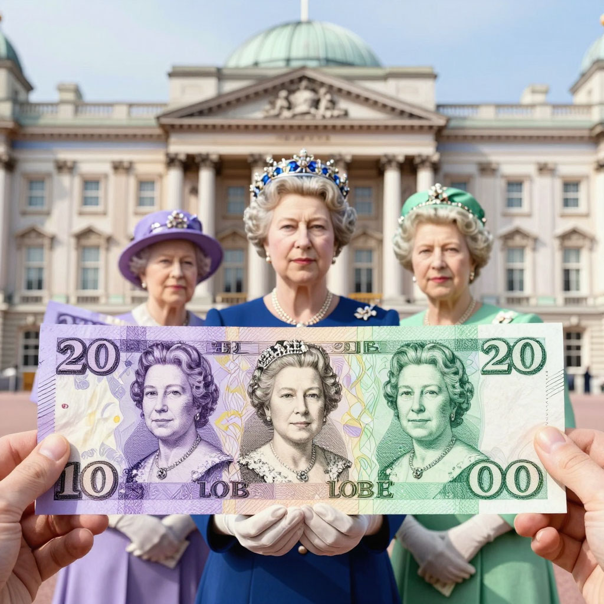
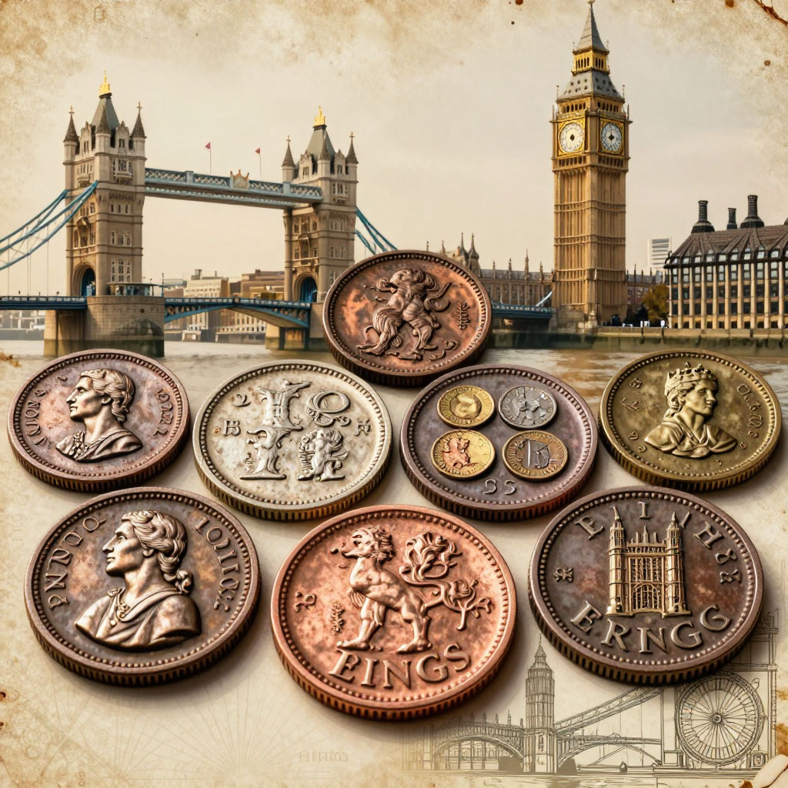
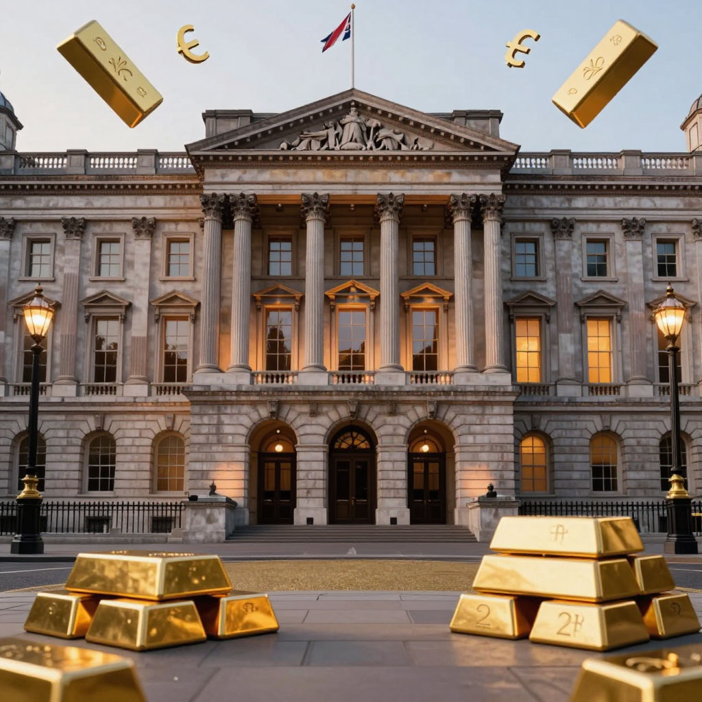

# [Фунт стерлингов](rezervnaya_valyuta.md)

://open.er-api.com/v6/latest/GBP)

## Самая старая [валюта](../../../6.2_money_and_literacy/how_to_save_for_goal/articles/money.md) мира, которая до сих пор в деле

---
## Содержание

- [Почему фунт не похож на другие деньги](#intro)
- [Откуда взялся фунт и почему он "стерлингов"](#history)
- [Королева на деньгах и другие портреты](#banknotes)
- [Банк Англии: старейший центральный банк мира](#bank-of-england)
- [Почему фунт — мировая валюта](#world-role)
- [Фунт и доллар: вечное противостояние](#usd)
- [Брекзит и фунт: история развода](#brexit)
- [На пальцах: что влияет на курс фунта](#simple)
- [Фунт и Россия: есть ли связь?](#russia)
- [Шотландские и североирландские фунты](#regional)
- [Фунт в мировой финансовой системе](#system)
- [Будущее фунта: останется или исчезнет?](#future)
- [Интересные факты о фунте](#facts)
- [Заключение](#main)

---

## Почему фунт не похож на другие [деньги](../../../2.1_society/cause_and_effect_relationships/articles/economic_chains.md)

Представь, что ты держишь в руках банкноту, на которой вместо президента или учёного изображена... королева. Да не просто королева, а самая настоящая, с короной и в окружении странных символов. А на другой стороне — вдруг писатель, который жил [200](../../../5.1_technology_and_digital_literacy/how_internet_works/articles/http_https/http_https.md) лет назад, или [учёный](../../../1.2_natural_sciences/why_science_help_understand_world/science.md), открывший [электричество](../../../1.2_natural_sciences/physics_in_everyday_life/Q11408.md).

Знакомься — **фунт стерлингов**. Это национальная валюта Великобритании, которая старше доллара на целых 100 лет. Валюта, на которой написано "Я обещаю платить по требованию..." — как будто [банк](../../../6.2_money_and_literacy/how_to_save_for_goal/articles/bank_account.md) обещает лично тебе. Валюта, которую англичане до сих пор любовно называют "стерлинг" или просто "квиды".

И самое удивительное: когда вся Европа перешла на [евро](evro.md), Британия сказала: "Нет уж, спасибо, мы останемся со своим фунтом". И осталась. Сегодня фунт — одна из ключевых валют мировой экономики, важный игрок на международных финансовых рынках.

Давайте разбираться, в чём секрет этой гордой валюты.

---

## Откуда взялся фунт и почему он "стерлингов"

### Тысяча лет истории

Фунт стерлингов — **самая старая валюта в мире**, которая до сих пор используется. Ей больше 1200 лет! Представляешь, когда викинги ещё плавали по морям, англосаксы уже платили фунтами.

Всё началось в VIII веке, когда король Оффа (да, было такое имя) ввёл серебряные [монеты](../../../6.1_Independent_living_and_daily_living_skills/reasonable_spending/articles/cash.md) — пенни. 240 таких монет весили ровно один фунт (примерно 350 граммов). Отсюда и название: **фунт стерлингов** — то есть "фунт серебряных монет".

### Почему "стерлинг"?

Есть несколько версий:
- От староанглийского "steorling" — "[звезда](../../../1.2_natural_sciences/physics_in_everyday_life/Q1146001.md)", потому что на первых монетах были звёздочки
- От нормандского "esterlin" — так называли деньги, похожие на нормандские
- Самая красивая версия: "sterling" означало "чистый, высокой [пробы](../../../7.2 Media, leisure and hobbies /useful_and_interesting_leisure/articles/how_to_understand_your_interests.md)"

Как бы то ни было, название прижилось. И до сих пор официальное название британской валюты — **фунт стерлингов** (pound sterling), хотя все называют просто "фунт".

### Странный символ £

Знак £ произошёл от буквы L — первой буквы латинского слова "libra" (фунт как мера веса). У римлян была такая единица. Так что, расплачиваясь фунтами, мы невольно вспоминаем Древний Рим.

---

## Королева на [деньгах](../../../8.2_future/choosing_a_career_path/articles/salary.md) и другие портреты

### Елизавета II: самый тиражируемый [портрет](../../../7.1_art/modern_technological_art/articles/5.4_mario_klingemann.md) в истории

На всех банкнотах Великобритании изображена королева. Но интересный [факт](../../../1.2_natural_sciences/why_science_help_understand_world/science.md): за [время](../../../1.2_natural_sciences/physics_in_everyday_life/Q20702.md) её правления портрет менялся несколько раз. Молодая королева, королева средних лет, пожилая королева... Коллекционеры даже собирают серии — "королева в разном возрасте".

После смерти Елизаветы II в 2022 году на новых банкнотах появится король Карл III, но старые купюры ещё долго будут в обращении.

### Кто ещё удостоился чести?

На оборотной стороне — великие британцы:

| Купюра | Кто изображён | Чем знаменит |
|--------|---------------|--------------|
| £5 | Уинстон Черчилль | Премьер, спасший Британию в войну |
| £10 | Джейн Остин | Писательница, [автор](../../../4.2_thinking_and_working_information/how_to_search_information/articles/copypaste.md) "Гордости и предубеждения" |
| £20 | Джозеф Тёрнер | Великий художник-пейзажист |
| £50 | Алан Тьюринг | Гений, взломавший шифры нацистов |

Алан Тьюринг — отдельная гордость. Его долго не признавали из-за несправедливого преследования, а теперь он на главной купюре страны. Символ того, что [справедливость](../../../2.1_society/cause_and_effect_relationships/articles/law_and_inevitability.md) восторжествовала.

---

## Банк Англии: старейший [центральный банк](valyutnyy_kurs.md) мира

### "Старушка с Треднидл-стрит"

Банк Англии — это не просто банк. Это **дедушка всех центробанков**. Его основали в 1694 году, и он до сих пор работает в [том](../../../7.1_art/musical_instruments/articles/drums.md) же районе Лондона. Англичане ласково называют его "The Old Lady" (Старушка).

Зачем создали банк? Чтобы собирать деньги на войну с Францией. Британское правительство придумало хитрый ход: давайте займём деньги у богатых купцов, а в обмен дадим им [право](../../../5.1_technology_and_digital_literacy/information and media literacy/авторское_право_и_честное_использование.md) открыть банк и печатать [банкноты](../../../6.2_money_and_literacy/how_to_save_for_goal/articles/money.md). Так и родился Банк Англии.

### Что делает Банк Англии?

- Печатает фунты
- Следит, чтобы банки работали честно
- Борется с инфляцией
- Управляет **[валютным курсом](./valyutnyy_kurs.md)** фунта
- Хранит золотой запас (там тонны золота в подвалах!)

Банк Англии — один из старейших и наиболее уважаемых **[центральных банков](./tsentralnyy_bank.md)** мира. Его решения [внимательно](../../../4.1_rules_of_study/how_to_memorize/articles/vnimanie.md) отслеживают финансисты по всему земному шару.

---

## Почему фунт — [мировая валюта](neftedollar.md)

### Британская империя: деньги, над которыми не заходило [солнце](../../../1.2_natural_sciences/physics_in_everyday_life/Q11388.md)

Когда-то Британия [правила](../../../2.1_society/cause_and_effect_relationships/articles/why_rules_work.md) половиной мира. Канада, [Австралия](../../../7.1_art/musical_instruments/articles/didgeridoo.md), Индия, [Египет](suetskiy_kanal.md), Южная [Африка](../../../7.1_art/musical_instruments/articles/marimba.md) — все они использовали фунт. Лондон был финансовой столицей [планеты](../../../1.2_natural_sciences/physics_in_everyday_life/Q1.md).

Даже когда империя развалилась, многие страны сохранили [связь](../../../1.2_natural_sciences/physics_in_everyday_life/Q12969754.md) с фунтом. До сих пор фунт — одна из главных **[резервных валют](./rezervnaya_valyuta.md)** мира.

### Лондон — финансовая столица

В Лондоне работают банки со всего мира. Здесь торгуют акциями, облигациями, валютой. Каждый день через Лондон проходят триллионы долларов (и фунтов). Пока Лондон остаётся финансовым центром, фунт будет нужен миру.

### Фунт в международных расчётах

Фунт активно используется в международных расчётах и на **[валютном рынке](./valyutnyy_kurs.md)**. Он входит в корзину специальных прав заимствования Международного валютного фонда вместе с долларом, [евро](rezervnaya_valyuta.md), иеной и юанем.

---

## Фунт и [доллар](dollar_ssha.md): вечное противостояние

### Кто главнее?

[Доллар США](./dollar_ssha.md), конечно, главнее. Но фунт держится молодцом и занимает почётное четвёртое место среди мировых валют после доллара, [евро](./evro.md) и иены.

### "Кейбл" — специальное слово

У трейдеров есть специальное слово для курса фунта к доллару — **"Cable"** (кабель). Почему? Потому что в XIX веке между Лондоном и Нью-Йорком проложили подводный телеграфный кабель, и курс передавали по нему. С тех пор и пошло.

### Когда фунт был сильнее

В 2007 году фунт стоил **2.1 доллара**! Купюра в 100 фунтов равнялась 210 долларам. Сейчас около 120-130. Но это всё равно много: фунт всегда дороже доллара (1 фунт = примерно 1.2-1.3 доллара).

---

## Брекзит и фунт: [история](../../../1.2_natural_sciences/physics_in_everyday_life/Q11469.md) развода

### [2016](../../../7.1_art/modern_technological_art/articles/5.5_yandex_neural.md) год: день, когда фунт упал

23 июня 2016 года Британия проголосовала за [выход](../../../3.2 healthy lifestyle/how to act in a dangerous situation/articles/building-evacuation.md) из Евросоюза. В ту же ночь фунт рухнул на 10% — самое сильное падение за всю историю. Люди, которые меняли валюту, не верили своим глазам.

### Почему фунт так отреагировал?

Инвесторы не любят неопределённости. А Брекзит — это гигантская неопределённость. Как теперь торговать? Какие будут правила? Уйдут ли банки из Лондона? Все эти [вопросы](../../../4.1_rules_of_study/how_to_learn_effectively/articles/curiosity.md) заставляли продавать фунт.

### Фунт после Брекзита

Прошло несколько лет. Банки не ушли. [Торговля](evropeyskiy_soyuz.md) продолжается. Фунт постепенно восстанавливается, но до прежних высот ещё далеко. История Брекзита показала, как тесно фунт связан с процессами **[глобализации](./globalizatsiya.md)** и политическими решениями.

---

## На пальцах: что влияет на курс фунта

Представь, что фунт — это [акции](../../../6.2_money_and_finance/personal_budget/investments.md) компании под названием "Великобритания Лтд". На цену этих акций влияют новости о компании:

**[Плохие новости](../../../3.1_healthy lifestyle/vrednye_privychki/articles/Doomscrolling.md) для фунта:**
- Экономика замедляется (люди меньше покупают)
- Политическая нестабильность (частая смена премьеров)
- Банк Англии печатает слишком много [денег](../../../8.2_future/choosing_a_career_path/articles/salary.md)

**Хорошие новости для фунта:**
- Экономика растёт
- Туристы везут деньги в Британию
- Банк Англии поднимает [ставки](../../../3.1_healthy lifestyle/vrednye_privychki/articles/ludomania.md)

### Почему это важно школьнику

Ты играешь в игры? Покупаешь коды в Xbox Store или PlayStation Store? Цены в британском магазине указаны в фунтах. Когда **[курс фунта](./valyutnyy_kurs.md)** высокий, игры обходятся дороже. Когда [низкий](../../../7.1_art/musical_instruments/articles/bassoon.md) — можно купить подешевле.

А ещё в Лондоне учатся тысячи студентов из разных стран, и их [родители](../../../../8.1_self_understanding/articles/family_influence.md) следят за курсом: на сколько фунтов хватит [зарплаты](../../../8.2_future/choosing_a_career_path/articles/salary.md)?

---

## Фунт и Россия: есть ли связь?

Прямой связи немного, но она существует.

### "Лондонград"

В Лондоне живёт много богатых россиян. Они покупают там дома, учат детей, хранят деньги в британских банках. Когда они переводят рубли в фунты, это влияет на **[валютный курс](./valyutnyy_kurs.md)**.

### [Инвестиции](aziatskie_tigry.md)

Некоторые россияне хранят [сбережения](../../../6.1_Independent_living_and_daily_living_skills/reasonable_spending/articles/savings.md) в фунтах, считая их надёжной валютой. Фунт действительно стабильнее рубля и входит в число **[резервных валют](./rezervnaya_valyuta.md)**, но тоже может колебаться.

---

## Шотландские и североирландские фунты

Вот это многих путает. В Великобритании несколько банков имеют право печатать свои банкноты!

### Шотландские фунты

Три шотландских банка печатают свои деньги. На них нет королевы (или есть, но в другом дизайне), изображены шотландские замки, поэты, [животные](../../../1.2_natural_sciences/why_science_help_understand_world/nature.md). Формально это те же фунты, но... английские магазины могут отказаться их принять! Потому что кассиры их не знают.

### Североирландские фунты

Там тоже свои банкноты, ещё более редкие. А ещё есть фунты Джерси, Гернси, острова Мэн — у каждого своя картинка.

Коллекционеры обожают собирать все разновидности. Их больше сотни!

---

## Фунт в мировой финансовой системе

### Почему фунт важен для мира

1. **Историческое [значение](../../../7.2 Media, leisure and hobbies /useful_and_interesting_leisure/articles/leisure_and_why_need.md)**. Благодаря Британской империи фунт распространился по всему миру.

2. **Финансовый центр**. Лондон остаётся одним из главных финансовых городов планеты.

3. **Стабильность**. Британия — страна с устойчивой политической системой и развитой экономикой.

4. **[Резервная валюта](rezervnaya_valyuta.md)**. Многие центральные банки хранят часть запасов в фунтах.

5. **[Валютный курс](./valyutnyy_kurs.md)**. Фунт входит в пятёрку самых торгуемых валют мира.

### Место фунта среди мировых валют

| Место | Валюта | Доля в мировых резервах |
|-------|--------|-------------------------|
| 1 | [Доллар США](dollar_ssha.md) | ~60% |
| 2 | Евро | ~20% |
| 3 | [Иена](rezervnaya_valyuta.md) | ~5% |
| 4 | Фунт стерлингов | ~4-5% |
| 5 | [Китайский юань](rezervnaya_valyuta.md) | ~2-3% |

---

## [Будущее](../../../1.2_natural_sciences/physics_in_everyday_life/Q11469.md) фунта: останется или исчезнет?

### [Цифровой](../../../7.1_art/musical_instruments/articles/synthesizer.md) фунт

Банк Англии разрабатывает **цифровой фунт** — электронную валюту, которая будет существовать параллельно с бумажной. Сможешь платить прямо с телефона, как наличными, но без посредников.

### Судьба наличных

В Британии всё меньше платят наличными. Многие молодые люди вообще не носят бумажники — только карты и телефоны. Но фунт от этого не исчезнет, просто станет цифровым.

### Роль в мировой экономике

Несмотря на конкуренцию со стороны [евро](./evro.md) и [доллара](./dollar_ssha.md), фунт сохранит своё место в мировой финансовой системе благодаря традициям и доверию международных инвесторов.

---

## Интересные [факты](../../../1.2_natural_sciences/physics_in_everyday_life/Q17737.md) о фунте

**Факт 1:** Самая тяжёлая монета в истории — "колесо" Карла II весом почти [500](../../../5.1_technology_and_digital_literacy/how_internet_works/articles/http_https/http_https.md) граммов. Ей можно было убить!

**Факт 2:** На старых банкнотах была надпись: "Я обещаю платить предъявителю по требованию". Технически ты мог прийти в банк и потребовать за 5 фунтов... 5 фунтов золотом или серебром. Сейчас это просто традиция — золото уже не дадут.

**Факт 3:** Банкнота в 1 миллион фунтов существует! Их используют только банки для внутренних расчётов. Простым смертным не показывают.

**Факт 4:** В 2020 году впервые за 20 лет выпустили банкноту в 50 фунтов с Аланом Тьюрингом. Её моментально раскупили коллекционеры.

**Факт 5:** В Британии есть банкоматы, которые выдают не только фунты, но и евро. Очень удобно перед поездкой в Европу.

**Факт 6:** Англичане никогда не говорят "pounds" про цену. Они скажут "ten quid" (десять квидов). Quid — сленговое название фунта, происхождение неизвестно.

**Факт 7:** Фунт был первой валютой, которая перестала быть обеспеченной золотом в 1931 году. Это открыло эру современных бумажных денег.

---

## [Заключение](../../../1.2_natural_sciences/physics_in_everyday_life/Q2225.md)

Фунт стерлингов — это не просто деньги. Это живая история. Он видел королей и королев, войны и революции, расцвет империи и её распад. Он пережил [появление](../../../1.2_natural_sciences/physics_in_everyday_life/Q5339.md) доллара, евро, криптовалют — и остаётся самим собой.

Сегодня фунт — важнейший [элемент](../../../1.2_natural_sciences/why_science_help_understand_world/chemistry.md) мировой финансовой системы, одна из главных **[резервных валют](./rezervnaya_valyuta.md)** планеты. Его котировки внимательно отслеживают трейдеры, экономисты и правительства.

Британцы гордятся своей валютой. Она для них — символ независимости и традиций. Пока существуют фунты, существует и старая добрая Англия с её Биг-Беном, двухэтажными автобусами и королевской гвардией.

И когда в следующий раз увидишь забавный значок £ на ценнике или в новостях про **[валютный курс](./valyutnyy_kurs.md)**, вспомни: этой валюте больше тысячи лет. Она старше Москвы, старше Парижа, старше почти всех государств на карте. И она всё ещё в игре.

---
## 🔗 Связанные статьи

- [Резервная валюта](./rezervnaya_valyuta.md)
- [Валютный курс](./valyutnyy_kurs.md)
- [Центральный банк](./tsentralnyy_bank.md)
- [Доллар США](./dollar_ssha.md)
- [Евро](./evro.md)
- [Глобализация](./globalizatsiya.md)

---
***Автор:** Максим Шаталов @Maxishoo*
***GitHub:*** *[Maxishoo](https://github.com/Maxishoo/)*
***Использованные [нейросети](../../../2.1_society/cause_and_effect_relationships/articles/ai_causality.md) и [ресурсы](../../../2.1_society/cause_and_effect_relationships/articles/ecological_footprint.md):*** *DeepSeek; Алиса AI.*
