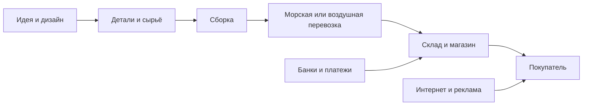
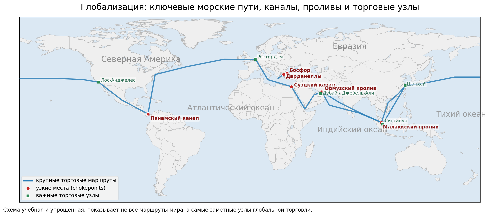
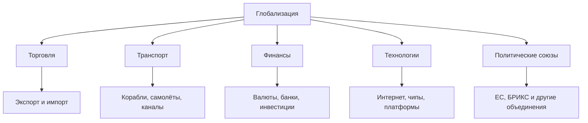
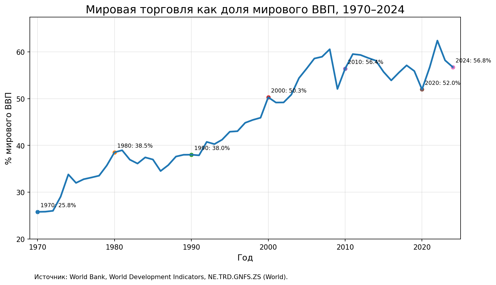
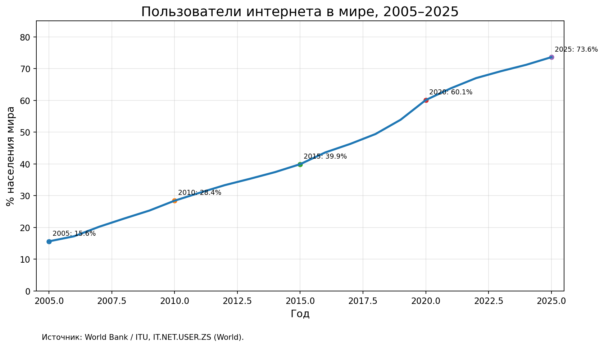
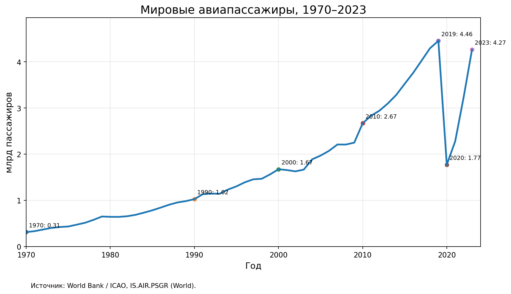
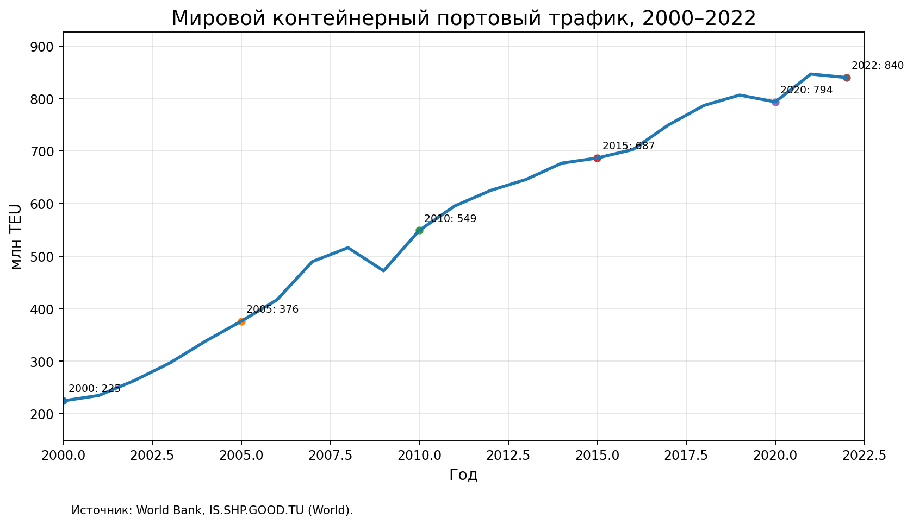

# Глобализация

**Глобализация** — это [процесс](../../../5.1_technology_and_digital_literacy/operating system/articles/process.md), при котором страны мира становятся всё сильнее связаны друг с другом через торговлю, [транспорт](../../../1.2_natural_sciences/physics_in_everyday_life/Q1751973.md), [деньги](../../../2.1_society/cause_and_effect_relationships/articles/economic_chains.md), [интернет](../../../1.2_natural_sciences/physics_in_everyday_life/Q26540.md), технологии, миграцию, [идеи](../../../7.2 Media, leisure and hobbies /useful_and_interesting_leisure/articles/free_leisure_activities.md) и культуру.

Это значит, что вещи, которые мы покупаем, часто создаются не в одной стране, а сразу в нескольких. Например, [дизайн](../../../7.2 Media, leisure and hobbies/Computer games/articles/dream_team/artist.md) товара может появиться в одной стране, детали — в другой, сборка — в третьей, а продажа — в четвёртой. Поэтому глобализация — это одна из самых важных тем для понимания мировой экономики.

Через эту тему особенно хорошо видно, как связаны [Европейский союз](./evropeyskiy_soyuz.md), [БРИКС](./briks.md), [Азиатские тигры](./aziatskie_tigry.md), [Нефть в мировой экономике](./neft_v_mirovoy_ekonomike.md), [Доллар США](./dollar_ssha.md), [Резервная валюта](./rezervnaya_valyuta.md), [Суэцкий канал](./suetskiy_kanal.md), [Панамский канал](./panamskiy_kanal.md), [Ормузский пролив](./ormuzskiy_proliv.md), [Босфор и Дарданеллы](./bosfor_i_dardanelly.md) и [Развитые и развивающиеся страны](./razvitye_i_razvivayushchiesya_strany.md).

## Содержание

- [Что это такое](#what-is)
- [Как глобализация развивалась](#history)
- [Карта мировой взаимосвязи](#map)
- [Почему это важно для мировой экономики](#why-important)
- [Как это работает](#how-it-works)
- [Что даёт глобализация и какие у неё проблемы](#pros-cons)
- [Данные и графики](#data)
- [Пример из реальной жизни](#real-life)
- [На пальцах](#simple)
- [Почему это важно школьнику](#school)
- [С чем связана эта статья в базе знаний](#links)
- [Интересный факт](#fact)
- [Главное](#main)
- [Источники данных и визуалов](#sources)

<a id="what-is"></a>
## Что это такое

Если совсем просто, глобализация — это ситуация, когда мир работает всё больше **как одна большая система**, а не как набор полностью отдельных стран.

Вот через что это проявляется:

| Что связывает страны | Как это выглядит в жизни |
|---|---|
| [Торговля](evropeyskiy_soyuz.md) | страны покупают и продают товары друг другу |
| Транспорт | контейнеровозы, самолёты, поезда и грузовики связывают рынки |
| Финансы | деньги, кредиты, [инвестиции](aziatskie_tigry.md) и валютные расчёты двигаются между странами |
| Технологии | интернет, [программирование](../../../5.2_cybersecurity/cpp_fundamentals/1_introduction.md), облачные [сервисы](../../../4.1_rules_of_study/how_to_learn_effectively/articles/digital_tools.md) и чипы работают сразу на мировой [рынок](../../../2.1_society/cause_and_effect_relationships/articles/economic_chains.md) |
| [Культура](../../../2.1_society/cause_and_effect_relationships/articles/why_rules_work.md) | [фильмы](../../../7.2 Media, leisure and hobbies /what_you_can_read_and_watch_to_develop_your_taste/articles/z1.md), [музыка](../../../1.2_natural_sciences/neurobiology_for_teens/articles/18_music_chills.md), игры, мода и [соцсети](../../../2.1_society/how_and_where_find_friends/articles/tcifrovaya_druzhba.md) быстро распространяются по миру |

> [!NOTE]
> **Важно:** глобализация — это не то же самое, что «все стали одинаковыми». Скорее это [история](../../../1.2_natural_sciences/physics_in_everyday_life/Q11469.md) о [том](../../../7.1_art/musical_instruments/articles/drums.md), что страны стали **сильнее зависеть друг от друга**.

Ещё одно важное слово здесь — **цепочка поставок**. Это [путь](../../../1.2_natural_sciences/physics_in_everyday_life/Q11476.md) товара от сырья до покупателя.



Такая схема хорошо показывает, что современный товар — это часто [результат](../../../1.2_natural_sciences/why_science_help_understand_world/experimental_science.md) [работы](../../../8.2_future/choosing_a_career_path/articles/interview.md) **многих стран сразу**.

<a id="history"></a>
## Как глобализация развивалась

Глобализация не появилась за один день. Она усиливалась постепенно.

| [Период](../../../1.2_natural_sciences/physics_in_everyday_life/Q11652.md) | Что происходило | Почему это важно |
|---|---|---|
| XIX — начало XX века | пароходы, железные дороги, телеграф | мир начал быстрее обмениваться товарами и новостями |
| После Второй мировой войны | [восстановление](../../../4.1_rules_of_study/how_to_learn_effectively/articles/breaks_and_rest.md) торговли, новые международные [правила](../../../2.1_society/cause_and_effect_relationships/articles/why_rules_work.md), [рост](../../../3.1. healthy lifestyle/Sleep, nutrition, and adolescent energy/articles/micronutrients_and_teenagers.md) роли США | мировая экономика стала более связанной |
| 1960-е и дальше | [контейнерные перевозки](suetskiy_kanal.md) | стало дешевле и быстрее возить товары между континентами |
| [1990-е](../../../7.1_art/modern_technological_art/articles/2.2_heath_bunting.md) | интернет, компьютеры, [ускорение](../../../1.2_natural_sciences/physics_in_everyday_life/Q11376.md) мировой торговли | глобализация резко ускорилась |
| 2000-е–2020-е | цифровые платформы, сложные цепочки поставок, быстрые финансовые потоки | связи стали ещё плотнее, но и уязвимее |

> [!TIP]
> Один из ключевых поворотов — **контейнеризация**. Когда грузы стали возить в стандартных контейнерах, [мировая торговля](panamskiy_kanal.md) ускорилась: товар стало проще перегружать из корабля в поезд и в грузовик.

Ещё один важный [шаг](../../../1.2_natural_sciences/physics_in_everyday_life/Q36253.md) — [развитие](../../../3.1. healthy lifestyle/Sleep, nutrition, and adolescent energy/articles/micronutrients_and_teenagers.md) **глобальных цепочек создания стоимости**. Это когда товар не «делают целиком» в одной стране, а создают по частям: где-то добывают сырьё, где-то делают детали, где-то собирают, а где-то продают и рекламируют.

<a id="map"></a>
## [Карта](../../../5.1_technology_and_digital_literacy/information and media literacy/карта_компетенций_по_возрастам.md) мировой взаимосвязи

Ниже — учебная карта с важнейшими маршрутами, узкими местами и торговыми узлами.



*Синим показаны крупные маршруты, красным — узкие места мировой торговли, зелёным — важные торговые узлы.*

> [!IMPORTANT]
> На карте видно, что глобализация зависит не только от стран, но и от **географии**: от того, где находятся порты, каналы и [проливы](bosfor_i_dardanelly.md). Если один важный путь блокируется, проблемы могут почувствовать люди очень далеко от этого места.

Ниже представлена интерактивная карта в формате GeoJSON:

```geojson
{
  "type": "FeatureCollection",
  "features": [
    {
      "type": "Feature",
      "properties": {
        "title": "Суэцкий канал",
        "description": "Важное узкое место мировой торговли.",
        "marker-color": "#b22222",
        "marker-size": "medium",
        "marker-symbol": "circle"
      },
      "geometry": {
        "type": "Point",
        "coordinates": [
          32.55,
          30.5
        ]
      }
    },
    {
      "type": "Feature",
      "properties": {
        "title": "Панамский канал",
        "description": "Важное узкое место мировой торговли.",
        "marker-color": "#b22222",
        "marker-size": "medium",
        "marker-symbol": "circle"
      },
      "geometry": {
        "type": "Point",
        "coordinates": [
          -79.6,
          9.1
        ]
      }
    },
    {
      "type": "Feature",
      "properties": {
        "title": "Ормузский пролив",
        "description": "Важное узкое место мировой торговли.",
        "marker-color": "#b22222",
        "marker-size": "medium",
        "marker-symbol": "circle"
      },
      "geometry": {
        "type": "Point",
        "coordinates": [
          56.25,
          26.57
        ]
      }
    },
    {
      "type": "Feature",
      "properties": {
        "title": "Малаккский пролив",
        "description": "Важное узкое место мировой торговли.",
        "marker-color": "#b22222",
        "marker-size": "medium",
        "marker-symbol": "circle"
      },
      "geometry": {
        "type": "Point",
        "coordinates": [
          102.8,
          2.5
        ]
      }
    },
    {
      "type": "Feature",
      "properties": {
        "title": "Босфор",
        "description": "Важное узкое место мировой торговли.",
        "marker-color": "#b22222",
        "marker-size": "medium",
        "marker-symbol": "circle"
      },
      "geometry": {
        "type": "Point",
        "coordinates": [
          29.06,
          41.17
        ]
      }
    },
    {
      "type": "Feature",
      "properties": {
        "title": "Дарданеллы",
        "description": "Важное узкое место мировой торговли.",
        "marker-color": "#b22222",
        "marker-size": "medium",
        "marker-symbol": "circle"
      },
      "geometry": {
        "type": "Point",
        "coordinates": [
          26.4,
          40.2
        ]
      }
    },
    {
      "type": "Feature",
      "properties": {
        "title": "Шанхай",
        "description": "Важный торговый узел мировой экономики.",
        "marker-color": "#2e8b57",
        "marker-size": "medium",
        "marker-symbol": "square"
      },
      "geometry": {
        "type": "Point",
        "coordinates": [
          121.49,
          31.23
        ]
      }
    },
    {
      "type": "Feature",
      "properties": {
        "title": "Сингапур",
        "description": "Важный торговый узел мировой экономики.",
        "marker-color": "#2e8b57",
        "marker-size": "medium",
        "marker-symbol": "square"
      },
      "geometry": {
        "type": "Point",
        "coordinates": [
          103.82,
          1.29
        ]
      }
    },
    {
      "type": "Feature",
      "properties": {
        "title": "Роттердам",
        "description": "Важный торговый узел мировой экономики.",
        "marker-color": "#2e8b57",
        "marker-size": "medium",
        "marker-symbol": "square"
      },
      "geometry": {
        "type": "Point",
        "coordinates": [
          4.48,
          51.92
        ]
      }
    },
    {
      "type": "Feature",
      "properties": {
        "title": "Лос-Анджелес",
        "description": "Важный торговый узел мировой экономики.",
        "marker-color": "#2e8b57",
        "marker-size": "medium",
        "marker-symbol": "square"
      },
      "geometry": {
        "type": "Point",
        "coordinates": [
          -118.25,
          34.05
        ]
      }
    },
    {
      "type": "Feature",
      "properties": {
        "title": "Дубай / Джебель-Али",
        "description": "Важный торговый узел мировой экономики.",
        "marker-color": "#2e8b57",
        "marker-size": "medium",
        "marker-symbol": "square"
      },
      "geometry": {
        "type": "Point",
        "coordinates": [
          55.0,
          25.0
        ]
      }
    },
    {
      "type": "Feature",
      "properties": {
        "title": "Азия — Европа",
        "description": "Один из ключевых маршрутов современной глобальной торговли.",
        "stroke": "#2c7fb8",
        "stroke-width": 3,
        "stroke-opacity": 0.85
      },
      "geometry": {
        "type": "LineString",
        "coordinates": [
          [
            121.49,
            31.23
          ],
          [
            116,
            25
          ],
          [
            108,
            18
          ],
          [
            102.8,
            2.5
          ],
          [
            85,
            10
          ],
          [
            62,
            16
          ],
          [
            56.25,
            26.57
          ],
          [
            50,
            24
          ],
          [
            43,
            13
          ],
          [
            32.55,
            30.5
          ],
          [
            14,
            36
          ],
          [
            4.48,
            51.92
          ]
        ]
      }
    },
      {
  "type": "Feature",
  "properties": {
    "title": "Азия — Северная Америка (западная часть)",
    "description": "Один из ключевых маршрутов современной глобальной торговли.",
    "stroke": "#2c7fb8",
    "stroke-width": 3,
    "stroke-opacity": 0.85
  },
  "geometry": {
    "type": "LineString",
    "coordinates": [
      [121.49, 31.23],
      [135, 33],
      [160, 38],
      [179.9, 38]
    ]
  }
},
{
  "type": "Feature",
  "properties": {
    "title": "Азия — Северная Америка (восточная часть)",
    "description": "Продолжение маршрута через Тихий океан.",
    "stroke": "#2c7fb8",
    "stroke-width": 3,
    "stroke-opacity": 0.85
  },
  "geometry": {
    "type": "LineString",
    "coordinates": [
      [-179.9, 38],
      [-150, 37],
      [-130, 36],
      [-118.25, 34.05]
    ]
  }
},
    {
      "type": "Feature",
      "properties": {
        "title": "Атлантика — Тихий океан через Панаму",
        "description": "Один из ключевых маршрутов современной глобальной торговли.",
        "stroke": "#2c7fb8",
        "stroke-width": 3,
        "stroke-opacity": 0.85
      },
      "geometry": {
        "type": "LineString",
        "coordinates": [
          [
            -74,
            40
          ],
          [
            -79.6,
            9.1
          ],
          [
            -100,
            20
          ],
          [
            -118.25,
            34.05
          ]
        ]
      }
    },
    {
      "type": "Feature",
      "properties": {
        "title": "Персидский залив — Азия",
        "description": "Один из ключевых маршрутов современной глобальной торговли.",
        "stroke": "#2c7fb8",
        "stroke-width": 3,
        "stroke-opacity": 0.85
      },
      "geometry": {
        "type": "LineString",
        "coordinates": [
          [
            55.0,
            25.0
          ],
          [
            56.25,
            26.57
          ],
          [
            70,
            18
          ],
          [
            86,
            10
          ],
          [
            102.8,
            2.5
          ],
          [
            103.82,
            1.29
          ],
          [
            121.49,
            31.23
          ]
        ]
      }
    },
    {
      "type": "Feature",
      "properties": {
        "title": "Черное море — Средиземное море",
        "description": "Один из ключевых маршрутов современной глобальной торговли.",
        "stroke": "#2c7fb8",
        "stroke-width": 3,
        "stroke-opacity": 0.85
      },
      "geometry": {
        "type": "LineString",
        "coordinates": [
          [
            37,
            45
          ],
          [
            33,
            43
          ],
          [
            29.06,
            41.17
          ],
          [
            26.4,
            40.2
          ],
          [
            22,
            37
          ]
        ]
      }
    },
    {
      "type": "Feature",
      "properties": {
        "title": "Европа — Северная Америка",
        "description": "Один из ключевых маршрутов современной глобальной торговли.",
        "stroke": "#2c7fb8",
        "stroke-width": 3,
        "stroke-opacity": 0.85
      },
      "geometry": {
        "type": "LineString",
        "coordinates": [
          [
            4.48,
            51.92
          ],
          [
            -20,
            52
          ],
          [
            -50,
            46
          ],
          [
            -74,
            40
          ]
        ]
      }
    }
  ]
}
```

Вот почему темы вроде [Суэцкого канала](./suetskiy_kanal.md), [Панамского канала](./panamskiy_kanal.md), [Ормузского пролива](./ormuzskiy_proliv.md) и [Босфора и Дарданелл](./bosfor_i_dardanelly.md) так важны для понимания мировой экономики.

<a id="why-important"></a>
## Почему это важно для мировой экономики

Глобализация важна потому, что она помогает странам **специализироваться**. Одна страна может лучше делать электронику, другая — автомобили, третья — перевозки, четвёртая — программное обеспечение, пятая — добывать [нефть](neft_v_mirovoy_ekonomike.md) или [газ](../../../1.1_structure_of_the_world/matter/articles/07_gases.md).

Это даёт сразу несколько эффектов:

1. Товары можно производить быстрее и дешевле.
2. Компании получают доступ к большим рынкам.
3. Страны могут покупать то, что сами производят хуже или дороже.
4. Новые идеи и технологии распространяются быстрее.

Но есть и обратная сторона: если страны очень сильно зависят друг от друга, то любой большой сбой быстро становится общей проблемой.

| Что усиливает глобализацию | Что может её тормозить |
|---|---|
| дешёвые перевозки | войны и конфликты |
| интернет и цифровые сервисы | [санкции](../../../2.1_society/cause_and_effect_relationships/articles/why_rules_work.md) и торговые барьеры |
| международные правила торговли | аварии и блокировки маршрутов |
| мировые валюты и банки | пандемии, засухи, климатические проблемы |
| крупные компании и инвестиции | политические споры и рост недоверия |

<a id="how-it-works"></a>
## Как это работает

У глобализации нет одной [кнопки](../../../7.1_art/musical_instruments/articles/accordion.md). Она работает сразу через несколько механизмов.

### 1. Международная торговля

Страны продают друг другу товары и [услуги](../../../8.1_self-understanding/HowToFindYourStrengths/articles/talent_monetization.md). Чем активнее торговля, тем сильнее они зависят друг от друга.

Например, [Азиатские тигры](./aziatskie_tigry.md) стали важной частью мировой экономики именно потому, что сумели встроиться в международную торговлю и [производство](../../../2.1_society/cause_and_effect_relationships/articles/economic_chains.md).

### 2. Транспорт и [логистика](suetskiy_kanal.md)

Товар надо не только произвести, но и довезти. Поэтому огромную роль играют контейнеровозы, самолёты, железные дороги, склады, порты и каналы.

Если путь через [Суэцкий канал](./suetskiy_kanal.md) удлиняется или нарушается, товары могут идти дольше и становиться дороже.

### 3. Деньги и валюты

[Глобальная](../../../5.2_cybersecurity/cpp_fundamentals/9_scopes.md) экономика работает не только на товарах, но и на платежах. Чтобы компании из разных стран могли быстро рассчитываться, нужны банки, валютные рынки и [доверие](../../../1.2_natural_sciences/neurobiology_for_teens/articles/17_hugs_oxytocin.md) к валютам. Поэтому важны [Доллар США](./dollar_ssha.md) и идея [резервной валюты](./rezervnaya_valyuta.md).

### 4. Технологии и интернет

Сегодня глобализация — это уже не только контейнеры и порты. Это ещё и облачные сервисы, видеосвязь, программирование, интернет-магазины, цифровая реклама, игры и стриминговые сервисы.

### 5. Политические и экономические союзы

Иногда государства специально сближаются, чтобы торговать проще и больше. Например, так работает [Европейский союз](./evropeyskiy_soyuz.md). В других случаях страны объединяются для усиления своего веса в мире, как это делает [БРИКС](./briks.md).



<a id="pros-cons"></a>
## Что даёт глобализация и какие у неё проблемы

| Плюсы | Что это значит простыми словами |
|---|---|
| Больше выбора | в магазинах и [онлайн](../../../3.2 healthy lifestyle/how to act in a dangerous situation/articles/internet-safety.md) больше товаров из разных стран |
| Ниже издержки | товар можно делать там, где это дешевле или удобнее |
| Быстрее распространяются технологии | новые идеи и изобретения доходят до других стран быстрее |
| Рост торговли | компании могут продавать не только «дома», но и по всему миру |
| Новые рабочие места | в торговле, логистике, [IT](../../../8.2_future/choosing_a_career_path/articles/programmer.md), промышленности, услугах |

| Проблемы | Что это значит простыми словами |
|---|---|
| [Зависимость](../../../3.1. healthy lifestyle/Sleep, nutrition, and adolescent energy/articles/the_energy_trap.md) от дальних поставок | если где-то сбой, проблема ощущается в других странах |
| Неравномерная [выгода](../../../6.1_Independent_living_and_daily_living_skills/reasonable_spending/articles/discount.md) | одни страны и компании выигрывают больше, чем другие |
| [Давление](../../../1.1_structure_of_the_world/matter/articles/07_gases.md) на слабые отрасли | местные компании могут не выдержать конкуренцию |
| [Риски](../../../7.2 Media, leisure and hobbies /useful_and_interesting_leisure/articles/safety_during_recreation.md) для экологии | больше перевозок и производства — больше нагрузки на природу |
| Политические споры | торговля и финансы часто зависят от политики |

> [!WARNING]
> **Важно [помнить](../../../4.1_rules_of_study/how_to_memorize/articles/pamyat.md):** глобализация сама по себе не «хорошая» и не «плохая». Это инструмент. Он может помогать развитию, а может делать мир более уязвимым к большим сбоям.

<a id="data"></a>
## [Данные](../../../2.1_society/cause_and_effect_relationships/articles/ai_causality.md) и графики

Ниже — несколько графиков, которые помогают увидеть глобализацию не на словах, а в цифрах.

### 1. Торговля как доля мирового ВВП



| Год | Торговля как % мирового ВВП |
|---|---:|
| 1970 | 25.8% |
| 1990 | 38.0% |
| 2000 | 50.3% |
| 2010 | 56.4% |
| 2020 | 52.0% |
| 2024 | 56.8% |

Из таблицы видно: в целом торговая взаимосвязь мира за последние десятилетия стала значительно сильнее, хотя во [время](../../../1.2_natural_sciences/physics_in_everyday_life/Q20702.md) кризисов и потрясений бывают откаты.

### 2. Интернет как ускоритель глобализации



| Год | Пользователи интернета в мире |
|---|---:|
| 2005 | 15.6% населения |
| 2015 | 39.9% населения |
| 2020 | 60.1% населения |
| 2025 | 73.6% населения |

Интернет сделал глобализацию гораздо быстрее: теперь можно не только перевозить товары, но и почти мгновенно передавать информацию, заказы, дизайн, рекламу и платежи.

### 3. Авиаперевозки



| Год | Мировые авиапассажиры |
|---|---:|
| 1970 | 0.31 млрд |
| 1990 | 1.02 млрд |
| 2000 | 1.67 млрд |
| 2019 | 4.46 млрд |
| 2020 | 1.77 млрд |
| 2023 | 4.27 млрд |

По этому графику видно, что мир стал намного мобильнее. Но также видно и то, что сильный глобальный шок может резко ударить по перевозкам.

### 4. Контейнерный [трафик](../../../5.1_technology_and_digital_literacy/how_internet_works/articles/dns/cdn.md)



| Год | Контейнерный портовый трафик |
|---|---:|
| 2000 | 224.8 млн TEU |
| 2010 | 549.0 млн TEU |
| 2020 | 793.6 млн TEU |
| 2022 | 839.8 млн TEU |

Контейнеры — это «тихие герои» глобализации. Пока они двигаются быстро и предсказуемо, мировая торговля работает smoother. Когда маршруты ломаются, это быстро отражается на ценах и сроках доставки.

<a id="real-life"></a>
## Пример из реальной жизни

Представьте обычный [смартфон](../../../1.2_natural_sciences/physics_in_everyday_life/Q3198.md).

- идея и часть программ — из одной страны;
- чипы — из другой;
- [экран](../../../3.1. healthy lifestyle/Sleep, nutrition, and adolescent energy/articles/gadgets_blue_light_sleep.md) — из третьей;
- редкие [материалы](../../../1.2_natural_sciences/physics_in_everyday_life/Q487005.md) приехали ещё из нескольких стран;
- сборка прошла в другой части мира;
- в магазин товар пришёл морем через каналы и проливы;
- оплатили его через международную банковскую систему.

То есть один предмет в кармане — это маленькая модель мировой экономики.

То же самое можно сказать про кроссовки, игровую приставку, шоколад, футболку или ноутбук.

<a id="simple"></a>
> [!NOTE]
> **На пальцах:**  
> Представьте, что весь мир — это огромная школьная ярмарка. Один класс печёт булочки, другой делает упаковку, третий рисует рекламу, четвёртый отвечает за доставку, а пятый принимает оплату. Если всё работает слаженно, ярмарка идёт быстро и успешно. Но если кто-то один внезапно перестанет работать — проблемы почувствуют все. Примерно так и устроена глобализация.

<a id="school"></a>
## Почему это важно школьнику

Эта тема помогает понять очень много вещей из обычной жизни:

- почему телефон, [приставка](../../../7.2 Media, leisure and hobbies/Computer games/articles/how_it_all_started/tennis_on_tv.md) или [видеокарта](../../../5.1_technology_and_digital_literacy/operating system/articles/window_manager.md) могут внезапно подорожать;
- почему [задержка](../../../5.1_technology_and_digital_literacy/how_internet_works/articles/dns/cdn.md) в одном канале или проливе может сказаться на ценах в магазине;
- почему новости о [нефти](./neft_v_mirovoy_ekonomike.md), долларе или перевозках обсуждают не только экономисты;
- почему интернет сделал мир «меньше», но не убрал проблемы полностью;
- почему разные страны спорят о торговле, заводах, чипах и логистике.

Если понимать глобализацию, легче понять и новости, и цены, и то, почему события далеко от тебя иногда влияют на твою повседневную [жизнь](../../../1.2_natural_sciences/physics_in_everyday_life/Q1751973.md).

<a id="links"></a>
## С чем связана эта статья в базе знаний

- [Европейский союз](./evropeyskiy_soyuz.md)
- [БРИКС](./briks.md)
- [Азиатские тигры](./aziatskie_tigry.md)
- [Нефть в мировой экономике](./neft_v_mirovoy_ekonomike.md)
- [Доллар США](./dollar_ssha.md)
- [Резервная валюта](./rezervnaya_valyuta.md)
- [Суэцкий канал](./suetskiy_kanal.md)
- [Панамский канал](./panamskiy_kanal.md)
- [Ормузский пролив](./ormuzskiy_proliv.md)
- [Босфор и Дарданеллы](./bosfor_i_dardanelly.md)
- [Развитые и развивающиеся страны](./razvitye_i_razvivayushchiesya_strany.md)

<a id="fact"></a>
> [!TIP]
> **Интересный [факт](../../../1.2_natural_sciences/why_science_help_understand_world/science.md):**  
> Даже если ты покупаешь вещь «одной марки», внутри неё часто спрятана [работа](../../../1.2_natural_sciences/physics_in_everyday_life/Q11382.md) десятков стран. Современный товар очень редко является результатом труда только одной экономики.

<a id="main"></a>
## Главное

Глобализация — это [усиление](../../../1.2_natural_sciences/physics_in_everyday_life/Q136980.md) связей между странами через торговлю, транспорт, деньги, технологии и культуру. Она помогает миру производить больше, быстрее обмениваться идеями и связывать рынки между собой. Но у неё есть и слабые места: чем сильнее [связь](../../../1.2_natural_sciences/physics_in_everyday_life/Q12969754.md), тем сильнее общий сбой, если ломается важный маршрут, растёт [конфликт](../../../2.1_society/cause_and_effect_relationships/articles/conflict_roots.md) или останавливается поставка.

Поэтому глобализация — это не просто модное слово, а один из главных способов понять, **как устроена современная мировая экономика**.

<a id="sources"></a>
## [Источники](../../../4.2_thinking_and_working_information/how_to_search_information/articles/three_whales.md) данных и визуалов

**Основные данные для графиков:**
- World Bank, World Development Indicators — Trade (% of GDP), indicator `NE.TRD.GNFS.ZS` (World)
- World Bank / ITU — Individuals using the Internet (% of population), indicator `IT.NET.USER.ZS` (World)
- World Bank / ICAO — Air transport, passengers carried, indicator `IS.AIR.PSGR` (World)
- World Bank — Container port traffic (TEU), indicator `IS.SHP.GOOD.TU` (World)

**Источники для объяснений и исторического контекста:**
- World Bank, *World Development Report 2020: Trading [for](../../../5.2_cybersecurity/cpp_fundamentals/7_loops.md) Development in the Age of Global Value Chains*
- OECD, материалы по global value and supply chains
- UNCTAD, *Review of Maritime Transport 2024*
- UNCTAD, материалы о сбоях в Сuez и Panama
- Britannica, материалы о containerization

**Карта и схемы:**
- Фоновая карта: Natural Earth / pyogrio naturalearth_lowres fixture
- Маршруты и точки: учебная авторская схема для этой статьи
- Исходный GeoJSON карты хранится в `WORK/2.2_history/world_economy_on_fingers/assets/maps/globalizatsiya_map.geojson`

---
***[Автор](../../../4.2_thinking_and_working_information/how_to_search_information/articles/copypaste.md):** Авраменко Денис @denisuelius*  
***GitHub:*** *[den4ik2975](https://github.com/den4ik2975)*  
***Использованные [нейросети](../../../2.1_society/cause_and_effect_relationships/articles/ai_causality.md) и [ресурсы](../../../2.1_society/cause_and_effect_relationships/articles/ecological_footprint.md):*** *[ChatGPT](../../../7.1_art/modern_technological_art/articles/6.1_prompt_art.md) 5.4; World Bank; ITU; ICAO; OECD; UNCTAD; Britannica; Natural Earth*
