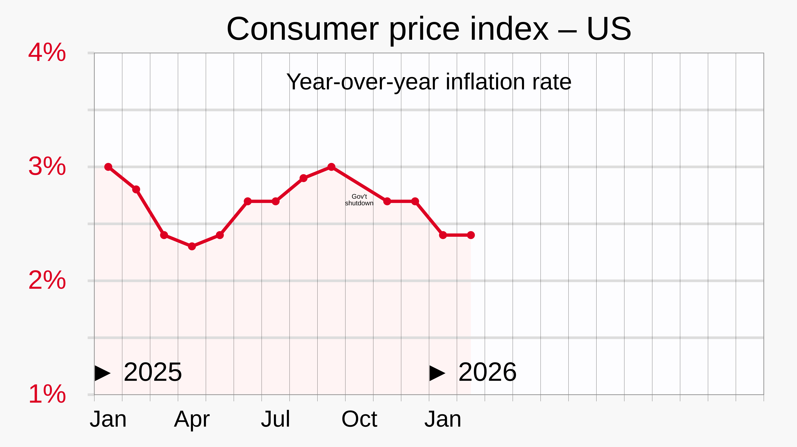
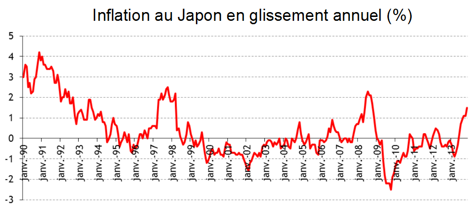
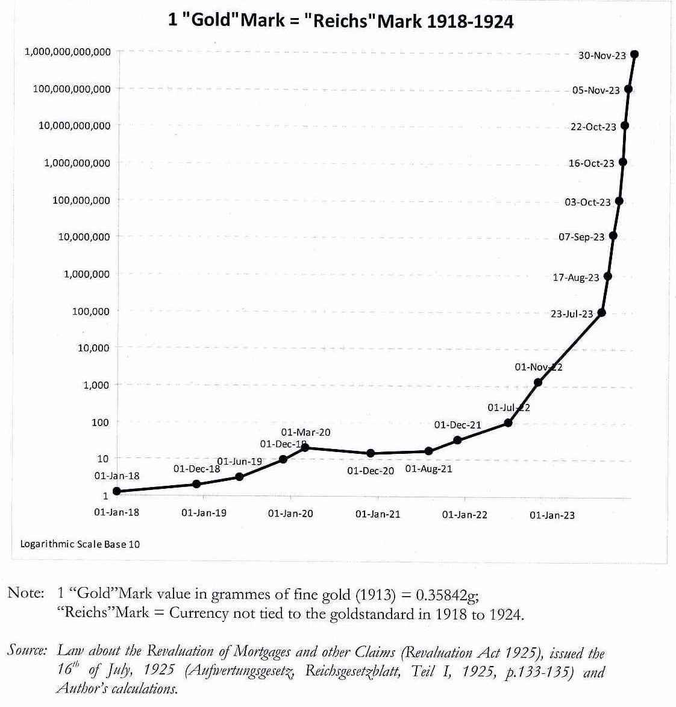

# [Инфляция](../../../2.1_society/cause_and_effect_relationships/articles/economic_chains.md), дефляция и нулевая инфляция

**Инфляция** — это [рост](../../../3.1. healthy lifestyle/Sleep, nutrition, and adolescent energy/articles/micronutrients_and_teenagers.md) общего уровня цен в экономике. **Дефляция** — наоборот, общее снижение цен. **Нулевая инфляция** — ситуация, когда средний [уровень](../../../../8.1_entertainment/articles/gamification.md) цен почти не меняется. На первый взгляд кажется, что идеальный вариант — это именно нулевая инфляция. Но в реальной экономике все немного сложнее: слишком высокая инфляция вредит людям и бизнесу, а длительная дефляция тоже может стать серьезной проблемой.

Через эту тему удобно понять, зачем нужен [центральный банк](./tsentralnyy_bank.md), как меняется [валютный курс](./valyutnyy_kurs.md), чем инфляция отличается от [девальвации](./devalvatsiya.md) и [деноминации](./denominatsiya.md), а также почему за ростом цен [внимательно](../../../4.1_rules_of_study/how_to_memorize/articles/vnimanie.md) следят в [еврозоне](./evrozona.md) и в странах с собственной валютой, например с [российским рублем](./rossiyskiy_rubl.md).

---

## Содержание

- [Что такое инфляция, дефляция и нулевая инфляция](#what-is-inflation)
- [Как измеряют изменение цен](#measuring-prices)
- [Почему возникает инфляция](#causes)
- [Почему дефляция тоже опасна](#deflation)
- [Нулевая инфляция: плюсы и минусы](#zero-inflation)
- [Как с этим работает центральный банк](#central-bank)
- [Не путать: инфляция, девальвация и деноминация](#not-confuse)
- [Примеры из истории](#history)
- [На пальцах](#simple)
- [Почему это важно школьнику](#school)
- [Самое главное](#main) 

---

## Что такое инфляция, дефляция и нулевая инфляция

Чтобы не путаться, удобно сразу развести три [близкие](../../../7.2 Media, leisure and hobbies /useful_and_interesting_leisure/articles/leisure_with_friends_and_family.md) темы.

| Понятие | Что это значит простыми словами |
|---|---|
| Инфляция | цены в среднем растут |
| Дефляция | цены в среднем падают |
| Нулевая инфляция | цены в среднем почти не меняются |

Важно слово **«в среднем»**. В магазине один товар может подешеветь, а другой — подорожать. Экономистов интересует не отдельная [цена](../../../6.1_Independent_living_and_daily_living_skills/reasonable_spending/articles/price.md), а общий уровень цен на большой набор товаров и услуг.

Если вчера на 100 рублей можно было купить 5 одинаковых булочек, а через год только 4, значит покупательная способность [денег](../../../8.2_future/choosing_a_career_path/articles/salary.md) снизилась. Это и есть одно из самых понятных проявлений инфляции.

Поэтому инфляция связана не только с цифрами в новостях. Она влияет на [зарплаты](../../../8.2_future/choosing_a_career_path/articles/salary.md), [карманные деньги](../../../6.1_Independent_living_and_daily_living_skills/reasonable_spending/articles/income.md), [накопления](../../../6.1_Independent_living_and_daily_living_skills/reasonable_spending/articles/savings.md) семьи, [стоимость](../../../6.1_Independent_living_and_daily_living_skills/reasonable_spending/articles/price.md) поездок, [техники](../../../8.2_future_and_path_choice/articles/03_stress_management.md), еды и услуг. 

---

## Как измеряют изменение цен

Обычно рост цен измеряют с помощью индексов, например индекса потребительских цен. Для этого смотрят на большой набор товаров и услуг, которыми люди пользуются в жизни: [еда](../../../3.1. healthy lifestyle/Sleep, nutrition, and adolescent energy/articles/stress_and_food.md), [одежда](../../../1.2_natural_sciences/physics_in_everyday_life/Q487005.md), [транспорт](../../../1.2_natural_sciences/physics_in_everyday_life/Q1751973.md), [связь](../../../1.2_natural_sciences/physics_in_everyday_life/Q12969754.md), жилье и многое другое.

*График потребительских цен и годовой инфляции. [Источник](../../../5.1_technology_and_digital_literacy/information and media literacy/дезинформация_и_фейки.md) визуала: Wikimedia Commons, [автор](../../../4.2_thinking_and_working_information/how_to_search_information/articles/copypaste.md) RCraig09, [лицензия](../../../4.2_thinking_and_working_information/how_to_search_information/articles/copyright.md) [CC BY-SA](../../../4.2_thinking_and_working_information/how_to_search_information/articles/copyright.md) 4.0; [файл](../../../5.1_technology_and_digital_literacy/operating system/articles/file_system.md) основан на данных US Bureau of Labor Statistics и FRED.*

Если такой набор товаров в целом дорожает, говорят об инфляции. Если дешевеет — о дефляции.

В реальной жизни цены растут неравномерно. Иногда сильнее дорожают [продукты](../../../3.1. healthy lifestyle/Sleep, nutrition, and adolescent energy/articles/healthy_school_snacks.md), иногда [энергия](../../../3.1. healthy lifestyle/Sleep, nutrition, and adolescent energy/articles/breakfast_for_the_brain.md), иногда [услуги](../../../8.1_self-understanding/HowToFindYourStrengths/articles/talent_monetization.md). Поэтому в разговоре об инфляции важно [помнить](../../../4.1_rules_of_study/how_to_memorize/articles/pamyat.md): это не одна случайная цена, а общая картина.

Именно поэтому за инфляцией внимательно следят и [центральные банки](./tsentralnyy_bank.md), и правительства, и обычные семьи. 

---

## Почему возникает инфляция

Инфляция может появляться по разным причинам, и обычно их бывает несколько сразу.

**Частые причины инфляции:**

- [спрос](../../../2.1_society/cause_and_effect_relationships/articles/economic_chains.md) растет быстрее, чем [производство](../../../2.1_society/cause_and_effect_relationships/articles/economic_chains.md) товаров и услуг;
- дорожают сырье, энергия и перевозки;
- компании поднимают цены из-за роста издержек;
- люди и [бизнес](../../../8.1_self-understanding/HowToFindYourStrengths/articles/talent_monetization.md) ждут дальнейшего роста цен и начинают вести себя так, будто он уже неизбежен;
- [валюта](../../../6.2_money_and_literacy/how_to_save_for_goal/articles/money.md) слабеет, и импортные товары становятся дороже, что связывает инфляцию со статьями [Валютный курс](./valyutnyy_kurs.md) и [Девальвация](./devalvatsiya.md).

Например, если подорожала [нефть](neft_v_mirovoy_ekonomike.md), перевозки и [электричество](../../../1.2_natural_sciences/physics_in_everyday_life/Q11408.md), то через некоторое [время](../../../1.2_natural_sciences/physics_in_everyday_life/Q20702.md) это может сказаться на ценах самых разных товаров. Поэтому статья [Нефть в мировой экономике](./neft_v_mirovoy_ekonomike.md) тоже помогает понять инфляцию.

Иногда инфляция бывает умеренной, а иногда очень высокой. Когда цены растут слишком быстро и люди перестают доверять [деньгам](../../../8.2_future/choosing_a_career_path/articles/salary.md), ситуация может стать крайне опасной для всей экономики. 

---

## Почему дефляция тоже опасна

На первый взгляд кажется, что падение цен — это только хорошо. Но если цены снижаются долго, люди и компании могут начать откладывать покупки и [инвестиции](aziatskie_tigry.md): зачем покупать сегодня, если завтра может быть дешевле?

Из-за этого бизнесу труднее продавать товары, компании меньше зарабатывают, откладывают [развитие](../../../3.1. healthy lifestyle/Sleep, nutrition, and adolescent energy/articles/micronutrients_and_teenagers.md), а иногда сокращают работников. Кроме того, долги при дефляции становятся тяжелее: [деньги](../../../2.1_society/cause_and_effect_relationships/articles/economic_chains.md) «дорожают», а выплачивать кредиты легче не становится.

*Пример длительной дефляции в Японии. Источник визуала: Wikimedia Commons, автор Floréalréal, лицензия CC BY-SA 4.0.*

Именно поэтому длительная дефляция считается проблемой. [Опыт](../../../1.2_natural_sciences/why_science_help_understand_world/experimental_science.md) Японии часто приводят как пример того, что экономика может надолго застрять в очень слабом росте цен или даже в их снижении.

Получается парадоксальная вещь: слишком высокая инфляция — плохо, но и длительная дефляция — тоже плохо. 

---

## Нулевая инфляция: плюсы и минусы

Нулевая инфляция звучит красиво: кажется, что цены стоят на месте, а деньги не теряют ценность. У такой ситуации действительно есть плюсы.

**Плюсы нулевой инфляции:**

- людям проще понимать, сколько на самом деле стоят товары;
- накопления обесцениваются медленнее;
- легче планировать [расходы](../../../6.1_Independent_living_and_daily_living_skills/reasonable_spending/articles/expense.md).

Но есть и минусы.

**Минусы нулевой инфляции:**

- если инфляция слишком близка к нулю, экономике легче «соскользнуть» в дефляцию;
- бизнесу и государству сложнее приспосабливаться к кризисам;
- центральному банку остается меньше пространства для маневра.

Поэтому многие центральные банки не стремятся к строго нулевой инфляции. Например, Европейский [центральный банк](tsentralnyy_bank.md) считает, что ценовую стабильность лучше всего поддерживать, когда инфляция в среднесрочном периоде находится около 2%. Это важно для понимания статей [Евро](./evro.md), [Еврозона](./evrozona.md) и [Центральный банк](./tsentralnyy_bank.md). 

---

## Как с этим работает [центральный банк](valyutnyy_kurs.md)

[Центральный банк](./tsentralnyy_bank.md) не может сделать так, чтобы цены вообще никогда не менялись. Но он старается не допустить слишком сильного роста цен и не дать экономике уйти в опасную дефляцию.

Обычно центральный банк влияет на ситуацию через [процентные ставки](evrozona.md) и другие [инструменты](../../../1.2_natural_sciences/physics_in_everyday_life/Q36253.md) денежно-кредитной политики.

Если инфляция слишком высокая, центральный банк может повышать [ставки](../../../3.1_healthy lifestyle/vrednye_privychki/articles/ludomania.md). Тогда кредиты становятся дороже, спрос охлаждается, и рост цен постепенно замедляется.

Если экономика слишком слабая и есть [риск](../../../1.2_natural_sciences/neurobiology_for_teens/articles/05_teen_brain.md) дефляции, центральный банк может снижать ставки и пытаться сделать деньги дешевле, чтобы поддержать спрос.

Вот почему темы инфляции и центрального банка почти всегда идут рядом. В статье про [еврозону](./evrozona.md) это особенно хорошо видно, потому что там за денежную политику отвечает один общий центр — Европейский центральный банк. 

---

## Не путать: инфляция, [девальвация](valyutnyy_kurs.md) и [деноминация](denominatsiya.md)

Эти слова часто звучат рядом, но означают разное.

| Понятие | О чем речь |
|---|---|
| Инфляция | общий рост цен внутри экономики |
| [Девальвация](devalvatsiya.md) | снижение стоимости национальной валюты по отношению к другим валютам |
| [Деноминация](denominatsiya.md) | изменение масштаба денежных единиц, когда [старые деньги](denominatsiya.md) меняют на новые по определенному соотношению |

Например, если [российский рубль](./rossiyskiy_rubl.md) слабеет по отношению к доллару или [евро](evro.md), это [Девальвация](./devalvatsiya.md). А если государство меняет денежные знаки и условно «убирает нули», это [Деноминация](./denominatsiya.md).

Эти процессы могут быть связаны между собой, но это не одно и то же. 

---

## Примеры из истории

Иногда инфляция выходит из-под контроля. Тогда говорят уже не просто о высокой инфляции, а о гиперинфляции.

*Гиперинфляция в Германии. Источник визуала: Wikimedia Commons, автор Wolfgang Chr. Fischer, лицензия CC BY-SA 3.0 / GFDL.*

На таком этапе деньги очень быстро теряют ценность. Люди стараются избавиться от них как можно скорее, потому что завтра на ту же сумму можно купить уже заметно меньше. Это разрушает [доверие](../../../1.2_natural_sciences/neurobiology_for_teens/articles/17_hugs_oxytocin.md) к денежной системе и мешает нормальной жизни экономики.

Исторические примеры полезны тем, что показывают крайние случаи. Они помогают понять, почему государства так внимательно относятся к инфляции и почему [устойчивость](../../../1.2_natural_sciences/physics_in_everyday_life/Q1530280.md) денег считается важной частью экономической безопасности. 

---

## На пальцах

Представьте, что в школьном буфете в начале года булочка стоит 20 рублей.

- Если через несколько месяцев она стоит 22 рубля, а потом 24, это похоже на **инфляцию**.
- Если она стоила 20 рублей, а потом 18 и 17, это похоже на **дефляцию**.
- Если она весь год стоит около 20 рублей, это похоже на **нулевую инфляцию**.

Но важно не только то, [что происходит](../../../5.1_technology_and_digital_literacy/how_internet_works/articles/web_basics/what_happens.md) с булочкой. Экономистов интересует большой набор товаров сразу: еда, одежда, связь, транспорт, жилье и услуги. 

---

## Почему это важно школьнику

Во-первых, инфляция напрямую влияет на повседневную [жизнь](../../../1.2_natural_sciences/physics_in_everyday_life/Q1751973.md): на стоимость еды, транспорта, техники, подписок и карманных расходов.

Во-вторых, через инфляцию проще понять новости. Когда говорят, что [центральный банк](./tsentralnyy_bank.md) меняет ставку, что ослаб [российский рубль](./rossiyskiy_rubl.md) или что вырос [курс валют](valyutnyy_kurs.md), это часто связано именно с темой цен.

В-третьих, статья про инфляцию помогает не путать несколько важных понятий: [Валютный курс](./valyutnyy_kurs.md), [Девальвация](./devalvatsiya.md), [Деноминация](./denominatsiya.md), [Евро](./evro.md) и [Еврозона](./evrozona.md).

Это одна из самых полезных тем всей вашей базы знаний, потому что она связывает деньги, банки, торговлю и повседневную жизнь обычного человека. 

---

## Самое главное

Инфляция — это рост общего уровня цен, дефляция — его снижение, а нулевая инфляция — ситуация, когда цены в среднем почти не меняются.

Слишком высокая инфляция вредит людям, бизнесу и доверию к деньгам. Но и длительная дефляция тоже опасна: она может тормозить покупки, инвестиции и [экономический рост](razvitye_i_razvivayushchiesya_strany.md).

Поэтому в современной экономике важна не просто «любая низкая цифра», а устойчивая ценовая ситуация, за которой следит [центральный банк](./tsentralnyy_bank.md). Именно через эту тему удобно понять связь со статьями [Валютный курс](./valyutnyy_kurs.md), [Девальвация](./devalvatsiya.md), [Деноминация](./denominatsiya.md), [Евро](./evro.md), [Еврозона](./evrozona.md) и [Российский рубль](./rossiyskiy_rubl.md). 

---

***Автор:** Лапенко Карина @Dhelprat*
***GitHub:*** *[Dhelprat](https://github.com/dhelprat)*
***Использованные [нейросети](../../../2.1_society/cause_and_effect_relationships/articles/ai_causality.md) и [ресурсы](../../../2.1_society/cause_and_effect_relationships/articles/ecological_footprint.md):*** *[ChatGPT](../../../7.1_art/modern_technological_art/articles/6.1_prompt_art.md) 5.4; IMF, “Inflation: Prices on the Rise”; European Central Bank, “Two per cent inflation target” и “The monetary policy strategy statement (2025)”; Japan Cabinet Office, “Advancing Deflation and Monetary Policy”; Bank of Japan, [материалы](../../../1.2_natural_sciences/physics_in_everyday_life/Q487005.md) о дефляции; Wikimedia Commons (локальные свободно лицензированные визуалы); материалы курса по оформлению статей в GFM.*
