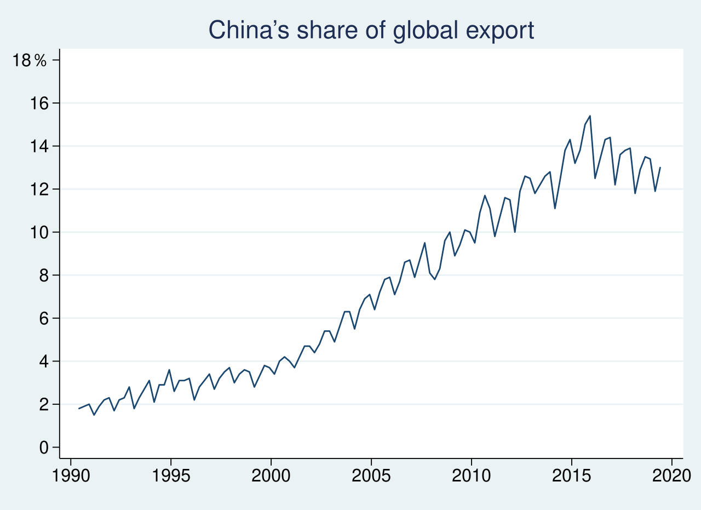
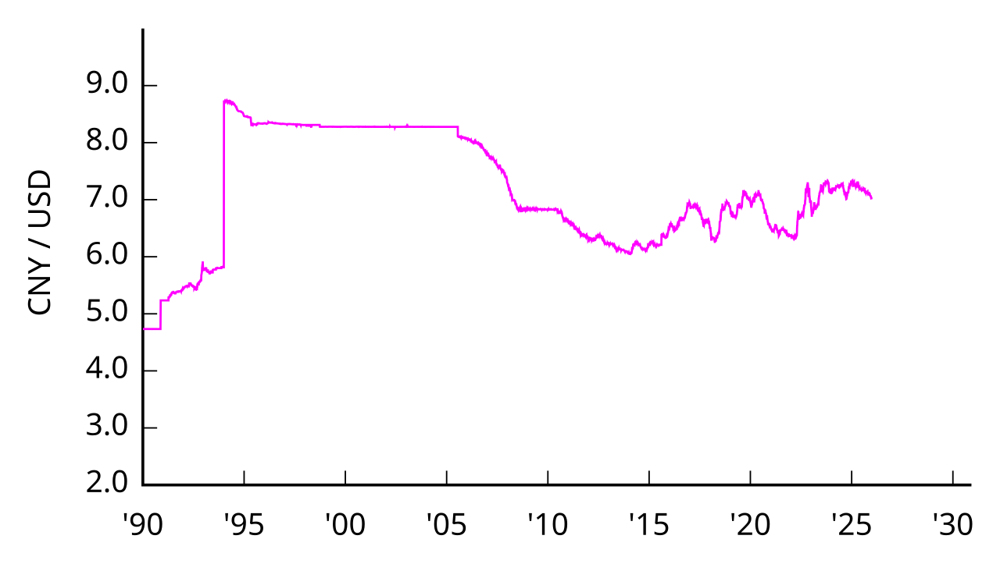
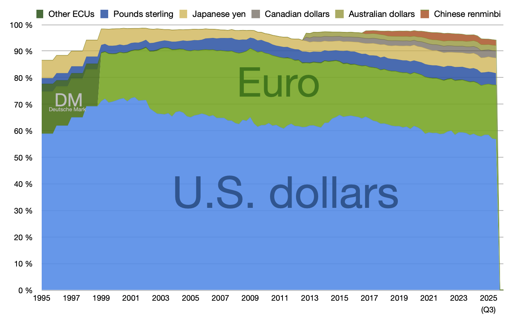

# Китайский юань

**Китайский юань** — это денежная единица Китая и одна из самых заметных валют современной мировой экономики. Когда говорят о росте Китая, международной торговле, конкуренции валют и попытках сделать мировую финансовую систему менее зависимой от одной страны, почти всегда вспоминают юань.

Для темы «Мировая экономика на пальцах» юань особенно важен, потому что он находится на пересечении сразу нескольких больших сюжетов: [Валютный курс](./valyutnyy_kurs.md), [Центральный банк](./tsentralnyy_bank.md), [Резервная валюта](./rezervnaya_valyuta.md), [БРИКС](./briks.md), [Доллар США](./dollar_ssha.md), [Евро](./evro.md), [Нефть в мировой экономике](./neft_v_mirovoy_ekonomike.md) и [Глобализация](./globalizatsiya.md).

---

## Содержание

- [Что такое китайский юань](#what-is-cny)
- [Почему юань важен для мировой экономики](#why-important)
- [Юань и мировой экспорт Китая](#export-role)
- [Юань и валютный курс](#exchange-rate)
- [Юань в международных платежах](#payments)
- [Юань и резервная валюта](#reserve-currency)
- [Почему юань пока не равен доллару](#not-equal-dollar)
- [Юань, БРИКС и идея более многополярного мира](#brics)
- [Юань и нефть](#oil)
- [На пальцах](#simple)
- [Почему это важно школьнику](#school)
- [Самое главное](#main) 

---

## Что такое китайский юань

Если говорить просто, **юань** — это основная денежная единица Китая. Но здесь есть важная тонкость: официальное название китайских денег — **жэньминьби**. На практике в обычной речи чаще используют слово «юань», а в международных обозначениях — код **CNY**.

Чтобы не запутаться, удобно пользоваться такой таблицей:

| Термин | Что это значит |
|---|---|
| Жэньминьби (RMB) | официальное название китайской денежной системы |
| Юань | основная денежная единица внутри этой системы |
| CNY | международный код валюты |
| ¥ | знак валюты |

Юань выпускает и регулирует Народный банк Китая — то есть китайский [центральный банк](./tsentralnyy_bank.md). Он влияет на денежную систему страны, контролирует выпуск наличных денег, участвует в регулировании финансового рынка и играет важную роль в формировании [валютного курса](./valyutnyy_kurs.md) юаня. 

---

## Почему юань важен для мировой экономики

Значение юаня объясняется не тем, что он «самый сильный» или «самый главный», а тем, что за ним стоит огромная экономика Китая.

Вот почему юань важен:

- Китай производит и экспортирует огромное количество товаров.
- Многие страны торгуют с Китаем постоянно и в больших объемах.
- Китай стремится расширять использование юаня в международных расчетах.
- Юань все чаще обсуждают как часть более многополярной мировой финансовой системы.

Из-за этого юань сравнивают с [долларом США](./dollar_ssha.md) и [евро](./evro.md). Но сравнение не означает, что эти валюты уже равны по влиянию. Пока [доллар](dollar_ssha.md) и [евро](evro.md) играют в мировой системе намного более заметную роль, хотя юань постепенно усиливает свои позиции. 

---

## Юань и мировой экспорт Китая

Юань не стал заметной валютой сам по себе. Его международное значение выросло потому, что Китай превратился в одну из крупнейших экономик мира и в одного из главных участников мировой торговли. Чем больше страна продает и покупает, тем чаще ее валюта начинает использоваться за пределами этой страны.

*Доля Китая в мировом экспорте, 1990–2019. Источник визуала: Wikimedia Commons, автор Normchou, лицензия CC BY-SA 4.0; график основан на данных CEIC, опубликованных Wall Street Journal.*

Именно поэтому статья о китайском юане тесно связана с [глобализацией](./globalizatsiya.md). В глобальной экономике товары могут проектироваться в одной стране, собираться в другой, продаваться в третьей, а оплачиваться в четвертой валюте. Китай участвует в таких цепочках почти во всех крупных регионах мира. 

---

## Юань и валютный курс

Как и любая валюта, юань имеет свой [валютный курс](./valyutnyy_kurs.md). Это значит, что за одну сумму в юанях можно получить разное количество долларов, евро или других денег в зависимости от ситуации на рынке.

Но курс юаня — не совсем такая же история, как у некоторых других валют. На него заметно влияет государство. В Китае финансовая система регулируется сильнее, чем во многих западных странах. Поэтому юань нельзя полностью сравнивать, например, с [долларом США](./dollar_ssha.md), курс которого в большой степени определяется мировым рынком.

*Курс юаня к доллару США с 1990 года. Источник визуала: Wikimedia Commons, автор Monaneko, лицензия CC BY 3.0; график основан на данных Federal Reserve Board H.10.*

Для восьмиклассника это можно объяснить так: иногда государство позволяет валюте «плавать» почти свободно, а иногда старается держать ее движение под контролем. Китай чаще выбирает второй вариант, потому что для него очень важны стабильность торговли, цены на экспорт и общая устойчивость экономики.

Именно поэтому разговор о юане почти всегда связан со статьями [Центральный банк](./tsentralnyy_bank.md) и [Валютный курс](./valyutnyy_kurs.md). 

---

## Юань в международных платежах

Один из способов понять роль валюты — посмотреть, насколько часто ее используют в международных платежах. По данным SWIFT за август 2025 года, юань оставался **6-й по активности валютой** в глобальных платежах по стоимости переводов с долей **2,93%**. Это означает, что юань уже заметен в международных расчетах, но пока сильно уступает лидерам — доллару и евро.

Этот факт хорошо показывает, что юань нельзя называть «главной мировой валютой», но и недооценивать его тоже нельзя. Он уже стал заметным инструментом международных расчетов, особенно в торговле с Китаем и с рядом его партнеров. 

---

## Юань и резервная валюта

Еще один важный вопрос: хранят ли государства юань в своих международных резервах? Это уже тема статьи [Резервная валюта](./rezervnaya_valyuta.md).

По данным IMF COFER, доля китайского ренминби в мировых валютных резервах составляла **1,93%** в третьем квартале 2025 года. Это показывает, что юань уже присутствует в резервах центральных банков, но его роль пока намного скромнее роли доллара и евро.

*Структура мировых валютных резервов. Источник визуала: Wikimedia Commons, автор Spitzl, лицензии CC BY-SA 3.0 и GFDL; график актуализирован на основе данных IMF COFER. На нем видно, что юань уже входит в состав резервных валют, но его доля пока невелика по сравнению с долларом США и евро.*

Важно понимать: статус резервной валюты зависит не только от размеров экономики. Нужны также доверие со стороны других стран, удобство использования валюты в международных расчетах, развитые финансовые рынки и уверенность в том, что активы в этой валюте можно быстро покупать, продавать и переводить. 

---

## Почему юань пока не равен доллару

Юань часто обсуждают как возможного конкурента доллара, но между ними есть важные различия.

Во-первых, роль [доллара США](./dollar_ssha.md) складывалась десятилетиями. Доллар глубоко встроен в мировую торговлю, международные кредиты, расчеты за сырье и валютные резервы государств.

Во-вторых, курс юаня не является полностью свободным. Китайские власти заметно сильнее управляют курсом своей валюты, чем страны с полностью плавающим курсом. Это помогает поддерживать стабильность, но одновременно ограничивает привлекательность юаня для части международных инвесторов.

В-третьих, Китай сохраняет более жесткий контроль над движением капитала, чем многие государства с ведущими мировыми валютами. Это тоже влияет на темпы превращения юаня в полноценную мировую [резервную валюту](./rezervnaya_valyuta.md).

Именно поэтому статья о юане должна ссылаться не только на [резервную валюту](./rezervnaya_valyuta.md), но и на [валютный курс](./valyutnyy_kurs.md) и [центральный банк](./tsentralnyy_bank.md): без них невозможно понять, почему одна валюта усиливается быстрее, а другая — медленнее. 

---

## Юань, БРИКС и идея более многополярного мира

Юань часто упоминают рядом с [БРИКС](./briks.md), потому что внутри этого объединения часто обсуждают расширение расчетов в национальных валютах. В таких разговорах юань выглядит особенно заметно: за ним стоит большая экономика, мощный экспорт и растущее влияние Китая на мировую торговлю.

Но здесь важно не упрощать. Разговор о расчетах в юанях — это не обязательно «конец доллара». Скорее это попытка сделать мировую финансовую систему более разнообразной, чтобы в ней играли роль не одна-две валюты, а большее число крупных участников.

Поэтому юань — не «замена» доллару в один момент, а пример того, как валюта постепенно расширяет международную роль. 

---

## Юань и нефть

Тема юаня связана и со статьей [Нефть в мировой экономике](./neft_v_mirovoy_ekonomike.md). Долгое время значительная часть мировых расчетов за [нефть](neft_v_mirovoy_ekonomike.md) была тесно связана с долларом, и это стало основой системы [Нефтедоллар](./neftedollar.md). Однако в последние годы все чаще обсуждается возможность проводить часть сделок в других валютах, в том числе в юанях.

Для Китая это особенно важно, потому что он является одним из крупнейших потребителей энергоресурсов в мире. Если страна много закупает сырья, ей выгодно, чтобы в международной торговле росла роль ее собственной валюты.

Именно здесь юань превращается из просто «денег Китая» в элемент большого разговора о том, как устроена мировая экономика, кто задает в ней правила и в каких валютах эти правила работают. 

---

## На пальцах

Представьте, что в школе есть один очень большой магазин, где покупают почти все. Если этот магазин принимает только один вид жетонов, то именно эти жетоны становятся главными.

Теперь представьте, что появляется второй огромный магазин, которым тоже пользуется почти вся школа. Он начинает принимать уже свои жетоны. Если туда ходит много людей, а товары там нужны всем, эти жетоны тоже становятся важными.

Примерно так и работает юань. Китай стал настолько большим участником мировой торговли, что его валюта тоже начала получать более заметную роль в международных расчетах. 

---

## Почему это важно школьнику

Тема китайского юаня может показаться далекой, но на самом деле она связана с повседневной жизнью.

Во-первых, множество товаров, которыми люди пользуются каждый день, так или иначе связаны с Китаем: электроника, детали для техники, зарядки, одежда, бытовые вещи. Когда меняются международные расчеты, торговые отношения и [валютный курс](./valyutnyy_kurs.md), это постепенно отражается и на ценах.

Во-вторых, через юань легко понять, что мировая экономика — это не только заводы и корабли, но и деньги, которыми оплачивают товары. То, в какой валюте проходит расчет, иногда влияет не меньше, чем сам объем торговли.

В-третьих, юань — хороший пример того, как экономика связана с политикой, международными отношениями и технологиями. Через эту тему удобно изучать [глобализацию](./globalizatsiya.md), роль [центрального банка](./tsentralnyy_bank.md) и смысл понятия [резервная валюта](./rezervnaya_valyuta.md). 

---

## Самое главное

Китайский юань — это валюта одной из крупнейших экономик мира. Его значение растет вместе с ростом международной торговли Китая и с попытками расширить использование национальных валют в мировых расчетах.

Но юань пока нельзя поставить в один ряд с долларом по реальному мировому влиянию. Он уже заметен, уже важен и уже используется в международных расчетах и резервах, но его роль пока намного скромнее, чем у [доллара США](./dollar_ssha.md) и [евро](./evro.md).

Именно поэтому юань — очень удобная тема для понимания современной мировой экономики: на его примере хорошо видно, как торговля, политика, доверие к валюте и действия государства вместе меняют устройство финансового мира. 

---

***Автор:** Лапенко Карина @Dhelprat*
***GitHub:*** *[Dhelprat](https://github.com/dhelprat)*
***Использованные нейросети и ресурсы:*** *ChatGPT 5.4; Wikimedia Commons (свободно лицензированные визуалы); SWIFT RMB Tracker; IMF COFER; Board of Governors of the Federal Reserve System, “Internationalization of the Chinese renminbi: progress and outlook” (2024); материалы курса по оформлению статей в GFM.*
