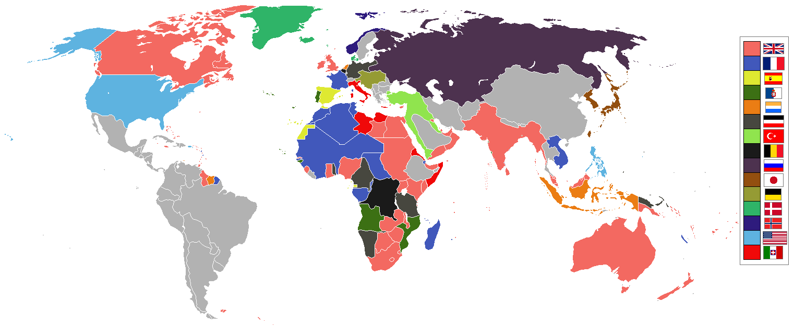
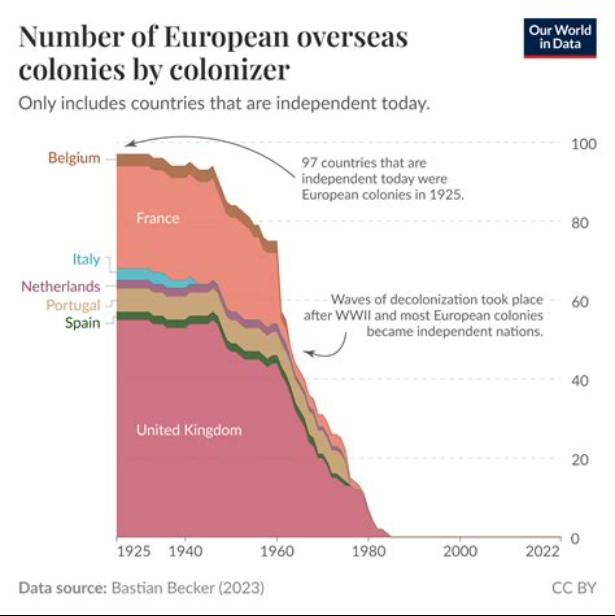
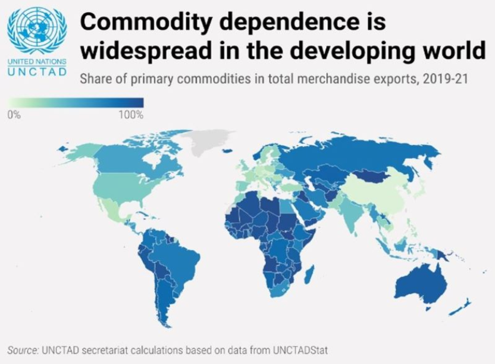
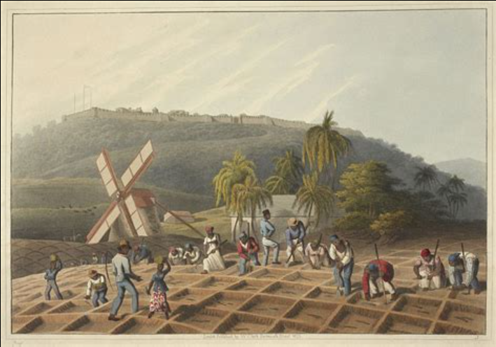

# Колониализм и неоколониализм в мировой экономике

---

Мировая экономика формировалась неравномерно, и одна из причин этого — колониальное прошлое многих стран. Даже после формального распада колониальных империй экономическая зависимость в ряде случаев сохранилась в новых формах, которые называют неоколониализмом.

Мировая экономика складывалась не сама по себе и не в равных условиях для всех стран. На протяжении нескольких веков одни государства захватывали территории других, устанавливали над ними политический и экономический контроль, вывозили ресурсы, использовали дешёвый труд и подчиняли торговлю своим интересам. Такая система получила название колониализм.

Даже после распада колониальных империй полное равенство в мировой экономике не наступило. Многие бывшие колонии стали формально независимыми, но сохранили сильную зависимость от внешнего капитала, технологий, рынков сбыта и международных финансовых центров. Эти более современные формы подчинения часто называют неоколониализмом. Чтобы понять, почему одни страны богаче других, почему мировая торговля устроена именно так и откуда берётся глобальное неравенство, эту тему важно рассматривать не только как историческую, но и как экономическую.

---

## Содержание

- [Что это такое](#what-is)
- [Почему это важно для мировой экономики](#why-important)
- [Как это работает](#how-it-works)
- [Пример из реальной жизни](#real-life)
- [На пальцах](#simple)
- [Почему это важно школьнику](#school)
- [С чем связана статья в базе знаний](#links)
- [Интересный факт](#fact)
- [Заключение](#main)

---

## Что это такое

Колониализм — это система, при которой сильное государство устанавливает контроль над другой территорией и использует её в своих интересах. Государство, которое владеет колониями, называют метрополией, а зависимую территорию — колонией.

Колония обычно не имела реальной самостоятельности. Её экономика подстраивалась под нужды метрополии:

- добывать сырьё;
- выращивать экспортные культуры;
- закупать готовые товары у страны-господина;
- обеспечивать дешёвую рабочую силу;
- приносить доход за счёт налогов и торговли.

Иными словами, колониальная экономика строилась не для удобного и гармоничного развития самой колонии, а для выгоды внешнего центра.

Неоколониализм — это более современная форма зависимости, при которой формально независимое государство остаётся экономически подчинённым более сильным странам, международным корпорациям или финансовым институтам. Внешнего управления как в классической колонии уже нет, но сохраняется неравноправие в возможностях и в распределении выгод.

Неоколониальная зависимость может проявляться по-разному:

- через экспорт почти одного только сырья;
- через долги и зависимость от международных кредиторов;
- через контроль внешних компаний над ключевыми отраслями;
- через технологическое отставание;
- через зависимость от иностранных рынков сбыта;
- через ситуацию, когда страна продаёт дешёвое сырьё, а покупает дорогую готовую продукцию.

Таким образом, колониализм — это прямое политическое господство, а неоколониализм — экономическая зависимость без формального захвата.

## Почему это важно для мировой экономики

Эта тема важна потому, что она помогает объяснить, почему мировой экономический порядок сложился неравномерно. Богатство многих современных развитых стран формировалось не только за счёт внутреннего труда, науки и промышленности, но и за счёт доступа к дешёвым ресурсам, рабочей силе и рынкам подвластных территорий.

На графике видно, как в течение нескольких столетий росло число заморских колоний европейских держав, а затем в XX веке начался резкий спад. Это помогает понять, что колониальная система существовала очень долго и серьёзно повлияла на устройство мировой экономики.

Колониальная система влияла сразу на несколько вещей.

Во-первых, она определяла, кто производит сырьё, а кто перерабатывает и получает основную прибыль. Колонии поставляли хлопок, сахар, каучук, металлы, специи, чай, кофе, [нефть](neft_v_mirovoy_ekonomike.md) и другие ресурсы, а основные доходы от переработки, перевозки и продажи концентрировались в метрополиях.

Во-вторых, она закрепляла неравномерное развитие территорий. В колониях часто строили дороги, порты и железные дороги не ради внутреннего развития, а ради вывоза сырья. Это означало, что инфраструктура создавалась под внешние нужды, а не под полноценное развитие собственной экономики.

В-третьих, колониализм повлиял на мировое разделение труда. Многие страны на долгие годы оказались в роли поставщиков первичной продукции, а индустриальные центры сосредоточились в Европе и Северной Америке. Даже после получения независимости изменить такую структуру оказалось трудно.

В-четвёртых, колониальное прошлое связано с современным глобальным неравенством. Бывшие колонии в Африке, Азии и Латинской Америке нередко унаследовали слабую промышленную базу, зависимость от одного-двух экспортных товаров, искусственно проведённые границы, внутренние конфликты и высокую уязвимость к внешним кризисам.

Неоколониализм важен уже для понимания современности. Он показывает, что формальная независимость ещё не означает полной экономической свободы. Страна может иметь флаг, правительство и место в ООН, но при этом в значительной степени зависеть от внешних займов, цен на мировой рынок, зарубежных технологий и решений крупных международных игроков.

## Как это работает

### Как работал классический колониализм

В колониальную эпоху метрополия стремилась встроить зависимую территорию в выгодную для себя схему. Чаще всего это выглядело так:

- колония поставляет сырьё;
- метрополия перерабатывает его на своих фабриках;
- готовая продукция продаётся обратно, в том числе в саму колонию;
- основная прибыль остаётся у метрополии;
- местная экономика развивается однобоко и зависимо.

Например, территория могла специализироваться только на одном виде продукции: сахаре, хлопке, какао, меди или нефти. Это делало её уязвимой: если мировые цены падали, доходы резко сокращались. Кроме того, население колоний часто не имело возможности развивать собственную промышленность, потому что это противоречило интересам метрополии.

Колониальная система нередко сопровождалась:

- принудительным трудом;
- насильственным изъятием земли;
- налоговым давлением;
- ограничением местного самоуправления;
- дискриминацией населения;
- насильственным навязыванием выгодных метрополии торговых правил.

### Как проявляется неоколониализм сегодня

В современном мире зависимость обычно не выглядит как прямой захват территории. Она действует тоньше и часто экономическими методами.

### Сырьевая зависимость

Если страна в основном продаёт нефть, руду, зерно, кофе, какао или другой сырьевой товар, а покупает за рубежом машины, лекарства, электронику и технологии, то она получает меньшую часть мировой прибыли. Готовая продукция обычно приносит больше дохода, чем продажа сырья.

### Долговая зависимость

Когда страна сильно зависит от внешних кредитов, она может оказаться вынуждена подстраивать свою экономическую политику под требования кредиторов. Это ограничивает свободу принятия решений, особенно если у государства слабая экономика и мало внутренних ресурсов.

### Зависимость от иностранных компаний

Если ключевые отрасли — добыча ресурсов, энергетика, транспорт, связь или банковский сектор — сильно зависят от внешнего капитала, значительная часть прибыли может уходить за границу. Формально предприятие работает внутри страны, но контроль над решениями и доходами находится вне её.

### Технологическое отставание

Страна может быть политически независимой, но без собственных технологий, научной базы и промышленного оборудования она остаётся зависимой от тех, кто всё это производит. Такая зависимость особенно заметна в высокотехнологичных сферах.

### Неравноправные условия мировой торговли

Некоторые страны десятилетиями остаются в положении, когда им легче продавать сырьё, чем продвигать на мировой рынок собственную сложную продукцию. Это связано и с историей, и со структурой экономики, и с тем, что правила мировой конкуренции изначально были сформированы более сильными игроками.

На инфографике видно, что зависимость от экспорта сырья особенно широко распространена среди развивающихся стран. Это важно для темы неоколониализма, потому что такая структура экономики делает страны более уязвимыми к внешнему спросу, ценовым колебаниям и влиянию более сильных игроков.

## Пример из реальной жизни

Хорошим примером могут служить многие бывшие колонии в Африке и Латинской Америке, экономика которых долгое время строилась вокруг экспорта одного или нескольких ресурсов. Например, страна могла десятилетиями поставлять на мировой рынок кофе, какао, медь или нефть, но при этом не развивать у себя переработку, машиностроение или высокотехнологичные отрасли.

В такой ситуации государство оказывается очень зависимым от мировой конъюнктуры. Если цены на экспортный товар растут, экономика получает доход. Если падают — начинаются бюджетные проблемы, сокращаются социальные расходы, увеличивается внешний долг. Получается, что судьба страны во многом зависит не от неё самой, а от внешнего рынка.

Ещё один пример — ситуация, когда иностранные компании получают доступ к добыче ресурсов, строят инфраструктуру под вывоз сырья и извлекают прибыль, а местная экономика получает лишь часть выгоды. Формально всё может происходить по законным контрактам, но структура отношений остаётся неравной: одна сторона контролирует технологии, капитал и каналы сбыта, а другая поставляет ресурсы и зависит от этих связей.

Можно также вспомнить, что многие современные морские маршруты, порты и торговые центры выросли из логики колониальной торговли. То, как сегодня движутся товары по миру, во многом связано с экономической географией, сформированной ещё в эпоху империй.

## На пальцах

Колониализм — это когда сильная страна подчиняет слабую и использует её ресурсы в свою пользу. Неоколониализм — когда формально страна независима, но её экономика всё равно сильно зависит от более сильных государств или компаний.

Если говорить ещё проще, колониализм — это ситуация, когда одна страна говорит другой: «Ты будешь работать на меня, отдавать ресурсы и покупать мои товары». То есть одна сторона получает главную выгоду, а другая оказывается в подчинённом положении.

На изображении видно, что колониальная экономика опиралась не только на торговлю и захват территорий, но и на тяжёлый труд зависимого населения. Такие формы организации труда позволяли метрополиям получать сырьё и прибыль, в то время как основная нагрузка ложилась на колонизированные общества.

Неоколониализм — это похожая ситуация, только без официального захвата. Страна вроде бы независима, но её экономика устроена так, что она всё равно сильно зависит от более богатых и сильных игроков. Она может продавать дешёвое сырьё, брать кредиты, покупать дорогие технологии и постоянно находиться в положении догоняющего.

Если совсем просто, это как разница между явной командой и скрытой зависимостью. В первом случае тебе прямо приказывают. Во втором — тебе ничего не приказывают формально, но вся система устроена так, что выбирать по-настоящему свободно трудно.

## Почему это важно школьнику

- помогает понять, почему страны мира развиваются не одинаково;
- объясняет, откуда берутся бедность, зависимость и неравенство;
- делает новости о международной политике понятнее;
- показывает, что экономика тесно связана с историей.

Эта тема важна, потому что без неё трудно понять, почему страны мира развиваются настолько неравномерно. На карте это выглядит просто: одни страны богаче, другие беднее. Но за этим стоят долгие исторические процессы.

Изучая колониализм и неоколониализм, школьник начинает видеть, что экономика — это не только цифры, заводы и торговля. Это ещё и вопрос власти, зависимости, контроля над ресурсами и исторической справедливости.

Тема помогает:

- понимать, почему многие страны Африки, Азии и Латинской Америки сталкиваются с похожими трудностями;
- видеть связь между историей и современной мировой экономикой;
- разбираться в новостях о долгах, сырье, международных компаниях и глобальном неравенстве;
- лучше понимать, почему некоторые страны стремятся к большей экономической самостоятельности.

Кроме того, это полезно для изучения истории, географии, обществознания и экономики одновременно. Тема учит смотреть на мир глубже и не принимать современное положение стран как нечто случайное или естественное.

## С чем связана статья в базе знаний

- [Развитые и развивающиеся страны](./razvitye_i_razvivayushchiesya_strany.md) — исторические причины различий в развитии.
- [Глобализация](./globalizatsiya.md) — современная форма мировой взаимосвязанности может и уменьшать, и воспроизводить неравенство.
- [План Маршалла](./plan_marshalla.md) — пример внешнего экономического влияния, но в ином контексте.
- [БРИКС](./briks.md) — часть стран [БРИКС](briks.md) выступает за более справедливое устройство мировой экономики.
- [Нефть в мировой экономике](./neft_v_mirovoy_ekonomike.md) — сырьевая специализация часто связана с историей внешнего контроля и зависимости.
- [Суэцкий канал](./suetskiy_kanal.md) — стратегический маршрут, тесно связанный с историей мирового господства.
- [Панамский канал](./panamskiy_kanal.md) — стратегический маршрут, тесно связанный с историей мирового господства.

## Интересный факт

Во многих бывших колониях железные дороги сначала строили не для связи городов между собой, а для того, чтобы быстрее вывозить сырьё из внутренних районов в порт. То есть даже инфраструктура изначально создавалась не для удобства местного населения, а для интересов внешней торговли.

## Заключение

Колониализм и неоколониализм помогают объяснить, почему мировая экономика устроена неравномерно. Без этой темы трудно понять происхождение глобального неравенства и зависимого положения части стран.

Колониализм и неоколониализм — это ключевые понятия для понимания мировой экономики. Они помогают объяснить, почему одни страны исторически накопили богатство и технологии, а другие долгое время оставались в зависимом положении.

Колониальное господство ушло в прошлое, но его последствия заметны до сих пор: в структуре торговли, в уровне развития, в распределении ресурсов и в характере международных отношений. Поэтому эту тему важно рассматривать не только как часть истории, но и как способ понять современный мир — его неравенство, взаимозависимость и борьбу за более справедливое экономическое устройство.

---

***Автор:** Георгий Голосов @goschikk*  
***GitHub:*** *[GeorgyGolosov](https://github.com/GeorgyGolosov)*  
***Использованные нейросети и ресурсы:*** *ChatGPT 5.4.*
