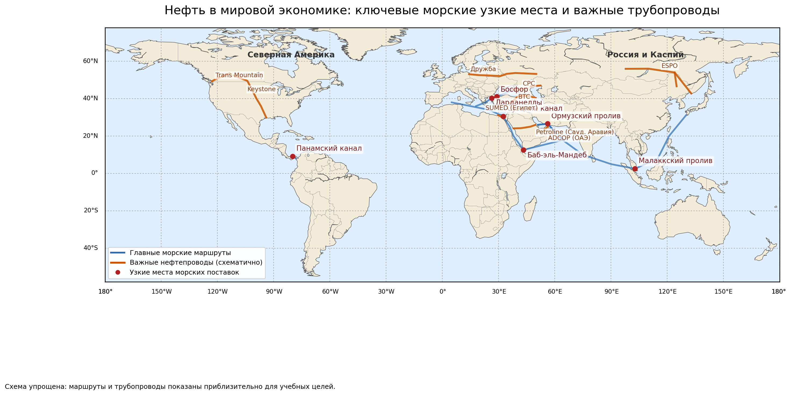
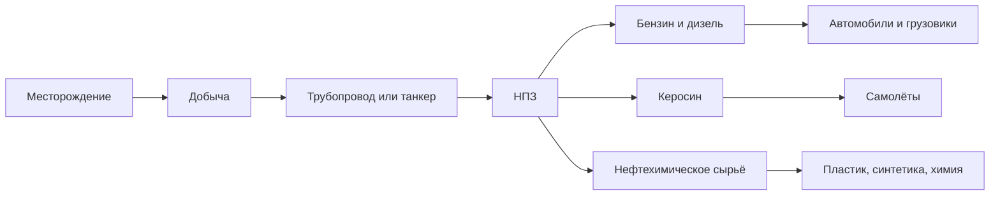
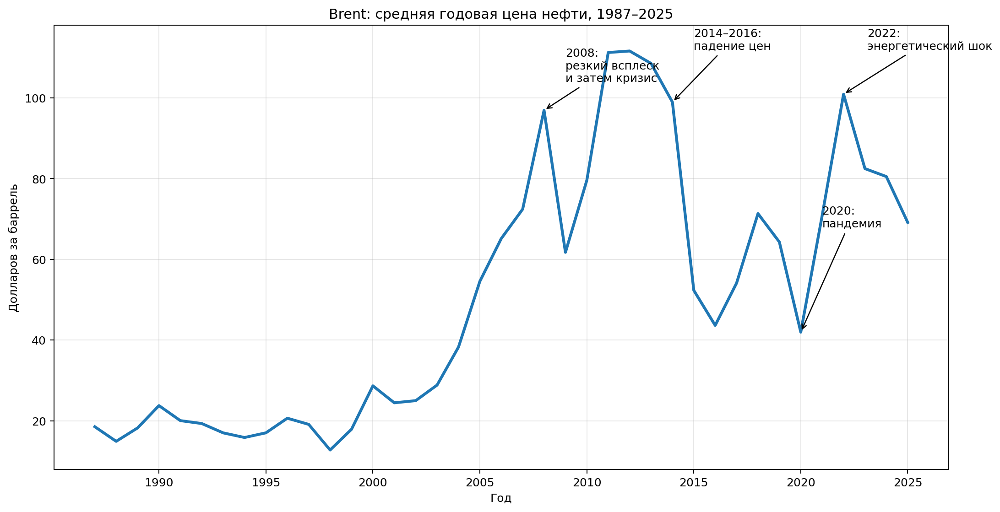
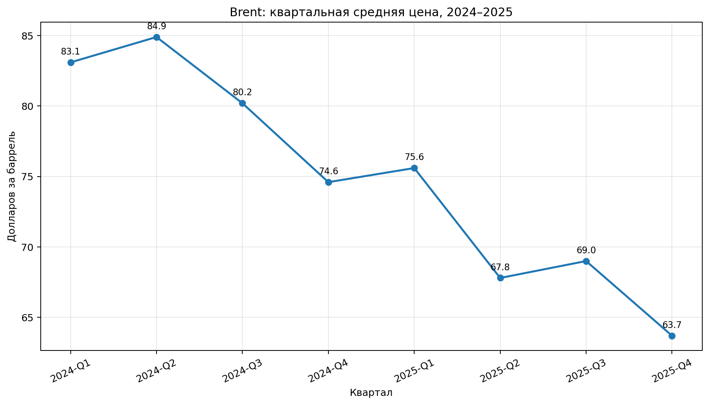
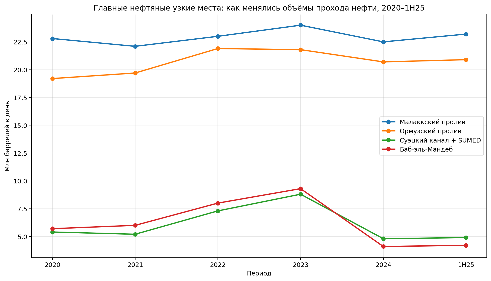
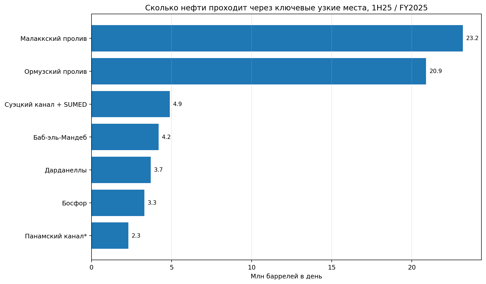
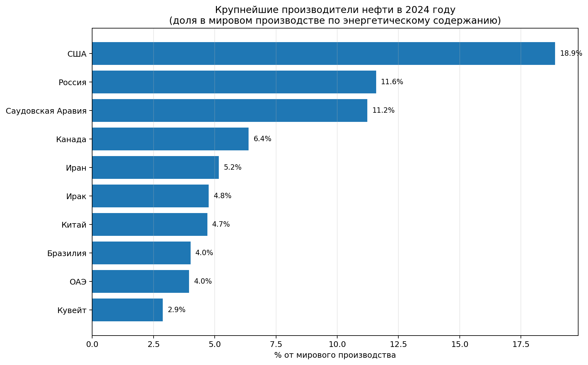

# Нефть в мировой экономике

**Нефть** — это одно из самых важных сырьевых богатств современной мировой экономики. Из нефти получают бензин, дизель, керосин, мазут и сырьё для пластика, синтетических тканей, химии и множества бытовых вещей. Поэтому разговор о нефти — это не только разговор про заправки, но и про транспорт, производство, международную торговлю, политику и даже валюты.

Для темы «Мировая экономика на пальцах» эта статья особенно важна потому, что через нефть хорошо видно, как связаны [Глобализация](./globalizatsiya.md), [Доллар США](./dollar_ssha.md), [Нефтедоллар](./neftedollar.md), [Китайский юань](./kitayskiy_yuan.md), [БРИКС](./briks.md), [Ормузский пролив](./ormuzskiy_proliv.md), [Суэцкий канал](./suetskiy_kanal.md), [Босфор и Дарданеллы](./bosfor_i_dardanelly.md) и [Российский рубль](./rossiyskiy_rubl.md).

## Содержание

- [Что это такое](#what-is)
- [Где в мире проходит «нефтяная география»](#map)
- [Почему нефть так важна для мировой экономики](#why-important)
- [Как работает мировой рынок нефти](#how-market-works)
- [Что влияет на цену нефти](#price)
- [Узкие места и маршруты поставок](#chokepoints)
- [Кто много добывает нефти](#producers)
- [Нефть, валюты и политика](#currencies)
- [Пример из реальной жизни](#real-life)
- [На пальцах](#simple)
- [Почему это важно школьнику](#school)
- [С чем связана эта статья в базе знаний](#links)
- [Интересный факт](#fact)
- [Главное](#main)
- [Источники данных и визуалов](#sources)

<a id="what-is"></a>
## Что это такое

Если совсем просто, **нефть** — это природное сырьё, которое добывают из-под земли и моря, а потом перерабатывают на специальных заводах — **нефтеперерабатывающих заводах**, или **НПЗ**.

После переработки нефть превращается не в «одну вещь», а сразу во множество разных продуктов:

| Что получают из нефти | Где это используется |
|---|---|
| Бензин и дизель | автомобили, автобусы, грузовики |
| Керосин | авиация |
| Мазут и другие тяжёлые продукты | энергетика, судоходство, промышленность |
| Нефтехимическое сырьё | пластик, упаковка, синтетика, бытовая химия, часть лекарств и косметики |

> [!NOTE]
> **Важно:** нефть — это не только топливо. Очень много современных предметов вокруг нас так или иначе связаны с нефтехимией.

<a id="map"></a>
## Где в мире проходит «нефтяная география»

Ниже — схема с важнейшими морскими узкими местами и крупными трубопроводами.



*Синим показаны главные морские маршруты, оранжевым — важные нефтепроводы, красным — узкие места морских поставок. Схема учебная и упрощённая.*

> [!IMPORTANT]
> На такой карте особенно хорошо видно, что нефть — это не просто «ресурс в земле». Для мировой экономики не менее важны **маршруты**, **проливы**, **каналы**, **порты** и **трубопроводы**. Если где-то возникает проблема, это может повлиять на цены по всему миру.

Ниже представлена интерактивная карта в формате GeoJSON:

```geojson
{
  "type": "FeatureCollection",
  "features": [
    {
      "type": "Feature",
      "properties": {
        "title": "Ормузский пролив",
        "description": "Один из самых важных нефтяных chokepoints мира. Через него проходят поставки из стран Персидского залива.",
        "marker-color": "#b22222",
        "marker-size": "medium",
        "marker-symbol": "circle"
      },
      "geometry": {
        "type": "Point",
        "coordinates": [
          56.25,
          26.57
        ]
      }
    },
    {
      "type": "Feature",
      "properties": {
        "title": "Баб-эль-Мандеб",
        "description": "Южные ворота Красного моря: важен для пути к Суэцкому каналу.",
        "marker-color": "#b22222",
        "marker-size": "medium",
        "marker-symbol": "circle"
      },
      "geometry": {
        "type": "Point",
        "coordinates": [
          43.35,
          12.6
        ]
      }
    },
    {
      "type": "Feature",
      "properties": {
        "title": "Суэцкий канал",
        "description": "Связывает Красное и Средиземное моря. Ключевой путь между Азией и Европой.",
        "marker-color": "#b22222",
        "marker-size": "medium",
        "marker-symbol": "circle"
      },
      "geometry": {
        "type": "Point",
        "coordinates": [
          32.58,
          30.5
        ]
      }
    },
    {
      "type": "Feature",
      "properties": {
        "title": "Босфор",
        "description": "Часть турецких проливов. Важен для нефти из Черного моря.",
        "marker-color": "#b22222",
        "marker-size": "medium",
        "marker-symbol": "circle"
      },
      "geometry": {
        "type": "Point",
        "coordinates": [
          29.06,
          41.17
        ]
      }
    },
    {
      "type": "Feature",
      "properties": {
        "title": "Дарданеллы",
        "description": "Вместе с Босфором соединяет Черное море со Средиземным.",
        "marker-color": "#b22222",
        "marker-size": "medium",
        "marker-symbol": "circle"
      },
      "geometry": {
        "type": "Point",
        "coordinates": [
          26.4,
          40.2
        ]
      }
    },
    {
      "type": "Feature",
      "properties": {
        "title": "Малаккский пролив",
        "description": "Кратчайший морской путь между Индийским и Тихим океанами для многих азиатских импортеров нефти.",
        "marker-color": "#b22222",
        "marker-size": "medium",
        "marker-symbol": "circle"
      },
      "geometry": {
        "type": "Point",
        "coordinates": [
          102.8,
          2.5
        ]
      }
    },
    {
      "type": "Feature",
      "properties": {
        "title": "Панамский канал",
        "description": "Соединяет Атлантический и Тихий океаны; особенно важен для части поставок нефтепродуктов.",
        "marker-color": "#b22222",
        "marker-size": "medium",
        "marker-symbol": "circle"
      },
      "geometry": {
        "type": "Point",
        "coordinates": [
          -79.8,
          9.1
        ]
      }
    },
    {
      "type": "Feature",
      "properties": {
        "title": "Petroline (Сауд. Аравия)",
        "description": "Нефтепровод через Саудовскую Аравию к Красному морю; помогает частично обходить Ормузский пролив.",
        "stroke": "#cc5500",
        "stroke-width": 3,
        "stroke-opacity": 0.85
      },
      "geometry": {
        "type": "LineString",
        "coordinates": [
          [
            49.67,
            25.94
          ],
          [
            47.0,
            25.0
          ],
          [
            44.0,
            24.5
          ],
          [
            41.8,
            24.2
          ],
          [
            38.06,
            24.09
          ]
        ]
      }
    },
    {
      "type": "Feature",
      "properties": {
        "title": "SUMED (Египет)",
        "description": "Египетский трубопровод между Красным и Средиземным морями.",
        "stroke": "#cc5500",
        "stroke-width": 3,
        "stroke-opacity": 0.85
      },
      "geometry": {
        "type": "LineString",
        "coordinates": [
          [
            32.35,
            29.61
          ],
          [
            31.3,
            30.4
          ],
          [
            29.79,
            31.12
          ]
        ]
      }
    },
    {
      "type": "Feature",
      "properties": {
        "title": "BTC",
        "description": "Баку – Тбилиси – Джейхан: выводит каспийскую нефть к Средиземному морю.",
        "stroke": "#cc5500",
        "stroke-width": 3,
        "stroke-opacity": 0.85
      },
      "geometry": {
        "type": "LineString",
        "coordinates": [
          [
            49.89,
            40.37
          ],
          [
            44.8,
            41.7
          ],
          [
            40.38,
            41.13
          ],
          [
            35.82,
            36.98
          ]
        ]
      }
    },
    {
      "type": "Feature",
      "properties": {
        "title": "CPC",
        "description": "Каспийский трубопроводный консорциум: маршрут из Казахстана к Новороссийску.",
        "stroke": "#cc5500",
        "stroke-width": 3,
        "stroke-opacity": 0.85
      },
      "geometry": {
        "type": "LineString",
        "coordinates": [
          [
            52.38,
            47.0
          ],
          [
            47.1,
            46.5
          ],
          [
            42.5,
            45.0
          ],
          [
            37.77,
            44.72
          ]
        ]
      }
    },
    {
      "type": "Feature",
      "properties": {
        "title": "Дружба",
        "description": "Один из самых известных нефтепроводов Евразии.",
        "stroke": "#cc5500",
        "stroke-width": 3,
        "stroke-opacity": 0.85
      },
      "geometry": {
        "type": "LineString",
        "coordinates": [
          [
            50.18,
            53.2
          ],
          [
            39.0,
            53.7
          ],
          [
            34.36,
            53.25
          ],
          [
            30.95,
            52.05
          ],
          [
            24.0,
            52.4
          ],
          [
            19.69,
            52.55
          ],
          [
            14.28,
            53.06
          ]
        ]
      }
    },
    {
      "type": "Feature",
      "properties": {
        "title": "ESPO",
        "description": "Восточная Сибирь – Тихий океан: выводит российскую нефть к азиатскому направлению.",
        "stroke": "#cc5500",
        "stroke-width": 3,
        "stroke-opacity": 0.85
      },
      "geometry": {
        "type": "LineString",
        "coordinates": [
          [
            97.86,
            55.93
          ],
          [
            110.0,
            56.0
          ],
          [
            123.98,
            53.98
          ],
          [
            132.87,
            42.73
          ]
        ]
      }
    },
    {
      "type": "Feature",
      "properties": {
        "title": "ESPO в Дачин",
        "description": "Ответвление ESPO к Китаю.",
        "stroke": "#cc5500",
        "stroke-width": 3,
        "stroke-opacity": 0.85
      },
      "geometry": {
        "type": "LineString",
        "coordinates": [
          [
            123.98,
            53.98
          ],
          [
            125.03,
            46.59
          ]
        ]
      }
    },
    {
      "type": "Feature",
      "properties": {
        "title": "Keystone",
        "description": "Один из ключевых нефтепроводов Северной Америки.",
        "stroke": "#cc5500",
        "stroke-width": 3,
        "stroke-opacity": 0.85
      },
      "geometry": {
        "type": "LineString",
        "coordinates": [
          [
            -111.33,
            52.35
          ],
          [
            -104.0,
            49.5
          ],
          [
            -99.17,
            40.04
          ],
          [
            -96.75,
            35.98
          ],
          [
            -93.94,
            29.88
          ]
        ]
      }
    },
    {
      "type": "Feature",
      "properties": {
        "title": "Trans Mountain",
        "description": "Нефтепровод к тихоокеанскому побережью Канады.",
        "stroke": "#cc5500",
        "stroke-width": 3,
        "stroke-opacity": 0.85
      },
      "geometry": {
        "type": "LineString",
        "coordinates": [
          [
            -113.49,
            53.55
          ],
          [
            -120.34,
            50.67
          ],
          [
            -122.95,
            49.28
          ]
        ]
      }
    },
    {
      "type": "Feature",
      "properties": {
        "title": "ADCOP (ОАЭ)",
        "description": "Маршрут к Фуджейре, который частично позволяет обойти Ормузский пролив.",
        "stroke": "#cc5500",
        "stroke-width": 3,
        "stroke-opacity": 0.85
      },
      "geometry": {
        "type": "LineString",
        "coordinates": [
          [
            54.6,
            23.82
          ],
          [
            55.4,
            24.1
          ],
          [
            56.33,
            25.12
          ]
        ]
      }
    },
    {
      "type": "Feature",
      "properties": {
        "title": "Персидский залив → Европа",
        "description": "Схематичный морской маршрут поставок нефти из Персидского залива в Европу.",
        "stroke": "#2b6cb0",
        "stroke-width": 3,
        "stroke-opacity": 0.7
      },
      "geometry": {
        "type": "LineString",
        "coordinates": [
          [
            51.0,
            26.0
          ],
          [
            56.25,
            26.57
          ],
          [
            60,
            22
          ],
          [
            65,
            18
          ],
          [
            43.35,
            12.6
          ],
          [
            38,
            20
          ],
          [
            36,
            25
          ],
          [
            34,
            28
          ],
          [
            32.58,
            30.5
          ],
          [
            25,
            34
          ],
          [
            15,
            36
          ],
          [
            5,
            38
          ]
        ]
      }
    },
    {
      "type": "Feature",
      "properties": {
        "title": "Персидский залив → Восточная Азия",
        "description": "Схематичный маршрут поставок в Китай, Японию и другие экономики Восточной Азии.",
        "stroke": "#2b6cb0",
        "stroke-width": 3,
        "stroke-opacity": 0.7
      },
      "geometry": {
        "type": "LineString",
        "coordinates": [
          [
            51.0,
            26.0
          ],
          [
            56.25,
            26.57
          ],
          [
            64,
            18
          ],
          [
            75,
            10
          ],
          [
            90,
            5
          ],
          [
            102.8,
            2.5
          ],
          [
            115,
            8
          ],
          [
            121,
            20
          ],
          [
            130,
            31
          ]
        ]
      }
    },
    {
      "type": "Feature",
      "properties": {
        "title": "Черное море → Средиземное",
        "description": "Путь через турецкие проливы.",
        "stroke": "#2b6cb0",
        "stroke-width": 3,
        "stroke-opacity": 0.7
      },
      "geometry": {
        "type": "LineString",
        "coordinates": [
          [
            37.77,
            44.72
          ],
          [
            34,
            43
          ],
          [
            29.06,
            41.17
          ],
          [
            27.5,
            40.7
          ],
          [
            26.4,
            40.2
          ],
          [
            23,
            38
          ],
          [
            18,
            36
          ]
        ]
      }
    },
    {
      "type": "Feature",
      "properties": {
        "title": "Атлантика ↔ Тихий океан",
        "description": "Схематичный путь через Панамский канал.",
        "stroke": "#2b6cb0",
        "stroke-width": 3,
        "stroke-opacity": 0.7
      },
      "geometry": {
        "type": "LineString",
        "coordinates": [
          [
            -80,
            9
          ],
          [
            -79.8,
            9.1
          ],
          [
            -79,
            9
          ],
          [
            -78,
            8
          ]
        ]
      }
    }
  ]
}
```

<a id="why-important"></a>
## Почему нефть так важна для мировой экономики

Есть несколько причин.

**Во-первых, нефть долгое время была главным топливом транспорта.**  
Мировая экономика держится на перевозках: корабли, самолёты, грузовики, автобусы, часть железных дорог. Даже если мир постепенно меняется, нефть всё ещё остаётся одной из ключевых опор глобальной логистики.

**Во-вторых, нефть влияет на себестоимость товаров.**  
Если дорожает топливо, дорожают перевозки. А если дорожают перевозки, это может отражаться на цене еды, одежды, техники и почти любых товаров, которые нужно доставить из одной страны в другую.

**В-третьих, нефть важна для бюджета многих стран.**  
Для государств-экспортёров нефть — это огромный источник доходов. Поэтому цена нефти может влиять и на их бюджет, и на курс национальной валюты. Отсюда понятна связь статьи с [Российский рубль](./rossiyskiy_rubl.md) и [Нефтедоллар](./neftedollar.md).

**В-четвёртых, нефть — это ещё и политика.**  
Маршруты поставок идут через проливы, каналы и иногда через неспокойные регионы. Поэтому нефть почти всегда связана с международными отношениями.

> [!TIP]
> По данным IEA, в 2024 году доля нефти в мировом энергетическом спросе опустилась ниже 30% впервые за полвека. Это значит, что роль нефти постепенно меняется, но она всё равно остаётся одной из главных тем мировой экономики.

<a id="how-market-works"></a>
## Как работает мировой рынок нефти

Если упростить, нефть проходит несколько шагов:



То есть мировой рынок нефти — это не только «кто сколько качает». Это ещё и:

- кто продаёт и покупает нефть;
- какими маршрутами она идёт;
- где её перерабатывают;
- в какой валюте рассчитываются;
- как на всё это влияет политика и безопасность.

> [!NOTE]
> Сегодня рост спроса на нефть всё сильнее связан не только с машинами, но и с **авиацией** и **нефтехимией**. Это хороший пример того, что мировая экономика постоянно меняется.

<a id="price"></a>
## Что влияет на цену нефти

Цена нефти — это один из самых известных показателей мировой экономики. В новостях часто обсуждают сорт **Brent**, потому что он служит одним из главных мировых ориентиров.



*На графике видно, что цена нефти может сильно меняться: из-за кризисов, падения спроса, конфликтов и других событий.*



*Даже за короткий срок цена может заметно измениться.*

На цену нефти одновременно влияют несколько вещей:


Удобно помнить простое правило:

| Если происходит... | Что часто бывает с ценой нефти |
|---|---|
| растёт мировая экономика и спрос на перевозки | цена может расти |
| добыча увеличивается быстрее спроса | цена может снижаться |
| конфликт или риск перекрытия маршрута | цена часто нервно растёт |
| мировой кризис и спад спроса | цена может падать |

<a id="chokepoints"></a>
## Узкие места и маршруты поставок

Самая чувствительная часть нефтяной торговли — это **узкие места**: проливы и каналы, где проходит большой объём нефти.

Вот наглядный график по главным маршрутам:



*Особенно выделяются Малаккский и Ормузский проливы. Также видно, как резко изменились потоки через Красное море и Суэцкое направление.*



А вот короткая таблица, чтобы было проще запомнить:

| Узкое место           |   Млн баррелей в день | Почему это важно                                                                     |
|:----------------------|----------------------:|:-------------------------------------------------------------------------------------|
| Малаккский пролив     |                  23.2 | Кратчайший путь для большой части поставок между Ближним Востоком и Восточной Азией. |
| [Ормузский пролив](ormuzskiy_proliv.md)      |                  20.9 | Главный выход нефти из Персидского залива.                                           |
| [Суэцкий канал](suetskiy_kanal.md) + SUMED |                   4.9 | Связывает Красное море со Средиземным и сокращает путь между Азией и Европой.        |
| Баб-эль-Мандеб        |                   4.2 | Южные ворота к Суэцу; проблемы здесь сразу бьют по маршруту через Красное море.      |
| [Дарданеллы](bosfor_i_dardanelly.md)            |                   3.7 | Часть пути из Черного моря в Средиземное.                                            |
| Босфор                |                   3.3 | Северная часть турецких проливов.                                                    |
| Панамский канал*      |                   2.3 | Позволяет быстрее вести часть потоков между Атлантикой и Тихим океаном.              |

> [!WARNING]
> Если с одним из таких маршрутов что-то случается — например, конфликт, атаки на суда, блокировка канала или авария — нефть не исчезает мгновенно, но доставка становится длиннее, дороже и нервнее для рынка. Отсюда скачки цен и тревожные новости.

Важно помнить и про нефтепроводы. Они не заменяют море полностью, но иногда помогают обойти опасные участки:

| Трубопровод    | Где проходит                                                      | Зачем важен                                               |
|:---------------|:------------------------------------------------------------------|:----------------------------------------------------------|
| Petroline      | Саудовская Аравия: от нефтяных районов на востоке к Красному морю | Помогает частично обходить Ормузский пролив               |
| SUMED          | Египет: между Красным и Средиземным морями                        | Дополняет Суэц как путь для нефти                         |
| BTC            | Азербайджан → Грузия → Турция                                     | Выводит каспийскую нефть к Средиземному морю              |
| CPC            | Казахстан → Россия → Новороссийск                                 | Ключевой экспортный маршрут для части казахстанской нефти |
| Дружба         | Россия / Беларусь / страны Восточной Европы                       | Исторически важный путь поставок в Европу                 |
| ESPO           | Россия → Тихий океан, с ответвлением в Китай                      | Поворачивает часть потоков к азиатским рынкам             |
| Keystone       | Канада → США                                                      | Важен для североамериканского рынка                       |
| Trans Mountain | Канада → тихоокеанское побережье                                  | Дает выход к Тихому океану                                |
| ADCOP          | ОАЭ: к порту Фуджейра                                             | Позволяет часть экспорта вести в обход Ормуза             |

<a id="producers"></a>
## Кто много добывает нефти

Ниже — наглядный график по крупнейшим производителям в 2024 году.



*Здесь доли показаны по энергетическому содержанию, чтобы все страны можно было сравнивать в одной системе.*

| Страна            | Доля мира   |
|:------------------|:------------|
| США               | 18.9%       |
| Россия            | 11.6%       |
| Саудовская Аравия | 11.2%       |
| Канада            | 6.4%        |
| Иран              | 5.2%        |
| Ирак              | 4.8%        |
| Китай             | 4.7%        |
| Бразилия          | 4.0%        |
| ОАЭ               | 4.0%        |
| Кувейт            | 2.9%        |

> [!NOTE]
> В новостях добычу нефти часто показывают в **баррелях в день**, а в некоторых международных базах — в единицах энергии. Для школьной статьи главное понять не формулу, а саму идею: несколько больших производителей очень сильно влияют на весь мировой рынок.

<a id="currencies"></a>
## Нефть, валюты и политика

Нефть тесно связана с деньгами и международной политикой.

**1. Нефть и [доллар](dollar_ssha.md).**  
Мировые цены на нефть обычно обсуждают в долларах. Поэтому нефть тесно связана со статьями [Доллар США](./dollar_ssha.md) и [Нефтедоллар](./neftedollar.md).

**2. Нефть и другие валюты.**  
Когда страны пытаются расширить расчёты в национальных валютах, сразу всплывает вопрос: а можно ли часть сделок по нефти проводить не в долларах? Отсюда связь с темами [Китайский юань](./kitayskiy_yuan.md) и [БРИКС](./briks.md).

**3. Нефть и курсы валют экспортёров.**  
Если у страны большой экспорт нефти, цена нефти может влиять на её бюджет и настроение валютного рынка. Поэтому нефть важна и для понимания темы [Российский рубль](./rossiyskiy_rubl.md).

**4. Нефть и [глобализация](globalizatsiya.md).**  
Нефть добывают в одном месте, перевозят через другие страны, перерабатывают в третьих, а используют по всему миру. Это очень наглядный пример [Глобализация](./globalizatsiya.md).

<a id="real-life"></a>
## Пример из реальной жизни

Представьте, что в Красном море становится опасно ходить судам. Тогда часть танкеров идёт в обход Африки. Маршрут становится длиннее, дороже и медленнее. Это означает:

- выше расходы на перевозку;
- рынок нервничает и сильнее реагирует на новости;
- цена нефти и топлива может временно подняться;
- дорожает доставка товаров, для которых важна логистика.

То есть даже если ты живёшь далеко от проливов и каналов, их проблемы всё равно могут дойти до тебя через цены.

<a id="simple"></a>
## На пальцах

> [!NOTE]
> **На пальцах:**  
> Представьте, что у огромной школы есть столовая, и почти вся еда в неё приезжает по нескольким узким коридорам. Если один коридор перекрыли, продукты всё ещё можно подвезти, но уже длинным обходным путём. Это дольше, дороже и неудобнее.  
> С нефтью примерно так же: пока она идёт по привычным маршрутам, всё работает спокойнее. Когда маршруты ломаются, вся мировая экономика начинает нервничать.

<a id="school"></a>
## Почему это важно школьнику

Тема нефти кажется «взрослой», но на самом деле она очень жизненная.

- **Почему дорожает бензин?** Часто одна из причин — изменения цен на нефть или проблемы с поставками.
- **Почему техника и товары могут приходить дороже?** Потому что доставка тоже зависит от топлива.
- **Почему в новостях обсуждают проливы и каналы?** Потому что это не просто география, а реальные «узкие места» мировой торговли.
- **Почему говорят про доллар, [юань](kitayskiy_yuan.md) и [БРИКС](briks.md), когда речь о нефти?** Потому что нефть связана не только с заводами и танкерами, но и с международными расчётами.

<a id="links"></a>
## С чем связана эта статья в базе знаний

- [Нефтедоллар](./neftedollar.md)
- [Доллар США](./dollar_ssha.md)
- [Китайский юань](./kitayskiy_yuan.md)
- [БРИКС](./briks.md)
- [Глобализация](./globalizatsiya.md)
- [Ормузский пролив](./ormuzskiy_proliv.md)
- [Суэцкий канал](./suetskiy_kanal.md)
- [Босфор и Дарданеллы](./bosfor_i_dardanelly.md)
- [Российский рубль](./rossiyskiy_rubl.md)

<a id="fact"></a>
## Интересный факт

> [!TIP]
> **Интересный факт:**  
> Когда в новостях говорят «баррель нефти», это не какая-то абстрактная единица. **Один баррель — это примерно 159 литров.** То есть в одном «барреле» нефти жидкости больше, чем в очень большой домашней ванне.

<a id="main"></a>
## Главное

Нефть в мировой экономике важна не только как топливо, но и как **сырьё**, **источник доходов**, **фактор цен**, **часть мировой логистики** и **предмет международной политики**.

Через нефть очень хорошо видно, как устроен современный мир:

- ресурсы добывают в одних странах;
- перевозят через проливы, каналы и трубопроводы;
- перерабатывают в других местах;
- продают по мировым ценам;
- а последствия чувствуют люди почти во всех странах.

Именно поэтому нефть — одна из лучших тем, чтобы понять мировую экономику «на пальцах», но по-настоящему.

<a id="sources"></a>
## Источники данных и визуалов

**Основные данные для графиков:**
- **U.S. Energy Information Administration (EIA)** — Brent spot price history и данные по мировым нефтяным chokepoints.  
- **World Bank, Pink Sheet** — квартальные средние цены на нефть Brent за 2024–2025 годы.  
- **International Energy Agency (IEA)** — материалы о роли нефти в мировой энергетике и транспорте.  
- **Our World in Data / Energy Institute Statistical Review of World Energy 2025** — сравнительные данные по крупным производителям нефти.  

**Карта и схемы:**
- **Natural Earth** — базовая география для учебной карты мира.
- Исходный GeoJSON карты хранится в `WORK/2.2_history/world_economy_on_fingers/assets/maps/neft_v_mirovoy_ekonomike_map.geojson`

> [!NOTE]
> Визуалы в этой статье сделаны специально для этой темы, поэтому маршруты и трубопроводы показаны **схематично**, а не как инженерные карты с точностью до километра.

---
***Автор:** Авраменко Денис @denisuelius*  
***GitHub:*** *[den4ik2975](https://github.com/den4ik2975)*  
***Использованные нейросети и ресурсы:*** *ChatGPT 5.4; EIA; World Bank; IEA; Our World in Data; Energy Institute; Natural Earth*
