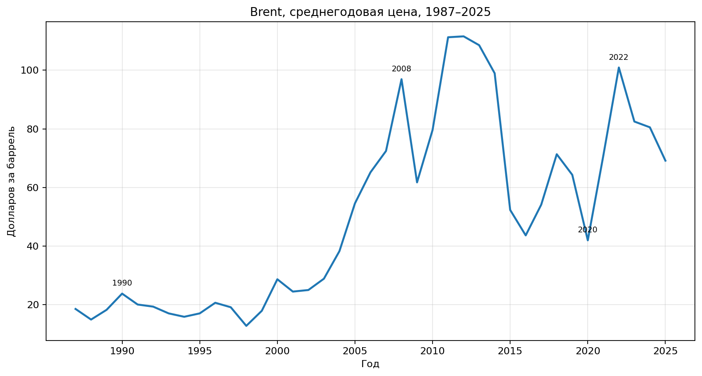
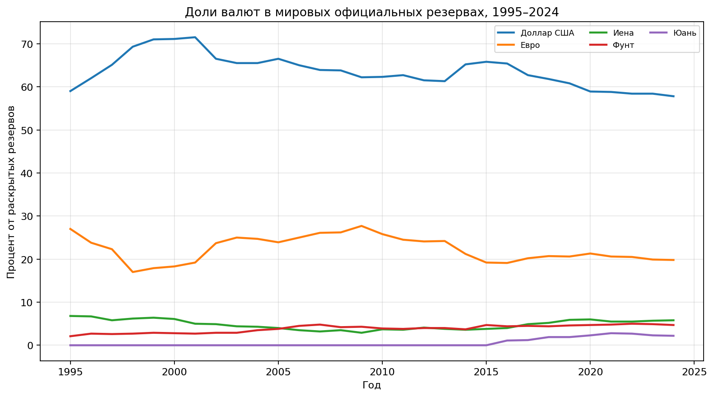
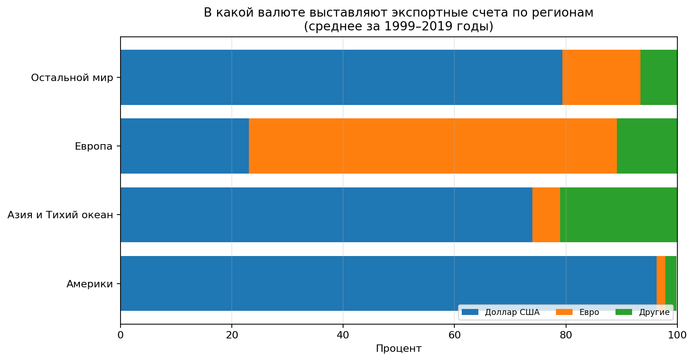

# Нефтедоллар

**Нефтедоллар** — это слово, у которого есть **два близких смысла**. В узком историческом смысле так называют **долларовые [доходы](../../../6.2_money_and_finance/personal_budget/index.md) стран, продающих [нефть](neft_v_mirovoy_ekonomike.md)**. В более широком смысле — это система, в которой [нефть](neft_v_mirovoy_ekonomike.md) во многих международных сделках **оценивают, продают и обсуждают через [доллар США](dollar_ssha.md)**, а часть полученных нефтяных [доходов](../../../8.2_future/choosing_a_career_path/articles/salary.md) потом возвращается в мировую финансовую систему через банки, [облигации](../../../6.2_money_and_finance/personal_budget/investments.md), резервы и фонды.[^1]

Для темы «[мировая экономика](globalizatsiya.md) на пальцах» эта статья важна потому, что через нефтедоллар особенно хорошо видно, как связаны [Доллар США](./dollar_ssha.md), [Резервная валюта](./rezervnaya_valyuta.md), [Нефть в мировой экономике](./neft_v_mirovoy_ekonomike.md), [Валютный курс](./valyutnyy_kurs.md), [Центральный банк](./tsentralnyy_bank.md), [БРИКС](./briks.md), [Китайский юань](./kitayskiy_yuan.md), [Евро](./evro.md) и [Ормузский пролив](./ormuzskiy_proliv.md).

## Содержание

- [Что это такое](#what-is)
- [Как возник нефтедоллар](#history)
- [Как работает нефтедоллар](#how-it-works)
- [Почему это важно для мировой экономики](#why-important)
- [Нефтедоллар сегодня: всё по-прежнему или нет?](#today)
- [Пример из реальной жизни](#real-life)
- [На пальцах](#simple)
- [Почему это важно школьнику](#school)
- [С чем связана эта статья в базе знаний](#links)
- [Интересный факт](#fact)
- [Главное](#main)
- [Источники данных и визуалов](#sources)

## Что это такое

Когда страна покупает нефть за рубежом, расчёт очень часто проходит **в долларах США**. Продавец получает долларовую выручку, а потом решает, что с ней делать: потратить на [импорт](devalvatsiya.md), перевести в банки, купить облигации, пополнить резервы или отправить в суверенный фонд.[^2]

Именно поэтому нефтедоллар — это не просто слово про нефть. Это слово про **[связь](../../../1.2_natural_sciences/physics_in_everyday_life/Q12969754.md) сырьевого рынка и финансовой системы**.

> [!NOTE]
> **Важно:** нефтедоллар — это **не отдельная бумажка** и не особая [валюта](../../../6.2_money_and_literacy/how_to_save_for_goal/articles/money.md). Это экономический механизм: нефть продаётся, [деньги](../../../2.1_society/cause_and_effect_relationships/articles/economic_chains.md) приходят в долларах, а потом эти доллары снова начинают работать в мировой экономике.

Ниже — маленькая таблица, чтобы не путаться в терминах.

| Термин | Что это значит |
|---|---|
| **Нефтедоллар** | долларовые доходы от продажи нефти; шире — долларовая система нефтяной торговли |
| **Petrodollar recycling** | «возврат» нефтяных долларов обратно в мировые банки, облигации, резервы и [инвестиции](aziatskie_tigry.md) |
| **Валюта-посредник** (*vehicle currency*) | валюта, которой пользуются даже тогда, когда ни покупатель, ни продавец не являются страной-эмитентом этой валюты |

## Как возник нефтедоллар

[История](../../../1.2_natural_sciences/physics_in_everyday_life/Q11469.md) нефтедоллара — это **не одна магическая сделка**, а цепочка нескольких важных событий.

### 1. Сначала изменилась мировая валютная система

В августе 1971 года США прекратили конвертируемость доллара в золото. Это стало началом конца бреттон-вудской системы в её прежнем виде.[^3]

### 2. Потом случился нефтяной шок 1973–1974 годов

Во [время](../../../1.2_natural_sciences/physics_in_everyday_life/Q20702.md) арабо-израильской войны 1973 года арабские экспортёры нефти ввели эмбарго против США и ряда других стран. Цены на нефть резко выросли, а нефтяные экспортёры начали быстро накапливать огромные долларовые доходы.[^4]

IMF прямо объясняет это так: импортёры нефти столкнулись с огромными счетами, а экспортёры получили большие массы долларов — именно их и стали называть **petrodollars**.[^5]

### 3. Нужно было решить, куда денутся эти деньги

Если бы нефтяные экспортёры просто складывали долларовые доходы «в сундук», мировая экономика тормозила бы сильнее. Поэтому возникла задача **переработки нефтедолларов**: деньги должны были вернуться в оборот через банки, кредиты, облигации и инвестиции. IMF пишет, что переработка нефтедолларов через банковскую систему помогла смягчить спад, хотя и не решила всех проблем.[^6]

### 4. Политика тоже сыграла роль

В 1974 году США и Саудовская Аравия создали совместную комиссию по экономическому сотрудничеству. GAO позже прямо отмечало, что она помогала и сближению двух стран, и **recycling petrodollars**.[^7]

> [!IMPORTANT]
> **Главная мысль:** нефтедоллар возник не из-за одной строчки в одном документе. Он сложился из сочетания **нефтяного шока**, **долларовых цен на нефть**, **глубоких долларовых финансовых рынков** и **политических договорённостей** между крупнейшими игроками.

### Ключевые этапы истории

| [Период](../../../1.2_natural_sciences/physics_in_everyday_life/Q11652.md) | Что произошло | Почему это важно |
|---|---|---|
| 1971 | США прекращают обмен доллара на золото | мировая валютная система меняется |
| 1973–1974 | нефтяной шок и эмбарго | у экспортёров нефти появляются огромные долларовые доходы |
| 1974 | США и Саудовская Аравия запускают экономическое [сотрудничество](../../../8.2_future/choosing_a_career_path/articles/team.md) | долларовая нефтяная система укрепляется политически |
| [1970-е](../../../7.1_art/modern_technological_art/articles/1.3_participatory_art.md) | развивается переработка нефтедолларов | нефтяные доходы возвращаются в банки, облигации и кредиты |
| [1990-е](../../../7.1_art/modern_technological_art/articles/2.2_heath_bunting.md)–2020-е | [доллар](dollar_ssha.md) остаётся главным торговым и финансовым инструментом | нефтяная [торговля](evropeyskiy_soyuz.md) продолжает опираться на долларовую инфраструктуру |
| 2020-е | усиливаются разговоры о дедолларизации | но полная замена доллара пока не произошла |

Ниже — упрощённая схема этой истории.

## Как работает нефтедоллар

Схема довольно простая:

1. Страна-импортёр покупает нефть.
2. Очень часто расчёт проходит в долларах.
3. Экспортёр нефти получает долларовую выручку.
4. Часть [денег](../../../8.2_future/choosing_a_career_path/articles/salary.md) идёт на [бюджет](../../../6.1_Independent_living_and_daily_living_skills/reasonable_spending/articles/budget.md), импорт, [развитие](../../../3.1. healthy lifestyle/Sleep, nutrition, and adolescent energy/articles/micronutrients_and_teenagers.md) страны.
5. Остальная часть может попасть в банки, облигации, резервы, суверенные фонды.
6. В итоге [спрос](../../../2.1_society/cause_and_effect_relationships/articles/economic_chains.md) на доллар и на долларовые активы остаётся высоким.

> [!TIP]
> **Подсказка:** здесь важно слово **«часто»**, а не **«всегда»**. Нефть можно обсуждать, хеджировать и иногда продавать и в других валютах, но доллар остаётся главным ориентиром и самым удобным инструментом для мирового рынка.[^8]

Почему именно доллар так удобен:

| [Причина](../../../2.1_society/cause_and_effect_relationships/articles/causality_base.md) | Почему это помогает доллару |
|---|---|
| Глубокие финансовые рынки США | большие суммы проще разместить в надёжных и ликвидных инструментах |
| Историческая [привычка](../../../7.2 Media, leisure and hobbies /useful_and_interesting_leisure/articles/how_not_to_quit_hobby.md) | чем больше участников уже пользуются долларом, тем удобнее пользоваться им дальше |
| Торговля сырьём | многие сырьевые товары исторически котируются в долларах |
| Резервы центробанков | центральным банкам удобно держать часть резервов в валюте, которая и так доминирует в расчётах |
| Банки и биржи | вокруг доллара давно выстроена мощная инфраструктура расчётов, кредитов и страхования |

## Почему это важно для мировой экономики

Нефтедоллар важен сразу по нескольким причинам.

**Во-первых,** он поддерживает глобальную роль доллара как [резервной валюты](./rezervnaya_valyuta.md). По данным Федеральной резервной системы, доллар составлял **57,8% раскрытых мировых валютных резервов в 2024 году**, заметно опережая [евро](evro.md) и другие валюты.[^9]

**Во-вторых,** он связывает [сырьевые рынки](neft_v_mirovoy_ekonomike.md) и валютные [курсы](../../../2.1_society/how_and_where_find_friends/articles/skill_miks.md). Когда [цена](../../../6.1_Independent_living_and_daily_living_skills/reasonable_spending/articles/price.md) нефти резко меняется, меняются и размеры долларовых потоков между импортёрами и экспортёрами. Это может влиять на [валютный курс](./valyutnyy_kurs.md), бюджеты стран, инфляцию и решения [центральных банков](./tsentralnyy_bank.md).

**В-третьих,** нефтедоллар показывает, что [мировой рынок нефти](neft_v_mirovoy_ekonomike.md) — это не только скважины и танкеры, но и **финансовая архитектура**: биржи, банки, облигации, резервы, страхование и даже морские маршруты вроде [Ормузского пролива](./ormuzskiy_proliv.md).

### График: как меняется цена нефти

*[Источник](../../../5.1_technology_and_digital_literacy/information and media literacy/дезинформация_и_фейки.md) данных: U.S. Energy Information Administration (EIA), Europe Brent Spot Price FOB; на графике показаны среднегодовые значения, рассчитанные по ежедневному ряду.*

> [!NOTE]
> Цены на нефть на этом графике не объясняют нефтедоллар целиком, но хорошо показывают, почему тема так важна: когда нефть дорожает, через мировой [рынок](../../../2.1_society/cause_and_effect_relationships/articles/economic_chains.md) проходит больше долларовой выручки, а когда дешевеет — меньше.

### График: почему доллар остаётся главным резервом

*Источник данных: Federal Reserve Board, accessible data to “The International Role of the U.S. Dollar – 2025 Edition”; базовый источник ряда — IMF COFER.*

### Таблица: доли крупнейших резервных валют в 2024 году

| Валюта | Доля в раскрытых мировых резервах, 2024 |
|---|---:|
| Доллар США | 57,8% |
| [Евро](rezervnaya_valyuta.md) | 19,8% |
| [Японская иена](iena.md) | 5,8% |
| [Фунт стерлингов](rezervnaya_valyuta.md) | 4,7% |
| [Китайский юань](kitayskiy_yuan.md) | 2,2% |
| Другие валюты | 9,6% |

## Нефтедоллар сегодня: всё по-прежнему или нет?

Не совсем. Мир меняется, и разговоров о дедолларизации стало больше. Особенно часто они звучат рядом с темами [БРИКС](./briks.md), [Китайского юаня](./kitayskiy_yuan.md) и [евро](./evro.md).

Но говорить, что нефтедоллар уже «рухнул», пока рано.

ECB показывал, что **более 80% extra-EU oil imports** в рассматриваемых данных были инвойсированы в долларах, а не в евро.[^10] Федеральная резервная система также показывает, что доллар остаётся доминирующей валютой мировой торговли далеко за пределами самой экономики США.[^11]

Ниже — ещё один наглядный график.

*Источник данных: Federal Reserve Board, Figure 7 accessible data to “The International Role of the U.S. Dollar – 2025 Edition” (средние значения по 1999–2019 годам).* 

### [Что происходит](../../../5.1_technology_and_digital_literacy/how_internet_works/articles/web_basics/what_happens.md) с альтернативами

| Альтернатива | Что важно понимать |
|---|---|
| **Евро** | заметен в европейской торговле и некоторых энергетических сегментах, но в нефти доллар пока сильнее |
| **[Китайский юань](rezervnaya_valyuta.md)** | Китай продвигает свою валюту и в 2018 году запустил нефтяные фьючерсы в юанях, но [юань](devalvatsiya.md) пока не сравнялся с долларом по мировому масштабу[^12] |
| **Расчёты в нацвалютах** | отдельные сделки возможны, но это ещё не означает смену всей мировой системы |

IMF в [работе](../../../8.2_future/choosing_a_career_path/articles/interview.md) 2025 года прямо пишет, что доллар остаётся доминирующим, а по нефтяному экспорту **нет устойчивых доказательств**, что политические инициативы уже заметно уменьшили [зависимость](../../../3.1. healthy lifestyle/Sleep, nutrition, and adolescent energy/articles/the_energy_trap.md) от доллара.[^13]

> [!WARNING]
> **Осторожно с громкими заголовками:** одна [новость](../../../5.1_technology_and_digital_literacy/information and media literacy/информационная_диета.md) о сделке в юанях или евро ещё не означает, что нефтедоллар закончился. Для смены мировой валютной [привычки](../../../1.2_natural_sciences/neurobiology_for_teens/articles/11_reward_system.md) нужны годы, а иногда и десятилетия.

## Пример из реальной жизни

Представьте, что крупная азиатская страна покупает нефть у ближневосточного экспортёра. Если контракт привязан к доллару, то покупателю нужны доллары, продавец получает доллары, а потом часть этой выручки может попасть в американские облигации, международные банки или [валютные резервы](tsentralnyy_bank.md). Так одна сделка с нефтью оказывается связана не только с энергетикой, но и с финансовыми рынками.

## На пальцах

> [!NOTE]
> **На пальцах:**
> Представьте, что вся [школа](../../../3.1. healthy lifestyle/Sleep, nutrition, and adolescent energy/articles/healthy_school_snacks.md) покупает воду только через один жетон. Тогда этот жетон нужен не только тем, кто пьёт воду, но и тем, кто хранит деньги, выдаёт сдачу, ведёт бухгалтерию и даёт займы. Нефтедоллар работает похоже: нефть продаётся по всему миру, и из-за этого доллар становится нужен не только нефтяникам, но и банкам, государствам и центральным банкам.

## Почему это важно школьнику

Потому что нефтедоллар помогает понять, почему новости про нефть почти всегда соседствуют с новостями про доллар, инфляцию и курсы валют.

- если дорожает нефть, это может влиять на цены топлива и перевозок;
- если меняется курс доллара, это может отражаться на стоимости импортных товаров;
- если [нефтяные страны](neft_v_mirovoy_ekonomike.md) получают больше или меньше долларовой выручки, это отражается на всей мировой финансовой системе.

Иными словами, тема нефтедоллара объясняет, почему экономика — это не набор отдельных коробочек, а одна большая связанная система.

## С чем связана эта статья в базе знаний

- [Доллар США](./dollar_ssha.md)
- [Резервная валюта](./rezervnaya_valyuta.md)
- [Нефть в мировой экономике](./neft_v_mirovoy_ekonomike.md)
- [Валютный курс](./valyutnyy_kurs.md)
- [Центральный банк](./tsentralnyy_bank.md)
- [БРИКС](./briks.md)
- [Китайский юань](./kitayskiy_yuan.md)
- [Евро](./evro.md)
- [Ормузский пролив](./ormuzskiy_proliv.md)

## Интересный [факт](../../../1.2_natural_sciences/why_science_help_understand_world/science.md)

> [!TIP]
> **Интересный факт:**
> Даже Европейский [центральный банк](tsentralnyy_bank.md) отдельно разбирал, почему нефть так часто инвойсируется в долларах, хотя значительная часть поставок в Европу идёт вовсе не из США. Это хороший пример того, что мировая валюта может быть сильна не только из-за «своего» экспорта, но и как **удобный посредник для всех остальных**.[^10]

## Главное

Нефтедоллар — это связь между нефтью и долларом США. Он появился не из одной причины, а из сочетания истории 1970-х, нефтяных шоков, политических решений и [силы](../../../1.2_natural_sciences/physics_in_everyday_life/Q11423.md) долларовых финансовых рынков. Сегодня мир обсуждает альтернативы, но доллар всё ещё остаётся главным языком мировой нефтяной торговли и важнейшей частью мировой финансовой системы.[^9][^13]

## [Источники](../../../4.2_thinking_and_working_information/how_to_search_information/articles/three_whales.md) данных и визуалов

**Основные [данные](../../../2.1_society/cause_and_effect_relationships/articles/ai_causality.md) для графиков:**
- **U.S. Energy Information Administration (EIA)** — Europe Brent Spot Price FOB, ежедневный ряд; на его основе построен график среднегодовой цены нефти.
- **Federal Reserve Board** — *The International Role of the U.S. Dollar – 2025 Edition*, accessible data; на его основе построены графики по резервам и валюте экспортных счетов.
- **IMF COFER** — базовый источник по составу мировых официальных резервов.

**Источники для объяснений и исторического контекста:**
- **ECB** — *Role of the US dollar as an invoicing currency [for](../../../5.2_cybersecurity/cpp_fundamentals/7_loops.md) oil imports*.
- **IMF, GAO, Office of the Historian, Federal Reserve History** — источники для исторической части статьи.

---

[^1]: [IMF, *Petrodollar Problem*](https://www.imf.org/external/np/exr/center/mm/eng/mm_rs_03.htm); [ECB, *Role of the US dollar as an invoicing currency for oil imports*](https://www.ecb.europa.eu/pub/pdf/ire/focus/ecb.irebox201906_03~3e5a7878dd.en.pdf).
[^2]: [Federal Reserve Bank of New York, *Recycling Petrodollars*](https://www.newyorkfed.org/research/current_issues/ci12-9.html).
[^3]: [Federal Reserve History, *Nixon Ends Convertibility of U.S. Dollars to Gold*](https://www.federalreservehistory.org/essays/gold-convertibility-ends).
[^4]: [Office of the Historian, *Oil Embargo, 1973–1974*](https://history.state.gov/milestones/1969-1976/oil-embargo); [Federal Reserve History, *Oil Shock of 1973-74*](https://www.federalreservehistory.org/essays/oil-shock-of-1973-74).
[^5]: [IMF, *Petrodollar Problem*](https://www.imf.org/external/np/exr/center/mm/eng/mm_rs_03.htm).
[^6]: [IMF, *Recycling Petrodollars*](https://www.imf.org/external/np/exr/center/mm/eng/rs_sub_3.htm).
[^7]: [U.S. GAO, *The U.S.-Saudi Arabian Joint Commission on Economic Cooperation*](https://www.gao.gov/products/id-79-7); [Office of the Historian, document on formation of U.S.-Saudi joint commissions](https://history.state.gov/historicaldocuments/frus1969-76ve09p2/d104).
[^8]: [ECB, *Role of the US dollar as an invoicing currency for oil imports*](https://www.ecb.europa.eu/pub/pdf/ire/focus/ecb.irebox201906_03~3e5a7878dd.en.pdf); [IMF Working Paper 2025/178](https://www.imf.org/en/publications/wp/issues/2025/09/12/patterns-of-invoicing-currency-in-global-trade-in-a-fragmenting-world-economy-570297).
[^9]: [Federal Reserve Board, *The International Role of the U.S. Dollar – 2025 Edition*](https://www.federalreserve.gov/econres/notes/feds-notes/the-international-role-of-the-u-s-dollar-2025-edition-20250718.html).
[^10]: [ECB, *Role of the US dollar as an invoicing currency for oil imports*](https://www.ecb.europa.eu/pub/pdf/ire/focus/ecb.irebox201906_03~3e5a7878dd.en.pdf).
[^11]: [Federal Reserve Board, *The International Role of the U.S. Dollar – 2025 Edition*](https://www.federalreserve.gov/econres/notes/feds-notes/the-international-role-of-the-u-s-dollar-2025-edition-20250718.html).
[^12]: [ECB, *Role of the US dollar as an invoicing currency for oil imports*](https://www.ecb.europa.eu/pub/pdf/ire/focus/ecb.irebox201906_03~3e5a7878dd.en.pdf).
[^13]: [IMF Working Paper 2025/178, *Patterns of Invoicing Currency in Global Trade in a Fragmenting World Economy*](https://www.imf.org/en/publications/wp/issues/2025/09/12/patterns-of-invoicing-currency-in-global-trade-in-a-fragmenting-world-economy-570297).

---
***[Автор](../../../4.2_thinking_and_working_information/how_to_search_information/articles/copypaste.md):** Авраменко Денис @denisuelius*  
***GitHub:*** *[den4ik2975](https://github.com/den4ik2975)*  
***Использованные [нейросети](../../../2.1_society/cause_and_effect_relationships/articles/ai_causality.md) и [ресурсы](../../../2.1_society/cause_and_effect_relationships/articles/ecological_footprint.md):*** *[ChatGPT](../../../7.1_art/modern_technological_art/articles/6.1_prompt_art.md) 5.4; IMF; ECB; Federal Reserve Board; Federal Reserve History; Office of the Historian; U.S. GAO*
