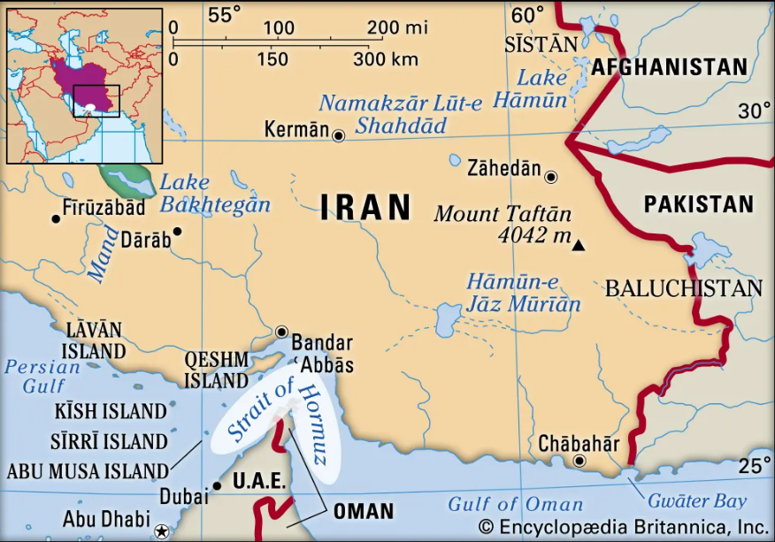
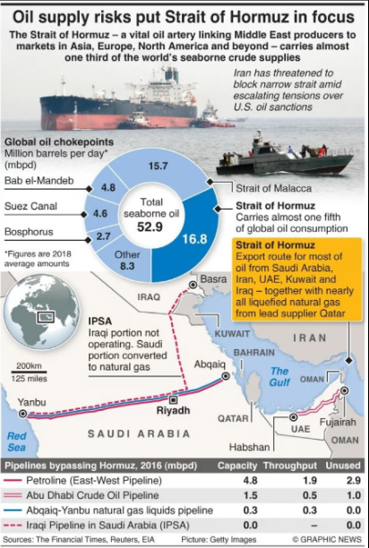
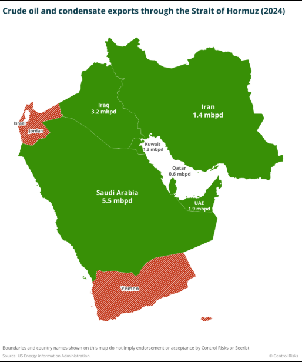
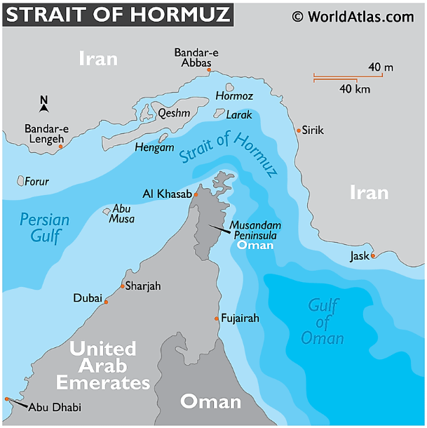

# Ормузский пролив

---

Ормузский пролив — один из важнейших морских маршрутов мира. Он соединяет Персидский залив с Оманским заливом и Аравийским морем и расположен между Ираном на севере и Оманом на юге. Его [значение](../../../7.2 Media, leisure and hobbies /useful_and_interesting_leisure/articles/leisure_and_why_need.md) огромно, потому что через этот узкий проход идёт большая часть морских поставок нефти и заметная доля мировых поставок сжиженного природного газа.

Для мировой экономики Ормузский пролив важен не только как точка на карте, а как один из главных «узких участков» глобальной торговли энергоресурсами. Когда ситуация в районе пролива обостряется, это быстро отражается на ценах на [нефть](neft_v_mirovoy_ekonomike.md), стоимости перевозок, страховке судов и устойчивости поставок в страны Азии и за её пределами.

---

## Содержание

- [Что это такое](#what-is)
- [Почему это важно для мировой экономики](#why-important)
- [Как это работает](#how-it-works)
- [Пример из реальной жизни](#real-life)
- [На пальцах](#simple)
- [Почему это важно школьнику](#school)
- [С чем связана статья в базе знаний](#links)
- [Интересный факт](#fact)
- [Заключение](#main)

---

## Что это такое

Ормузский пролив — это единственный морской проход, связывающий нефтеносный Персидский залив с открытым океаном через Оманский залив и Аравийское море. Britannica отмечает, что это один из наиболее важных нефтяных chokepoints мировой экономики. Ширина пролива составляет примерно от 35 до 60 миль, а судоходные полосы в основном проходят в территориальных водах Омана и частично Ирана.

Через пролив проходят входящая и исходящая судоходные полосы шириной по 2 мили, разделённые буферной зоной. При этом [судоходство](panamskiy_kanal.md) регулируется нормами международного морского права. Северную часть района контролирует Иран, южную — Оман, что делает пролив не только экономически, но и геополитически чувствительным местом.

Его считают стратегическим маршрутом потому, что через него проходит огромный [поток](../../../5.1_technology_and_digital_literacy/operating system/articles/thread.md) энергоресурсов из стран Персидского залива на [мировые рынки](globalizatsiya.md). Для многих экспортёров нефти и газа это главный морской [выход](../../../3.2 healthy lifestyle/how to act in a dangerous situation/articles/building-evacuation.md) во внешний мир.

## Почему это важно для мировой экономики

По данным Управления энергетической информации США, в 2024 году через Ормузский пролив проходило в среднем около 20 млн баррелей нефти в сутки, что эквивалентно примерно 20% мирового потребления нефтяных жидкостей. В 2024 году и в первом квартале 2025 года через пролив проходило более четверти всей мировой морской торговли нефтью, а также около одной пятой мировой торговли СПГ, главным образом из Катара.

Особенно важно то, что у значительной части этих потоков почти нет полноценных заменителей. EIA прямо пишет, что для большинства объёмов, выходящих из региона, практических альтернатив проливу немного, хотя часть нефти можно перенаправить по трубопроводам Саудовской Аравии и ОАЭ. Поэтому даже кратковременные перебои способны вызвать задержки поставок, [рост](../../../3.1. healthy lifestyle/Sleep, nutrition, and adolescent energy/articles/micronutrients_and_teenagers.md) издержек и [повышение](../../../8.2_future/choosing_a_career_path/articles/career-path.md) мировых цен на энергию.

На инфографике видно, насколько интенсивно используется маршрут через Ормузский пролив. Большая [плотность](../../../1.1_structure_of_the_world/matter/articles/06_liquids.md) танкерного трафика показывает, что это один из главных узлов мировой торговли энергоресурсами.

Пролив критически важен и потому, что основные направления поставок ведут в Азию. По оценке EIA, в 2024 году около 84% нефти и конденсата и 83% СПГ, проходивших через Ормузский пролив, направлялись на азиатские рынки, прежде всего в Китай, Индию, Японию и Южную Корею. Это означает, что проблемы в проливе особенно чувствительны для стран, зависящих от ближневосточного топлива.

Любая серьёзная напряжённость в этом районе влияет на цены на [нефть](neft_v_mirovoy_ekonomike.md), перевозки и мировые рынки. Даже без полного перекрытия маршрута [рынок](../../../2.1_society/cause_and_effect_relationships/articles/economic_chains.md) может реагировать ростом цен и повышением логистических рисков.

## Как это работает

Экономическая роль Ормузского пролива строится на простой логике: государства Персидского залива добывают нефть и [газ](../../../1.1_structure_of_the_world/matter/articles/07_gases.md), затем танкеры вывозят это сырьё через пролив на мировые рынки. Через него идёт [экспорт](aziatskie_tigry.md) из Саудовской Аравии, Ирака, Кувейта, Катара, ОАЭ и Ирана. Britannica подчёркивает, что пролив служит основным маршрутом для экспорта нефти из этих стран.

При этом полностью заменить [морской маршрут](suetskiy_kanal.md) трудно. У Саудовской Аравии есть нефтепровод East-West к Красному морю, у ОАЭ — трубопровод к экспортному терминалу Фуджейра на берегу Оманского залива. Но EIA оценивает свободную [мощность](../../../1.2_natural_sciences/physics_in_everyday_life/Q25236.md) этих обходных маршрутов примерно в 2,6 млн баррелей в сутки, что значительно меньше средних объёмов, проходящих через сам пролив. У Ирана также есть маршрут Goreh–Jask, но его эффективная мощность намного ниже основных потоков.

На инфографике видно, какое место Ормузский пролив занимает среди мировых нефтяных узких мест и почему его трудно полностью заменить. Даже при наличии обходных трубопроводов основная часть поставок всё равно зависит от прохода через этот маршрут.

География пролива делает его уязвимым для политической напряжённости, но не превращает автоматически в легко перекрываемую «дверь». Britannica пишет, что глубина во многих частях пролива составляет примерно 60–100 метров, и это затрудняет длительное полное блокирование прохода. Тем не менее даже [угроза](../../../5.1_technology_and_digital_literacy/information and media literacy/информационная_безопасность_для_детей.md) атак, мин или захватов судов способна резко снизить [трафик](../../../5.1_technology_and_digital_literacy/how_internet_works/articles/dns/cdn.md), потому что судоходные компании и страховщики начинают считать маршрут слишком рискованным.

Именно поэтому Ормузский пролив считают узким местом мировой [энергетики](../../../3.1. healthy lifestyle/Sleep, nutrition, and adolescent energy/articles/the_energy_trap.md). Огромный поток нефти и газа проходит через сравнительно ограниченный участок, а политические конфликты в регионе сразу повышают [риски](../../../7.2 Media, leisure and hobbies /useful_and_interesting_leisure/articles/safety_during_recreation.md) для мировой экономики.

## Пример из реальной жизни

Хороший пример — обострение вокруг Ормузского пролива в 2025 году. Britannica указывает, что после ударов США по иранским ядерным объектам 22 июня 2025 года парламент Ирана одобрил [шаг](../../../1.2_natural_sciences/physics_in_everyday_life/Q36253.md) к возможному закрытию пролива, хотя для реального исполнения требовалось дополнительное [решение](../../../2.1_society/cause_and_effect_relationships/articles/personal_choice.md) высшего совета безопасности. Даже сама перспектива такого шага вызвала опасения по поводу роста цен на нефть и заставила часть танкеров избегать маршрута.

Ещё более показателен март 2026 года. Britannica отмечает, что на фоне конфликта 2026 года угрозы и атаки на суда привели к 97-процентному падению трафика через пролив, а это вызвало крупнейший сбой в глобальных поставках нефти и [рост цен](inflyatsiya_deflyatsiya_i_nulevaya_inflyatsiya.md) на другие критически важные товары. Это очень наглядно показывает, что даже не полное юридическое «закрытие», а резкое ухудшение безопасности уже достаточно, чтобы [мировая экономика](globalizatsiya.md) почувствовала последствия.

## На пальцах

Если представить мировую торговлю нефтью как систему труб и дорог, то Ормузский пролив — это очень узкий, но крайне важный участок, через который проходит огромный поток сырья. Если там проблема, это чувствует весь мир.

Если совсем просто, Ормузский пролив — это очень узкое горлышко, через которое проходит огромный поток нефти и газа. Пока он работает нормально, [топливо](neft_v_mirovoy_ekonomike.md) спокойно уходит из стран Персидского залива в другие части мира. Но если там начинаются конфликты, рынок сразу нервничает: грузы задерживаются, страховка дорожает, а цены на энергию растут.

Можно представить мировую торговлю энергоресурсами как систему дорог, по которым едут бензовозы. Ормузский пролив — это одна из главных развязок. Если на ней авария или угроза перекрытия, проблемы начинаются далеко за её пределами — у заводов, перевозчиков, электростанций и обычных потребителей в самых разных странах. Такой [вывод](../../../1.2_natural_sciences/why_science_help_understand_world/scientific_method.md) прямо поддерживается данными о доле мировых поставок нефти и СПГ, проходящих через пролив.

На схеме видно, что Ормузский пролив — это узкий коридор между крупными регионами добычи нефти и открытым океаном. Именно поэтому любые риски в этой точке быстро отражаются на мировой экономике.

## Почему это важно школьнику

- помогает понять, почему конфликты в отдельных регионах влияют на мировые цены;
- показывает [связь](../../../1.2_natural_sciences/physics_in_everyday_life/Q12969754.md) географии, политики и экономики;
- делает понятнее новости про нефть, [доллар](dollar_ssha.md) и международные кризисы;
- полезно для понимания мировой энергетики.

Эта тема важна школьнику, потому что она показывает, как география влияет на экономику. На карте Ормузский пролив — сравнительно небольшой участок моря, но в реальности он влияет на мировые цены на нефть, на транспортные [расходы](../../../6.1_Independent_living_and_daily_living_skills/reasonable_spending/articles/expense.md) и на экономическую стабильность многих стран. Это хороший пример того, что в мировой экономике иногда решающее значение имеет не размер территории, а положение на ключевом маршруте.

Кроме того, Ормузский пролив помогает лучше понимать международные новости. Когда в новостях говорят о скачках цен на нефть, напряжённости на Ближнем Востоке или рисках для мировой торговли, за этими событиями часто стоит именно вопрос безопасности поставок через стратегические морские узлы. На примере пролива удобно увидеть связь между политикой, логистикой и повседневной экономикой.

## С чем связана статья в базе знаний

- [Нефть в мировой экономике](./neft_v_mirovoy_ekonomike.md) — пролив критически важен для поставок нефти.
- [Нефтедоллар](./neftedollar.md) — [экспорт нефти](neft_v_mirovoy_ekonomike.md) связан с международными расчетами.
- [Доллар США](./dollar_ssha.md) — [мировая торговля](panamskiy_kanal.md) энергоресурсами тесно связана с долларом.
- [БРИКС](./briks.md) — часть стран объединения зависит от энергетических маршрутов.
- [Глобализация](./globalizatsiya.md) — локальный [риск](../../../1.2_natural_sciences/neurobiology_for_teens/articles/05_teen_brain.md) влияет на всю мировую систему.
- [Суэцкий канал](./suetskiy_kanal.md) — оба объекта являются важнейшими узкими местами торговли.

## Интересный [факт](../../../1.2_natural_sciences/why_science_help_understand_world/science.md)

Даже без фактического перекрытия пролива одни только риски нестабильности могут заметно влиять на мировые нефтяные цены.

Хотя пролив часто представляют как место, которое можно «просто перекрыть», Britannica отмечает, что его глубина и ширина во многих участках делают длительное полное блокирование крайне сложной задачей. На практике мировой рынок чаще страдает не от абсолютного физического закрытия, а от угроз, атак, минной [опасности](../../../1.2_natural_sciences/physics_in_everyday_life/Q845744.md) и резкого роста рисков для судоходства.

## [Заключение](../../../1.2_natural_sciences/physics_in_everyday_life/Q2225.md)

Ормузский пролив — это один из главных стратегических пунктов мировой энергетики. Его значение показывает, насколько [глобальная](../../../5.2_cybersecurity/cpp_fundamentals/9_scopes.md) экономика зависит от нескольких критически важных маршрутов.

Ормузский пролив — это один из главных стратегических пунктов мировой экономики. Через него проходит огромная доля мировых поставок нефти и значительная часть торговли СПГ, а потому его стабильность важна не только для стран Ближнего Востока, но и для Азии, Европы и мировых сырьевых рынков в целом.

Эта статья важна для базы знаний, потому что Ормузский пролив наглядно показывает, как в одной точке пересекаются география, [энергетика](neft_v_mirovoy_ekonomike.md), мировая торговля и политика. Поняв его значение, легче понять и [устройство](../../../1.2_natural_sciences/physics_in_everyday_life/Q178032.md) современной мировой экономики: она глобальна, взаимозависима и очень чувствительна к нескольким ключевым маршрутам.

---

***[Автор](../../../4.2_thinking_and_working_information/how_to_search_information/articles/copypaste.md):** Георгий Голосов @goschikk*  
***GitHub:*** *[GeorgyGolosov](https://github.com/GeorgyGolosov)*  
***Использованные [нейросети](../../../2.1_society/cause_and_effect_relationships/articles/ai_causality.md) и [ресурсы](../../../2.1_society/cause_and_effect_relationships/articles/ecological_footprint.md):*** *[ChatGPT](../../../7.1_art/modern_technological_art/articles/6.1_prompt_art.md) 5.4.*
