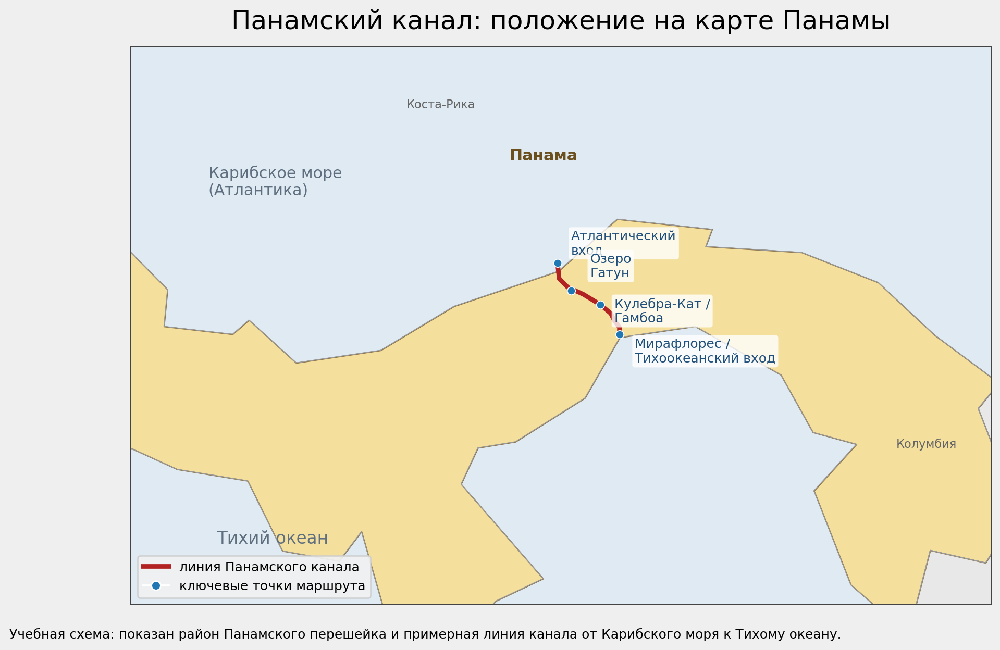
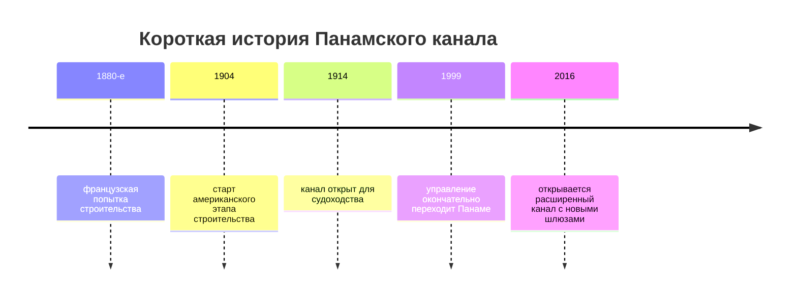
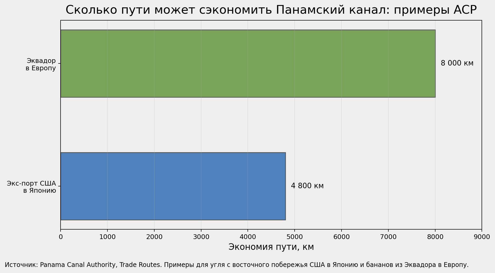
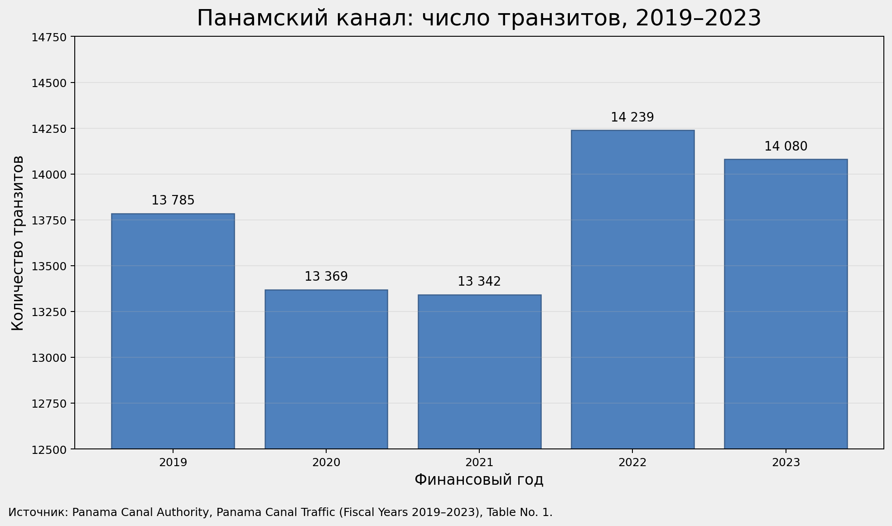

# Панамский канал

**Панамский канал** — это искусственный водный [путь](../../../1.2_natural_sciences/physics_in_everyday_life/Q11476.md) в Панаме, который соединяет Атлантический и Тихий [океаны](../../../1.2_natural_sciences/physics_in_everyday_life/Q179388.md) и позволяет судам не обходить всю Южную Америку.[^1][^2] Он работает не как «ровная канава от моря до моря», а как **система шлюзов**: корабль поднимают на [уровень](../../../../8.1_entertainment/articles/gamification.md) озера Гатун, проводят через Панамский перешеек, а потом опускают к другому океану.[^1][^3]

Для темы мировой экономики Панамский канал особенно важен потому, что через него хорошо видно, как связаны [Глобализация](./globalizatsiya.md), [Доллар США](./dollar_ssha.md), [Колониализм и неоколониализм в мировой экономике](./kolonializm_i_neokolonializm_v_mirovoy_ekonomike.md), [Суэцкий канал](./suetskiy_kanal.md) и [Развитые и развивающиеся страны](./razvitye_i_razvivayushchiesya_strany.md).

## Содержание

- [Что это такое](#what-is)
- [Где находится и как устроен канал](#map)
- [Коротко об истории](#history)
- [Как проходит судно через Панамский канал](#how-it-works)
- [Почему канал так сильно сокращает путь](#shorter)
- [Почему это важно для мировой торговли](#why-important)
- [Данные и графики](#data)
- [Пример из реальной жизни](#real-life)
- [На пальцах](#simple)
- [Почему это важно школьнику](#school)
- [С чем связана эта статья в базе знаний](#links)
- [Интересный факт](#fact)
- [Главное](#main)
- [Источники данных и визуалов](#sources)

<a id="what-is"></a>
## Что это такое

Если совсем просто, Панамский канал — это **морской shortcut**, то есть сокращённый путь между двумя океанами.

Без него многим судам пришлось бы идти вокруг юга Южной Америки — через очень длинный маршрут у мыса Горн. С каналом путь становится короче, а значит:

- быстрее доставка;
- ниже часть транспортных расходов;
- проще связывать рынки Атлантики и Тихого океана;
- удобнее строить мировые торговые маршруты.[^4]

Небольшая таблица, чтобы не запутаться:

| Термин | Что это значит |
|---|---|
| **Панамский канал** | искусственный водный путь через Панамский перешеек |
| **Шлюз** | камера, в которой судно поднимают или опускают водой |
| **Озеро Гатун** | большое пресноводное озеро, через которое проходит часть маршрута |
| **Панамакс / НеоПанамакс** | классы судов, размеры которых связаны с возможностью пройти канал |

> [!NOTE]
> **Важно:** Панамский канал нужен не только Панаме. Это один из тех объектов, от которых зависит [работа](../../../1.2_natural_sciences/physics_in_everyday_life/Q11382.md) международной торговли далеко за пределами самой страны.[^4][^5]

<a id="map"></a>
## Где находится и как устроен канал

Канал расположен в государстве Панама, в самом узком месте между Северной и Южной Америкой. С севера он выходит к Карибскому морю, то есть к Атлантическому бассейну, а с юга — к Тихому океану.[^1][^2]



*На карте приближён район Панамского перешейка. Красной линией показана учебная схема канала, синими точками — ключевые участки маршрута.*

> [!IMPORTANT]
> Панамский канал — это **не канал на уровне моря**, как иногда думают. Судно не просто плывёт по прямой между двумя океанами: его сначала поднимают примерно на **26 метров** до уровня озера Гатун, а затем опускают обратно.[^3][^6]

Основные части маршрута выглядят так:

| Участок | Что здесь происходит |
|---|---|
| Атлантический вход | судно заходит со стороны Карибского моря |
| Гатунские шлюзы / Agua Clara | корабль поднимают вверх |
| Озеро Гатун | длинный внутренний участок пути |
| Кулебра-Кат | узкий проход через перешеек |
| Pedro Miguel и Miraflores / Cocolí | судно опускают к Тихому океану |
| Тихоокеанский вход | [выход](../../../3.2 healthy lifestyle/how to act in a dangerous situation/articles/building-evacuation.md) в сторону Панамского залива и Тихого океана |

Ниже представлена интерактивная [карта](../../../5.1_technology_and_digital_literacy/information and media literacy/карта_компетенций_по_возрастам.md) в формате GeoJSON:

```geojson
{
  "type": "FeatureCollection",
  "features": [
    {
      "type": "Feature",
      "properties": {
        "title": "Атлантический вход",
        "description": "Северный вход со стороны Карибского моря.",
        "marker-color": "#1f77b4",
        "marker-size": "medium",
        "marker-symbol": "circle"
      },
      "geometry": {
        "type": "Point",
        "coordinates": [-79.92, 9.36]
      }
    },
    {
      "type": "Feature",
      "properties": {
        "title": "Озеро Гатун",
        "description": "Ключевой участок канала и водный резервуар, через который проходят суда.",
        "marker-color": "#1f77b4",
        "marker-size": "medium",
        "marker-symbol": "square"
      },
      "geometry": {
        "type": "Point",
        "coordinates": [-79.84, 9.2]
      }
    },
    {
      "type": "Feature",
      "properties": {
        "title": "Кулебра-Кат / Гамбоа",
        "description": "Узкий центральный участок маршрута через Панамский перешеек.",
        "marker-color": "#1f77b4",
        "marker-size": "small",
        "marker-symbol": "triangle"
      },
      "geometry": {
        "type": "Point",
        "coordinates": [-79.67, 9.12]
      }
    },
    {
      "type": "Feature",
      "properties": {
        "title": "Мирафлорес и Тихоокеанский вход",
        "description": "Южный выход канала к Тихому океану.",
        "marker-color": "#1f77b4",
        "marker-size": "medium",
        "marker-symbol": "circle"
      },
      "geometry": {
        "type": "Point",
        "coordinates": [-79.56, 8.95]
      }
    },
    {
      "type": "Feature",
      "properties": {
        "title": "Панамский канал",
        "description": "Учебная схема примерной линии канала от Карибского моря к Тихому океану.",
        "stroke": "#b22222",
        "stroke-width": 4,
        "stroke-opacity": 0.9
      },
      "geometry": {
        "type": "LineString",
        "coordinates": [
          [-79.92, 9.36],
          [-79.91, 9.27],
          [-79.86, 9.22],
          [-79.77, 9.18],
          [-79.67, 9.12],
          [-79.61, 9.07],
          [-79.59, 9.03],
          [-79.56, 8.99],
          [-79.56, 8.95]
        ]
      }
    }
  ]
}
```

<a id="history"></a>
## Коротко об истории

[История](../../../1.2_natural_sciences/physics_in_everyday_life/Q11469.md) Панамского канала — это одновременно история инженерии, мировой торговли и большой политики.

### 1. Сначала был французский [проект](../../../1.2_natural_sciences/why_science_help_understand_world/research_work.md)

В XIX веке канал пыталась построить французская компания, но проект провалился: мешали болезни, сложный [рельеф](../../../1.2_natural_sciences/physics_in_everyday_life/Q83301.md) и огромные [расходы](../../../6.1_Independent_living_and_daily_living_skills/reasonable_spending/articles/expense.md).[^2]

### 2. Потом канал достроили США

Американский этап строительства начался в 1904 году, а официальный ввод канала в эксплуатацию состоялся **15 августа 1914 года**.[^2][^7]

### 3. Почти весь XX век канал был связан с американским контролем

Поэтому тему Панамского канала часто изучают рядом со статьёй [Колониализм и неоколониализм в мировой экономике](./kolonializm_i_neokolonializm_v_mirovoy_ekonomike.md): вокруг канала долго шли споры о суверенитете, контроле над территорией и выгодах от мировой торговли.[^8][^9]

### 4. В 1999 году канал окончательно перешёл под управление Панамы

Panama Canal Authority прямо указывает, что [процесс](../../../5.1_technology_and_digital_literacy/operating system/articles/process.md), начатый после договоров Торрихоса—Картера 1977 года, завершился передачей канала Панаме **31 декабря 1999 года**.[^8][^9]

### 5. В [2016](../../../7.1_art/modern_technological_art/articles/5.5_yandex_neural.md) году канал расширили

Новый комплекс шлюзов добавил **третью линию движения** для более крупных судов типа NeoPanamax. Это расширило возможности канала и помогло ему сохранить [значение](../../../7.2 Media, leisure and hobbies /useful_and_interesting_leisure/articles/leisure_and_why_need.md) в современной торговле.[^10][^11]



<a id="how-it-works"></a>
## Как проходит судно через Панамский канал

Главная идея очень красивая: канал использует **воду как лифт для кораблей**.[^3][^6]


В упрощённом виде всё происходит так:

1. судно входит в шлюз;
2. за ним закрывают ворота;
3. воду по каналам и клапанам пускают самотёком;
4. уровень воды в камере поднимается или опускается;
5. ворота открываются, и судно идёт дальше.[^3]

> [!TIP]
> **Подсказка:** удобнее всего [запомнить](../../../4.1_rules_of_study/how_to_memorize/articles/zapominanie.md) так: Панамский канал — это не «[труба](../../../7.1_art/musical_instruments/articles/trumpet.md) между океанами», а **ступеньки из воды** для больших кораблей.

Ещё одна важная деталь: расширенный канал 2016 года сделал маршрут удобнее для больших контейнеровозов, газовозов и других крупных судов. После расширения через него смогла проходить очень большая часть мирового LNG-флота, а сама линия стала важнее для новых энергетических маршрутов.[^10][^12]

<a id="shorter"></a>
## Почему канал так сильно сокращает путь

Панамский канал важен прежде всего потому, что он **экономит [расстояние](../../../1.2_natural_sciences/physics_in_everyday_life/Q11412.md) и [время](../../../1.2_natural_sciences/physics_in_everyday_life/Q20702.md)**.

Panama Canal Authority приводит очень наглядные примеры:[^4]

- судно с углём с восточного побережья США в Японию экономит около **4 800 км** по сравнению с кратчайшим альтернативным морским маршрутом;
- судно с бананами из Эквадора в Европу экономит около **8 000 км**.[^4]



| Пример маршрута | [Экономия](../../../6.2_money_and_literacy/how_to_save_for_goal/articles/expenses.md) пути |
|---|---:|
| восточное побережье США → Япония | около 4 800 км |
| Эквадор → Европа | около 8 000 км |

Это и есть главная экономическая магия канала: он не делает океаны ближе физически, но делает **маршруты выгоднее для торговли**.

> [!NOTE]
> **Важно:** сокращение пути — это обычно не только про километры. Это ещё и про [топливо](neft_v_mirovoy_ekonomike.md), время в пути, расписание судна, [стоимость](../../../6.1_Independent_living_and_daily_living_skills/reasonable_spending/articles/price.md) фрахта и [скорость](../../../1.2_natural_sciences/physics_in_everyday_life/Q11402.md) доставки товара в [порт](../../../5.1_technology_and_digital_literacy/how_internet_works/articles/tcp_udp/tcp_udp.md) назначения.

<a id="why-important"></a>
## Почему это важно для мировой торговли

Панамский канал — один из мировых **морских chokepoints**, то есть узких, но очень важных мест мировой логистики. В этом смысле он родственен [Суэцкому каналу](./suetskiy_kanal.md): оба дают торговле shortcut, а при сбоях быстро становятся заметны всему миру.[^13]

### 1. Он соединяет огромную [сеть](../../../5.1_technology_and_digital_literacy/how_internet_works/articles/history/internet_history.md) маршрутов

По данным Panama Canal Authority, сегодня канал обслуживает около **180 морских маршрутов**, связывает **1 920 портов** в **170 странах**, а в 2025 году через него прошло **13 [404](../../../5.1_technology_and_digital_literacy/how_internet_works/articles/http_https/http_https.md) транзита**.[^5][^14]

### 2. Он особенно важен для торговли между Атлантикой и Тихим океаном

ACP отмечает, что большая часть трафика канала идёт между восточным побережьем США и Дальним Востоком, а также между Европой и западным побережьем Северной Америки.[^4] Поэтому канал часто обсуждают и рядом со статьёй [Доллар США](./dollar_ssha.md): через него проходят маршруты, тесно связанные с американским рынком, мировой торговлей и логистикой, где [доллар](dollar_ssha.md) по-прежнему играет очень большую роль.

### 3. Он важен и для богатых, и для развивающихся стран

Для [развитых стран](./razvitye_i_razvivayushchiesya_strany.md) канал важен как способ быстрее получать товары и сырьё. Для развивающихся — как способ дешевле и удобнее вывозить [экспорт](aziatskie_tigry.md). Поэтому один и тот же канал одновременно важен и для крупных потребительских рынков, и для экспортёров сырья, еды и промышленных товаров.[^4][^13]

### 4. Любой сбой быстро отражается на ценах и сроках

UNCTAD подчёркивала, что ограничения прохода через Панамский канал из-за засухи в 2023–2024 годах стали частью более широкой проблемы глобальных морских сбоев: длиннее путь, выше затраты, сильнее [давление](../../../1.1_structure_of_the_world/matter/articles/07_gases.md) на [цепочки поставок](globalizatsiya.md).[^13][^15]

> [!WARNING]
> Когда у такого канала начинаются проблемы с пропускной способностью, это бьёт не только по судоходству. Последствия могут дойти до магазинов, заводов и потребителей в других странах через цены, сроки доставки и дефицит контейнеров.

<a id="data"></a>
## [Данные](../../../2.1_society/cause_and_effect_relationships/articles/ai_causality.md) и графики

Ниже — несколько наглядных цифр, чтобы увидеть роль канала не только в словах.

### 1. Сколько судов проходило через канал



| Финансовый год | Число транзитов |
|---|---:|
| 2019 | 13 785 |
| 2020 | 13 369 |
| 2021 | 13 342 |
| 2022 | 14 239 |
| 2023 | 14 080 |

По этой таблице видно, что через канал ежегодно проходит **очень большой [поток](../../../5.1_technology_and_digital_literacy/operating system/articles/thread.md) судов**. Даже небольшие [колебания](../../../1.2_natural_sciences/physics_in_everyday_life/Q11652.md) здесь важны для мировой логистики.

### 2. Что показали последние сложные годы

В FY2024 из-за засухи число **deep-draft transits** снизилось до **9 944**, а перевезённый тоннаж составил около **423 млн тонн**.[^16] Уже в FY2025 ACP сообщила о **13 404 транзитах** и примерно **489,1 млн тонн**.[^14]

Это хороший пример того, что Панамский канал — [объект](../../../1.2_natural_sciences/physics_in_everyday_life/Q634.md) не только инженерный, но и природно-экономический: ему нужна [вода](../../../3.1. healthy lifestyle/Sleep, nutrition, and adolescent energy/articles/drinking_regime.md), а значит [климат](../../../1.2_natural_sciences/physics_in_everyday_life/Q179388.md) и осадки напрямую влияют на мировую торговлю.[^14][^15][^16]

### 3. Примеры экономии маршрута


| Маршрут | Что показывает |
|---|---|
| восточное побережье США → Япония | канал помогает не идти длинным обходным путём |
| Эквадор → Европа | канал особенно важен для экспорта товаров из Латинской Америки |

<a id="real-life"></a>
## Пример из реальной жизни

Представьте [контейнер](../../../5.2_cybersecurity/cpp_fundamentals/15_stl.md) с фруктами из Эквадора, который нужно быстро довезти в Европу.

Если путь получается короче примерно на **8 000 км**, товар приходит быстрее. Для обычного покупателя это означает:

- меньше [риск](../../../1.2_natural_sciences/neurobiology_for_teens/articles/05_teen_brain.md) задержек;
- выше шанс, что [груз](../../../1.2_natural_sciences/physics_in_everyday_life/Q20702.md) не испортится;
- ниже часть транспортных расходов;
- предсказуемее поставки для магазинов.[^4]

То есть Панамский канал влияет не только на карты и корабли, но и на то, как вообще работает мировая [торговля](evropeyskiy_soyuz.md) продуктами.

<a id="simple"></a>
## На пальцах

> [!NOTE]
> **На пальцах:**  
> Представьте, что между двумя частями огромной школы есть длинный обходной коридор вокруг всего [здания](../../../1.2_natural_sciences/physics_in_everyday_life/Q83301.md). А потом в стене делают короткий проход с подъёмником. Теперь тележки с учебниками, едой и техникой можно возить намного быстрее.  
> Панамский канал — это примерно такой короткий проход между двумя океанами. Только вместо тележек — огромные корабли, а вместо подъёмника — водяные шлюзы.

<a id="school"></a>
## Почему это важно школьнику

Эта тема кажется «очень морской», но на самом деле она объясняет много вещей из обычной жизни:

- почему география влияет на цены почти так же сильно, как экономика;
- почему новости о каналах и проливах важны даже для людей далеко от моря;
- почему [глобализация](./globalizatsiya.md) держится не только на интернете, но и на реальных маршрутах;
- почему один инженерный объект может влиять и на [развитые и развивающиеся страны](./razvitye_i_razvivayushchiesya_strany.md), и на логистику крупных компаний;
- почему история канала связана не только со строительством, но и с политикой, суверенитетом и спорами о контроле над мировой торговлей.

Если понять Панамский канал, легче понять, **как география превращается в экономику**.

<a id="links"></a>
## С чем связана эта статья в базе знаний

- [Глобализация](./globalizatsiya.md)
- [Доллар США](./dollar_ssha.md)
- [Колониализм и неоколониализм в мировой экономике](./kolonializm_i_neokolonializm_v_mirovoy_ekonomike.md)
- [Суэцкий канал](./suetskiy_kanal.md)
- [Развитые и развивающиеся страны](./razvitye_i_razvivayushchiesya_strany.md)

<a id="fact"></a>
## Интересный [факт](../../../1.2_natural_sciences/why_science_help_understand_world/science.md)

> [!TIP]
> **Интересный факт:**  
> Вода в Панамском канале не подкачивается насосами для каждого прохода судна. Классическая система шлюзов работает в основном **силой тяжести**: воду впускают и выпускают так, чтобы она сама поднимала или опускала корабль.[^3][^6]

<a id="main"></a>
## Главное

Панамский канал — это один из важнейших shortcut-маршрутов мировой торговли. Он соединяет Атлантический и Тихий океаны, сокращает [морские пути](bosfor_i_dardanelly.md), ускоряет доставку и помогает связывать между собой рынки разных частей света.[^4][^5]

Но ещё важнее другое: канал показывает, что [мировая экономика](globalizatsiya.md) зависит не только от [денег](../../../8.2_future/choosing_a_career_path/articles/salary.md) и заводов, но и от **географии**, **воды**, **инженерии** и **логистики**. Когда такой узел работает хорошо, торговля ускоряется. Когда у него возникают проблемы, это чувствуют страны, компании и покупатели далеко за пределами Панамы.[^13][^15]

<a id="sources"></a>
## [Источники](../../../4.2_thinking_and_working_information/how_to_search_information/articles/three_whales.md) данных и визуалов

**Основные источники для объяснений и истории:**
- Panama Canal Authority — [страницы](../../../5.1_technology_and_digital_literacy/operating system/articles/memory_management.md) *How does [it](../../../8.2_future/choosing_a_career_path/articles/programmer.md) work*, *Design of the Locks*, *History of the Panama Canal*, *Legal Foundations*
- Encyclopedia Britannica — обзор по Панамскому каналу
- Panama Canal Authority — [материалы](../../../1.2_natural_sciences/physics_in_everyday_life/Q487005.md) по расширенному каналу

**Источники для объяснений и исторического контекста:**
- Panama Canal Authority — страница *Trade Routes*
- Panama Canal Authority — официальный сайт с текущими показателями маршрутов, портов, стран и транзитов
- UNCTAD — материалы о сбоях в мировых морских chokepoints и влиянии ограничений на Панамском канале

**Источники данных для графиков:**
- Panama Canal Authority, *Panama Canal Traffic* (Fiscal Years 2019–2023), Table No. 1
- Panama Canal Authority, *Trade Routes* (примеры экономии расстояния)

**Карта и схемы:**
- Фоновая карта: Natural Earth / pyogrio naturalearth_lowres fixture
- Линия канала и точки маршрута: учебная авторская схема для этой статьи
- Исходный GeoJSON карты хранится в `WORK/2.2_history/world_economy_on_fingers/assets/maps/panamskiy_kanal_map.geojson`

---

[^1]: [Panama Canal Authority, *How does it work*](https://pancanal.com/en/history-of-the-panama-canal/).
[^2]: [Encyclopedia Britannica, *Panama Canal*](https://www.britannica.com/topic/Panama-Canal).
[^3]: [Panama Canal Authority, *Design Of The Locks*](https://pancanal.com/en/design-of-the-locks/).
[^4]: [Panama Canal Authority, *Trade Routes*](https://pancanal.com/en/maritime-services/trade-routes/).
[^5]: [Panama Canal Authority, official homepage](https://pancanal.com/en/).
[^6]: [Encyclopedia Britannica, *Panama Canal — Locks*](https://www.britannica.com/topic/Panama-Canal/Locks).
[^7]: [Panama Canal Authority, *History of the Panama Canal*](https://pancanal.com/en/history-of-the-panama-canal/).
[^8]: [Panama Canal Authority, *Legal Foundations*](https://pancanal.com/en/legal-foundations/).
[^9]: [Panama Canal Authority, *The Panama Canal Commemorates 26 Years Under Panamanian Administration*](https://pancanal.com/en/the-panama-canal-commemorates-26-years-under-panamanian-administration/).
[^10]: [Panama Canal Authority, *Discover the Expanded Canal*](https://pancanal.com/en/discover-the-expanded-canal/).
[^11]: [Panama Canal Authority, *Inaugural Transit of the Expanded Panama Canal Begins*](https://pancanal.com/en/inaugural-transit-of-the-expanded-panama-canal-begins/).
[^12]: [Panama Canal Authority, *The Transformation of the Panama Canal’s Service Since the Expansion*](https://pancanal.com/en/the-transformation-of-the-panama-canals-service-since-the-expansion/).
[^13]: [UNCTAD, *Review of Maritime Transport 2024 — overview*](https://unctad.org/system/files/official-document/rmt2024overview_en.pdf).
[^14]: [Panama Canal Authority, *Panama Canal Maintains Operational and Financial Strength*](https://pancanal.com/en/panama-canal-maintains-operational-and-financial-strength/).
[^15]: [UNCTAD, *Navigating Troubled Waters: Impact to Global Trade of Disruption of Shipping Routes in the Red Sea, the Black Sea and the Panama Canal*](https://unctad.org/publication/navigating-troubled-waters-impact-global-trade-disruption-shipping-routes-red-sea-black).
[^16]: [Panama Canal Authority, *Panama Canal Presents Financial Results for FY24 with a Focus on Sustainability and the Future*](https://pancanal.com/en/presents-financial-results-for-fy24-with-a-focus-on-sustainability-and-the-future/).

---
***[Автор](../../../4.2_thinking_and_working_information/how_to_search_information/articles/copypaste.md):** Авраменко Денис @denisuelius*  
***GitHub:*** *[den4ik2975](https://github.com/den4ik2975)*  
***Использованные [нейросети](../../../2.1_society/cause_and_effect_relationships/articles/ai_causality.md) и [ресурсы](../../../2.1_society/cause_and_effect_relationships/articles/ecological_footprint.md):*** *[ChatGPT](../../../7.1_art/modern_technological_art/articles/6.1_prompt_art.md) 5.4; Panama Canal Authority; UNCTAD; Britannica; Natural Earth*
