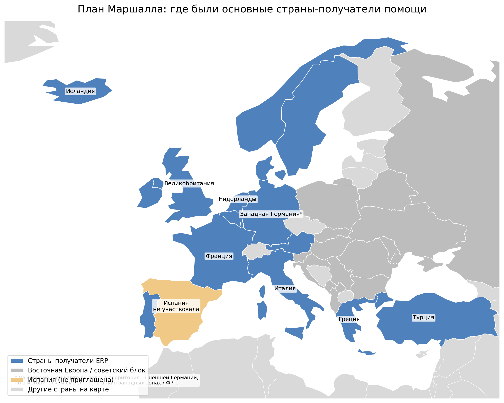
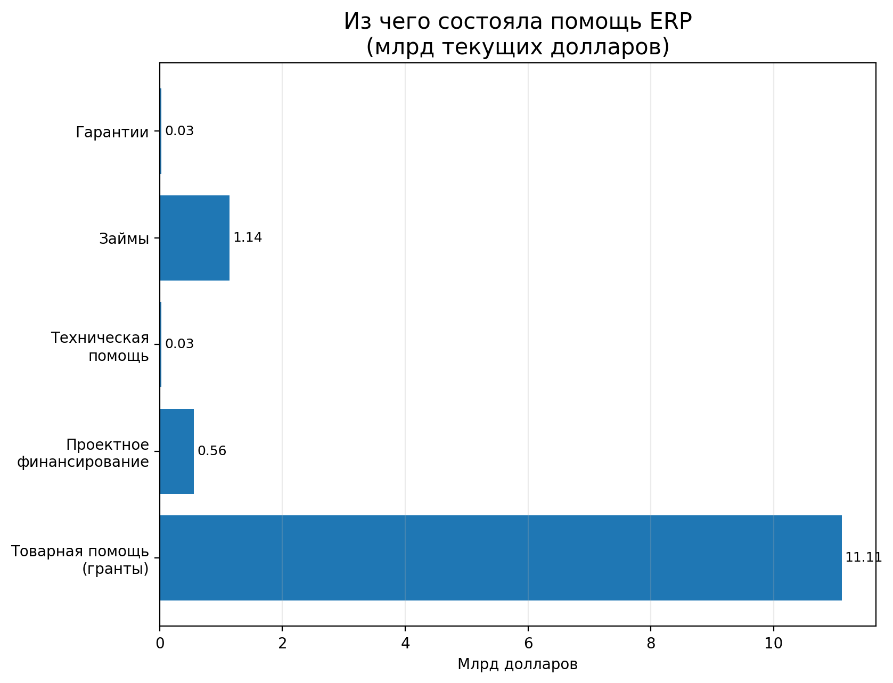
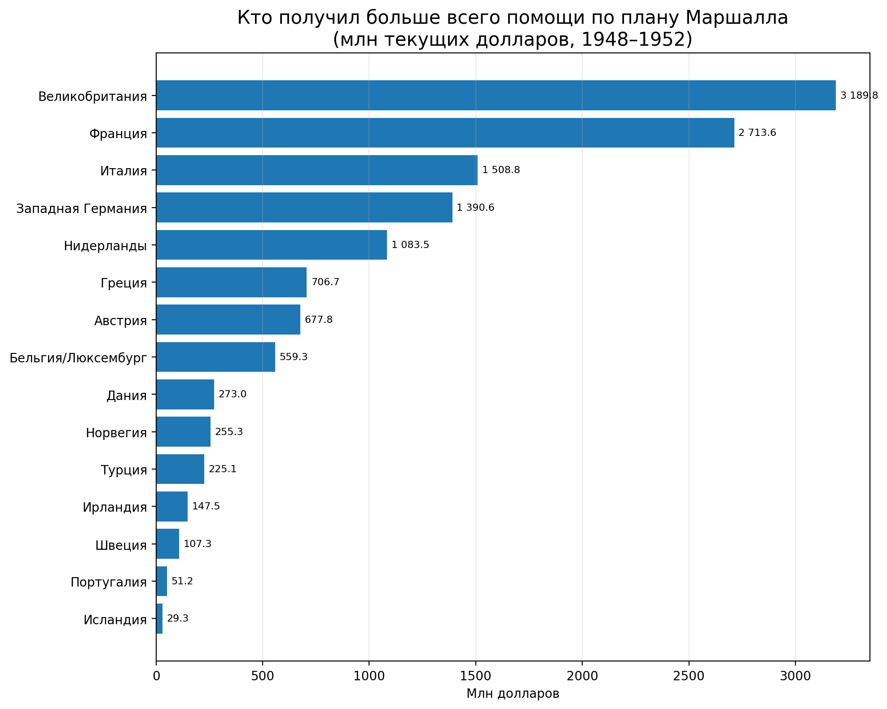
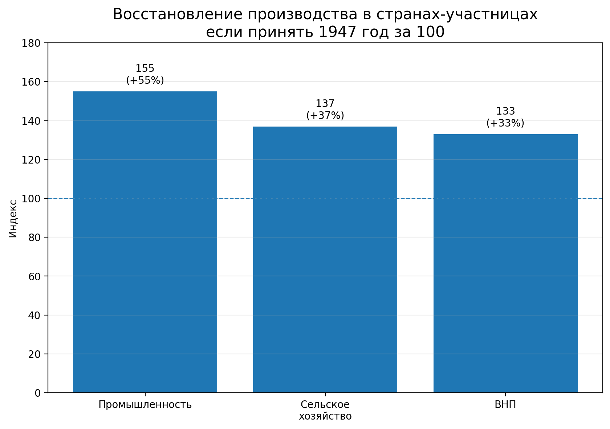

# План Маршалла

**План Маршалла** — это программа экономической помощи, которую США запустили после Второй мировой войны, чтобы помочь странам Западной Европы восстановить хозяйство, торговлю и производство.[^1] Обычно под ним имеют в виду **European Recovery Program (ERP)** — Европейскую программу восстановления, действовавшую с 1948 года. За четыре года на неё было направлено около **13,3 млрд долларов** того времени.[^1][^2]

Для темы «мировая экономика» План Маршалла важен потому, что через него хорошо видно, как связаны [Доллар США](./dollar_ssha.md), [Европейский союз](./evropeyskiy_soyuz.md), [Еврозона](./evrozona.md), [Глобализация](./globalizatsiya.md), [Развитые и развивающиеся страны](./razvitye_i_razvivayushchiesya_strany.md) и [Колониализм и неоколониализм в мировой экономике](./kolonializm_i_neokolonializm_v_mirovoy_ekonomike.md).

## Содержание

- [Что это такое](#what-is)
- [Почему он появился](#history)
- [Как это работало](#how-it-works)
- [Почему это важно для мировой экономики](#why-important)
- [Пример из реальной жизни](#real-life)
- [На пальцах](#simple)
- [Почему это важно школьнику](#school)
- [С чем связана эта статья в базе знаний](#links)
- [Интересный факт](#fact)
- [Главное](#main)
- [Источники данных и визуалов](#sources)

<a id="what-is"></a>
## Что это такое

После войны Европа была сильно разрушена: пострадали заводы, транспорт, жильё, торговля и снабжение продовольствием.[^2] На этом фоне США предложили масштабную программу помощи: дать странам деньги, сырьё, топливо, продовольствие, оборудование и организационную поддержку, чтобы они быстрее восстановили экономику.[^1][^2]

> [!NOTE]
> **Важно:** План Маршалла — это не просто «раздать деньги». Это была программа, в которой помощь связывали с **восстановлением производства**, **расширением торговли** и **сотрудничеством между европейскими странами**.[^3]

Небольшая таблица, чтобы не запутаться:

| Термин | Что это значит |
|---|---|
| **План Маршалла** | общее название американской помощи послевоенной Европе |
| **ERP** | официальное название программы: *European Recovery Program* |
| **OEEC** | европейская организация, созданная в 1948 году для координации восстановления и сотрудничества; предшественник OECD[^4] |
| **ECA** | американское агентство, которое управляло программой помощи[^3] |

### Карта: где были основные получатели помощи



*На карте выделены реальные получатели помощи ERP по сводной таблице CRS/USAID. Серым показана Восточная Европа, жёлтым — Испания, которая не была приглашена. Для Германии использована современная карта страны, хотя исторически речь шла о западных зонах и позже о ФРГ.*

Ниже представлена интерактивная карта в формате GeoJSON. Она помогает быстро выделить главные точки темы.

```geojson
{
  "type": "FeatureCollection",
  "features": [
    {
      "type": "Feature",
      "properties": {
        "title": "Лондон",
        "description": "Великобритания — крупнейший получатель помощи: 3 189,8 млн долларов.",
        "marker-color": "#4f81bd",
        "marker-size": "medium"
      },
      "geometry": {
        "type": "Point",
        "coordinates": [
          -0.1276,
          51.5072
        ]
      }
    },
    {
      "type": "Feature",
      "properties": {
        "title": "Париж",
        "description": "Франция — один из главных получателей. В Париже координировали европейский ответ и работу OEEC.",
        "marker-color": "#4f81bd",
        "marker-size": "medium"
      },
      "geometry": {
        "type": "Point",
        "coordinates": [
          2.3522,
          48.8566
        ]
      }
    },
    {
      "type": "Feature",
      "properties": {
        "title": "Рим",
        "description": "Италия — один из крупнейших получателей помощи и важный политический кейс холодной войны.",
        "marker-color": "#4f81bd",
        "marker-size": "medium"
      },
      "geometry": {
        "type": "Point",
        "coordinates": [
          12.4964,
          41.9028
        ]
      }
    },
    {
      "type": "Feature",
      "properties": {
        "title": "Бонн / Западная Германия",
        "description": "Западная Германия вошла в систему ERP в 1949 году и стала одним из крупнейших получателей помощи.",
        "marker-color": "#4f81bd",
        "marker-size": "medium"
      },
      "geometry": {
        "type": "Point",
        "coordinates": [
          7.0982,
          50.7374
        ]
      }
    },
    {
      "type": "Feature",
      "properties": {
        "title": "Мадрид",
        "description": "Испания при Франко не была приглашена к участию в плане Маршалла.",
        "marker-color": "#f0c987",
        "marker-size": "small"
      },
      "geometry": {
        "type": "Point",
        "coordinates": [
          -3.7038,
          40.4168
        ]
      }
    },
    {
      "type": "Feature",
      "properties": {
        "title": "Прага",
        "description": "Страны Восточной Европы не вошли в план: СССР выступил против и надавил на союзников.",
        "marker-color": "#9e9e9e",
        "marker-size": "small"
      },
      "geometry": {
        "type": "Point",
        "coordinates": [
          14.4378,
          50.0755
        ]
      }
    }
  ]
}
```

<a id="history"></a>
## Почему он появился

Причины были сразу и **экономические**, и **политические**.

### 1. Европа после войны была в очень тяжёлом состоянии

Национальный архив США прямо пишет, что после окончания войны европейские города были разрушены, экономика — опустошена, а людям грозили голод и нехватка самого необходимого.[^2]

### 2. США боялись не только бедности, но и политического кризиса

Официальная история Госдепартамента США объясняет, что на фоне ухудшения положения зимой 1946–1947 годов в Вашингтоне усилился страх перед ростом влияния коммунистических сил и расширением советского влияния в Европе.[^1]

### 3. Идея была озвучена в 1947 году, а закон приняли в 1948-м

5 июня 1947 года Джордж Маршалл выступил в Гарварде и предложил программу восстановления Европы.[^1][^2] Закон о программе был подписан президентом Гарри Трумэном 3 апреля 1948 года.[^2]

### 4. Европа должна была не просто просить помощь, а договариваться между собой

Американская сторона требовала, чтобы европейские страны сами согласовали общий план восстановления и сотрудничали друг с другом.[^3] При этом часть стран Восточной Европы сначала проявляла интерес, но затем под давлением [СССР](../../history_of_russia_and_nearest_countries/articles/USSR.md) отказалась участвовать.[^8] Именно из этой логики выросла организация OEEC, ставшая важным шагом к более тесной экономической координации в Европе.[^4]

> [!IMPORTANT]
> **Главная мысль:** План Маршалла возник не потому, что США вдруг решили «просто помочь». Это была попытка одновременно **восстановить европейскую экономику**, **сдержать политическую нестабильность** и **оживить мировую торговлю**.[^1][^2][^3]

### Короткая хронология

| Год | Что произошло | Почему это важно |
|---|---|---|
| 1945 | Война заканчивается | Европа остаётся с разрушенной экономикой |
| 5 июня 1947 | Речь Маршалла в Гарварде | появляется идея большой программы помощи |
| апрель 1948 | старт ERP и работа ECA/OEEC | программа становится реальностью |
| 1948–1952 | идут поставки и инвестиции | страны восстанавливают производство и торговлю |
| 1950-е | растёт кооперация в Европе | закладывается база для дальнейшей интеграции |


<a id="how-it-works"></a>
## Как это работало

План Маршалла был устроен не так, как обычная разовая благотворительность.

### Что именно давали

По данным CRS, американская помощь шла на закупку **продовольствия, топлива и машин**, а также на отдельные проекты, инфраструктуру, техническую помощь и поддержку производительности.[^3]

### Как деньги превращались в восстановление

Часто схема выглядела так:

1. страна получала американскую помощь в долларах или в виде поставок;
2. на эти средства закупали еду, сырьё, уголь, топливо, оборудование и машины;
3. внутри страны создавались так называемые **counterpart funds** — местные фонды в национальной валюте;
4. уже из них можно было вкладывать деньги в дороги, электростанции, транспорт, жильё и модернизацию предприятий.[^5]


### Из чего в основном состояла помощь



*По структуре видно, что главную часть составляла именно товарная помощь: продовольствие, топливо, сырьё и оборудование. Это удобно помнить: план Маршалла — это не только деньги на бумаге, но и очень конкретные поставки.*

> [!TIP]
> **Подсказка:** для школьного понимания удобнее думать так: США помогали Европе не мешком денег, а скорее большим набором ресурсов и инструментов для перезапуска экономики.

### Кто получил больше всего



Крупнейшими получателями были Великобритания, Франция, Италия, Западная Германия и Нидерланды.[^6]

| Страна | Помощь, млн долл. |
|---|---:|
| Великобритания | 3 189,8 |
| Франция | 2 713,6 |
| Италия | 1 508,8 |
| Западная Германия | 1 390,6 |
| Нидерланды | 1 083,5 |

<a id="why-important"></a>
## Почему это важно для мировой экономики

План Маршалла важен не только как эпизод истории США и Европы. Он сильно повлиял на устройство всей послевоенной экономики.

### 1. Он ускорил восстановление производства

CRS пишет, что к концу периода плана в странах-участницах промышленное производство было примерно на **55% выше**, чем в 1947 году; сельскохозяйственное производство выросло примерно на **37%**, а средний ВНП — примерно на **33%**.[^7]



### 2. Он помог запустить европейское сотрудничество

OECD прямо называет OEEC, созданную в 1948 году, предшественником OECD и пишет, что План Маршалла заложил основу для долгого сотрудничества и более открытой торговли.[^4] Это не то же самое, что сразу создать [Европейский союз](./evropeyskiy_soyuz.md) или [Еврозону](./evrozona.md), но это была важная ступень на длинной дороге к интеграции Европы.

### 3. Он оживил мировую торговлю

Национальный архив США подчёркивает, что для самих США план тоже был выгоден: он помог создать рынки для американских товаров и устойчивых торговых партнёров.[^2] То есть это был пример того, как восстановление одной части мира влияет на всю мировую экономику и даже на будущую [глобализацию](./globalizatsiya.md).

### 4. Он усилил роль США и доллара

Помощь шла через американские ресурсы, американские институты и американские доллары.[^2][^3] Поэтому План Маршалла часто вспоминают рядом с темой [Доллара США](./dollar_ssha.md): после войны экономическая мощь США стала ещё заметнее.

### 5. Он был важен и для политики холодной войны

Госдепартамент США и CVCE сходятся в том, что экономическая помощь рассматривалась и как способ уменьшить политическую нестабильность и ограничить распространение советского влияния в Западной Европе.[^1][^8]

> [!WARNING]
> **Важно не переупростить:** План Маршалла был очень значимым, но он не был «волшебной кнопкой». Восстановление Европы зависело и от окончания войны, и от внутренних реформ, и от запуска торговли, и от усилий самих европейских стран.[^1][^3]

### Ещё одна полезная таблица

| Что дал план | Почему это важно |
|---|---|
| Быстрые поставки топлива, еды и сырья | помогло пережить послевоенный дефицит |
| Машины и оборудование | ускорили модернизацию предприятий |
| Counterpart funds | дали деньги на инфраструктуру внутри стран |
| Координация через OEEC | подтолкнула страны к сотрудничеству |
| Рост торговли | помог восстановить экономические связи Европы и США |

### А как это связано с остальным миром?

План Маршалла помогал прежде всего Западной Европе, а не всему миру сразу. Поэтому он связан и с темой [Развитые и развивающиеся страны](./razvitye_i_razvivayushchiesya_strany.md): послевоенное восстановление «богатого Запада» шло по особой траектории. Кроме того, CVCE напоминает, что часть работы OEEC затрагивала и колонии европейских стран, где США поддерживали производство стратегического сырья.[^8] Это уже мостик к теме [Колониализма и неоколониализма в мировой экономике](./kolonializm_i_neokolonializm_v_mirovoy_ekonomike.md).

<a id="real-life"></a>
## Пример из реальной жизни

Представьте французский или итальянский завод конца 1940-х годов. После войны ему не хватает топлива, сырья и современного оборудования. По Плану Маршалла страна получает помощь, на неё закупаются нужные товары, а внутри страны часть средств превращается в инвестиции через counterpart funds. Завод снова начинает работать, рабочие получают зарплату, товары идут в магазины, государство получает налоги, а соседние страны снова начинают торговать друг с другом. Так одна экономическая программа постепенно оживляет целую цепочку.

<a id="simple"></a>
## На пальцах

> [!NOTE]
> **На пальцах:**
> Представьте, что после большого пожара школьные мастерские разрушены. Ученикам дают не просто деньги, а доски, инструменты, лампы, генераторы и ещё просят договориться, кто что будет чинить первым, чтобы школа снова заработала как единая система. План Маршалла работал похоже: Европе помогали не только деньгами, но и ресурсами, техникой и правилами сотрудничества.

<a id="school"></a>
## Почему это важно школьнику

Потому что через План Маршалла проще понять сразу несколько больших тем:

- почему после войны именно Западная Европа довольно быстро восстановилась;
- почему США стали ещё важнее для мировой экономики;
- почему экономическая помощь почти всегда связана не только с добротой, но и с политикой;
- почему современные разговоры про «новый план Маршалла» появляются всякий раз, когда какой-то регион нужно быстро восстанавливать.

И ещё это хороший пример того, что экономика — это не только деньги. Это ещё **логистика**, **сырьё**, **энергия**, **доверие**, **правила торговли** и **сотрудничество между странами**.

<a id="links"></a>
## С чем связана эта статья в базе знаний

- [Доллар США](./dollar_ssha.md)
- [Европейский союз](./evropeyskiy_soyuz.md)
- [Еврозона](./evrozona.md)
- [Глобализация](./globalizatsiya.md)
- [Развитые и развивающиеся страны](./razvitye_i_razvivayushchiesya_strany.md)
- [Колониализм и неоколониализм в мировой экономике](./kolonializm_i_neokolonializm_v_mirovoy_ekonomike.md)

<a id="fact"></a>
## Интересный факт

> [!TIP]
> **Интересный факт:**
> По одной из сравнительных таблиц распределения помощи, **Исландия** получила небольшую сумму в абсолютных цифрах, но очень большую помощь **на человека** — около **162 долларов на душу населения** в расчётах по населению 1951 года. Это хороший пример того, что «самый большой получатель» и «самый большой получатель на человека» — не одно и то же.[^9]

<a id="main"></a>
## Главное

План Маршалла — это программа американской помощи послевоенной Европе, которая помогла быстрее восстановить производство, торговлю и хозяйственные связи.[^1][^2] Но ещё важнее то, что он подтолкнул европейские страны к сотрудничеству и стал частью формирования новой послевоенной мировой экономической системы.[^3][^4]

<a id="sources"></a>
## Источники данных и визуалов

**Основные данные для графиков:**
- **CRS / EveryCRSReport** — сводные таблицы по получателям помощи, структуре расходов и результатам восстановления.
- **OECD** — история OEEC как предшественника OECD.
- **Library of Congress** — сводки о том, что к середине программы многие показатели уже подошли к довоенному уровню.
- **Учебная таблица distribution of aid by countries (OCDE, Maddison, ISTAT)** — данные для сравнения помощи на душу населения.

**Источники для объяснений и исторического контекста:**
- **Office of the Historian, U.S. Department of State** — историческая рамка: речь Маршалла, запуск программы, контекст холодной войны.
- **National Archives (U.S.)** — дата подписания закона, общий объём программы, её значение для Европы и США.

**Карта и схемы:**
- **Natural Earth** — контуры стран для учебной карты.
- Исходный GeoJSON карты хранится в `WORK/2.2_history/world_economy_on_fingers/assets/maps/plan_marshalla_map.geojson`

---

[^1]: [Office of the Historian, *Marshall Plan, 1948*](https://history.state.gov/milestones/1945-1952/marshall-plan).
[^2]: [National Archives, *Marshall Plan (1948)*](https://www.archives.gov/milestone-documents/marshall-plan).
[^3]: [CRS / EveryCRSReport, *The Marshall Plan: Design, Accomplishments, and Significance*](https://www.everycrsreport.com/reports/R45079.html).
[^4]: [OECD, *The Organisation for European Economic Co-operation (OEEC)*](https://www.oecd.org/en/about/history/the-organisation-for-european-economic-co-operation-oeec.html).
[^5]: [CRS / EveryCRSReport, раздел о counterpart funds](https://www.everycrsreport.com/reports/R45079.html).
[^6]: [CRS / EveryCRSReport, Table 2. European Recovery Program Recipients](https://www.everycrsreport.com/reports/R45079.html).
[^7]: [CRS / EveryCRSReport, раздел *Growth in European Production: 1938-1951*](https://www.everycrsreport.com/reports/R45079.html); [Library of Congress, *For European Recovery*](https://www.loc.gov/exhibits/marshall/marsh-exhibition.html).
[^8]: [CVCE, *The Marshall Plan and the establishment of the OEEC*](https://www.cvce.eu/en/education/unit-content/-/unit/55c09dcc-a9f2-45e9-b240-eaef64452cae/164c96b3-4d46-4c09-a177-2e6d35a832b2).
[^9]: [Distribution of Marshall Plan aid by countries (1948-1952), source note: OCDE, Maddison y ISTAT](https://learneurope.eu/wp-content/uploads/2023/03/Distribution_of_MP_aid_en.pdf).

---
***Автор:** Авраменко Денис @denisuelius*  
***GitHub:*** *[den4ik2975](https://github.com/den4ik2975)*  
***Использованные нейросети и ресурсы:*** *ChatGPT 5.4; Office of the Historian; National Archives; CRS; OECD; Library of Congress; Natural Earth*
