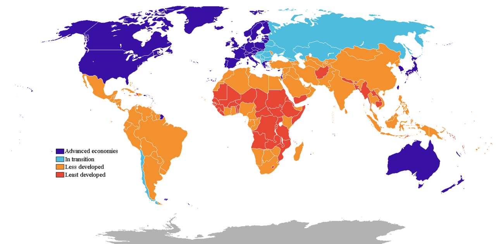
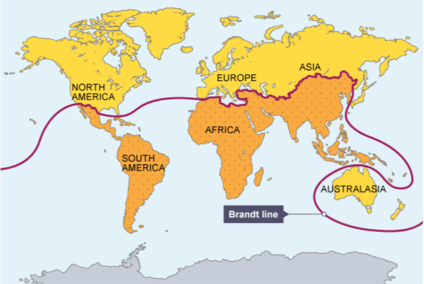
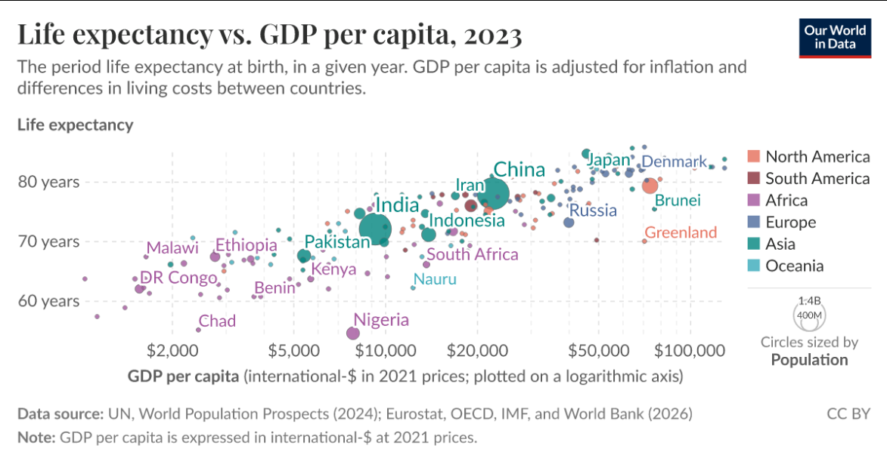

# Развитые и развивающиеся страны

---

В мировой экономике страны заметно отличаются по уровню [доходов](../../../8.2_future/choosing_a_career_path/articles/salary.md), промышленного развития, качеству жизни и роли в международной торговле. Для описания этих различий часто используют деление на развитые и развивающиеся страны.

Это деление помогает понять, почему одни государства производят сложную технику, управляют крупными финансовыми потоками и задают [правила](../../../2.1_society/cause_and_effect_relationships/articles/why_rules_work.md) мировой торговли, а другие в большей [степени](../../../3.1_healthy_lifestyle/pervaya_pomoshch/ushibi_porezy_ozhogi/13_ozhogi_vidy_stepeni.md) зависят от экспорта сырья, дешёвой рабочей [силы](../../../1.2_natural_sciences/physics_in_everyday_life/Q11423.md) или внешних инвестиций. При этом важно [помнить](../../../4.1_rules_of_study/how_to_memorize/articles/pamyat.md): мир не делится строго на «успешных» и «неуспешных». Между этими группами есть множество промежуточных случаев, а положение страны со временем может меняться.

---

## Содержание

- [Что это такое](#what-is)
- [Почему это важно для мировой экономики](#why-important)
- [Как это работает](#how-it-works)
- [Пример из реальной жизни](#real-life)
- [На пальцах](#simple)
- [Почему это важно школьнику](#school)
- [С чем связана статья в базе знаний](#links)
- [Интересный факт](#fact)
- [Заключение](#main)

---

## Что это такое

Развитые страны — это государства с высоким уровнем доходов, развитой промышленностью и сферой услуг, устойчивыми государственными институтами, современной инфраструктурой и обычно высоким качеством жизни. Для них характерны высокий [уровень](../../../../8.1_entertainment/articles/gamification.md) образования, доступная [медицина](../../../1.2_natural_sciences/physics_in_everyday_life/Q12969754.md), развитая [наука](../../../1.2_natural_sciences/physics_in_everyday_life/Q238323.md), сложная [структура](../../../4.1_rules_of_study/how_to_learn_effectively/articles/note_taking.md) экономики и значительная роль в мировых финансах и технологиях.

Развивающиеся страны — это государства, которые ещё не достигли такого уровня экономического и социального развития или достигли его только частично. Их экономики могут быстро расти, но при этом сталкиваться с бедностью, слабой инфраструктурой, неравномерным распределением доходов, зависимостью от сырья или внешнего капитала.

Это не значит, что развивающаяся страна обязательно бедная, а развитая — идеальная. Например, некоторые развивающиеся страны имеют огромные рынки, быстрый экономический [рост](../../../3.1. healthy lifestyle/Sleep, nutrition, and adolescent energy/articles/micronutrients_and_teenagers.md) и большое [влияние](../../../5.1_technology_and_digital_literacy/information and media literacy/манипуляции_и_пропаганда.md) на мировую торговлю. А в развитых странах тоже могут существовать социальные проблемы, долги, безработица и региональные различия.

Кроме того, это деление условно. В реальности существуют:

- новые индустриальные страны;
- страны с переходной экономикой;
- быстрорастущие [развивающиеся экономики](briks.md);
- наименее развитые страны.

Поэтому правильнее воспринимать это деление как удобную модель для понимания мировой экономики, а не как абсолютно жёсткую границу.

На схеме видно, что деление мира на более богатый Глобальный Север и менее развитый Глобальный Юг во многом связано с неравномерностью исторического и экономического развития. При этом такая схема условна и не охватывает всё многообразие современных стран.

## Почему это важно для мировой экономики

Различия между развитыми и развивающимися странами определяют то, как устроено международное разделение труда. Одни страны чаще выступают центрами технологий, финансов и управления, а другие — поставщиками сырья, дешёвой рабочей силы, сельскохозяйственной продукции или массовых промышленных товаров.

Это влияет на многое:

- на то, кто что производит;
- на то, кто у кого покупает товары;
- на то, куда идут [инвестиции](aziatskie_tigry.md);
- на то, где сосредоточены научные разработки;
- на то, какие валюты играют главную роль в мире.

Развитые страны часто экспортируют:

- машины и оборудование;
- лекарства;
- цифровые [технологии](globalizatsiya.md);
- финансовые и консультационные [услуги](../../../8.1_self-understanding/HowToFindYourStrengths/articles/talent_monetization.md);
- продукцию с высокой добавленной стоимостью.

Развивающиеся страны нередко экспортируют:

- [нефть](neft_v_mirovoy_ekonomike.md), [газ](../../../1.1_structure_of_the_world/matter/articles/07_gases.md), [металлы](../../../1.2_natural_sciences/physics_in_everyday_life/Q124291.md), сельскохозяйственное сырьё;
- текстиль и массовую промышленную продукцию;
- продукцию, произведённую с использованием дешёвой рабочей силы.

При этом [связь](../../../1.2_natural_sciences/physics_in_everyday_life/Q12969754.md) между этими группами очень тесная. Развитым странам нужны сырьё, рынки сбыта и производственные площадки. Развивающимся странам нужны технологии, инвестиции, оборудование и доступ к мировым рынкам. Именно поэтому [мировая экономика](globalizatsiya.md) представляет собой не набор отдельных государств, а сложную систему взаимозависимости.

Разница в уровне развития также влияет на международную политику. Более развитые страны обычно имеют больше возможностей влиять на правила мировой торговли, [работу](../../../8.2_future/choosing_a_career_path/articles/interview.md) международных организаций, кредитные условия, [санкции](../../../2.1_society/cause_and_effect_relationships/articles/why_rules_work.md) и глобальные стандарты. Развивающиеся страны, в свою очередь, стараются усилить свой голос через объединения, региональные союзы и рост собственной экономики.

## Как это работает

Чтобы понять, к какой группе обычно относят страну, экономисты и международные организации смотрят не на один признак, а сразу на несколько.

### Уровень доходов

Один из самых понятных критериев — это [доход](../../../6.1_Independent_living_and_daily_living_skills/reasonable_spending/articles/income.md) на душу населения. Чем выше средний уровень доходов, тем больше возможностей у государства и граждан:

- развивать образование;
- вкладываться в медицину;
- строить дороги, порты и связь;
- поддерживать [бизнес](../../../8.1_self-understanding/HowToFindYourStrengths/articles/talent_monetization.md) и науку.

Но этот показатель сам по себе не идеален. В стране может быть высокий средний доход, но при этом огромный разрыв между богатыми и бедными.

### Структура экономики

Для развитых стран характерно то, что значительная часть их экономики связана не только с промышленностью, но и со сложной сферой услуг:

- банковским сектором;
- страхованием;
- [IT](../../../8.2_future/choosing_a_career_path/articles/programmer.md);
- инженерией;
- образованием;
- медициной;
- научными исследованиями.

Во многих развивающихся странах большая роль сохраняется за:

- сельским хозяйством;
- добычей полезных ископаемых;
- первичной переработкой сырья;
- трудоёмким производством.

Чем более сложной и разнообразной становится экономика, тем устойчивее она обычно оказывается.

На инфографике видно, что [развитие](../../../3.1. healthy lifestyle/Sleep, nutrition, and adolescent energy/articles/micronutrients_and_teenagers.md) страны оценивается не только по доходам, но и по продолжительности жизни, уровню образования и качеству жизни. Это помогает понять, почему богатство страны и её реальное развитие не всегда совпадают полностью.

### Уровень индустриализации и технологий

Развитые страны, как [правило](../../../1.2_natural_sciences/why_science_help_understand_world/patterns.md), обладают:

- современной промышленной базой;
- высокотехнологичными производствами;
- научными центрами;
- собственными разработками и патентами.

Развивающиеся страны могут быть промышленно активными, но часто зависят от:

- импорта технологий;
- иностранного оборудования;
- внешних инвестиций;
- зарубежных рынков.

### [Качество](../../../6.1_Independent_living_and_daily_living_skills/reasonable_spending/articles/quality.md) жизни

Сюда относят:

- доступность образования;
- продолжительность жизни;
- качество медицины;
- уровень безопасности;
- доступ к чистой воде, электричеству и интернету;
- жилищные условия.

Именно поэтому развитость страны — это не только про [деньги](../../../2.1_society/cause_and_effect_relationships/articles/economic_chains.md), но и про то, насколько удобно и безопасно в ней жить.

### Инфраструктура

Развитая страна обычно имеет:

- хорошие дороги и железные дороги;
- стабильное электроснабжение;
- современные порты и аэропорты;
- развитую цифровую [сеть](../../../5.1_technology_and_digital_literacy/how_internet_works/articles/history/internet_history.md);
- эффективную логистику.

Если инфраструктура слаба, бизнесу труднее развиваться, а населению сложнее получать услуги и находить работу.

### Институты и управление

Большую роль играют [устойчивость](../../../1.2_natural_sciences/physics_in_everyday_life/Q1530280.md) законов, качество государственного управления, независимость судов, [защита](../../../5.1_technology_and_digital_literacy/how_internet_works/articles/dns/cdn.md) собственности и уровень коррупции. Даже богатая ресурсами страна может развиваться медленно, если в ней слабые институты и нестабильные правила игры.

### Почему страна может быстро развиваться, но ещё не считаться полностью развитой

Быстрый экономический рост сам по себе ещё не означает, что страна стала развитой. Даже если [промышленность](../../../1.2_natural_sciences/physics_in_everyday_life/Q163214.md) и [экспорт](aziatskie_tigry.md) быстро увеличиваются, в государстве могут сохраняться бедность, слабая инфраструктура, неравный доступ к образованию и медицине, региональные различия и нестабильные институты.

Именно поэтому некоторые страны показывают высокие темпы роста и усиливают своё влияние в мире, но всё ещё относятся к развивающимся. Чтобы считаться развитой, стране обычно нужен не только [рост экономики](aziatskie_tigry.md), но и устойчивое [повышение](../../../8.2_future/choosing_a_career_path/articles/career-path.md) качества жизни, развитие институтов, науки, технологий и социальной сферы.

## Пример из реальной жизни

Для наглядности можно сравнить, например, Германию и Индию.

Германия — одна из ведущих развитых стран мира. Она известна сильной промышленностью, машиностроением, химической отраслью, высоким качеством образования, развитой инфраструктурой и значительной ролью в экономике Европы. Германия экспортирует продукцию с высокой добавленной стоимостью и активно участвует в международных финансовых и производственных цепочках.

Индия — одна из крупнейших развивающихся стран и одна из самых быстрорастущих экономик мира. У неё огромный внутренний [рынок](../../../2.1_society/cause_and_effect_relationships/articles/economic_chains.md), сильный IT-сектор, растущая промышленность и большое международное [значение](../../../7.2 Media, leisure and hobbies /useful_and_interesting_leisure/articles/leisure_and_why_need.md). Но при этом Индия сталкивается с заметным социальным неравенством, бедностью части населения, контрастом между развитыми городами и менее обеспеченными регионами, а также с инфраструктурными трудностями.

Это [сравнение](../../../5.2_cybersecurity/cpp_fundamentals/5_operators.md) хорошо показывает, что развивающаяся страна — не обязательно слабая или второстепенная. Она может играть огромную роль в мире, быстро расти и влиять на глобальную экономику, но при этом всё ещё не достигать уровня развитых стран по качеству жизни и устойчивости институтов.

Ещё один важный пример — [Южная Корея](aziatskie_tigry.md). Сегодня её обычно относят к развитым странам, но ещё в середине XX века она была значительно беднее многих европейских государств. Быстрый рост промышленности, образования, экспорта и технологий позволил ей за несколько десятилетий совершить мощный экономический рывок.

К похожим примерам часто относят и «азиатских тигров» — Южную Корею, [Сингапур](aziatskie_tigry.md), [Гонконг](aziatskie_tigry.md) и [Тайвань](aziatskie_tigry.md). Эти экономики показали, что при удачном сочетании индустриализации, вложений в образование, экспорта и государственной [стратегии](../../../../8.1_self_understanding/articles/overcoming.md) страна может сравнительно быстро перейти на новый уровень развития.

## На пальцах

Если совсем просто, то развитые и развивающиеся страны можно сравнить с учениками, которые находятся на разных этапах подготовки.

Одни уже давно хорошо освоили базу, умеют решать сложные [задачи](../../../1.2_natural_sciences/why_science_help_understand_world/research_work.md) и сами задают правила игры. Это похоже на развитые страны: у них сильная экономика, технологии, устойчивые институты и высокий уровень жизни.

Другие быстро учатся, набирают темп, иногда даже показывают очень высокий рост, но у них ещё остаются пробелы: где-то слабее инфраструктура, где-то ниже [доходы](../../../6.2_money_and_finance/personal_budget/index.md), где-то сильнее [зависимость](../../../3.1. healthy lifestyle/Sleep, nutrition, and adolescent energy/articles/the_energy_trap.md) от внешней помощи или сырья. Это похоже на развивающиеся страны.

При этом важно, что никто не «приклеен» к своей роли навсегда. Страна может ускориться, провести [реформы](../../../2.1_society/cause_and_effect_relationships/articles/lessons_of_history.md), развить образование и промышленность — и постепенно перейти на новый уровень.

## Почему это важно школьнику

- помогает понимать карты мира не только по географии, но и по экономике;
- объясняет различия в уровне жизни;
- помогает разбираться в мировой торговле, миграции и международной политике;
- полезно для обществознания, географии и экономики.

Эта тема важна не только для уроков географии или обществознания. Она помогает лучше понимать мир вокруг.

Во-первых, через неё становится понятнее, почему в разных странах по-разному живут люди: отличаются [зарплаты](../../../8.2_future/choosing_a_career_path/articles/salary.md), качество дорог, уровень медицины, возможности для образования и технологии.

Во-вторых, она помогает разбираться в новостях. Когда говорят о глобальном Юге, о международной помощи, о кризисах, о миграции, о росте стран Азии или о спорах вокруг мировой торговли, почти всегда речь так или иначе идёт о различиях в уровне развития.

В-третьих, эта тема показывает, что экономика связана с историей, политикой, географией и технологиями. Страны развиваются не сами по себе: на них влияют [прошлое](../../../2.1_society/cause_and_effect_relationships/articles/lessons_of_history.md), [ресурсы](../../../2.1_society/cause_and_effect_relationships/articles/ecological_footprint.md), международные [отношения](../../../2.1_society/how_and_where_find_friends/articles/guide_dlya_introvertov.md) и собственные решения.

Наконец, это полезно для школьника как для будущего гражданина. [Понимание](../../../2.1_society/cause_and_effect_relationships/articles/empathy_causality.md) того, как устроена мировая экономика, помогает лучше ориентироваться в современном мире, критически воспринимать информацию и видеть за сухими терминами реальные процессы.

## С чем связана статья в базе знаний

- [БРИКС](./briks.md) — объединяет крупные развивающиеся экономики.
- [Колониализм и неоколониализм в мировой экономике](./kolonializm_i_neokolonializm_v_mirovoy_ekonomike.md) — помогает понять причины отставания части стран.
- [Азиатские тигры](./aziatskie_tigry.md) — пример быстрого развития.
- [План Маршалла](./plan_marshalla.md) — пример послевоенного восстановления и развития.
- [Глобализация](./globalizatsiya.md) — усиливает взаимозависимость разных типов стран.
- [Европейский союз](./evropeyskiy_soyuz.md) — объединение в основном развитых стран.
- [Китайский юань](./kitayskiy_yuan.md) — связан с темой международной торговли, положения стран в мировой экономике и роли национальных валют.
- [Российский рубль](./rossiyskiy_rubl.md) — связан с темой международной торговли, положения стран в мировой экономике и роли национальных валют.

## Интересный [факт](../../../1.2_natural_sciences/why_science_help_understand_world/science.md)

Ещё несколько десятилетий назад многие страны Восточной и Юго-Восточной Азии считались бедными или слаборазвитыми, а сегодня часть из них входит в число важнейших экономик мира. Это один из лучших примеров того, как быстро может измениться положение страны при удачном сочетании реформ, инвестиций и развития образования.

## [Заключение](../../../1.2_natural_sciences/physics_in_everyday_life/Q2225.md)

Деление стран на развитые и развивающиеся помогает увидеть, насколько неравномерно устроена мировая экономика. Оно показывает различия в уровне жизни, структуре хозяйства, доступе к технологиям и роли государств в международной торговле.

Но это деление не стоит воспринимать как вечный приговор. Страны меняются: одни совершают быстрый рывок, другие сталкиваются с кризисами, третьи постепенно переходят от сырьевой [модели](../../../1.2_natural_sciences/physics_in_everyday_life/Q172280.md) к более сложной экономике. Поэтому главная ценность этой темы в [том](../../../7.1_art/musical_instruments/articles/drums.md), что она учит смотреть на мир не как на набор случайных различий, а как на систему, где [история](../../../1.2_natural_sciences/physics_in_everyday_life/Q11469.md), география, политика и экономика тесно связаны друг с другом.

---

***[Автор](../../../4.2_thinking_and_working_information/how_to_search_information/articles/copypaste.md):** Георгий Голосов @goschikk*  
***GitHub:*** *[GeorgyGolosov](https://github.com/GeorgyGolosov)*  
***Использованные [нейросети](../../../2.1_society/cause_and_effect_relationships/articles/ai_causality.md) и ресурсы:*** *[ChatGPT](../../../7.1_art/modern_technological_art/articles/6.1_prompt_art.md) 5.4.*
