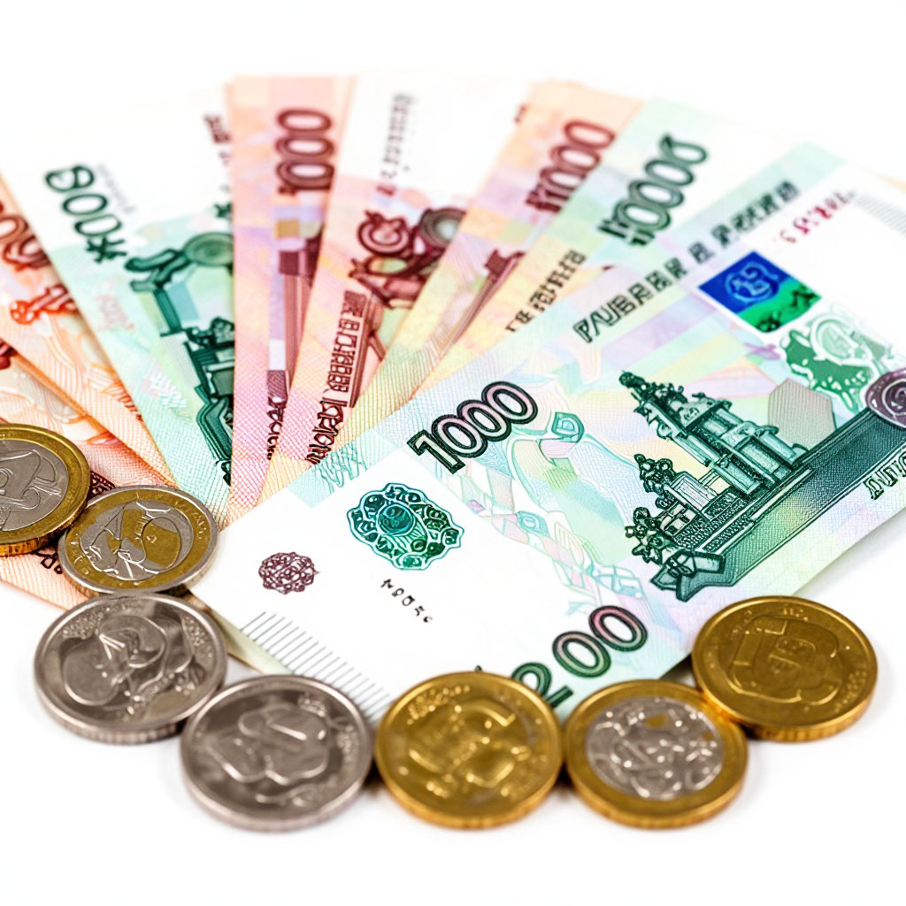
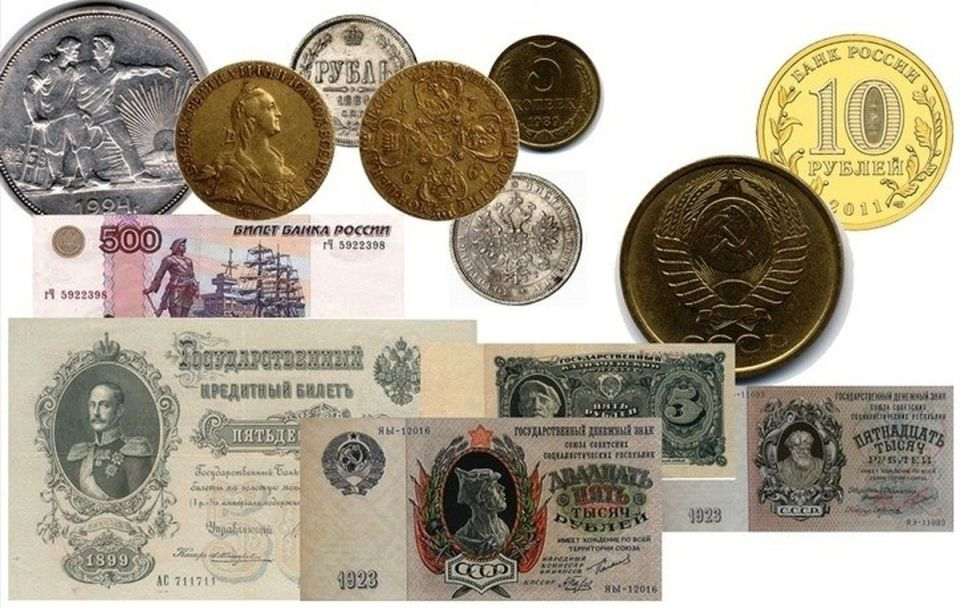
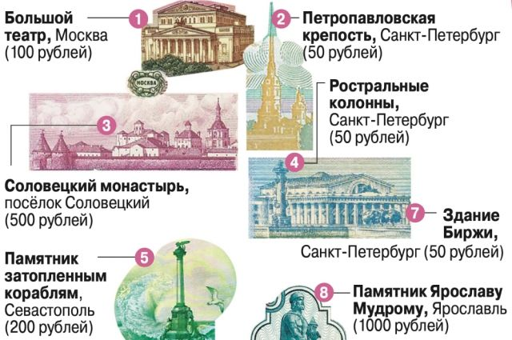

# Российский рубль

## Главная валюта нашей страны

---
## Содержание

- [Что такое рубль](#intro)
- [Откуда взялся рубль и что означает его имя](#history)
- [Рубль в XX веке: взлёты и падения](#twentieth-century)
- [Современный рубль: как он устроен](#today)
- [Почему рубль то дорожает, то дешевеет](#exchange)
- [Девальвация и деноминация: страшные слова простыми словами](#devaluation)
- [Рубль в мировой экономике](#world)
- [Интересные факты о рубле](#facts)
- [Будущее рубля](#future)
- [Заключение](#main)

---

## Введение: Что такое рубль?

Рубль — это не просто деньги, которые лежат у тебя в кармане или на карточке. Это **национальная валюта России**, одна из старейших валют мира и настоящий символ нашей страны. Им расплачиваются 146 миллионов человек на территории 17 миллионов квадратных километров — от Калининграда до Владивостока.

Интересный факт: во всём мире название «рубль» используется только в двух странах — в России и Белоруссии. И наш рубль — **вторая по возрасту валюта в мире** после английского фунта стерлингов. Ему больше 700 лет!

Но рубль — это не только история. Это живой организм, который постоянно меняется: то дорожает, то дешевеет, на нём появляются новые картинки и степени защиты. На его курс влияют **[инфляция](./inflyatsiya_deflyatsiya_i_nulevaya_inflyatsiya.md)**, **[девальвация](./devalvatsiya.md)**, цены на [нефть](neft_v_mirovoy_ekonomike.md) и многие другие факторы. Он влияет на цены в магазинах, на зарплаты родителей, на стоимость твоего нового телефона или поездки на море.

Давай разберёмся, откуда взялся рубль, почему он так называется и как устроена главная валюта нашей страны.

---

## Откуда взялся рубль и что означает его имя

### Рождение рубля

История рубля начинается в **XIII веке**. В те времена на Руси не было привычных нам монет. Люди расплачивались серебряными слитками — **гривнами**. Гривна весила примерно 200 граммов и была довольно крупной суммой.

И тут возникает вопрос: как расплатиться, если тебе нужно купить что-то дешёвое? Целую гривну отдавать жалко. Тогда люди придумали **рубить** слиток на части. Отрубленный кусок называли... правильно, **рубль**!

Существует и другая версия: название могло произойти от слова "рубец" (шрам на слитке после отливки). Но самая популярная и понятная версия — от глагола **"рубить"**.

### Первые рублёвые монеты

Долгое время рубль существовал только в виде кусков серебра. Первую настоящую рублёвую монету отчеканили при царе **Алексее Михайловиче** в 1654 году. На ней изобразили двуглавого орла и царя на коне. Но массово такие монеты не пошли — слишком сложно было наладить производство.

Настоящий русский рубль появился при **Петре I** в 1704 году. Пётр провёл денежную реформу и сделал рубль главной монетой страны. Интересно, что петровские рубли почти на 100% состояли из серебра, поэтому были очень ценными, но мягкими.

---

## Рубль в XX веке: взлёты и падения

### Золотой рубль

В конце XIX века Россия была одной из ведущих экономик мира. При министре финансов Сергее Витте провели реформу: рубль стал **золотым**. Это значило, что за каждый рубль можно было получить определённое количество золота. Рубль стал твёрдой, уважаемой в мире валютой.

### Советский рубль

После революции 1917 года всё изменилось. Большевики отменили царские деньги и ввели свои. Советский рубль просуществовал с 1923 по 1991 год. Интересно, что в начале 1960-х годов рубль стоил **дороже [доллара США](./dollar_ssha.md)**! За один [доллар](dollar_ssha.md) давали всего 60 копеек. Представляешь?

Советский рубль был очень стабильным, но у него был огромный недостаток: его нельзя было свободно обменять на другие валюты. Выезжая за границу, советские люди не могли взять с собой рубли — их меняли по специальному курсу только при наличии загранпаспорта.

### Лихие 90-е

После распада [СССР](../../history_of_russia_and_nearest_countries/articles/USSR.md) началось самое трудное время для рубля. **[Инфляция](./inflyatsiya_deflyatsiya_i_nulevaya_inflyatsiya.md)** съедала сбережения людей. В 1998 году случилась **[девальвация](./devalvatsiya.md)** — рубль резко обесценился. Люди, хранившие деньги в рублях, за считанные недели потеряли львиную долю своих накоплений.

В 1998 году **[валютный курс](./valyutnyy_kurs.md)** доллара вырос с 6 до 24 рублей буквально за несколько месяцев. Для многих это было катастрофой.

---

## Современный рубль: как он устроен

### Кто выпускает рубли?

В России деньги выпускает только **[Центральный банк](./tsentralnyy_bank.md)** (Банк России). Никто другой не имеет права печатать или чеканить рубли. За подделку денег сажают в тюрьму — это очень серьёзное преступление.

### Какими бывают рубли?

Сейчас в ходу:

**Монеты:**
- 1 копейка (почти исчезла из обращения)
- 5 копеек (тоже редкая)
- 10 копеек
- 50 копеек
- 1 рубль
- 2 рубля
- 5 рублей
- 10 рублей

**Банкноты:**
- 50 рублей (редкая, почти не встречается)
- 100 рублей
- 200 рублей (относительно новая)
- 500 рублей
- 1000 рублей
- 2000 рублей (новая)
- 5000 рублей

### Что изображено на купюрах?

Современные российские деньги — это настоящее путешествие по стране. На каждой купюре изображены достопримечательности разных городов:

| Купюра | Город | Что изображено |
|--------|-------|----------------|
| 100 рублей | Москва | Большой театр (квадрига на портике) |
| 200 рублей | Севастополь | Памятник затопленным кораблям |
| 500 рублей | Архангельск | Памятник Петру I, морской порт |
| 1000 рублей | Ярославль | Церковь Ильи Пророка, колокольня |
| 2000 рублей | Владивосток | Мост на остров Русский, космодром Восточный |
| 5000 рублей | Хабаровск | Памятник Муравьёву-Амурскому, мост через Амур |

А ещё есть памятные монеты и купюры, выпущенные к каким-то событиям — например, к Олимпиаде в Сочи или чемпионату мира по футболу.

---

## Почему рубль то дорожает, то дешевеет

### На пальцах: рубль как качели

Представь, что рубль — это качели. На одном конце сидят продавцы **[нефти](./neft_v_mirovoy_ekonomike.md)** и газа (экспортёры), на другом — покупатели импортных товаров (все мы). Качели постоянно качаются.

**Когда рубль дорогой:**
- Импортные товары становятся дешевле
- Люди могут поехать отдыхать за границу
- Но нашим заводам труднее продавать товары за рубеж (они дорогие для иностранцев)

**Когда рубль дешёвый:**
- Импорт дорожает (айфоны, машины, лекарства)
- Зато наши товары охотно покупают за границей
- Бюджет получает больше рублей от продажи нефти и газа

### Что влияет на курс рубля

**Нефть и газ.** Россия продаёт много нефти и газа за границу. Когда цены на них высокие — рубль обычно крепче. Когда цены падают — рубль слабеет. Связь **[рубля и нефти](./neft_v_mirovoy_ekonomike.md)** очень сильная.

**Санкции.** Когда другие страны вводят ограничения против России, это давит на рубль.

**Действия Центробанка.** Банк России может поднимать или опускать ключевую ставку, влиять на **[валютный курс](./valyutnyy_kurs.md)**, печатать или изымать деньги из обращения.

**Спрос на валюту.** Если все хотят покупать доллары и евро, рубль падает. Если все продают валюту — рубль растёт.

---

## Девальвация и деноминация: страшные слова простыми словами

### Что такое девальвация?

**[Девальвация](./devalvatsiya.md)** — это когда национальная валюта теряет свою цену по отношению к другим валютам. Проще говоря, когда за те же рубли можно купить меньше долларов или евро.

Представь: вчера за 100 рублей давали 1 доллар. А сегодня — только 80 центов. Это и есть [девальвация](devalvatsiya.md).

В истории современной России было несколько сильных девальваций: в 1998, 2008, 2014, 2022 годах. Каждый раз рубль терял часть своей цены, и каждый раз это сильно меняло жизнь людей.

### Что такое деноминация?

**[Деноминация](./denominatsiya.md)** — это когда с денег убирают лишние нули. Например, если у тебя было 1000 старых рублей, после деноминации ты получишь 10 новых рублей (убрали два нуля).

В России последняя [деноминация](denominatsiya.md) была в 1998 году. Тогда убрали три нуля: 1000 старых рублей стали 1 новым рублём.

### Почему это важно школьнику

Когда родители жалуются, что всё подорожало, — это часто результат девальвации. Импортные товары (от айфонов до шоколадок) становятся дороже, потому что за них нужно отдавать больше рублей. Если ты копишь на что-то, что привозят из-за границы, девальвация может отодвинуть твою цель.

---

## Рубль в мировой экономике

### Рубль и другие валюты

По мировой значимости рубль уступает [доллару США](./dollar_ssha.md), [евро](./evro.md), [иене](./iena.md), [фунту стерлингов](./funt_sterlingov.md), **[китайскому юаню](./kitayskiy_yuan.md)**. Это не резервная валюта, в ней хранят запасы только некоторые страны бывшего СССР.

Но рубль очень важен в нашем регионе — им торгуют Россия, Белоруссия, частично Казахстан и другие страны Евразийского экономического союза.

### Рубль и БРИКС

Россия входит в объединение **[БРИКС](./briks.md)** (Бразилия, Россия, Индия, Китай, ЮАР). Внутри этого блока обсуждают создание новой валюты для взаимных расчётов, чтобы меньше зависеть от доллара. Пока это только планы, но в будущем рубль может играть большую роль в этом объединении.

### Курс рубля в истории

Были времена, когда рубль стоил дороже доллара (1960-е). Были времена, когда доллар стоил 6 рублей (1980-е). Были времена, когда доллар стоил 30 рублей (2000-е). А бывало и за 100 рублей (2022 год). Рубль умеет удивлять.

---

## Интересные факты о рубле

**Факт 1:** Первый символ рубля (₽) придумали ещё в XVII веке. Он состоял из букв «Р» и «У», наложенных друг на друга. Современный знак рубля утвердили только в 2013 году.

**Факт 2:** В Томске, Новосибирске, Улан-Удэ, Сыктывкаре и других городах есть **памятники рублю**. Огромные монеты и купюры из камня и металла!

**Факт 3:** Самая крупная купюра в истории России — 500 000 рублей (1995 год). Тогда была гиперинфляция, и деньги были огромных номиналов.

**Факт 4:** Словом «червонец» раньше называли не 10 рублей, а **3 рубля**. Червонец — от слова «червонное золото» (высокой пробы).

**Факт 5:** Дореволюционные рубли были огромными — весили около 20 граммов и были почти чистым серебром. Современные монеты — это сплав дешёвых металлов.

**Факт 6:** Рубль — одна из немногих валют, у которой есть своя «семья»: белорусский рубль, приднестровский рубль, а раньше были ещё таджикский рубль и другие.

**Факт 7:** В 1991-1993 годах в обращении были деньги с портретами Ленина, на которых сверху напечатали... новые номера. Потому что не успели напечатать новые купюры.

**Факт 8:** Банк России иногда выпускает монеты с изображениями мультгероев — Чебурашки, Винни-Пуха, Крокодила Гены.

---

## Будущее рубля

### Цифровой рубль

Банк России активно разрабатывает **цифровой рубль** — третью форму денег (кроме наличных и безналичных). Это будет электронная валюта, которой можно будет платить прямо с телефона, как наличными, но без участия банков.

Цифровой рубль уже тестируют, и скоро он появится в нашей жизни. С ним можно будет платить даже там, где нет интернета, и переводить деньги без комиссий.

### Что ждёт рубль?

Экономисты спорят о будущем рубля. Одни говорят, что он будет слабеть, потому что так выгодно для бюджета. Другие верят, что рубль укрепится, когда экономика станет сильнее.

Ясно одно: рубль останется нашей главной валютой. Им платят зарплаты, пенсии, стипендии. В нём мы копим на мечты. И пока существует Россия, будет существовать и рубль.

---

## Заключение

Рубль прошёл долгий путь: от разрубленного куска серебра до цифрового кода в телефоне. Он видел царей и генсеков, войны и перестройки, кризисы и подъёмы. Он пережил 90-е с их бешеными ценами и 2000-е с их стабильностью.

На его судьбу всегда влияли **[инфляция](./inflyatsiya_deflyatsiya_i_nulevaya_inflyatsiya.md)**, **[девальвация](./devalvatsiya.md)**, цены на **[нефть](./neft_v_mirovoy_ekonomike.md)** и отношения с другими странами. Но он всегда оставался главным символом денежной системы России.

Сегодня рубль — это не просто платёжное средство. Это часть нашей идентичности. Мы думаем в рублях, считаем в рублях, мечтаем в рублях.

И когда ты держишь в руках сотенную купюру с Большим театром или пятитысячную с Хабаровском, знай: ты держишь кусочек истории. Истории страны, которой больше тысячи лет, и валюты, которой больше семисот.

Береги рубль, а рубль сбережёт тебя. Как говорят в народе: **«Копейка рубль бережёт»**.

---
## 🔗 Связанные статьи

- [Валютный курс](./valyutnyy_kurs.md)
- [Центральный банк](./tsentralnyy_bank.md)
- [Девальвация](./devalvatsiya.md)
- [Деноминация](./denominatsiya.md)
- [Инфляция, дефляция и нулевая инфляция](./inflyatsiya_deflyatsiya_i_nulevaya_inflyatsiya.md)
- [Нефть в мировой экономике](./neft_v_mirovoy_ekonomike.md)
- [БРИКС](./briks.md)
- [Доллар США](./dollar_ssha.md)
- [Китайский юань](./kitayskiy_yuan.md)

---
***Автор:** Максим Шаталов @Maxishoo*
***GitHub:*** *[Maxishoo](https://github.com/Maxishoo/)*
***Использованные нейросети и ресурсы:*** *DeepSeek; Алиса AI.*
