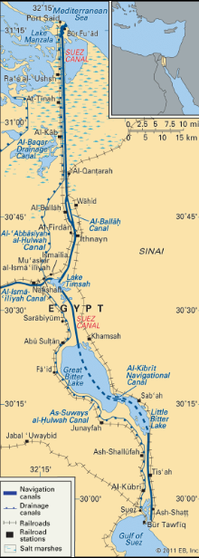
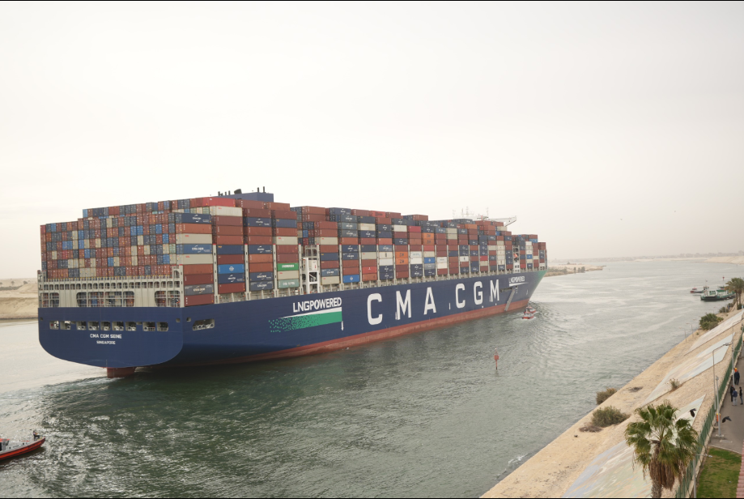
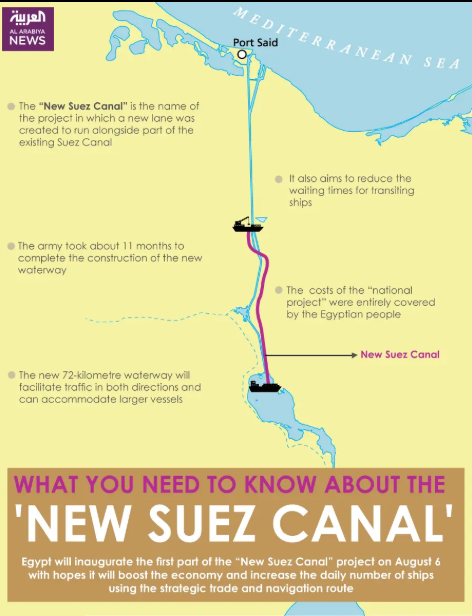
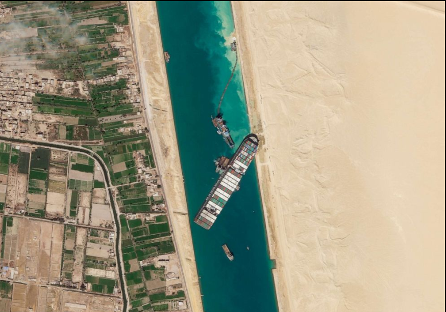

# Суэцкий канал

---

Суэцкий канал — один из важнейших морских путей мира. Он проходит по территории Египта через Суэцкий перешеек и соединяет Средиземное море с Красным морем, создавая прямой водный маршрут между Европой и Азией. Благодаря этому суда могут не огибать Африку, а идти более коротким путём, что делает канал ключевым элементом мировой торговли.

Суэцкий канал важен не только как географический [объект](../../../1.2_natural_sciences/physics_in_everyday_life/Q634.md), но и как экономический узел. Через него проходят контейнерные перевозки, [нефть](neft_v_mirovoy_ekonomike.md), сжиженный [газ](../../../1.1_structure_of_the_world/matter/articles/07_gases.md), промышленная продукция, сырьё и множество других грузов. Поэтому любое нарушение движения в канале быстро отражается на поставках, сроках доставки и транспортных расходах во всём мире.

---

## Содержание

- [Что это такое](#what-is)
- [Почему это важно для мировой экономики](#why-important)
- [Как это работает](#how-it-works)
- [Пример из реальной жизни](#real-life)
- [На пальцах](#simple)
- [Почему это важно школьнику](#school)
- [С чем связана статья в базе знаний](#links)
- [Интересный факт](#fact)
- [Заключение](#main)

---

## Что это такое

Суэцкий канал — это искусственный морской канал без шлюзов. Он соединяет Средиземное и Красное моря и проходит с севера на юг через территорию Египта. Его современная трасса тянется от района Порт-Саида на севере до Суэца на юге. Поскольку это канал уровня моря, [движение](../../../1.2_natural_sciences/physics_in_everyday_life/Q11023.md) по нему не требует подъёма и спуска судов через шлюзы, как, например, в некоторых других каналах мира.

Современный Суэцкий канал был построен в XIX веке. По данным Britannica и Управления Суэцкого канала, [строительство](../../../1.2_natural_sciences/physics_in_everyday_life/Q487005.md) велось с 1859 по 1869 год, а официальное [открытие](../../../1.2_natural_sciences/physics_in_everyday_life/Q560.md) состоялось 17 ноября 1869 года. Позже канал пережил несколько важных этапов истории, включая национализацию, закрытие после войны 1967 года и повторное открытие в июне 1975 года.

Его называют одним из важнейших торговых маршрутов мира, потому что он связывает крупнейшие экономические регионы и сильно сокращает [морской путь](panamskiy_kanal.md) между Европой и Азией. Одновременно он считается «узким местом» мировой торговли: движение идёт через ограниченный участок, и любая серьёзная [задержка](../../../5.1_technology_and_digital_literacy/how_internet_works/articles/dns/cdn.md) быстро влияет на глобальную логистику.

## Почему это важно для мировой экономики

Главное [значение](../../../7.2 Media, leisure and hobbies /useful_and_interesting_leisure/articles/leisure_and_why_need.md) Суэцкого канала в [том](../../../7.1_art/musical_instruments/articles/drums.md), что он сокращает морской путь между Европой и Азией. Это позволяет быстрее и дешевле перевозить товары между промышленными центрами Европы, странами Азии, Ближнего Востока и частью Африки. Более короткий маршрут означает экономию топлива, времени и эксплуатационных затрат, а значит, влияет на цену международной торговли в целом.

Канал особенно важен для мировой логистики, потому что через него идёт большой [поток](../../../5.1_technology_and_digital_literacy/operating system/articles/thread.md) судов. По данным справочных материалов, в 2021 году через него прошло более 20,6 тысячи судов, то есть в среднем около 56 в день. Даже если показатели по годам меняются, сам масштаб движения показывает, что это не региональная, а [глобальная](../../../5.2_cybersecurity/cpp_fundamentals/9_scopes.md) транспортная артерия.

Значение канала особенно велико для перевозок между Европой и Азией, а также для поставок энергоносителей. Через него идут контейнеры, [нефть](neft_v_mirovoy_ekonomike.md), газ, промышленная продукция и другие важные грузы. Когда движение через Суэцкий канал нарушается, [цепочки поставок](globalizatsiya.md) начинают сбоить: суда задерживаются, часть маршрутов приходится перестраивать, а [стоимость](../../../6.1_Independent_living_and_daily_living_skills/reasonable_spending/articles/price.md) перевозок возрастает. Именно поэтому Суэцкий канал часто называют одним из важнейших «узких мест» мировой торговли.

На фотографии видно, что Суэцкий канал используется крупнейшими современными контейнеровозами мира. Это показывает его значение как одного из главных маршрутов мировой торговли между Востоком и Западом.

## Как это работает

Суда проходят Суэцкий канал по организованной системе движения, а сам маршрут имеет особое значение из-за ограниченной пропускной [способности](../../../4.1_rules_of_study/how_to_learn_effectively/articles/growth_mindset.md) отдельных участков. Исторически канал включал однопутные отрезки и участки для расхождения судов, а в южной части проблемы особенно заметны, если движение нарушается. Именно поэтому даже одна крупная авария способна временно остановить весь поток через канал.

[Работа](../../../1.2_natural_sciences/physics_in_everyday_life/Q11382.md) канала основана на том, что он соединяет два больших морских бассейна напрямую, без необходимости сложных перегрузок на суше. Для мировой торговли это крайне удобно: контейнеры, нефть, газ и другие грузы идут единым маршрутом между регионами. Египет, в свою очередь, получает [доход](../../../6.1_Independent_living_and_daily_living_skills/reasonable_spending/articles/income.md) и стратегическое значение как государство, контролирующее один из ключевых маршрутов [планеты](../../../1.2_natural_sciences/physics_in_everyday_life/Q1.md).

Экономическая [логика](../../../2.1_society/cause_and_effect_relationships/articles/causality_base.md) канала проста: чем быстрее и надёжнее судно проходит между Азией и Европой, тем стабильнее работают международные поставки. Если канал свободен, [бизнес](../../../8.1_self-understanding/HowToFindYourStrengths/articles/talent_monetization.md) выигрывает за счёт скорости и предсказуемости. Если возникают задержки, возрастают [расходы](../../../6.1_Independent_living_and_daily_living_skills/reasonable_spending/articles/expense.md) на [топливо](neft_v_mirovoy_ekonomike.md), страхование, простой судов и хранение грузов, а последствия могут ощущаться далеко за пределами Египта. Это подтверждают исследования о сбоях морских цепочек поставок на примере Суэцкого канала.

На схеме видно, что канал не только исторически важен, но и продолжает модернизироваться. Расширение отдельных участков нужно для ускорения прохода судов, уменьшения задержек и увеличения пропускной способности маршрута.

## Пример из реальной жизни

Самый известный современный пример — [блокировка](../../../3.2 healthy lifestyle/how to act in a dangerous situation/articles/cyberbullying.md) канала контейнеровозом Ever Given в марте 2021 года. Судно село на мель 23 марта и перекрыло движение на шесть дней, до 29 марта. В это [время](../../../1.2_natural_sciences/physics_in_everyday_life/Q20702.md) через канал не могли проходить другие суда, а после снятия блокады пришлось разбирать крупный накопившийся затор. По сообщениям, к моменту восстановления движения в ожидании находилось более 400 судов.

На изображении видно, как одно крупное судно фактически перекрыло весь канал. Этот случай наглядно показал, насколько [мировая торговля](panamskiy_kanal.md) зависит от одного узкого маршрута и как быстро [локальная](../../../5.2_cybersecurity/cpp_fundamentals/9_scopes.md) авария превращается в глобальную проблему.

Этот случай наглядно показал, насколько мировая торговля зависит от одного узкого маршрута. Исследования и аналитические [материалы](../../../1.2_natural_sciences/physics_in_everyday_life/Q487005.md) после инцидента подчёркивали, что блокировка повлекла серьёзные потери для логистики, поставок и [доходов](../../../8.2_future/choosing_a_career_path/articles/salary.md), а также стала символом уязвимости глобальных цепочек перевозок. Иначе говоря, одна авария в одном месте временно стала проблемой для множества стран и компаний по всему миру.

## На пальцах

Суэцкий канал — это как очень важная короткая дорога между двумя частями мира. Если она свободна, товары идут быстро. Если она перекрыта, всем приходится ехать длинным объездом, и это дороже.

Если совсем просто, Суэцкий канал — это очень важная короткая дорога по воде между Европой и Азией. Пока эта дорога открыта, корабли идут быстрее и дешевле. Если она закрывается, им приходится искать обходной [путь](../../../1.2_natural_sciences/physics_in_everyday_life/Q11476.md) вокруг Африки, а это дольше, дороже и неудобнее.

Можно представить мировую торговлю как огромную систему доставки, а Суэцкий канал — как один из самых важных мостов на этой дороге. Пока [мост](../../../5.1_technology_and_digital_literacy/operating system/articles/HAL.md) работает, всё идёт по плану. Но если на мосту случается авария, пробка возникает не только рядом с ним — она влияет на всю [сеть](../../../5.1_technology_and_digital_literacy/how_internet_works/articles/history/internet_history.md). Именно это и произошло во время блокады 2021 года.

## Почему это важно школьнику

- помогает понять, почему география влияет на экономику;
- объясняет, как [морские пути](bosfor_i_dardanelly.md) связаны с ценами на товары;
- показывает, почему отдельные точки на карте могут быть важны для всего мира;
- полезно для географии, истории и экономики.

Тема Суэцкого канала важна школьнику, потому что она хорошо показывает [связь](../../../1.2_natural_sciences/physics_in_everyday_life/Q12969754.md) географии и экономики. На карте канал выглядит как сравнительно узкая линия, но в реальности от неё зависит [перемещение](../../../1.2_natural_sciences/physics_in_everyday_life/Q11476.md) огромного количества товаров. Это помогает понять, что в мировой экономике даже небольшая точка на карте может иметь огромное значение.

Кроме того, статья о Суэцком канале помогает лучше понимать новости. Когда в мире говорят о задержках поставок, росте транспортных расходов, проблемах в торговле между Европой и Азией или нестабильности на мировых рынках, за этим часто стоят конкретные маршруты и узкие места вроде Суэцкого канала.

Для школьника это ещё и хороший пример того, как объединяются знания из разных предметов. Здесь одновременно встречаются география, [история](../../../1.2_natural_sciences/physics_in_everyday_life/Q11469.md), экономика, политика и логистика. Суэцкий канал показывает, что [мировая экономика](globalizatsiya.md) — это не только цифры, но и реальные пути, по которым движутся товары и [ресурсы](../../../2.1_society/cause_and_effect_relationships/articles/ecological_footprint.md).

## С чем связана статья в базе знаний

- [Глобализация](./globalizatsiya.md) — канал ускоряет мировую торговлю.
- [Нефть в мировой экономике](./neft_v_mirovoy_ekonomike.md) — через него проходят энергетические грузы.
- [Ормузский пролив](./ormuzskiy_proliv.md) — ещё одно важное узкое место мировой торговли.
- [Босфор и Дарданеллы](./bosfor_i_dardanelly.md) — стратегические [проливы](bosfor_i_dardanelly.md), влияющие на логистику.
- [Панамский канал](./panamskiy_kanal.md) — другой важный межокеанский маршрут.
- [БРИКС](./briks.md) — для ряда стран объединения канал важен как часть внешней торговли.

## Интересный [факт](../../../1.2_natural_sciences/why_science_help_understand_world/science.md)

Даже кратковременный сбой на таком маршруте может повлиять на поставки товаров по всему миру, от топлива до бытовой электроники.

Хотя современный Суэцкий канал был открыт в 1869 году, Britannica отмечает, что различные формы водного [сообщения](../../../5.1_technology_and_digital_literacy/operating system/articles/IPC.md) между районом дельты Нила и Красным морем существовали ещё в древности, в разные эпохи до VIII века. Это значит, что идея соединить важные торговые направления в этом районе появилась задолго до современного канала.

## [Заключение](../../../1.2_natural_sciences/physics_in_everyday_life/Q2225.md)

Суэцкий канал — это один из ключевых узлов мировой логистики. Его значение показывает, насколько мировая экономика зависит от географии и бесперебойной [работы](../../../8.2_future/choosing_a_career_path/articles/interview.md) транспортных маршрутов.

Суэцкий канал — это один из ключевых узлов мировой экономики. Он соединяет важнейшие морские пространства, сокращает путь между Европой и Азией и делает международную торговлю быстрее и дешевле. Благодаря этому канал имеет не только транспортное, но и огромное экономическое и политическое значение.

История канала и особенно блокировка 2021 года хорошо показывают, насколько современный мир зависит от стабильной работы нескольких стратегических маршрутов. Поэтому Суэцкий канал важен как пример того, как география, история и мировая экономика соединяются в одной точке.

---

***[Автор](../../../4.2_thinking_and_working_information/how_to_search_information/articles/copypaste.md):** Георгий Голосов @goschikk*  
***GitHub:*** *[GeorgyGolosov](https://github.com/GeorgyGolosov)*  
***Использованные [нейросети](../../../2.1_society/cause_and_effect_relationships/articles/ai_causality.md) и ресурсы:*** *[ChatGPT](../../../7.1_art/modern_technological_art/articles/6.1_prompt_art.md) 5.4.*
