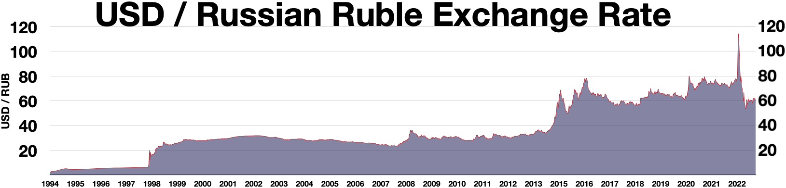
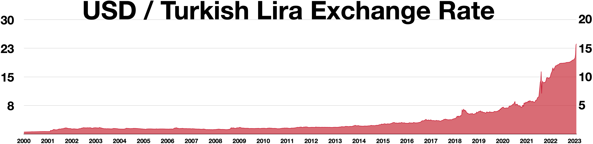

# Валютный курс

://open.er-api.com/v6/latest/USD)

**Валютный курс** — это [цена](../../../6.1_Independent_living_and_daily_living_skills/reasonable_spending/articles/price.md) одной валюты, выраженная в другой валюте. Через тему валютного курса удобно понять сразу несколько важных вещей: почему меняются цены на импортные товары, как связаны [деньги](../../../2.1_society/cause_and_effect_relationships/articles/economic_chains.md) разных стран, зачем государствам нужен [Центральный банк](./tsentralnyy_bank.md) и почему рядом со словом «курс» так часто стоят темы [Девальвация](./devalvatsiya.md), [Инфляция, дефляция и нулевая инфляция](./inflyatsiya_deflyatsiya_i_nulevaya_inflyatsiya.md), [Доллар США](./dollar_ssha.md), [Евро](./evro.md), [Китайский юань](./kitayskiy_yuan.md) и [Резервная валюта](./rezervnaya_valyuta.md).

Валютный курс важен не только для банков и экономистов. Он влияет на [стоимость](../../../6.1_Independent_living_and_daily_living_skills/reasonable_spending/articles/price.md) поездок, онлайн-покупок, импортной [техники](../../../8.2_future_and_path_choice/articles/03_stress_management.md), топлива, лекарств и даже на то, насколько выгодно стране продавать свои товары за рубеж. Поэтому это одна из центральных тем вашей базы знаний по мировой экономике.

---

## Содержание

- [Что такое валютный курс](#what-is-rate)
- [Как записывают курс](#how-written)
- [От чего зависит валютный курс](#what-affects)
- [Фиксированный, плавающий и управляемый курс](#regimes)
- [Почему валютный курс так важен](#why-important)
- [Примеры валютных пар](#examples)
- [Почему курс может резко меняться](#why-moves-fast)
- [На пальцах](#simple)
- [Почему это важно школьнику](#school)
- [Самое главное](#main) 

---

## Что такое валютный курс

Если говорить просто, валютный курс показывает, **сколько единиц одной валюты дают за единицу другой**. Например, если за 1 [доллар США](dollar_ssha.md) дают 90 рублей, значит курс доллара к рублю равен 90 рублям.

Это не просто число на табло в банке. Курс отражает соотношение между разными денежными системами. Через него видно, насколько участники рынка доверяют валюте, как они оценивают экономику страны и насколько удобно использовать эти деньги в международной торговле.

Именно поэтому курс всегда связан со статьями [Доллар США](./dollar_ssha.md), [Евро](./evro.md), [Китайский юань](./kitayskiy_yuan.md), [Иена](./iena.md), [Фунт стерлингов](./funt_sterlingov.md) и [Российский рубль](./rossiyskiy_rubl.md). Когда мы сравниваем валюты, мы сравниваем не просто бумажки или цифры, а целые экономики. 

---

## Как записывают курс

Валютный курс обычно записывают в виде **валютной пары**. Она показывает, сколько одной валюты стоит другая.

| Запись | Что это значит |
|---|---|
| USD/RUB | сколько рублей дают за 1 [доллар США](neftedollar.md) |
| EUR/USD | сколько долларов дают за 1 [евро](evro.md) |
| USD/JPY | сколько иен дают за 1 доллар США |
| CNY/USD | сколько долларов дают за 1 [юань](kitayskiy_yuan.md) или сколько юаней за 1 [доллар](dollar_ssha.md) — зависит от способа [записи](../../../4.1_rules_of_study/how_to_learn_effectively/articles/note_taking.md) |

Важно смотреть, **какая [валюта](../../../6.2_money_and_literacy/how_to_save_for_goal/articles/money.md) стоит первой, а какая второй**. От этого зависит смысл записи.

В реальной жизни люди часто говорят проще: «курс доллара», «курс [евро](rezervnaya_valyuta.md)», «курс юаня». Но в строгом смысле курс всегда бывает **к чему-то**. [Нельзя](../../../3.1_healthy_lifestyle/pervaya_pomoshch/ushibi_porezy_ozhogi/07_ushib_chego_nelzya.md) сказать, что у валюты есть курс сам по себе. У нее есть курс **по отношению к другой валюте**. 

---

## От чего зависит валютный курс

Валютный курс меняется потому, что на валюту есть [спрос](../../../2.1_society/cause_and_effect_relationships/articles/economic_chains.md) и предложение. Если многим нужна какая-то валюта, ее цена обычно растет. Если [доверие](../../../1.2_natural_sciences/neurobiology_for_teens/articles/17_hugs_oxytocin.md) к ней падает или ее хотят продать, курс может снижаться.

На курс влияют сразу несколько факторов:

- состояние экономики страны;
- решения [Центрального банка](./tsentralnyy_bank.md);
- [уровень](../../../../8.1_entertainment/articles/gamification.md) [Инфляция, дефляция и нулевая инфляция](./inflyatsiya_deflyatsiya_i_nulevaya_inflyatsiya.md);
- объемы импорта и экспорта;
- политические кризисы и [ожидания](../../../1.2_natural_sciences/neurobiology_for_teens/articles/27_brain_predicts.md) участников рынка;
- цены на сырье, особенно если страна сильно зависит от нефти, газа или металлов.

Если упростить, сильная и устойчивая экономика чаще вызывает больше доверия к своей валюте. Но это не значит, что курс всегда движется только по одной причине. На практике он зависит от множества факторов сразу.

Поэтому валютный курс тесно связан со статьями [Центральный банк](./tsentralnyy_bank.md), [Девальвация](./devalvatsiya.md), [Инфляция, дефляция и нулевая инфляция](./inflyatsiya_deflyatsiya_i_nulevaya_inflyatsiya.md), [Нефть в мировой экономике](./neft_v_mirovoy_ekonomike.md) и [Глобализация](./globalizatsiya.md). 

---

## Фиксированный, плавающий и управляемый курс

Не все страны относятся к курсу одинаково. Одни позволяют ему меняться относительно свободно, другие стараются удерживать его ближе к выбранному уровню, а третьи занимают промежуточное положение.

| [Режим](../../../4.1_rules_of_study/how_to_learn_effectively/articles/breaks_and_rest.md) | Простое [объяснение](../../../4.1_rules_of_study/how_to_learn_effectively/articles/teaching_others.md) |
|---|---|
| Фиксированный курс | государство или [центральный банк](tsentralnyy_bank.md) старается держать курс около выбранного уровня |
| Плавающий курс | курс в основном определяется рынком |
| Управляемый курс | курс меняется, но центральный [банк](../../../6.2_money_and_literacy/how_to_save_for_goal/articles/bank_account.md) иногда активно вмешивается |

*Курс евро к доллару США с 1999 года. [Источник](../../../5.1_technology_and_digital_literacy/information and media literacy/дезинформация_и_фейки.md) визуала: Wikimedia Commons, [автор](../../../4.2_thinking_and_working_information/how_to_search_information/articles/copypaste.md) Monaneko, [лицензия](../../../4.2_thinking_and_working_information/how_to_search_information/articles/copyright.md) [CC BY](../../../4.2_thinking_and_working_information/how_to_search_information/articles/copyright.md) 3.0; график основан на данных Federal Reserve.*

У каждого режима есть свои плюсы и минусы. Фиксированный курс может делать торговлю и [расчеты](../../../1.2_natural_sciences/physics_in_everyday_life/Q11023.md) более предсказуемыми. Плавающий курс дает экономике больше гибкости. Управляемый курс пытается совместить [устойчивость](../../../1.2_natural_sciences/physics_in_everyday_life/Q1530280.md) и возможность подстраиваться под изменения.

Именно здесь особенно заметна роль [Центральный банк](./tsentralnyy_bank.md). Если страна хочет удерживать курс ближе к определенному уровню, ей часто приходится активнее использовать [валютные резервы](tsentralnyy_bank.md), [процентные ставки](evrozona.md) и другие [инструменты](../../../1.2_natural_sciences/physics_in_everyday_life/Q36253.md) денежной политики. 

---

## Почему валютный курс так важен

Курс влияет на [жизнь](../../../1.2_natural_sciences/physics_in_everyday_life/Q1751973.md) людей и на экономику страны сразу по нескольким каналам.

Во-первых, он влияет на **[импорт](devalvatsiya.md)**. Если национальная валюта слабеет, импортные товары обычно становятся дороже. Это касается техники, лекарств, одежды, топлива и многих других вещей.

Во-вторых, курс влияет на **[экспорт](aziatskie_tigry.md)**. Когда валюта страны дешевеет, ее товары за рубежом могут казаться более выгодными по цене. Но это не всегда срабатывает мгновенно и не всегда дает одинаково сильный эффект.

В-третьих, курс связан с **инфляцией**. Если импорт дорожает, [рост цен](inflyatsiya_deflyatsiya_i_nulevaya_inflyatsiya.md) может перейти и на внутренний [рынок](../../../2.1_society/cause_and_effect_relationships/articles/economic_chains.md). Поэтому тема [Валютный курс](./valyutnyy_kurs.md) напрямую связана со статьями [Инфляция, дефляция и нулевая инфляция](./inflyatsiya_deflyatsiya_i_nulevaya_inflyatsiya.md) и [Девальвация](./devalvatsiya.md).

В-четвертых, через курс страны сравнивают свои валюты с более влиятельными [деньгами](../../../8.2_future/choosing_a_career_path/articles/salary.md) — например, с [Доллар США](./dollar_ssha.md) или [Евро](./evro.md). А это уже связано и с вопросом о [том](../../../7.1_art/musical_instruments/articles/drums.md), какие валюты становятся [Резервная валюта](./rezervnaya_valyuta.md). 

---

## Примеры валютных пар

Один и тот же принцип курса можно увидеть на очень разных примерах.

*Курс доллара США к российскому рублю. Источник визуала: Wikimedia Commons, автор Wikideas1, [статус](../../../5.1_technology_and_digital_literacy/how_internet_works/articles/http_https/http_https.md) — [CC0](../../../4.2_thinking_and_working_information/how_to_search_information/articles/copyright.md) / [public domain](../../../4.2_thinking_and_working_information/how_to_search_information/articles/copyright.md); график основан на исторических данных Investing.com.*

Пара **USD/RUB** хорошо показывает, как на курс влияют внешние шоки, цены на сырье, ожидания рынка и решения властей. На таких графиках видно, что курс может меняться не только плавно, но и очень резко.

*Курс доллара США к турецкой лире. Источник визуала: Wikimedia Commons, автор Wikideas1, статус — public domain; график основан на исторических данных Investing.com.*

Пара **USD/TRY** показывает другой [тип](../../../5.2_cybersecurity/cpp_fundamentals/13_struct.md) истории: валюта может слабеть не за один скачок, а постепенно и долго. Это помогает понять разницу между краткими колебаниями и долгим ослаблением курса.

Такие графики полезны для школьной энциклопедии, потому что они наглядно показывают: валютный курс — это живая величина, которая меняется во времени, а не раз и навсегда установленное число. 

---

## Почему курс может резко меняться

Иногда валютный курс ведет себя спокойно, а иногда меняется очень быстро. Это происходит, когда участники рынка резко меняют свои ожидания.

Например, курс может резко сдвинуться, если:

- центральный банк неожиданно меняет ставку;
- начинается политический или военный [кризис](../../../2.1_society/cause_and_effect_relationships/articles/economic_chains.md);
- падают цены на главный экспортный товар страны;
- инвесторы начинают массово выводить деньги;
- участники рынка боятся будущей [Девальвация](./devalvatsiya.md).

Именно поэтому курс валюты — это не просто «обмен [денег](../../../8.2_future/choosing_a_career_path/articles/salary.md)», а показатель доверия, ожиданий и устойчивости экономики. Когда люди [внимательно](../../../4.1_rules_of_study/how_to_memorize/articles/vnimanie.md) следят за курсом, они на самом деле следят за тем, [что происходит](../../../5.1_technology_and_digital_literacy/how_internet_works/articles/web_basics/what_happens.md) с экономикой страны и ее местом в мире. 

---

## На пальцах

Представьте, что в двух соседних школах разные жетоны. Если первая [школа](../../../3.1. healthy lifestyle/Sleep, nutrition, and adolescent energy/articles/healthy_school_snacks.md) делает много полезных вещей, которые хотят купить все остальные, ее жетоны начинают цениться выше. Если же у второй школы начинаются проблемы, а ее жетоны нужны все меньше, их ценность падает.

Примерно так и работает валютный курс. Он показывает, сколько «жетонов» одной страны готовы дать за «жетоны» другой страны. И эта цена зависит от доверия, спроса, удобства расчетов и общей [силы](../../../1.2_natural_sciences/physics_in_everyday_life/Q11423.md) экономики. 

---

## Почему это важно школьнику

Тема валютного курса кажется взрослой, но на самом деле она очень жизненная.

Во-первых, через курс легко понять, почему дорожают импортные товары и почему одни покупки за границей становятся выгоднее, а другие — нет.

Во-вторых, курс помогает разобраться в новостях. Если в новостях говорят, что валюта ослабла или укрепилась, ты уже понимаешь, что речь идет не просто о цифре, а о возможных последствиях для цен, торговли и экономики.

В-третьих, тема курса связывает сразу много других статей вашей базы знаний: [Доллар США](./dollar_ssha.md), [Евро](./evro.md), [Китайский юань](./kitayskiy_yuan.md), [Девальвация](./devalvatsiya.md), [Центральный банк](./tsentralnyy_bank.md) и [Инфляция, дефляция и нулевая инфляция](./inflyatsiya_deflyatsiya_i_nulevaya_inflyatsiya.md). Поэтому без статьи о валютном курсе [база](../../../1.2_natural_sciences/physics_in_everyday_life/Q5339.md) знаний про мировую экономику была бы неполной. 

---

## Самое главное

Валютный курс — это цена одной валюты, выраженная в другой валюте. Он показывает, сколько денег одной страны дают за деньги другой страны.

Курс зависит от спроса и предложения на валюту, состояния экономики, решений [Центральный банк](./tsentralnyy_bank.md), уровня [Инфляция, дефляция и нулевая инфляция](./inflyatsiya_deflyatsiya_i_nulevaya_inflyatsiya.md), цен на сырье и ожиданий участников рынка.

Через тему валютного курса хорошо видно, как связаны между собой [Доллар США](./dollar_ssha.md), [Евро](./evro.md), [Китайский юань](./kitayskiy_yuan.md), [Девальвация](./devalvatsiya.md), [Центральный банк](./tsentralnyy_bank.md) и [Резервная валюта](./rezervnaya_valyuta.md). Валютный курс — одна из главных тем для понимания современной мировой экономики. 

---

***Автор:** Лапенко Карина @Dhelprat*
***GitHub:*** *[Dhelprat](https://github.com/dhelprat)*
***Использованные [нейросети](../../../2.1_society/cause_and_effect_relationships/articles/ai_causality.md) и [ресурсы](../../../2.1_society/cause_and_effect_relationships/articles/ecological_footprint.md):*** *[ChatGPT](../../../7.1_art/modern_technological_art/articles/6.1_prompt_art.md) 5.4; IMF, “Exchange Rate Regimes: Fix or Float”; IMF, “Choice of Exchange Rate Arrangement” (2022); European Central Bank, “Exchange rate pass-through into euro area inflation”; World Bank, “How exports react to exchange-rate fluctuations, and what [it](../../../8.2_future/choosing_a_career_path/articles/programmer.md) means [for](../../../5.2_cybersecurity/cpp_fundamentals/7_loops.md) policy” (2024); Wikimedia Commons (локальные свободно лицензированные визуалы); [материалы](../../../1.2_natural_sciences/physics_in_everyday_life/Q487005.md) курса по оформлению статей в GFM.*
