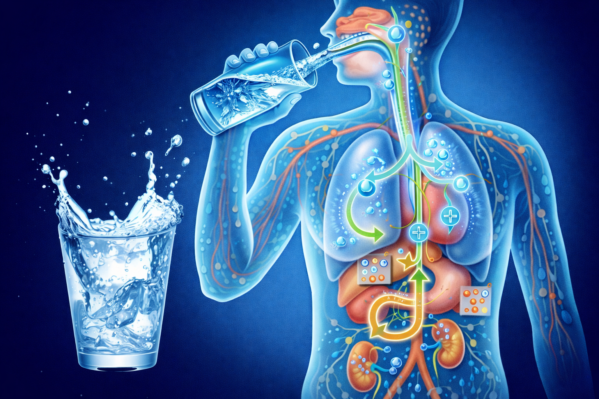

# [Водный баланс](./water.md)

**ID:** `water`  
**WikiData:** [Q4113990](https://www.wikidata.org/wiki/Q4113990)  
**Раздел:** 3.1. Здоровый образ жизни

> 💡 **Коротко:** Поддержание нужного количества воды в организме для правильной работы мозга, мышц и кожи.

---

## Введение
Привет! Задумывался ли ты когда-нибудь, из чего ты состоишь? Нет, не только из "костей и мяса". На самом деле, ты — это настоящий "ходячий океан". Твой организм примерно на 60–70% состоит из воды. Это значит, что если бы ты весил 40 килограммов, то почти 28 из них составляла бы чистая жидкость!

[Водный баланс](./water.md) — это равновесие между тем, сколько воды ты выпиваешь, и тем, сколько твой организм тратит на разные нужды. Вода — это главный транспорт в твоем теле. Она развозит витамины к клеткам, помогает переваривать обед и "вымывает" всё лишнее. Без воды жизнь человека невозможна дольше нескольких дней, поэтому следить за своим "внутренним уровнем моря" критически важно. 💧

## Как это работает: внутренняя логистика
Представь, что твои сосуды — это скоростные шоссе. Чтобы "машины" (полезные вещества) ехали быстро, дорога должна быть ровной и влажной. Если воды мало, кровь становится гуще, и сердцу сложнее её перекачивать.

Вот за что отвечает вода в твоем теле:
*   **Работа мозга**: Твой мозг — самый "мокрый" орган (он на 80% состоит из воды). Даже небольшая нехватка жидкости заставляет тебя туго соображать.
*   **Система охлаждения**: Когда тебе жарко или ты бегаешь, ты потеешь. Пот испаряется и охлаждает кожу. Чтобы эта система не "перегрелась", нужно постоянно доливать "охлаждающую жидкость". После активного спорта не забудь сходить в [душ](./shower.md), чтобы смыть соли, вышедшие с потом.
*   **Чистота изнутри**: Вода помогает почкам фильтровать кровь и выводить токсины. Это как внутренняя гигиена, такая же важная, как [мытье рук](./handwashing.md), только внутри тебя.

Твой организм очень умный. Когда уровень воды падает всего на 1–2%, он включает сигнал "Жажда". Это как красная лампочка на приборной панели автомобиля: "Срочно заправься!".

 

## Примеры из жизни школьника
Давай разберем ситуации, когда вода решает всё:

1.  **Контрольная работа или сложный урок**: Если на втором или третьем уроке ты вдруг почувствовал, что буквы в учебнике расплываются, а голова стала тяжелой — скорее всего, ты просто хочешь пить. Пара глотков воды помогут мозгу "проснуться" и сосредоточиться на задаче. Всегда держи бутылку чистой воды на парте.
2.  **Урок физкультуры**: Во время бега или игры в футбол ты теряешь много влаги через дыхание и пот. Если не пить воду во время и после тренировки, может заболеть голова или начаться судорога в мышцах. Вода помогает мышцам восстанавливаться быстрее.
3.  **Красивая кожа**: Если ты пьешь достаточно воды, твоя кожа выглядит здоровой и упругой. Это помогает организму бороться с такими проблемами, как [акне](./acne.md), так как вода помогает выводить вещества, которые могут провоцировать воспаления.

## Интересные факты
*   **Вода в еде**: Мы получаем воду не только из стакана. Например, огурец и арбуз на 95% состоят из воды. Даже в хлебе есть немного влаги! Но чистая вода всё равно остается самым полезным напитком, в отличие от сладкой газировки, от которой пить хочется еще сильнее.
*   **Цвет — подсказка**: Твое тело дает тебе визуальные подсказки. Если ты пьешь достаточно, твоя моча будет светло-желтой или почти прозрачной. Если она темно-желтая — это крик организма о помощи: "Мне срочно нужна вода!".
*   **Вода и рост**: Вода участвует в строительстве новых клеток. Если ты хочешь вырасти крепким и здоровым, вода тебе необходима так же, как строительный материал для дома.

## Заключение
[Водный баланс](./water.md) — это залог твоего хорошего настроения и отличных оценок. Не жди, пока во рту станет совсем сухо. Пей понемногу в течение всего дня. Купи себе красивую многоразовую бутылку, которую приятно брать с собой в школу. Помни: чистая вода изнутри и [мытье рук](./handwashing.md) снаружи — это два главных правила долгой и здоровой жизни! 🌍✨

---

*Автор: Бугренков Владимир • Сгенерировано с помощью ChatGPT 5-2 • Слов: 538 • 2026-03-09*