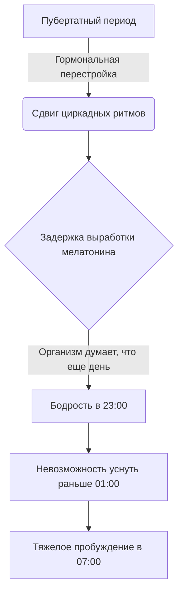

# [Биология](../../../3.1. healthy lifestyle/Sleep, nutrition, and adolescent energy/articles/biology_of_night_owls_teens.md) «сов»: Почему [подростки](../../../3.1. healthy lifestyle/Sleep, nutrition, and adolescent energy/articles/biology_of_night_owls_teens.md) ложатся поздно?

Ты лежишь в кровати, на часах 23:30. [Родители](../../../../8.1_self_understanding/articles/family_influence.md) уже видят десятый [сон](../../../3.1. healthy lifestyle/Sleep, nutrition, and adolescent energy/articles/evening_rituals_sleep_fast.md), а твой [мозг](../../../3.1. healthy lifestyle/Sleep, nutrition, and adolescent energy/articles/breakfast_for_the_brain.md) решил, что самое [время](../../../1.2_natural_sciences/physics_in_everyday_life/Q20702.md) обдумать смысл жизни, [вспомнить](../../../how_to_memorize/articles/aktivnoe_vspominanie.md) все неловкие моменты за последние 5 лет или просто залипнуть в потолок. Взрослые называют это нарушением режима или бунтом, но [наука](../../../1.2_natural_sciences/why_science_help_understand_world/science.md) называет это **«задержкой [фазы сна](../../../1.2_natural_sciences/neurobiology_for_teens/articles/09_sleep.md)»**.

[Спойлер](../../../1.2_natural_sciences/neurobiology_for_teens/articles/19_curiosity.md): ты не сломан, и это не [лень](../../../1.2_natural_sciences/neurobiology_for_teens/articles/12_lazy_brain.md). Это твоя [биология](../../../3.1. healthy lifestyle/Sleep, nutrition, and adolescent energy/articles/biology_of_night_owls_teens.md). Разберемся, [что происходит](../../../5.1_technology_and_digital_literacy/how_internet_works/articles/web_basics/what_happens.md) с твоим организмом и почему будильник в 7:00 кажется орудием пыток.

>### 🛑 Рубрика «Миф vs [Реальность](../../../1.2_natural_sciences/physics_in_everyday_life/Q140028.md)»
>
>**1. Про [сон](../../../3.1. healthy lifestyle/Sleep, nutrition, and adolescent energy/articles/evening_rituals_sleep_fast.md) в [выходные](../../../3.1. healthy lifestyle/Sleep, nutrition, and adolescent energy/articles/social_jetlag_and_monday_morning.md)**  
>🔴 *Миф:* «Я отосплюсь за субботу и воскресенье».  
>🟢 *Реальность:* Это [социальный джетлаг](../../../3.1. healthy lifestyle/Sleep, nutrition, and adolescent energy/articles/social_jetlag_and_monday_morning.md). В [понедельник](../../../3.1. healthy lifestyle/Sleep, nutrition, and adolescent energy/articles/social_jetlag_and_monday_morning.md) проснуться будет еще сложнее.
>
>**2. Про [режим](../../../5.1_technology_and_digital_literacy/information and media literacy/семейные_правила_потребления_контента.md)**  
>🔴 *Миф:* «Я просто сова по привычке».  
>🟢 *Реальность:* Это биологический [сдвиг](../../../1.2_natural_sciences/physics_in_everyday_life/Q193514.md) ритмов. Твой [мозг](../../../3.1. healthy lifestyle/Sleep, nutrition, and adolescent energy/articles/breakfast_for_the_brain.md) думает, что в 23:00 еще ранний вечер.

## Кто перевел [часы](../../../1.2_natural_sciences/physics_in_everyday_life/Q20702.md) внутри меня?

В нашем мозге есть крошечный участок — супрахиазматическое [ядро](../../../1.1_structure_of_the_world/matter/articles/03_atom_structure.md). Это главный дирижер нашего организма, который управляет циркадными ритмами (циклом сон-бодрствование).

Главный инструмент дирижера — гормон **[мелатонин](../../../3.1. healthy lifestyle/Sleep, nutrition, and adolescent energy/articles/biology_of_night_owls_teens.md)**. Он подает [сигнал](../../../5.1_technology_and_digital_literacy/how_internet_works/articles/wifi/router.md): «На улице темно, пора [спать](../../../how_to_memorize/articles/son.md)».

### В чем проблема подростков?

У взрослых выброс мелатонина начинается примерно в 21:00–22:00. У подростков этот [процесс](../../../5.1_technology_and_digital_literacy/operating system/articles/process.md) сдвигается на **2 часа позже**. То есть, когда родители уже клюют носом, твой [организм](../../../1.2_natural_sciences/why_science_help_understand_world/organism.md) находится в состоянии бодрого вечера. Для твоего тела 23:00 — это как 21:00 для взрослого.

Это [явление](../../../1.2_natural_sciences/physics_in_everyday_life/Q163214.md) называется **физиологическим сдвигом фазы сна**.

## [Давление](../../../1.1_structure_of_the_world/matter/articles/07_gases.md) сна: Второй игрок

Помимо циркадных ритмов, есть **гомеостатическое [давление](../../../1.1_structure_of_the_world/matter/articles/07_gases.md) сна**. Представь, что это [шкала](../../../1.2_natural_sciences/physics_in_everyday_life/Q11223329.md) энергии, которая заполняется усталостью (химическим веществом, которое называется **аденозин**) в течение дня.

У детей эта шкала заполняется быстро — к вечеру они валятся с ног. У подростков процесс [накопления](../../../6.1_Independent_living_and_daily_living_skills/reasonable_spending/articles/savings.md) усталости замедляется. Тебе нужно больше времени бодрствования, чтобы почувствовать ту самую «сонливость». Именно поэтому, даже если ты лег в 22:00, ты можешь лежать с открытыми глазами — «давления» сна еще недостаточно.

### Что с этим делать? (Короткий чек-лист)

Мы не можем полностью отменить биологию, но можем перестать ей мешать.

*   **[Свет](../../../1.2_natural_sciences/why_science_help_understand_world/physics.md) утром — твой друг.** Открывай шторы сразу, как проснешься. Яркий [свет](../../../1.2_natural_sciences/physics_in_everyday_life/Q1.md) подавляет остатки мелатонина и «запускает» таймер на следующий вечер.
*   **Темнота вечером — [необходимость](../../../6.1_Independent_living_and_daily_living_skills/reasonable_spending/articles/need.md).** [Синий свет](../../../3.1. healthy lifestyle/Sleep, nutrition, and adolescent energy/articles/gadgets_blue_light_sleep.md) от экрана телефона мозг воспринимает как дневной (солнечный). Используй "Ночной [режим](../../../4.1_rules_of_study/how_to_learn_effectively/articles/breaks_and_rest.md)" или [очки](../../../1.2_natural_sciences/physics_in_everyday_life/Q14620.md), блокирующие синий [спектр](../../../1.2_natural_sciences/physics_in_everyday_life/Q1075.md).
*   **Не пытайся [«доспать»]("./articles/social_jetlag_and_monday_morning.md") в воскресенье до 14:00.** Это сместит твои ритмы еще дальше, и в ночь на [понедельник](../../../3.1. healthy lifestyle/Sleep, nutrition, and adolescent energy/articles/social_jetlag_and_monday_morning.md) ты не уснешь до 3 утра.

### 😂 Анекдот от GPT по теме

Разговаривают два подростка:

— Слушай, а ты во сколько вчера лег?

— Рано...

— В десять вечера?

— Нет, в пять утра. Рано утром!

---
**[Автор](../../../5.1_technology_and_digital_literacy/information and media literacy/авторское_право_и_честное_использование.md):** Мельцова Вероника

**Нейронные сети, использованные при создании статьи:** OpenAI GPT-4o, Google Gemini 1.5 Pro
