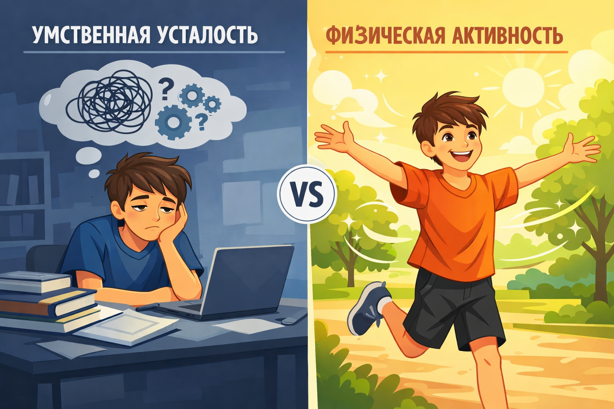

# [Спорт](../../../3.1. healthy lifestyle/Sleep, nutrition, and adolescent energy/articles/sport_and_energy.md) и [энергия](../../../3.1. healthy lifestyle/Sleep, nutrition, and adolescent energy/articles/breakfast_for_the_brain.md): Почему [физическая активность](../../../3.1. healthy lifestyle/Sleep, nutrition, and adolescent energy/articles/sport_and_energy.md) лечит [усталость](../../../3.1. healthy lifestyle/Sleep, nutrition, and adolescent energy/articles/sugar_rollercoaster.md), а не усиливает её

Представь ситуацию: ты сидишь за уроками несколько часов подряд. [Глаза](../../../7.2 Media, leisure and hobbies/Computer games/articles/useful_tips/eyes_and_back.md) слипаются, мысли путаются, каждое [движение](../../../1.2_natural_sciences/why_science_help_understand_world/physical_science.md) даётся с трудом. Единственное [желание](../../../6.1_Independent_living_and_daily_living_skills/reasonable_spending/articles/want.md) — упасть на кровать и не двигаться до утра. И тут кто-то предлагает тебе пойти на тренировку. Звучит как издевательство, правда?

Но именно в этом и кроется главный парадокс, который учёные раскрыли давно, но в который до сих пор трудно поверить: **[физическая активность](../../../3.1. healthy lifestyle/Sleep, nutrition, and adolescent energy/articles/sport_and_energy.md) не забирает энергию, а создаёт её**.

Давай разберёмся, почему [движение](../../../1.2_natural_sciences/physics_in_everyday_life/Q11023.md) — это не про «ещё больше устать», а про перезагрузку всего организма.

> ### 🛑 Рубрика «Миф vs [Реальность](../../../1.2_natural_sciences/physics_in_everyday_life/Q140028.md)»
>
> **1. Про экономию сил**
> 🔴 *Миф:* «Если я [устал](../../../how_to_memorize/articles/ustalost.md), нужно лечь и не двигаться, чтобы сохранить энергию».
> 🟢 *Реальность:* Длительное лежание снижает тонус мышц, замедляет кровообращение, и [усталость](../../../3.1. healthy lifestyle/Sleep, nutrition, and adolescent energy/articles/sugar_rollercoaster.md) становится хронической. [Организм](../../../1.2_natural_sciences/why_science_help_understand_world/organism.md) входит в [режим](../../../5.1_technology_and_digital_literacy/information and media literacy/семейные_правила_потребления_контента.md) «энергосбережения», из которого всё труднее выйти.
>
> **2. Про [спорт](../../../3.1. healthy lifestyle/Sleep, nutrition, and adolescent energy/articles/sport_and_energy.md) после учёбы**
> 🔴 *Миф:* «В школе была физра — этого достаточно. После уроков [мозг](../../../3.1. healthy lifestyle/Sleep, nutrition, and adolescent energy/articles/breakfast_for_the_brain.md) и [тело](../../../1.2_natural_sciences/why_science_help_understand_world/organism.md) требуют только горизонтального положения».
> 🟢 *Реальность:* Умственная и физическая усталость работают по разным механизмам. Физра утром или днём не отменяет эффекта вечерней активности. Более того, именно смена деятельности даёт настоящий [отдых](../../../3.1. healthy lifestyle/Sleep, nutrition, and adolescent energy/articles/evening_rituals_sleep_fast.md).
>
> **3. Про [лень](../../../1.2_natural_sciences/neurobiology_for_teens/articles/12_lazy_brain.md)**
> 🔴 *Миф:* «Я просто ленивый, поэтому не [хочу](../../../6.1_Independent_living_and_daily_living_skills/reasonable_spending/articles/want.md) напрягаться после учёбы».
> 🟢 *Реальность:* Часто то, что мы принимаем за лень, — это защитный механизм перегруженного мозга. Но он ошибается: ему нужно не бездействие, а переключение.

## Два вида усталости: почему [мозг](../../../3.1. healthy lifestyle/Sleep, nutrition, and adolescent energy/articles/breakfast_for_the_brain.md) и [тело](../../../1.2_natural_sciences/why_science_help_understand_world/organism.md) — разные вселенные

Чтобы понять парадокс спорта, нужно разделить два понятия: **умственное [утомление](../../../how_to_memorize/articles/ustalost.md)** и **мышечное [утомление](../../../4.1_rules_of_study/how_to_memorize/articles/ustalost.md)**.

Когда ты решаешь [задачи](../../../1.2_natural_sciences/why_science_help_understand_world/research_work.md), пишешь сочинения или запоминаешь параграфы, твой мозг активно работает. [Нейроны](../../../1.2_natural_sciences/neurobiology_for_teens/articles/22_neuroplasticity.md) потребляют [глюкозу]("./articles/sugar_rollercoaster.md") и [кислород](../../../1.2_natural_sciences/physics_in_everyday_life/Q629.md), накапливаются [продукты](../../../3.1. healthy lifestyle/Sleep, nutrition, and adolescent energy/articles/healthy_school_snacks.md) обмена. При этом тело может часами находиться в статичном положении: скрюченная [спина](../../../7.2 Media, leisure and hobbies/Computer games/articles/useful_tips/eyes_and_back.md), зажатая [шея](../../../7.2 Media, leisure and hobbies/Computer games/articles/useful_tips/eyes_and_back.md), онемевшие ноги.

Возникает состояние, которое психологи называют **«центральная усталость»**:

- Туман в голове
- Снижение концентрации
- Раздражительность
- Желание всё бросить
- Физическая вялость

В этот момент кажется, что сил нет совсем. Но это иллюзия. Запасы энергии в мышцах всё ещё есть. Просто мозг подаёт [сигнал](../../../5.1_technology_and_digital_literacy/how_internet_works/articles/wifi/router.md): «Стоп, я перегрелся, дай отдохнуть».

## [Что происходит](../../../5.1_technology_and_digital_literacy/how_internet_works/articles/web_basics/what_happens.md), когда ты начинаешь двигаться?

Допустим, ты пересилил себя и вышел на пробежку или просто начал танцевать под любимый трек. В организме запускается целый каскад реакций.

| Фактор | Что происходит в организме? | Какой эффект ты чувствуешь? |
|:--|:--|:--|
| **[Ускорение](../../../1.2_natural_sciences/physics_in_everyday_life/Q11376.md) кровотока** | [Сердце](../../../3.1. healthy lifestyle/Sleep, nutrition, and adolescent energy/articles/the_energy_trap.md) качает кровь быстрее, доставляя к мозгу больше кислорода. | **Ясность мышления.** Уходит «туман» из головы, легче [сосредоточиться](../../../how_to_memorize/articles/koncentraciya.md). |
| **Выработка эндорфинов** | Мозг выделяет «гормоны радости» (естественные обезболивающие). | **[Повышение](../../../8.2_future/choosing_a_career_path/articles/career-path.md) настроения.** Приходит чувство лёгкости и удовлетворения. |
| **Снижение уровня кортизола** | «Сжигаются» излишки гормона стресса, накопленного за день. | **Уменьшение тревоги.** [Нервы](../../../1.2_natural_sciences/neurobiology_for_teens/articles/03_nervous_system_map.md) успокаиваются, [напряжение](../../../how_to_memorize/articles/stress.md) уходит. |

**[Результат](../../../1.2_natural_sciences/why_science_help_understand_world/experimental_science.md):** Несмотря на затраченную энергию, ты чувствуешь **общую [бодрость](../../vrednye_privychki/articles/energetiki.md)** и прилив сил.
## Почему подросткам особенно нужно двигаться?

В подростковом возрасте происходят мощнейшие изменения в мозге. [Нейронные связи](../../../1.2_natural_sciences/neurobiology_for_teens/articles/21_how_memory_works.md) перестраиваются, формируются новые пути. Это энергозатратный [процесс](../../../5.1_technology_and_digital_literacy/operating system/articles/process.md), который требует:

- Хорошего кровоснабжения
- Достаточного количества кислорода
- Регулярного «сброса» стресса

Если ты проводишь бóльшую часть дня сидя ([школа](../../../3.1. healthy lifestyle/Sleep, nutrition, and adolescent energy/articles/healthy_school_snacks.md) + уроки + [соцсети](../../../2.1_society/how_and_where_find_friends/articles/tcifrovaya_druzhba.md)), мозг испытывает кислородное голодание. Отсюда — вялость, апатия, [трудности](../../../4.1_rules_of_study/how_to_learn_effectively/articles/growth_mindset.md) с запоминанием.

**Короткая тренировка в этом случае — не трата времени, а инвестиция в работоспособность мозга.**

---

## [Эксперимент](../../../1.2_natural_sciences/why_science_help_understand_world/science.md): что выберешь ты?

Учёные провели [исследование](../../../1.2_natural_sciences/why_science_help_understand_world/experimental_science.md): двум группам людей дали сложное умственное задание до изнеможения. Первой группе предложили отдохнуть лёжа, второй — 15 минут лёгкой активности (ходьба, растяжка). Затем обе группы снова проверяли на когнитивные [способности](../../../4.1_rules_of_study/how_to_learn_effectively/articles/growth_mindset.md).

**[Результат](../../../1.2_natural_sciences/why_science_help_understand_world/experimental_science.md):** группа с физической активностью показала [результаты](../../../1.2_natural_sciences/why_science_help_understand_world/research_work.md) на **30% выше**, чем группа «лежачих». У них быстрее восстанавливалась [концентрация](../../../how_to_memorize/articles/koncentraciya.md) и [скорость реакции](../../../1.1_structure_of_the_world/matter/articles/12_chemical_properties.md).

---

## Как использовать этот парадокс? (Короткий чек-лист)

Не нужно тащить себя в спортзал поднимать штангу, если валишься с ног. Главное — начать двигаться, но с умом.

- **[Правило](../../../1.2_natural_sciences/why_science_help_understand_world/patterns.md) 10 минут.** Скажи себе: «Я позанимаюсь всего 10 минут, а потом посмотрю на состояние». Обычно этого хватает, чтобы войти во [вкус](../../../1.2_natural_sciences/neurobiology_for_teens/articles/10_sweet_tooth.md). Если нет — ты хотя бы попробовал и разогнал кровь.
- **Выбирай то, что нравится.** Не любишь бегать — танцуй. Не любишь танцы — гуляй быстрым шагом. Не любишь гулять — делай растяжку под любимый сериал. Лучшая тренировка — та, которую ты не бросаешь.
- **Интенсивность влияет на результат.** Для снятия умственной усталости лучше работает умеренная активность (пульс 120–140 уд/мин), а не изматывающие рекорды.
- **[Время](../../../1.2_natural_sciences/physics_in_everyday_life/Q20702.md) имеет [значение](../../../7.2_leisure/useful_and_interesting_leisure/articles/leisure_and_why_need.md).** Идеально — через 1–2 часа после возвращения из школы. Слишком поздно вечером (за 2 часа до сна) активность может помешать засыпанию.
- **Не забывай [про воду]("./articles/drinking_regime.md").** Во время [тренировки](../../../3.1. healthy lifestyle/Sleep, nutrition, and adolescent energy/articles/sport_and_energy.md) пей небольшими глотками. Обезвоживание сводит на нет весь бодрящий эффект.

---

## Таблица: Как разные активности влияют на усталость

| [Тип](../../../5.2_cybersecurity/cpp_fundamentals/13_struct.md) активности | Эффект при умственной усталости | Когда лучше применять |
|:--|:--|:--|
| **Бег трусцой / быстрая ходьба** | Отлично прочищает голову, насыщает кислородом | Днём или ранним вечером |
| **Интервальная тренировка** | Быстрый выброс энергии, полная перезагрузка | Если есть [силы](../../../1.2_natural_sciences/physics_in_everyday_life/Q11423.md) и нужно «встряхнуться» |
| **Растяжка / йога** | Снимает мышечные зажимы, успокаивает нервы | Вечером, после уроков, перед сном |
| **Танцы** | Снимают эмоциональное [напряжение](../../../1.2_natural_sciences/physics_in_everyday_life/Q11023.md), поднимают [настроение](../../../8.1_entertainment/articles/psychology_of_music.md) | В любое время, когда грустно или скучно |
| **Силовая тренировка** | Даёт ощущение контроля и силы, отвлекает от мыслей | Когда есть свободные 30–40 минут |
| **Прогулка на свежем воздухе** | Универсальный [восстановитель](../../../1.1_structure_of_the_world/matter/articles/12_chemical_properties.md) | Всегда, когда есть возможность |

> [!TIP]
> Самый простой способ проверить теорию на себе: в следующий раз, когда почувствуешь тупую усталость от учёбы, выйди на 15-минутную прогулку в быстром темпе (можно под музыку или подкаст). Вернись и оцени своё состояние. Скорее всего, ты удивишься результату.

---

## Почему мы боимся начать?

Главный [враг](../../../7.2 Media, leisure and hobbies/Computer games/articles/heroes_and_villains/main_villains.md) здесь — [инерция](../../../1.2_natural_sciences/physics_in_everyday_life/Q11402.md). Первые 5–10 минут кажутся адскими, потому что [организм](../../../1.2_natural_sciences/neurobiology_for_teens/articles/03_nervous_system_map.md) ленив и хочет экономить. Но если пройти этот барьер, включается «[режим](../../../4.1_rules_of_study/how_to_learn_effectively/articles/breaks_and_rest.md) [работы](../../../8.2_future/choosing_a_career_path/articles/interview.md)», и становится легче.

Это как заводить старую машину в мороз: сначала мотор чихает и не хочет, но потом прогревается и едет.

---

### 😂 Анекдот от GPT по теме

Встречаются два друга после тяжёлого учебного дня.

— Слушай, я так [устал](../../../4.1_rules_of_study/how_to_memorize/articles/ustalost.md), что сил нет даже телефон в руках держать.

— А пойдём в зал?

— Ты с ума сошёл? Я же сказал — устал!

— Ну как хочешь. А я слышал, что спорт — это единственный вид усталости, после которого реально прибавляется сил.

— Ладно, уговорил. Но если я после [тренировки](../../../3.1. healthy lifestyle/Sleep, nutrition, and adolescent energy/articles/sport_and_energy.md) не стану бодрым, ты мне будешь должен шоколадку.

— Договорились.

*(На следующий день)*

— Ну как?

— Шоколадку я тебе не отдам. Но энергией со вчерашнего вечера до сих пор заряжен. Это что за колдовство?

— [Биология](../../../3.1. healthy lifestyle/Sleep, nutrition, and adolescent energy/articles/biology_of_night_owls_teens.md), брат. Чистая [биология](../../../3.1. healthy lifestyle/Sleep, nutrition, and adolescent energy/articles/biology_of_night_owls_teens.md).

---

## Коротко о главном

Если вынести из статьи только три мысли:

1.  **Мозг устаёт иначе, чем тело.** То, что ты чувствуешь после учёбы, часто не требует сна, а требует смены активности.
2.  **Движение запускает «второе [дыхание](../../../1.2_natural_sciences/why_science_help_understand_world/organism.md)».** За счёт ускорения крови, выработки эндорфинов и снижения кортизола спорт даёт энергию, а не забирает её.
3.  **Главное — начать.** Первые минуты самые сложные, но именно они открывают доступ к внутренним резервам организма.

Попробуй в следующий раз вместо «посплю часок» сделать короткую разминку или прогулку. Возможно, это изменит твоё представление об отдыхе навсегда.

---

**[Автор](../../../5.1_technology_and_digital_literacy/information and media literacy/авторское_право_и_честное_использование.md):** Жмур Мария

**Нейронные сети, использованные при создании статьи:** OpenAI GPT-5.3, DeepSeek

**[Источники](../../../4.2_thinking_and_working_information/how_to_search_information/articles/three_whales.md) вдохновения:** исследования Гарвардской медицинской школы, [данные](../../../2.1_society/cause_and_effect_relationships/articles/ai_causality.md) ВОЗ о физической активности подростков, [материалы](../../../1.2_natural_sciences/physics_in_everyday_life/Q487005.md) TED-Ed о [работе](../../../8.2_future/choosing_a_career_path/articles/interview.md) мозга.