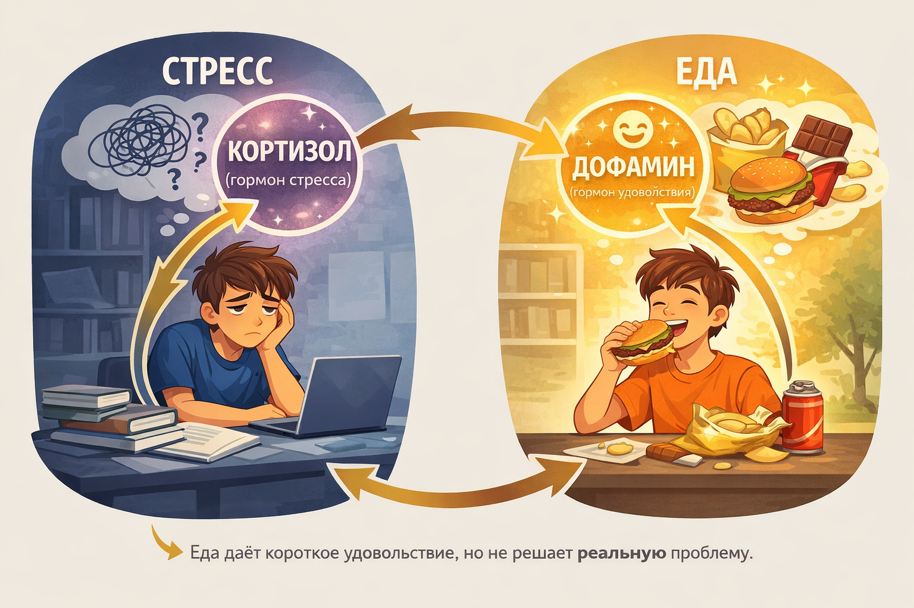

# [Стресс](../../../3.1. healthy lifestyle/Sleep, nutrition, and adolescent energy/articles/chronic_sleep_deprivation.md) и «эмоциональное поедание»: Как экзамены портят пищевые [привычки](../../../1.2_natural_sciences/neurobiology_for_teens/articles/11_reward_system.md)

Представь вечер перед важной контрольной. Ты сидишь над учебниками, в голове каша, а рука сама тянется к пачке чипсов, шоколадке или вчерашней пицце. «Это просто [голод](../../../1.2_natural_sciences/neurobiology_for_teens/articles/08_hunger.md)», — думаешь ты. Но через 15 минут после съеденного приходит вялость, ещё через час — чувство вины, а на следующее утро — прыщ и плохое [настроение](../../../8.1_entertainment/articles/psychology_of_music.md).

Знакомо? Поздравляю, ты столкнулся с **эмоциональным поеданием**. И дело тут не в отсутствии [силы](../../../1.2_natural_sciences/physics_in_everyday_life/Q11423.md) воли, а в древней биологии, которая до сих пор управляет нашим поведением в стрессе.

Разберёмся, почему экзамены превращают нас в пищевых монстров и как разорвать этот круг без жёстких диет.

> ### 🛑 Рубрика «Миф vs [Реальность](../../../1.2_natural_sciences/physics_in_everyday_life/Q140028.md)»
>
> **1. Про голод**
> 🔴 *Миф:* «Раз мне хочется есть — значит, [организм](../../../1.2_natural_sciences/why_science_help_understand_world/organism.md) действительно нуждается в энергии».
> 🟢 *Реальность:* В стрессе мы часто путаем физический голод с эмоциональным. Рука тянется к еде не потому, что желудок пуст, а потому что [мозг](../../../3.1. healthy lifestyle/Sleep, nutrition, and adolescent energy/articles/breakfast_for_the_brain.md) требует дофамина и успокоения.
>
> **2. Про силу воли**
> 🔴 *Миф:* «Я просто слабовольный, надо было отказаться от булочки».
> 🟢 *Реальность:* В стрессовом состоянии [мозг](../../../3.1. healthy lifestyle/Sleep, nutrition, and adolescent energy/articles/breakfast_for_the_brain.md) отключает часть самоконтроля — это эволюционный механизм. Бороться с ним силой воли почти бесполезно, но можно обмануть.
>
> **3. Про лёгкие [перекусы](../../../3.1. healthy lifestyle/Sleep, nutrition, and adolescent energy/articles/healthy_school_snacks.md)**
> 🔴 *Миф:* «Лучше постоянно жевать что-то обезжиренное, чем сорваться на пиццу».
> 🟢 *Реальность:* Постоянное жевание (даже сельдерея) не даёт пищеварительной системе отдыхать и поддерживает тревожный [режим](../../../5.1_technology_and_digital_literacy/information and media literacy/семейные_правила_потребления_контента.md) «я ем, значит, я в [опасности](../../../1.2_natural_sciences/physics_in_everyday_life/Q845744.md)».

## Почему экзамены включают [режим](../../../4.1_rules_of_study/how_to_learn_effectively/articles/breaks_and_rest.md) «обжоры»?

Чтобы понять этот механизм, нужно заглянуть вглубь эволюции. Представь древнего человека, который увидел саблезубого тигра. [Что происходит](../../../5.1_technology_and_digital_literacy/how_internet_works/articles/web_basics/what_happens.md) в его организме?

1. Выброс **кортизола** и **адреналина** ([гормоны стресса](../../../1.2_natural_sciences/neurobiology_for_teens/articles/07_stress.md))
2. [Мобилизация](../../../1.2_natural_sciences/neurobiology_for_teens/articles/07_stress.md) всех ресурсов: «[бей или беги](../../../1.2_natural_sciences/neurobiology_for_teens/articles/07_stress.md)»
3. [Организм](../../../1.2_natural_sciences/neurobiology_for_teens/articles/03_nervous_system_map.md) требует **быстрой энергии**, чтобы выжить

Какое [топливо](../../../2.2_history/world_economy_on_fingers/articles/neft_v_mirovoy_ekonomike.md) даёт максимально быстрый прилив сил? Правильно — **[сахар]("./articles/sugar_rollercoaster.md") и жиры**. В природе это редкие и ценные [ресурсы](../../../2.1_society/cause_and_effect_relationships/articles/ecological_footprint.md) (мёд, жирное мясо). Поэтому мозг закрепил механизм: «[стресс](../../../3.1. healthy lifestyle/Sleep, nutrition, and adolescent energy/articles/chronic_sleep_deprivation.md) = ищи калорийное».

Для твоего мозга экзамен — тот же саблезубый тигр. Разницы нет. Гормоны те же, [реакция](../../../1.2_natural_sciences/why_science_help_understand_world/chemistry.md) та же. Только вместо охоты на мамонта ты охотишься за шоколадкой в школьном буфете.

## [Замкнутый круг](../../../8.2_future_and_path_choice/articles/procrastination_and_stress.md) экзаменационного жора

Вот как выглядит типичный цикл эмоционального поедания во [время](../../../1.2_natural_sciences/physics_in_everyday_life/Q20702.md) сессии:

1. **Стресс перед экзаменом** → выброс кортизола
2. **Выброс кортизола** → мозг требует быстрых углеводов и жиров
3. **Мозг требует еду** → съедаем вредную пищу
4. **Съедаем вредное** → кратковременный дофаминовый кайф
5. **Дофаминовый кайф** → резкий скачок инсулина
6. **Скачок инсулина** → падение сахара в крови
7. **Падение сахара** → упадок сил + чувство вины
8. **Упадок сил и [вина](../../../2.1_society/cause_and_effect_relationships/articles/responsibility.md)** → НОВЫЙ СТРЕСС

Видишь? Это бесконечный круг. Чем больше ты заедаешь стресс, тем хуже себя чувствуешь потом, и тем сильнее стресс — и так по новой.

---

## Почему тянет именно на [фастфуд](../../vrednye_privychki/articles/fastfud_i_pischevoy_musor.md), а не на брокколи?

Потому что пищевая индустрия давно изучила наши инстинкты. Вредная [еда](../../../3.1. healthy lifestyle/Sleep, nutrition, and adolescent energy/articles/stress_and_food.md) создана так, чтобы быть **«гипер-вкусной»** — это сочетание:

- **Соли** — усиливает [вкус](../../../1.2_natural_sciences/neurobiology_for_teens/articles/10_sweet_tooth.md), вызывает жажду, которую мы путаем с голодом
- **Сахара** — мгновенный [дофамин](../../../1.2_natural_sciences/neurobiology_for_teens/articles/10_sweet_tooth.md)
- **Жира** — медленное [удовольствие](../../../1.2_natural_sciences/neurobiology_for_teens/articles/11_reward_system.md), чувство насыщения

Производители специально подбирают пропорции, чтобы активировать центр удовольствия в мозге максимально сильно. Это называется **«блисс-поинт»** (точка блаженства).

В спокойном состоянии мы можем отказаться. В стрессе — защитные механизмы слабеют, и [сопротивление](../../../1.2_natural_sciences/physics_in_everyday_life/Q12725.md) бесполезно, если не знать, как обмануть мозг.

---

## Чем это опасно для подростка?

В подростковом возрасте организм и так переживает гормональную перестройку. Добавь сюда:

- Нарушение режима сна из-за зубрёжки
- [Малоподвижность](../../vrednye_privychki/articles/malopodvizhnost.md) (сидим за учебниками)
- Эмоциональные [качели](../../../1.2_natural_sciences/physics_in_everyday_life/Q1530280.md)

И получается идеальный шторм для:

- Набора веса
- Проблем с кожей
- Нарушения пищевого поведения
- Скачков настроения

Но самое страшное — формируется **[привычка](../../../7.2_leisure/useful_and_interesting_leisure/articles/how_not_to_quit_hobby.md) заедать стресс**. Которая может остаться на всю [жизнь](../../../1.2_natural_sciences/why_science_help_understand_world/biology.md).

---

## Как разорвать круг и не сойти с ума? (Чек-лист)

Запомни главное [правило](../../../1.2_natural_sciences/why_science_help_understand_world/patterns.md) экзаменационного периода: **не пытайся сесть на диету во время стресса**. Это верный [путь](../../../1.2_natural_sciences/physics_in_everyday_life/Q11476.md) к срыву и чувству вины. Нужно не запрещать, а заменять и хитрить.

---

### 1. Отдели физический голод от эмоционального

Перед тем как открыть [холодильник](../../../6.1_Independent_living_and_daily_living_skills/Simple_and_safe_cooking/articles/safe_product_storage.md), задай себе 3 вопроса:

- Я действительно [хочу](../../../6.1_Independent_living_and_daily_living_skills/reasonable_spending/articles/want.md) есть или мне скучно/грустно/страшно?
- Съел бы я сейчас яблоко? (Если нет — это эмоциональный голод)
- Прошло ли 3–4 часа после последнего приёма пищи?

---

### 2. Не запрещай, а заменяй ([стратегия](../../../2.1_society/cause_and_effect_relationships/articles/future_planning.md) «обмани мозг»)

| Хочется | Почему хочется | Что можно съесть вместо |
|:--|:--|:--|
| **Шоколадку** | Нужен дофамин и магний | Тёмный шоколад (от 70%), банан, какао без сахара |
| **[Чипсы](../../vrednye_privychki/articles/fastfud_i_pischevoy_musor.md)** | Хочется хрустеть (снимает [напряжение](../../../how_to_memorize/articles/stress.md)) | Орехи, семечки, яблоко, морковка, сельдерей с солью |
| **Сладкую газировку** | Резкий скачок сахара, нужна [бодрость](../../vrednye_privychki/articles/energetiki.md) | [Вода](../../../3.1. healthy lifestyle/Sleep, nutrition, and adolescent energy/articles/drinking_regime.md) с лимоном и мёдом, холодный чай без сахара |
| **Пиццу/бургер** | Хочется жирного и сытного | Бутерброд с цельнозерновым хлебом, курицей и овощами |
| **Мороженое** | Хочется успокоения (холодное немного тормозит нервную систему) | Замороженный йогурт или просто холодная [вода](../../../3.1. healthy lifestyle/Sleep, nutrition, and adolescent energy/articles/drinking_regime.md) |

---

### 3. Пей воду!

Мозг часто путает сигналы жажды и голода. Особенно в стрессе, когда [дыхание](../../../1.2_natural_sciences/why_science_help_understand_world/organism.md) учащённое и теряется влага.

**Лайфхак:** перед каждым перекусом выпивай стакан воды и жди 15 минут. Если голод не прошёл — тогда ешь. В 50% случаев оказывается, что хотелось просто пить.

---

### 4. Ешь осознанно (даже вредности)

Если уж решил съесть пиццу — съешь её **по-настоящему**:

- Сядь за стол (не ешь перед ноутом с конспектами)
- Отключи телефон
- Откусывай маленькие кусочки и жуй медленно
- Почувствуй вкус

**Парадокс:** когда ты ешь осознанно, тебе нужно **меньше еды**, чтобы получить удовольствие. А когда ты ешь и одновременно учишь билеты — ты проглатываешь вдвое больше и ничего не чувствуешь.

---

### 5. Белок — твой лучший друг

Добавь в рацион побольше белка (яйца, рыба, курица, творог, бобовые). Белок даёт:

- Длительное чувство сытости
- Ровный [уровень](../../../8.1_entertainment/articles/gamification.md) сахара в крови (без скачков)
- Строительный [материал](../../../1.2_natural_sciences/physics_in_everyday_life/Q25358.md) для нейромедиаторов

---

### 6. Сними стресс другим способом

[Еда](../../../3.1. healthy lifestyle/Sleep, nutrition, and adolescent energy/articles/stress_and_food.md) — не единственный [источник](../../../5.1_technology_and_digital_literacy/information and media literacy/дезинформация_и_фейки.md) дофамина. Попробуй:

- 5 минут танцев под любимый трек
- Прогулку вокруг дома (10 минут)
- [Душ](../../hygiene_and_personal_care/articles/sleep.md) или [умывание](../../hygiene_and_personal_care/articles/handwashing.md) холодной водой
- Позвонить другу (не писать, а именно позвонить)
- Сжать и разжать эспандер или подушку

---

## Таблица: Что реально работает при стрессе

| [Стратегия](../../../2.1_society/cause_and_effect_relationships/articles/future_planning.md) | Эффект | Стоит ли пробовать |
|:--|:--|:--|
| Полный запрет на вкусности | Срыв и чувство вины | **НЕТ** ❌ |
| Замена на полезные аналоги | Снижает тягу, даёт [витамины](../../../3.1. healthy lifestyle/Sleep, nutrition, and adolescent energy/articles/micronutrients_and_teenagers.md) | **ДА** ✅ |
| Осознанное [питание](../../../3.1. healthy lifestyle/Sleep, nutrition, and adolescent energy/articles/breakfast_for_the_brain.md) | Удовольствие от малых порций | **ДА** ✅ |
| Вода перед едой | Убирает ложный голод | **ДА** ✅ |
| Жевать жвачку | Обманывает мозг, успокаивает | **ДА** (без сахара) |
| Сидеть на диете во время сессии | Истощение + срыв | **КАТЕГОРИЧЕСКИ НЕТ** ❌ |

> [!TIP]
> Самое важное: **не кошмарь себя за срывы**. Съел шоколадку — ну и что? Ты не провалил экзамен и не набрал 10 кг за один день. Скажи себе: «Ок, сегодня я съел это. В следующий раз попробую заменить». Чувство вины только усиливает стресс и запускает круг заново.

---

## Почему мы срываемся именно ночью?

Ночью [уровень](../../../../8.1_entertainment/articles/gamification.md) кортизола естественным образом снижается, но если ты не выспался и зубришь — организм ищет любой способ успокоиться. Плюс ночью слабеет [самоконтроль](../../../1.2_natural_sciences/neurobiology_for_teens/articles/05_teen_brain.md) (ты [устал](../../../how_to_memorize/articles/ustalost.md)).

**[Решение](../../../2.1_society/cause_and_effect_relationships/articles/personal_choice.md):** приготовь с вечера «безопасный перекус» рядом с рабочим местом — нарезанное яблоко, морковку, орешки. Чтобы рука тянулась к ним, а не к чипсам.

---

### 😂 Анекдот от GPT по теме

Экзамен по биологии. Профессор спрашивает студента:

— Назовите три причины, почему в [период](../../../1.2_natural_sciences/physics_in_everyday_life/Q11652.md) стресса организм требует сладкого.

[Студент](../../../8.2_future/choosing_a_career_path/articles/university.md) думает и отвечает:

— Первая — чтобы получить быструю энергию. Вторая — чтобы повысить уровень серотонина.

— А третья?

— Третья — потому что шоколадка лежит на столе и она вкусная.

— Садитесь, — вздыхает профессор. — Зачёт. По биологии пока неуд, но жизненную правду вы знаете.

---

## Коротко о главном

Если вынести из статьи только пять мыслей:

1. **Тяга к вредному в стрессе — это [биология](../../../3.1. healthy lifestyle/Sleep, nutrition, and adolescent energy/articles/biology_of_night_owls_teens.md), а не слабость.** [Эволюция](../../../1.2_natural_sciences/why_science_help_understand_world/life_sciences.md) велит нам запасаться калориями в опасной ситуации.
2. **Эмоциональный голод отличается от физического.** Научись их различать по трём вопросам (про яблоко, время и реальное [желание](../../../6.1_Independent_living_and_daily_living_skills/reasonable_spending/articles/want.md)).
3. **Запреты не работают.** Чем сильнее запрещаешь, тем больше срываешься. Работает замена и осознанность.
4. **[Вода]("./articles/drinking_regime.md") — твой главный помощник.** Половину «голодных» приступов можно снять стаканом воды.
5. **Не вини себя за срывы.** [Вина](../../../2.1_society/cause_and_effect_relationships/articles/responsibility.md) запускает новый круг стресса и обжорства. Принял — проанализировал — пошёл дальше.

Попробуй в следующий раз перед экзаменом вместо [шоколадки]("./articles/sugar_rollercoaster.md") взять с собой банан и бутылку воды. А если очень хочется бургер — съешь его в компании, не спеша, получая удовольствие. И помни: экзамены заканчиваются, а [привычка](../../../7.2 Media, leisure and hobbies /useful_and_interesting_leisure/articles/how_not_to_quit_hobby.md) заедать стресс может остаться. Лучше сразу учиться дружить с едой, а не воевать.

---

**[Автор](../../../5.1_technology_and_digital_literacy/information and media literacy/авторское_право_и_честное_использование.md):** Жмур Мария

**Нейронные сети, использованные при создании статьи:** OpenAI GPT-5.3, DeepSeek

**[Источники](../../../4.2_thinking_and_working_information/how_to_search_information/articles/three_whales.md) вдохновения:** исследования по психологии пищевого поведения, статьи ВОЗ о стрессе у подростков, лекции Роберта Сапольски о биологии стресса.