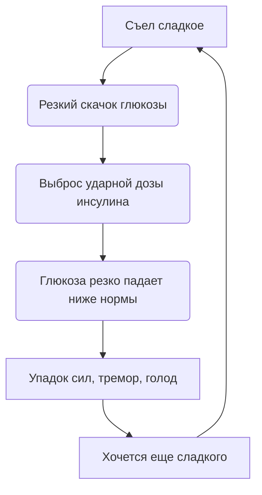
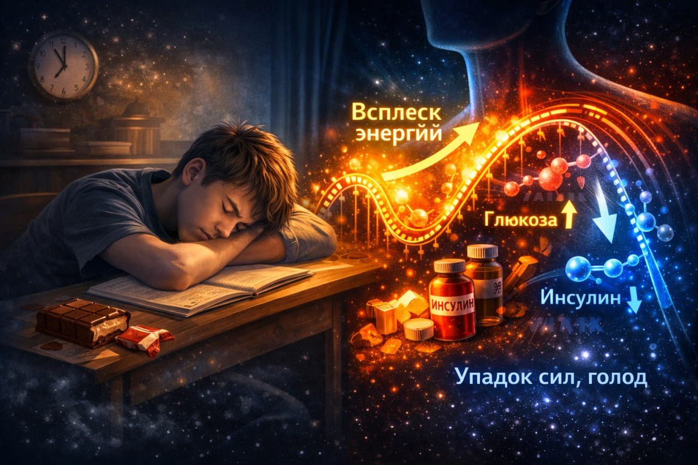

# Сахарные горки: Как [сладости](../../../3.1. healthy lifestyle/Sleep, nutrition, and adolescent energy/articles/sugar_rollercoaster.md) вызывают упадок сил через час после еды

Это чувство знакомо каждому: ты съедаешь шоколадку, чтобы взбодриться. Первые 20 минут — ты [супергерой](../../../../8.1_self_understanding/articles/types_of_impostor_syndrome.md). А потом накрывает такая [усталость](../../../3.1. healthy lifestyle/Sleep, nutrition, and adolescent energy/articles/sugar_rollercoaster.md), что хочется лечь прямо на парту и [уснуть]("./articles/chronic_sleep_deprivation.md"). Знакомо? Это не магия, это [физика](../../../1.2_natural_sciences/why_science_help_understand_world/natural_sciences.md) твоего тела. Или, точнее, [химия](../../../1.2_natural_sciences/why_science_help_understand_world/natural_sciences.md).

Ты только что прокатился на «сахарных горках». Аттракцион так себе.

> ### 🛑 Рубрика «Миф vs [Реальность](../../../1.2_natural_sciences/physics_in_everyday_life/Q140028.md)»
>
> **1. Про шоколад для мозга**  
> 🔴 *Миф:* «Мозгу нужен [сахар](../../../3.1. healthy lifestyle/Sleep, nutrition, and adolescent energy/articles/sugar_rollercoaster.md), чтобы думать».  
> 🟢 *Реальность:* Мозгу нужна *[глюкоза](../../../3.1. healthy lifestyle/Sleep, nutrition, and adolescent energy/articles/breakfast_for_the_brain.md)*. Но он получает ее из сложных углеводов (каш, овощей). Шоколад дает переизбыток, после которого наступает откат.
>
> **2. Про энергию**  
> 🔴 *Миф:* «[Сладкое](../../../1.2_natural_sciences/neurobiology_for_teens/articles/10_sweet_tooth.md) дает энергию».  
> 🟢 *Реальность:* Сладкое дает быстрый всплеск, а затем крах. Чистая [энергия](../../../3.1. healthy lifestyle/Sleep, nutrition, and adolescent energy/articles/breakfast_for_the_brain.md) — это белки и жиры, они горят долго.

## Инсулиновые [качели](../../../1.2_natural_sciences/physics_in_everyday_life/Q1530280.md): Анатомия краха

Когда ты съедаешь сладкое ([сахар](../../../3.1. healthy lifestyle/Sleep, nutrition, and adolescent energy/articles/sugar_rollercoaster.md), булку, сок), [уровень](../../../8.1_entertainment/articles/gamification.md) глюкозы в крови взлетает до небес. [Организм](../../../1.2_natural_sciences/why_science_help_understand_world/organism.md) пугается: «Это критический [уровень](../../../../8.1_entertainment/articles/gamification.md)! Надо срочно спасаться!»

Поджелудочная железа выбрасывает мощную дозу гормона **инсулина**. Его задача — затолкать глюкозу из крови в клетки, чтобы снизить уровень сахара до безопасного.

Проблема в [том](../../../7.1_art/musical_instruments/articles/drums.md), что [инсулин](../../../3.1. healthy lifestyle/Sleep, nutrition, and adolescent energy/articles/sugar_rollercoaster.md) действует как слишком ревностный уборщик — он не останавливается вовремя и выметает всё подчистую. В результате через час уровень глюкозы падает **ниже [нормы](../../../2.1_society/cause_and_effect_relationships/articles/why_rules_work.md)**. Из огня да в полымя.

# Почему это плохо для психики

**«Сахарные горки»** — это не просто про [усталость](../../../3.1. healthy lifestyle/Sleep, nutrition, and adolescent energy/articles/sugar_rollercoaster.md). Это про твое [настроение](../../../8.1_entertainment/articles/psychology_of_music.md). Исследования показывают, что частые скачки сахара усиливают [тревожность](../../../../8.1_self_understanding/articles/causes.md) и делают [эмоции](../../../3.1. healthy lifestyle/Sleep, nutrition, and adolescent energy/articles/stress_and_food.md) нестабильными.

Когда сахар падает, [организм](../../../1.2_natural_sciences/neurobiology_for_teens/articles/03_nervous_system_map.md) снова думает, что наступила катастрофа (он же не знает, что это ты просто сникерс съел). Он снова выбрасывает **[адреналин](../../../1.2_natural_sciences/neurobiology_for_teens/articles/07_stress.md) и [кортизол](../../../1.2_natural_sciences/neurobiology_for_teens/articles/07_stress.md)**. Ты становишься раздражительным, злым или плаксивым без причины.

## Типичный день сладкоежки

Вот как выглядит типичный день сладкоежки:

- **10:00** — съел конфету (кайф, [глаза](../../../7.2 Media, leisure and hobbies/Computer games/articles/useful_tips/eyes_and_back.md) горят)
- **10:40** — хочешь [спать](../../../how_to_memorize/articles/son.md), бесит училка, бесит сосед по парте
- **11:00** — съел еще конфету (снова кайф)
- **11:45** — рыдаешь над задачей по алгебре, хотя обычно решаешь ее за минуту

**Краткий [пересказ](../../../5.1_technology_and_digital_literacy/information and media literacy/первоисточник_и_пересказ.md):** Сладкое → временный кайф → падение сахара → паника в мозге → [тревога](../../../how_to_memorize/articles/stress.md) и [агрессия](../../../2.1_society/cause_and_effect_relationships/articles/conflict_roots.md).

## Чек-лист: Как слезть с сахарных качелей

Если ты замечаешь за собой такую [зависимость](../../../3.1. healthy lifestyle/Sleep, nutrition, and adolescent energy/articles/the_energy_trap.md), попробуй эти лайфхаки:

- **Никогда не ешь сладкое на голодный желудок.** Если хочешь десерт, съешь его ПОСЛЕ нормальной еды (с белками и жирами). Это замедлит всасывание сахара.
- **Добавляй белок к углеводам.** Ешь яблоко не одно, а с горстью орехов. К шоколаду добавь сыр или йогурт. Белок работает как подушка безопасности для твоего сахара.
- **Пей воду.** Обезвоживание часто маскируется под тягу к сладкому и усталость. Иногда достаточно выпить стакан [воды]("./articles/drinking_regime.md"), чтобы [желание](../../../6.1_Independent_living_and_daily_living_skills/reasonable_spending/articles/want.md) сбежать за шоколадкой исчезло.
- **Засеки [время](../../../1.2_natural_sciences/physics_in_everyday_life/Q20702.md).** Если через 30–60 минут после сладкого тебя вырубает — ты точно на сахарных горках. Попробуй неделю прожить без добавленного сахара и почувствуй разницу.

## 😂 Анекдот от GPT по теме

[Разговор](../../../2.1_society/how_and_where_find_friends/articles/izi_temy_dlya_razgovora.md) двух подростков в столовой:  
— Слыш, дай шоколадку, у меня [мозг](../../../3.1. healthy lifestyle/Sleep, nutrition, and adolescent energy/articles/breakfast_for_the_brain.md) отключается.  
— Так ты уже третью за сегодня ешь!  
— Вот именно поэтому и отключается. Мне нужна четвертая, чтобы включиться обратно. [Замкнутый круг](../../../8.2_future_and_path_choice/articles/procrastination_and_stress.md) какой-то...

---
**[Автор](../../../5.1_technology_and_digital_literacy/information and media literacy/авторское_право_и_честное_использование.md):** Ткаченко Елизавета  
**Нейронные сети, использованные при создании статьи:** OpenAI GPT-4o, Google Gemini 1.5 Pro
